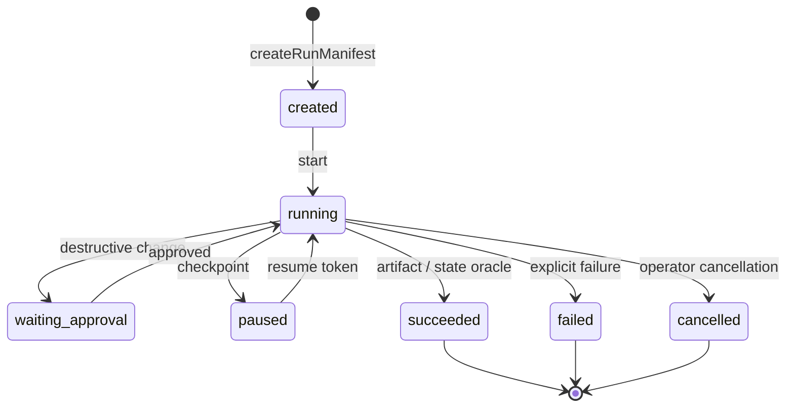

# A1 · Run contract：先固定行为，再谈“Agent 完成了”

> 场景：启动一次“生产变更审查”，固定行为版本、权限和预算；只有外部证据成立才进入成功终态，并把有限上下文安全交给下一位审查者。
>
> 返回：[Agent Engineering 实践轨道](../README.md) · canonical 蓝图：[Agent 趋势与生产架构](../../docs/agent-trends-architecture.md)

## 学习目标

学完本章你能够：

- [ ] 区分 **Run** 与 Session、Working Context、Memory、Artifact：Run 是一次有目标、有固定依赖、有终态证据的执行记录。
- [ ] 用 `createRunManifest()` 固定 prompt / context / toolset / permission 等行为 revision，拒绝 `latest` 一类浮动引用。
- [ ] 用 `transitionRun()` 只允许显式状态图中的迁移，并理解终态不能“复活”。
- [ ] 说明为什么 `succeeded` 必须引用 artifact 或 state oracle，Agent 的自述不是完成证据。
- [ ] 用 `createHandoffEnvelope()` 传递目标、期望 artifact、过滤后的 context refs 与权限子集，避免 handoff 扩权。

## 从 manifest 到 evidence



manifest 回答“这次到底运行什么”；状态机回答“现在走到哪里”；outcome evidence 回答“为什么可以声称完成”。三者缺一，最终回答再漂亮也不能组成可审计运行记录。

## 贯穿场景

生产变更 `change-4821` 要把数据库连接池从 20 调到 30。审查 Agent 本次只拥有 `read:change`、`read:runbook` 与 `write:review-artifact`：

- prompt、context policy 与工具集都固定到不可变版本；
- 进入 `running` 后创建 handoff，请数据库审查者只读核对容量证据；
- 子审查者不能继承父运行没有的 `deploy:production`；
- 只有审查 artifact 或外部状态 oracle 能让运行转为 `succeeded`。

## 正例：可审计成功

```ts
const manifest = unwrap(createRunManifest({
  runId: "run-change-4821",
  sessionId: "session-release-review",
  owner: "release-review-agent",
  objective: "审查 change-4821 是否满足发布门",
  stage: "collect-evidence",
  behavior, // agent / harness / prompt / model / toolset / output / context / permission / eval
  authority: {
    tools: ["read_change", "read_runbook", "write_review_artifact"],
    resources: ["change:change-4821", "runbook:database-pool", "artifact:release-review"],
    actions: ["read", "write-artifact"],
  },
  expectedOutcome: "产出带证据引用的发布建议",
  budget: { maxTurns: 8, maxTokens: 12_000, deadline: "2026-08-10T03:00:00.000Z" },
  createdAt: "2026-08-10T01:00:00.000Z",
}));

const running = unwrap(transitionRun(manifest, {
  type: "start",
  expectedRevision: 0,
  at: "2026-08-10T01:00:00.000Z",
}));
const succeeded = unwrap(transitionRun(running.run, {
  type: "complete",
  expectedRevision: 1,
  outcome: "release decision artifact 已就绪",
  evidence: [{
    id: "review-change-4821",
    kind: "artifact",
    digest: "sha256:review",
    location: "artifact://review/change-4821",
  }],
  at: "2026-08-10T01:05:00.000Z",
}));
```

重点不是字段长，而是运行依赖不再藏在日志或“当时的 latest”里；成功也能回到独立证据。

## 反例：合同应 fail closed

### 反例 1：浮动版本

```ts
createRunManifest({
  ...input,
  behavior: {
    ...behavior,
    prompt: { id: "prod-change-review", version: "latest", digest: "sha256:unknown" },
  },
});
```

同一个 manifest 明天可能指向不同 prompt，无法复现，`createRunManifest()` 应拒绝。

### 反例 2：无证据的假成功

```ts
transitionRun(running.run, {
  type: "complete",
  expectedRevision: running.run.revision,
  outcome: "Agent 自称已经检查完",
  evidence: [],
  at: "2026-08-10T01:05:00.000Z",
});
```

“我已经检查完了”属于 Agent 输出，不是 artifact / state oracle；迁移应失败并带上下文错误码。

### 反例 3：handoff 扩权

```ts
createHandoffEnvelope({
  source: running.run,
  authority: {
    tools: ["read_change", "deploy_prod"],
    resources: ["change:change-4821", "production"],
    actions: ["read", "write"],
  },
  // ...
});
```

child authority 不是 parent authority 的子集，必须阻断。handoff 是权限收窄点，不是绕过审批的捷径。

## 离线运行

无需 API key，不联网，也不会执行生产变更：

```bash
node node_modules/tsx/dist/cli.mjs agent-engineering/01-run-contract/index.ts
```

CLI 会打印：

1. 固定行为 revision 的 run manifest；
2. 合法的 `created -> running -> succeeded` 与 outcome evidence；
3. scoped handoff 的 authority、context refs 与 lineage；
4. 一个被拒绝的扩权 handoff，证明反例不是只写在文档里。

## 事实、推断与未知边界

### 已验证事实

- 本章离线代码会校验固定 revision、显式迁移、成功证据与 authority 子集。
- manifest 与 envelope 可 JSON round-trip；这里展示的是确定性合同，而非模型推理。

### 工程推断

- manifest 把行为依赖前置固化后，回归更容易归因到 prompt/context/tool/permission 的具体 revision。
- handoff 只传必要 context refs 并收窄权限，通常比复制整个 transcript 更容易审计。

### 未知项

- 内存中的 resume journal 不证明跨进程、分布式 lease 或真实外部 API exactly-once。
- 离线 authority 数组不等于身份系统、凭证隔离、sandbox 或真实审批已经完成。
- 合同通过 **不等于真实模型质量或生产安全**；仍需真实环境的 outcome oracle、trace、重试、监控与人工 gate。

## 与现有课程的关系

- [第 04 章：Agent 循环](../../lessons/04-the-agent-loop/README.md) 解释单次观察—行动循环；本章在循环外补 Run 生命周期和证据终态。
- [第 15 章：评估与测试](../../lessons/15-evaluation-and-testing/README.md) 提供 outcome/trace 评估基础；本章把成功证据接进状态迁移。
- [Agent Eval Harness](../../capstone/agent-eval-harness/README.md) 提供通用回归实践；本章只定义一次运行固定了哪些 revision。
- 下一章：[A2 · Context Compiler](../02-context-compiler/README.md) 把 handoff/context refs 背后的多来源数据编译成本轮 packet。

## 一手资料

- [OpenAI · The next evolution of the Agents SDK](https://openai.com/index/the-next-evolution-of-the-agents-sdk/)（2026-04-15）：harness、handoff、resume bookkeeping、sandbox 与 artifact/workspace 的职责分离。
- [Anthropic · Demystifying evals for AI agents](https://www.anthropic.com/engineering/demystifying-evals-for-ai-agents/)（2026-01-09）：评估对象包含 model、harness、tools 与 environment，且 outcome 与 trajectory 都重要。
- [Anthropic · Harness design for long-running application development](https://www.anthropic.com/engineering/harness-design-long-running-apps)（2026-03-24）：用结构化 artifact 跨 session handoff，并讨论 compaction 与 clean reset 取舍。
- [Model Context Protocol · Tools specification](https://modelcontextprotocol.io/specification/draft/server/tools)：tool annotations 应按不可信输入处理，host 仍要承担授权与执行边界（核验于 2026-08-10）。

<!-- KG:START (由 npm run kg 自动生成，勿手改本标记区) -->

## 知识图谱与延伸阅读

> 本节由 `npm run kg` 自动生成（数据源 `knowledge-graph/data/graph.ts`）。要增删请改数据源后重跑。

### 本章概念图谱

> 节点：**橙框**=本章概念，蓝框=关联的其他章概念。连线按关系类型着色：前置(蓝) · 深化(紫) · 对比(玫红) · 应用(绿) · 组成(橙)。


### 与其他章节的关系

- `完整 Behavior Bundle` —**应用**→ `行为版本冻结`（第 ae-prompt 章）

### 延伸阅读

- [OpenAI: The next evolution of the Agents SDK](https://openai.com/index/the-next-evolution-of-the-agents-sdk/) — OpenAI 官方产品文章：Agents SDK 向 sandbox execution、long-horizon tasks、durable harness 演进，是前沿趋势与可恢复 run contract 的来源 `blog`

> 🗺️ 在[全局知识图谱](../../docs/knowledge-graph.md) / [交互式图谱](../../knowledge-graph/output/index.html) 中查看本章位置。

<!-- KG:END -->
