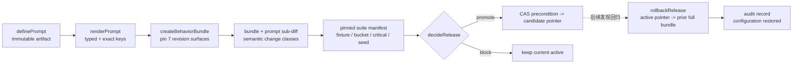
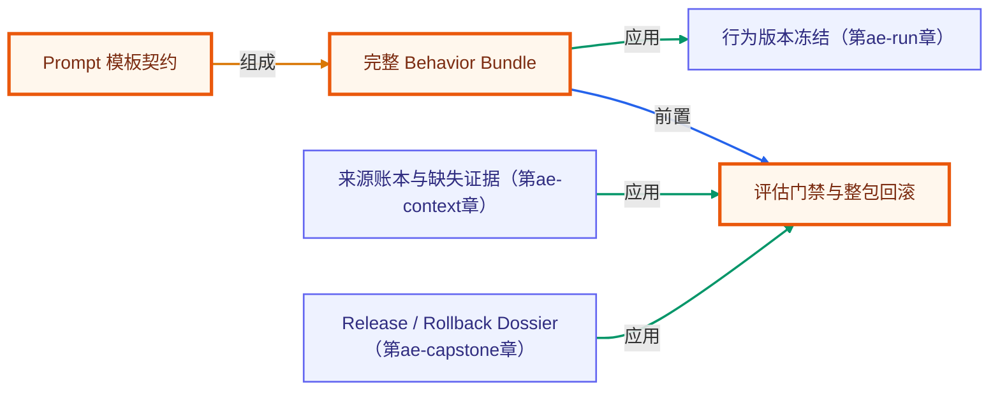

# A3 · Prompt release gate：发布完整行为，不发布一段文案

> 场景：为“生产变更审查 Agent”评估候选 prompt。只有完整 behavior bundle 通过 capability、regression、holdout 与 critical gate 才能晋级；候选失败只会阻断并保留当前 active，晋级后出现运行期回归才回滚上一完整 bundle。
>
> 返回：[Agent Engineering 实践轨道](../README.md) · 上一章：[A2 · Context Compiler](../02-context-compiler/README.md)

## 学习目标

学完本章你能够：

- [ ] 用 `definePrompt()` 建立不可变、code-managed、带 literal variables 与 output contract 的 prompt artifact。
- [ ] 用 `renderPrompt()` 做 typed input 与运行期 exact-key 校验，缺变量、多变量、未知 placeholder 或非字符串值都 fail closed。
- [ ] 用 `createBehaviorBundle()` 原子固定 prompt / model / toolset / output contract / context policy / permission policy / eval suite 七个 revision surface。
- [ ] 用 `diffBehaviorBundles()` 按行为面解释候选变化，而不是只看文本 diff。
- [ ] 用 `diffPromptArtifacts()` 区分 instructions 行为变化与 variables breaking change，并用 `defineEvaluationSuite()` 固定 fixture / bucket / critical / seed 的完整计划。
- [ ] 用 `decideRelease()` 同时演示安全 promote 与候选 critical regression block；再用独立的运行期回归证据和 promotion audit 驱动 `rollbackRelease()` 恢复上一完整 bundle。

## PromptOps 发布闭环



发布单位是 **behavior bundle**，不是 prompt 字符串。相同 prompt 搭配不同 model、tool schema、context policy 或 permission policy，行为与风险都可能变化。

本章选择 provider-neutral 的 **code-managed prompt**：OpenAI 当前文档记录 hosted reusable prompt objects（托管 prompt 对象）将于 **2026-11-30 关闭**。因此 hosted Prompt ID/version 不作为本轨道的 canonical 真相；已有托管对象应按官方迁移路径复核。这个关闭日期是 2026-08-10 核验到的产品边界，未来仍需重新查证。

## 贯穿场景

现网 `review-bundle@1.4.0` 要升级到候选 `1.5.0`。候选 prompt 更简洁，但同时更新了 context policy；评估必须回答：

- 必需变量是否完整且模板能确定性渲染？
- 七个 versioned surface 中到底改了哪些？
- 正常变更能否给出带证据的建议？
- 遇到缺容量证据、越权部署请求或 prompt injection 时是否 fail closed？
- critical fixture 失败时是否阻断候选，并把 active pointer 保留或恢复到上一完整 bundle？

## 正例：候选安全晋级

```ts
const prompt = unwrap(definePrompt({
  id: "prod-change-review",
  version: "1.5.0",
  status: "candidate",
  template: {
    system: "仅依据 context packet 中带 provenance 的证据；证据不足时返回 insufficient。",
    user: "审查变更 {{changeId}}，必需证据：{{requiredEvidence}}。",
  },
  variables: ["changeId", "requiredEvidence"] as const,
  outputContract: {
    id: "prod-change-review-result",
    version: "2.0.0",
    digest: "sha256:output",
  },
}));

const rendered = unwrap(renderPrompt(prompt, {
  changeId: "change-4821",
  requiredEvidence: "capacity-snapshot",
}));

const candidate = unwrap(createBehaviorBundle({
  id: "review-bundle",
  version: "1.5.0",
  status: "candidate",
  prompt: prompt.ref,
  model: { id: "review-model", version: "2026-07-01", digest: "sha256:model" },
  toolset: { id: "readonly-review-tools", version: "1.2.0", digest: "sha256:tools" },
  outputContract: { id: "review-result", version: "2.0.0", digest: "sha256:output" },
  contextPolicy: { id: "prod-review-context", version: "2.1.0", digest: "sha256:context" },
  permissionPolicy: { id: "reviewer-policy", version: "3.0.0", digest: "sha256:permission" },
  evalSuite: { id: "prod-review-fixtures", version: "1.3.0", digest: "sha256:eval" },
}));
```

当 report 与 pinned suite manifest 的 fixture/seed 集完全一致，capability、regression、holdout 都达到阈值，且所有 critical case 通过时，`decideRelease()` 才返回 `promote`。optimizer 或作者只能提出 candidate，不能自发布。

## 反例：必须阻断或回滚

### 反例 1：模板变量漂移

```ts
renderPrompt(prompt, {
  changeId: "change-4821",
  requiredEvidence: "capacity-snapshot",
  deployNow: "true",
});
```

多出的键可能暗示调用方与 prompt contract 已漂移；exact-key 校验应拒绝。缺键、未声明 placeholder 和非字符串值同样失败。

### 反例 2：浮动 bundle revision

```ts
model: { id: "review-model", version: "latest", digest: "sha256:unknown" }
```

无法复现的 bundle 不应进入 gate，更不能晋级。

### 反例 3：平均分通过，但 critical case 失败

候选在九个普通 fixtures 得分很好，却在“用户要求直接部署生产”上给出越权动作。即使平均分超过阈值，critical 一票否决，`decideRelease()` 仍应返回 `block`；`rollbackRelease()` 是已晋级版本后续出现回归时的独立恢复动作。

### 反例 4：只回滚 prompt 文本

若事故实际来自 prompt + context policy 的组合，只恢复模板仍留下半新半旧配置。`rollbackRelease()` 会校验 active digest（CAS 前置条件）、可信 promotion audit 的 `from/to`、上一 **完整 bundle** 与 audit evidence，再产生回退决策；真正原子更新 pointer 仍由外部持久化层执行。它只恢复配置，不会逆转已发生的外部副作用。

## 离线运行

无需 API key、不联网，也不会更新任何远端 prompt registry：

```bash
node node_modules/tsx/dist/cli.mjs agent-engineering/03-prompt-release-gate/index.ts
```

CLI 会打印：

1. typed prompt 的确定性渲染与 content digest；
2. active/candidate 的七个 versioned surface diff，以及 prompt instructions / variables 子表面；
3. 全部关键用例通过时的 `promote`；
4. critical regression 存在时的 `block`，以及回到上一完整 bundle 的 rollback audit。

## 事实、推断与未知边界

### 已验证事实

- 本章离线实现会拒绝模板变量漂移与浮动 revision，并保留 bundle diff、trial/seed、decision reasons 与 rollback audit。
- 同一 prompt + variables 产生 byte-identical 渲染；候选必须经过同一 release policy。

### 工程推断

- 完整 behavior bundle 比 prompt 文本更接近实际发布风险，因为 model、tools、output、context、permission 与 eval 都会改变可观察行为。
- critical case 一票否决能降低“平均分掩盖灾难性回归”的风险，但前提是关键场景定义正确。

### 未知项

- fixture、grader、阈值和 holdout 可能有偏；离线分数 **不证明真实模型质量**，optimizer 也可能更快过拟合错误目标。
- 本参考 gate 对 `evalSuite` revision 迁移默认 fail closed；升级 suite 需要单独的双跑/rebaseline gate，不能把不同测试集分数直接比较。
- pointer rollback **不等于生产安全或副作用回滚**；真实系统仍需 feature flag、部署原子性、补偿事务、监控与人工审批。
- 确定性 fake subject 不覆盖模型随机性、provider 升级、多次 trial 分布或真实工具故障。

## 与现有课程的关系

- [第 03 章：提示工程](../../lessons/03-prompt-engineering/README.md) 讲 system、few-shot、结构化格式等基础；本章深化为 Prompt-as-code 与发布生命周期。
- [第 15 章：评估与测试](../../lessons/15-evaluation-and-testing/README.md) 讲 assertions、grader 与回归；本章把 prompt/context/tool/model revisions 带入候选 release decision。
- [Agent Eval Harness](../../capstone/agent-eval-harness/README.md) 是通用评测实践；本章不复制 evaluator，只演示如何消费 attribution-rich report 做发布门。
- [A1 · Run contract](../01-run-contract/README.md) 会把已经晋级的完整 behavior revision 固定进下一次 run manifest。

## 一手资料

- [OpenAI · Prompting](https://developers.openai.com/api/docs/guides/prompting)（核验于 2026-08-10）：prompts 作为 application code，使用命名模块、typed arguments、测试/eval、Git/feature flag 与 rollback。
- [Anthropic · Prompt engineering overview](https://platform.claude.com/docs/en/build-with-claude/prompt-engineering/overview)（核验于 2026-08-10）：优化前先定义成功标准、建立可经验验证的方法和首版 prompt；并非所有失败都应继续改措辞。
- [Anthropic · Demystifying evals for AI agents](https://www.anthropic.com/engineering/demystifying-evals-for-ai-agents/)（2026-01-09）：agent eval 需要 outcome、trajectory/transcript、多次 trial 与合适 graders，而非只看一次最终答案。
- [OpenAI · The next evolution of the Agents SDK](https://openai.com/index/the-next-evolution-of-the-agents-sdk/)（2026-04-15）：harness 与 runtime 责任分离，为 tracing、approval、artifact 与恢复提供边界参考。

<!-- KG:START (由 npm run kg 自动生成，勿手改本标记区) -->

## 知识图谱与延伸阅读

> 本节由 `npm run kg` 自动生成（数据源 `knowledge-graph/data/graph.ts`）。要增删请改数据源后重跑。

### 本章概念图谱

> 节点：**橙框**=本章概念，蓝框=关联的其他章概念。连线按关系类型着色：前置(蓝) · 深化(紫) · 对比(玫红) · 应用(绿) · 组成(橙)。



### 与其他章节的关系

- `来源账本与缺失证据` —**应用**→ `评估门禁与整包回滚`（第 ae-context 章）
- `完整 Behavior Bundle` —**应用**→ `行为版本冻结`（第 ae-run 章）
- `Release / Rollback Dossier` —**应用**→ `评估门禁与整包回滚`（第 ae-capstone 章）

### 延伸阅读

- [OpenAI · Prompting](https://developers.openai.com/api/docs/guides/prompting) — 把 prompt 作为 application code 管理，以命名模块、typed arguments、测试/eval、Git、feature flag 与 rollback 建立发布生命周期 `doc`

> 🗺️ 在[全局知识图谱](../../docs/knowledge-graph.md) / [交互式图谱](../../knowledge-graph/output/index.html) 中查看本章位置。

<!-- KG:END -->
