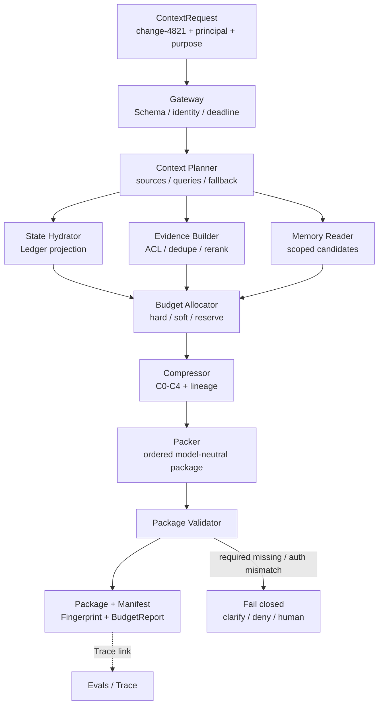

# A4 · Context Runtime：信息与证据运行时

> 场景：`change-4821` 即将进入生产变更审查。你需要在固定权限、时效和 Token 预算下装配最小充分上下文，并证明每个条目为何进入或被拒绝。

[上一章：A3 Prompt Release Gate](../03-prompt-release-gate/README.md) · [20 周课程](../CURRICULUM.md) · [下一章：A5 Evidence RAG](../05-evidence-rag/README.md)

全章约束：断网、固定 clock、固定 seed、无真实 I/O；**offline≠production**。

## 先修与学习目标

先完成 [A1 Run Contract](../01-run-contract/README.md)、[A2 Context Compiler](../02-context-compiler/README.md) 与 [A3 Prompt Release Gate](../03-prompt-release-gate/README.md)。你应已理解运行版本谱系、确定性摘要、模板变量、behavior bundle 和发布门。

完成本章后，你应能：

- 区分聊天历史、持久状态、记忆、证据和运行时 Context。
- 解释 Context Runtime 与 Orchestrator、Prompt Compiler、Tool Gateway 的职责边界。
- 从固定 `ContextRequest` 生成 `ContextPackage`、`ContextManifest`、`ContextFingerprint` 与 `BudgetReport`。
- 在硬约束、输出预留和权限前置条件下分配 Token；超预算时可追溯地降级。
- 用 Manifest 回答“选了什么、丢了什么、依据什么、使用哪个版本”。
- 对跨租户、过期证据、指纹不一致和不可信指令 fail closed。

## 核心理论与边界

### Context 不是越多越好

Context Runtime 的目标不是“把所有可找到的文本塞进窗口”，而是把分散的业务数据、目标、状态、证据、记忆、工具说明和安全策略装配成**最小、正确、及时、可授权、可追溯**的包。一个条目即使相关，只要权限不允许、版本过期、来源不可定位或边际价值低，也不应进入模型可见区。

课程采用以下运行时合同：

```text
ContextRequest
  -> ContextPackage
  -> ContextManifest
  -> ContextFingerprint
  -> BudgetReport
```

- `ContextPackage` 是模型中立的最小上下文，不直接等同于最终 Prompt 字符串。
- `ContextPackage` 自带 `tenantId`、`principalId`、`purpose` 与 `permissionDigest`；这些消费边界不能只存在于外围日志。
- `ContextManifest` 记录候选、选择/拒绝、权限、分数、位置、变换、版本与 lineage。
- `ContextFingerprint` 对规范化 query 以及所有影响语义、可见性和行为的输入做规范化摘要。
- `BudgetReport` 证明输入、输出预留与安全余量没有突破模型窗口。

### 五个组件各自拥有什么

| 组件 | 拥有的职责 | 明确不拥有 |
|---|---|---|
| Prompt Compiler | 编译版本化行为合同与输出 Schema | 不决定业务权限，不读取全部数据 |
| Context Runtime | 选择、授权、压缩、装配信息与证据 | 不规划业务目标，不执行副作用工具 |
| Orchestrator | 状态机、任务图、预算、重试、恢复、终止 | 不让检索内容改变控制规则 |
| Tool Gateway | 工具注册、授权、参数约束、审批、幂等、沙箱、审计 | 不接受模型自授予 capability |
| Evals / Trace | 分层证据、回放、发布与回滚判定 | 不用单一平均分覆盖安全 veto |

### Token 是有约束的运行时资源

预算必须先预留输出与安全余量：

```text
input_budget = model_window - output_reserve - safety_margin
```

系统策略、当前目标、硬约束、输出合同和关键 Task State 属于硬配额；Evidence 属于高优先级弹性配额；Memory、旧对话和示例通常是软配额。安全策略与确认决策不可做生成式摘要。压缩应从规范化/去重、字段投影、抽取摘要、生成摘要到仅保留句柄逐级增加信息损失，并在 Manifest 中记录原始引用与算法版本。

### 权限与信任边界

网页、邮件、文件、工具结果和其他 Agent 输出都是**数据**，不是控制指令。权限至少在检索前、候选后、装配前和消费前校验；派生摘要的权限不得宽于父项。Package 的 `policySnapshot` 与当前 principal 不匹配时，模型和工具均不得消费它。

## 架构



推荐装配顺序是：可信系统指令和安全约束 → 当前目标、成功条件和输出合同 → 当前步骤最小状态 → 按子问题组织的证据 → 少量高置信度记忆 → 当前需要的工具 Schema → 必要对话里程碑 → 未决不确定性。顺序也是评测对象，不能只凭经验固定。

## 逐步实验：构建 `change-4821` Context

本目录的 `index.ts` 是离线教学入口。它用固定时间、固定 seed 和内存 fixture 调用共享实现 `buildEnterpriseContext`；不访问网络、真实模型、数据库或部署系统。

### 第 1 步：识别输入不变量

运行前先写下你期望固定的维度：规范化 query、`tenant`、principal scope、purpose、task revision、Prompt/Policy/Index/Tool 版本、freshness bucket、budget profile。少任何一项，都可能让重放或缓存误复用。

### 第 2 步：运行命令并检查预期 JSON

```powershell
node node_modules/tsx/dist/cli.mjs agent-engineering/04-context-runtime/index.ts
```

程序只向 stdout 输出一个 JSON 对象，进程成功时退出码为 `0`。预期顶层字段：

```json
{
  "module": "A4",
  "scenario": "production-change-review",
  "packageId": "...",
  "manifestId": "...",
  "fingerprint": "sha256:...",
  "budget": {},
  "safetyCounterexample": {},
  "boundary": {}
}
```

不要把示例中的省略值当成实际断言；验收应检查字段类型、非空 ID、预算不变量、确定性指纹、安全反例和边界分类。

### 第 3 步：读取四份证据

1. `packageId` 证明本次装配产物有稳定身份。
2. `manifestId` 连接选择/拒绝记录与 Trace。
3. `fingerprint` 在相同 fixture 下应保持一致；权限、版本或状态变化时应改变。
4. `budget` 应能证明 required 项保留、输出预算预留、总量不超限。

### 第 4 步：检查安全反例

`safetyCounterexample` 应展示一个看似相关但不可消费的候选，例如来自其他租户、权限摘要不匹配、过期版本或携带“忽略系统规则”的不可信文本。正确行为是拒绝、脱敏或转审批，而不是把它交给模型自行判断。

### 第 5 步：验证确定性

连续运行两次，比较 `packageId`、`manifestId`、`fingerprint` 和预算摘要。若固定输入产生漂移，先检查时间、随机数、集合排序和 JSON canonicalization；不要用“模型有随机性”解释一个根本没有模型调用的离线实验。

## 正例与反例

### 正例：最小充分且可回放

`change-4821` 的 Package 保留审查目标、回滚约束、当前 Ledger revision、两个已授权证据引用和输出合同；低置信度旧记忆被拒绝。Manifest 记录拒绝原因，Fingerprint 包含 policy 与数据版本，预算保留足够输出空间。审查结论仍需 A5 的 Evidence Gate，A4 不越权替它判定发布。

### 反例 1：把聊天历史当 Context Runtime

把全部聊天和日志原文拼接后 Token 未超限，并不代表正确。它可能包含旧决策、不可信指令、跨租户内容和重复噪声；也没有候选拒绝记录，无法解释重放差异。

### 反例 2：指纹只含 query

相同问题在 ACL 已收紧、Prompt 已发布新版本、Ledger 已推进时命中旧 Package，会复用错误可见性与状态。无法完整表达语义和权限的缓存场景，正确策略是 miss。

### 反例 3：压缩硬约束

将“变更必须具备回滚证明”摘要成“建议考虑回滚”，语义已经改变。硬约束、确认决策、关键证据引用必须完整保留或阻断，而不是静默降级。

## 练习与答案检查点

### 练习 1：预算收缩

把可用输入预算缩小 30%，设计丢弃顺序。

答案检查点：先去重和字段投影，再丢低价值 examples、旧 conversation、低置信 memory；保留安全规则、当前目标、输出合同、当前步骤状态和关键 evidence 引用；始终保留输出预留。

### 练习 2：权限变化

保持 query 不变，将 principal 从 reviewer 改为 observer。

答案检查点：Permission Digest 与 Fingerprint 必须变化；不可访问候选不得进入 Package；旧 Package 在消费前复核失败；日志只记录资源 ID、decision ID 与脱敏摘要。

### 练习 3：证据过期

将一个证据的 `validTime` 推到业务 freshness 阈值之外。

答案检查点：高风险审查不得用 stale-while-revalidate；证据被降权或拒绝，Manifest 写明 `STALE`；若 required evidence 缺失，则转澄清/人工，不调用模型补全。

## 测试与验收矩阵

| 测试层 | Fixture / 操作 | 必须观察 | 失败行为 |
|---|---|---|---|
| Contract | 缺 tenant、purpose、budget 或版本 | 输入 Schema 明确拒绝 | 不生成半成品 Package |
| Determinism | 相同时间与 seed 运行两次 | ID、指纹、预算摘要一致 | 定位排序/时间/canonical JSON 漂移 |
| Budget | required 项超过预算 | 输出预留未被占用 | 降级、澄清或阻断 |
| Authorization | 跨租户或 principal 降权 | 可见证据为 0 泄漏 | `DENY/REDACT/REQUIRE_APPROVAL` |
| Freshness | 权威证据过期 | Manifest 有 stale reason | 高风险链路拒绝或实时查询 |
| Integrity | Package 与 Manifest 指纹不一致 | Validator 检出 | 不缓存、不消费、重建 |
| Injection | 文档要求忽略系统规则 | 内容保持 untrusted data | 不改变工具或控制权限 |
| Boundary | 尝试让 Runtime 执行发布 | `boundary` 明确 offline | 不触发真实 I/O 或部署 |

本章验收门：所有 required item 完整；预算不变量成立；Manifest 能解释每个候选；跨租户泄漏为 0；固定输入可重放；任何安全失败均优先于一般质量分。

## 事实、推断与未知边界

### 已验证事实

- 本章 `index.ts` 的教学合同是调用 `buildEnterpriseContext` 并输出指定 JSON 字段。
- 实验 fixture、时间与 seed 固定，不需要网络、模型、数据库或真实工具。
- 当前离线结果可以验证 Schema、预算、指纹、选择/拒绝和安全反例的不变量。

### 工程推断

- Manifest 与分层 Trace 能显著缩短“检索、权限、装配还是模型”错误归因路径；真实收益仍需生产事故与运维数据验证。
- 最小充分 Context 通常会降低 Token 与注入面，但质量提升幅度取决于业务 Golden Set 和真实来源质量。

### 未知项

- 真实 IAM/PDP 的策略表达、撤权传播延迟和审计保留要求。
- 真实模型 tokenizer、窗口、延迟、生成非确定性与成本。
- 生产数据源 SLA、索引延迟、跨地域合规和容量上限。

## 从离线样例升级到生产

- [ ] 把内存身份/权限 fixture 替换为真实 Gateway + PDP/PEP，并覆盖 RBAC/ABAC/ReBAC 与 purpose。
- [ ] 为 Request、Item、Package、Manifest、Fingerprint 和 Budget 建立版本化 runtime schema 与兼容策略。
- [ ] 接入 State Store、Evidence 来源和 Memory Store，但继续通过 Context Runtime 统一装配。
- [ ] 为每个来源定义 owner、authority、freshness、ACL、删除和降级 SLO。
- [ ] 使用真实 tokenizer，设置 P50/P95/P99 延迟、Token、成本和构建失败率门槛。
- [ ] 对 Manifest/Trace 做脱敏、加密、采样、保留和可验证删除。
- [ ] 接入 Tool Gateway；副作用动作必须具备独立授权、审批、幂等、沙箱、对账和补偿。
- [ ] 建立 Retrieval Gold、Context Gold、Security Red Team 与 Production Replay；通过 Shadow/Canary 后才谈生产可用。

## 延伸学习

- [A2 · Context Compiler](../02-context-compiler/README.md)：理解最小输入选择与摘要边界。
- [RAG Advanced · Context Engineering](../../rag-advanced/11-context-engineering/README.md)：补充检索与上下文设计。
- [短期记忆](../../lessons/07-short-term-memory/README.md)：对比工作记忆与持久状态。
- [安全与 Guardrails](../../lessons/17-safety-and-guardrails/README.md)：继续研究权限、注入和副作用边界。

<!-- KG:START (由 npm run kg 自动生成，勿手改本标记区) -->

## 知识图谱与延伸阅读

> 本节由 `npm run kg` 自动生成（数据源 `knowledge-graph/data/graph.ts`）。要增删请改数据源后重跑。

### 本章概念图谱

> 节点：**橙框**=本章概念，蓝框=关联的其他章概念。连线按关系类型着色：前置(蓝) · 深化(紫) · 对比(玫红) · 应用(绿) · 组成(橙)。


### 与其他章节的关系

- `来源账本与缺失证据` —**深化**→ `Principal / Tenant / Purpose 作用域`（第 ae-context 章）
- `Context Manifest 与 Fingerprint` —**前置**→ `ACL 前置检索`（第 ae-evidence 章）

### 延伸阅读

- [Effective context engineering for AI agents](https://www.anthropic.com/engineering/effective-context-engineering-for-ai-agents) — Anthropic 官方：上下文是有限资源，需主动裁剪、压缩和按需装配，对应 compiler、runtime 与长期任务压缩 `blog`

> 🗺️ 在[全局知识图谱](../../docs/knowledge-graph.md) / [交互式图谱](../../knowledge-graph/output/index.html) 中查看本章位置。

<!-- KG:END -->
