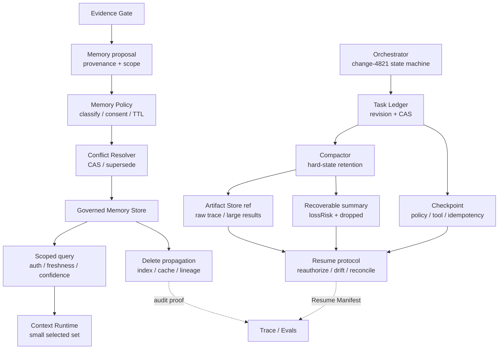
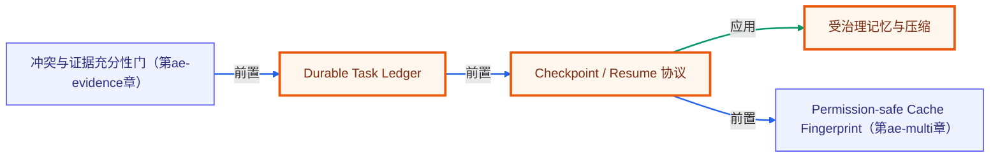

# A6 · Durable Memory：可恢复状态与受治理记忆

> 场景：`change-4821` 的审查跨越多个步骤、一次进程中断和一次人工等待。系统既要从 checkpoint 恢复，又不能把临时推断或旧权限下的内容永久“记住”。

[上一章：A5 Evidence RAG](../05-evidence-rag/README.md) · [20 周课程](../CURRICULUM.md) · [下一章：A7 Cache 与 Multi-Agent](../07-cache-multi-agent/README.md)

全章约束：断网、固定 clock、固定 seed、无真实 I/O；**offline≠production**。

## 先修与学习目标

先完成 [A1 Run Contract](../01-run-contract/README.md)、[A4 Context Runtime](../04-context-runtime/README.md) 和 [A5 Evidence RAG](../05-evidence-rag/README.md)。你应能解释 revision、CAS、Manifest、Evidence lineage 与权限快照。

完成本章后，你应能：

- 区分强一致 Task Ledger、短期 Working Context 和跨任务 Memory。
- 在副作用边界前后提交 revision 与 checkpoint，避免恢复时重复执行。
- 压缩长任务轨迹，同时保留硬状态、损失风险和可恢复 Artifact 引用。
- 把 MemoryRecord 视为受治理断言，执行 propose → policy → conflict → commit → query → supersede/delete。
- 让过期、错误租户、低置信、无来源或已删除记忆保持不可见。
- 对摘要篡改、CAS 冲突、权限漂移和未知副作用 fail closed。

## 核心理论与边界

### State 和 Memory 不是同一个存储桶

| 对象 | 主要问题 | 一致性与写入 | 进入 Context 的方式 |
|---|---|---|---|
| Task Ledger | 任务现在执行到哪里、事实和决策是什么 | revision + CAS；由 Orchestrator 原子更新 | 按当前步骤投影 |
| Checkpoint | 从哪个安全边界恢复 | committed snapshot + checksum + policy/tool versions | 只恢复必要状态与引用 |
| Artifact | 大文件、日志、原始轨迹、工具结果 | content-addressed / immutable | 只注入摘要与句柄，JIT 读取 |
| MemoryRecord | 未来任务是否可复用某个受治理断言 | 候选、来源、作用域、TTL、冲突、撤销链 | 高门槛检索后少量选择 |
| Conversation | 当前交互记录 | 通常是短期事件，不天然持久 | 最近窗口、里程碑或摘要 |

把任务进度写成 Memory 会失去 revision、原子性和恢复语义；把每句聊天复制成长期 Memory 会放大隐私、陈旧和投毒风险。

### Task Ledger 保存可恢复业务状态

Ledger 至少包含目标、成功条件、非目标、计划与依赖、当前步骤、已验证事实及 evidence refs、确认决策、未决问题、artifact refs、checkpoint、policy snapshot 和 idempotency keys。重要规则：

- 重大目标变化形成新 revision，不能原地改写历史。
- 事实只有通过 Evidence Gate 后才能进入 `verifiedFacts`。
- 决策不可被 compaction 摘要覆盖，只能被带原因的新决策 supersede。
- 副作用前记录计划、参数哈希、授权、审批和幂等键；副作用后记录结果引用、对账与补偿。
- CAS 失败后重新读取并合并，不能以“最后写入者覆盖”为成功。

### Compaction 不是删除历史

长任务压缩必须区分四类内容：

- **必须完整保留**：目标、硬约束、成功条件、当前步骤、确认决策、未决问题、关键 evidence handles、安全策略。
- **允许摘要**：已完成步骤过程、旧对话、非关键工具交互、重复解释。
- **应外置**：原始文件、日志、查询结果、代码快照、完整轨迹。
- **允许丢弃**：重复候选、低价值失败探索、过期临时信息、无引用草稿。

每次 `compactTaskLedger` 必须输出 `lossRisk`、`dropped` 与 `recoverableArtifact`。若预算小到无法保留硬状态，正确行为是 fail closed，不是生成一份看似完整的摘要。

### Memory 是受治理断言

Memory 可以按 Working、Episodic、Semantic、Procedural、Task、Shared 分层，但每条持久记录都要有 namespace、kind、subject、value、provenance、confidence、status、sensitivity、validity、TTL/supersedes 和 write policy。模型推断不能自动成为事实；无来源只能停留在 candidate。

记忆写入优先“宁缺毋滥”：默认最小作用域，敏感数据按政策禁止/同意/加密/短 TTL，冲突不静默覆盖，提交需要 CAS、审计与幂等键。删除要传播到索引、缓存和派生项，并能证明完成。

## 架构



## 逐步实验：恢复审查并治理记忆

本目录 `index.ts` 使用固定时间、seed 和内存仓库，依次演示以下共享导出：

- `createTaskLedger`
- `commitTaskLedger`
- `checkpointTaskLedger`
- `compactTaskLedger`
- `proposeGovernedMemory`
- `queryGovernedMemory`
- `deleteGovernedMemory`

这些 API 只演示领域合同，不写真实数据库、对象存储或缓存，也不执行真实副作用。

### 第 1 步：建立 revision 0

为 `change-4821` 固定目标、成功条件、回滚约束、required evidence、当前步骤和 policy snapshot。不要把“可能风险较低”这种未经 Evidence Gate 的推断放进 `verifiedFacts`。

### 第 2 步：提交并 checkpoint

将已核验的测试事实以 evidence refs 写入新 revision，使用 expected revision 做 CAS。然后在“申请灰度”这个潜在副作用前创建 checkpoint，记录计划动作、参数摘要、审批状态和 idempotency key。

### 第 3 步：压缩与外置

调用 `compactTaskLedger`，检查硬状态仍在、可摘要过程被压缩、大体量轨迹成为 `recoverableArtifact`。若故意把预算降到连 goal/constraints/current step 都容不下，应得到明确失败。

### 第 4 步：提出并读取记忆

从已确认事实或用户显式偏好提出 Memory candidate。调用 `proposeGovernedMemory` 后检查 provenance、namespace、status、confidence、sensitivity 与 TTL；再用当前 tenant/principal/purpose 调用 `queryGovernedMemory`。过期项和错误租户项必须不可见。

### 第 5 步：冲突与删除

为同一 subject 提出不兼容值，确认系统返回冲突或 supersede 决策，而不是静默覆盖。调用 `deleteGovernedMemory` 后再次查询，记录不可见状态和删除审计语义。

### 第 6 步：运行命令并检查预期 JSON

```powershell
node node_modules/tsx/dist/cli.mjs agent-engineering/06-durable-memory/index.ts
```

预期 stdout 是单个 JSON，成功退出码为 `0`：

```json
{
  "module": "A6",
  "ledger": {
    "revision": 0,
    "checkpoint": "...",
    "replayed": true
  },
  "memory": {
    "status": "...",
    "conflicts": [],
    "deleted": true
  },
  "compaction": {
    "lossRisk": "...",
    "dropped": [],
    "recoverableArtifact": {
      "id": "...",
      "version": "...",
      "digest": "...",
      "location": "artifact://..."
    }
  },
  "safetyCounterexample": {},
  "boundary": {}
}
```

实际 revision 数值由 fixture 决定，不能把上面的 `0` 当最终值。验收关注 revision 单调、checkpoint 可验证、重放一致、硬状态保真、冲突显式、删除后不可见和边界声明。

## 正例与反例

### 正例：恢复前先重验证

进程在 checkpoint 后重启。系统读取最新 committed revision，校验 Artifact checksum，比较 Prompt/Policy/Tool/Index 版本，重新鉴权，并对未确认“申请灰度”动作做 reconciliation。只有无副作用 readiness step 通过后才继续；它不会盲目重发申请。

### 正例：受治理的审查偏好

用户明确要求审查报告使用中文并分为事实/推断/未知。该偏好有 message provenance，作用域是该用户，置信度高，非敏感，可形成 semantic preference。它进入未来 Context 时仍标记为历史偏好，不能冒充当前生产事实。

### 反例 1：摘要篡改硬状态

原约束是“缺少回滚演练不得灰度”，摘要变成“建议补充回滚信息”。哈希再稳定也没有意义，因为语义已经丢失。Compactor 必须保留硬状态，记录算法版本与 source trace，并把原始轨迹外置。

### 反例 2：把推断自动写入共享记忆

Worker 猜测 `change-4821` 风险较低，就直接写成组织级事实。这既无来源，也扩大作用域。正确行为是保留为私有 scratch 或 candidate，经 Evidence Gate 与审批后才可能提交。

### 反例 3：删除只删主表

MemoryRecord 被删除，但向量索引、Context Package 缓存和派生摘要仍可命中，删除并未完成。生产删除必须沿 lineage 传播并有验证回执。

## 练习与答案检查点

### 练习 1：设计 checkpoint 边界

在查询证据、生成报告、申请灰度和发送通知四步中选择 checkpoint。

答案检查点：模型阶段完成后保存结构化输出/Manifest；副作用“申请灰度”和“发送通知”前后都 checkpoint；等待人工前保存 resume condition；纯只读查询可按成本与可重放需求 checkpoint，但不应把每次小计算都当强边界。

### 练习 2：处理 CAS 冲突

两个审查 Worker 都基于 revision 4 提交事实，第一份已把 Ledger 推进到 5。

答案检查点：第二份提交失败后重新读取 revision 5，按 claim/evidence lineage 合并并重新验证，再以 expected revision 5 提交；不可直接覆盖，也不能把 CAS 失败当业务失败吞掉。

### 练习 3：记忆冲突与过期

旧偏好 `report_detail=brief` 尚未过期，新显式偏好是 `exhaustive`。

答案检查点：新记录可 supersede 旧记录并保留链；查询默认只读最新 active；若来源或确认度不足，则冲突并存而非猜测。超过 `expiresAt` 的记录不可被返回，即使向量相似度很高。

### 练习 4：压缩预算不足

设置一个连硬约束和当前步骤都无法容纳的预算。

答案检查点：`compactTaskLedger` 返回明确失败；不得通过截断、删除约束或只保留自由文本摘要假装成功；原始 Artifact 仍可恢复。

## 测试与验收矩阵

| 测试层 | Fixture / 操作 | 必须观察 | 失败行为 |
|---|---|---|---|
| Ledger Contract | 缺 goal、revision 或 policy snapshot | Schema 拒绝 | 不创建部分 Ledger |
| CAS | 两次使用同一 expected revision | 第二次冲突 | 重新读取、合并、重验 |
| Idempotency | 重复提交相同操作键 | 不重复产生副作用语义 | 返回已有结果或冲突上下文 |
| Checkpoint | Artifact checksum 被修改 | 恢复校验失败 | 阻断并告警 |
| Compaction | 紧预算与大量轨迹 | 硬状态保留、dropped 可解释 | 不够则 fail closed |
| Replay | 同一 checkpoint 恢复两次 | revision/摘要/下一步一致 | 定位非确定时间/排序 |
| Memory Write | 无 provenance 的模型推断 | 只停留 candidate 或拒绝 | 不提交 confirmed fact |
| Memory Scope | wrong-tenant / wrong-purpose 查询 | 记录不可见 | critical veto |
| Memory Freshness | expired 或 superseded | 默认不可见 | 不以相似度绕过 |
| Conflict | 同 subject 不兼容 active 值 | conflicts 显式 | 不静默覆盖 |
| Delete | 删除后读、索引/缓存模拟 | 全部不可见并留审计 | 未完成则报告 partial |
| Boundary | 模拟重启/存储 | `boundary` 声明内存离线 | 不宣称生产持久化 |

本章验收门：revision 单调且 CAS 生效；checkpoint 可验证；重复副作用为 0；compaction 关键事实/约束保留；错误租户、过期和已删除记忆不可见；冲突与删除谱系可审计。

## 事实、推断与未知边界

### 已验证事实

- 本章离线入口覆盖 Ledger 创建/提交/checkpoint/compaction 与 Governed Memory 提议/查询/删除合同。
- 固定 fixture 能验证 CAS、重放、硬状态保真、冲突、作用域、过期与删除后的可见性。
- `recoverableArtifact` 是教学引用，不代表真实对象存储已经持久化。

### 工程推断

- 结构化 Ledger 加 Artifact 外置比无限聊天历史更适合长任务恢复；真实 RTO 和存储成本仍需压测。
- 高精度、低写入率的 Memory 往往比“什么都记”的体验更可靠，但业务价值需用 Read Utility 与用户纠正数据验证。

### 未知项

- 生产 State Store 的事务、复制、备份、RPO/RTO 与跨地域一致性。
- 隐私同意、数据保留、法律删除和审计访问的组织规则。
- 真实 Memory 检索规模、冲突密度、异步巩固质量和删除传播 SLA。

## 从离线样例升级到生产

- [ ] 选择支持事务、revision 与 CAS 的 State Store；定义事件、快照、迁移和兼容策略。
- [ ] 在每个副作用前后记录授权、审批、参数哈希、idempotency key、结果引用、对账与补偿。
- [ ] 使用内容寻址 Artifact Store，校验 checksum、加密、保留、访问与删除。
- [ ] 为 Compactor 建立 hard-state Golden Set、摘要篡改测试、Fact Retention 和恢复演练。
- [ ] 实现恢复时 Prompt/Policy/Tool/Model/Data 版本漂移检查与无副作用 readiness step。
- [ ] 为 Memory 建立 namespace、最小作用域、provenance、confidence、sensitivity、TTL、supersede 与 consent policy。
- [ ] 对 Memory 写入、索引、缓存和派生项实现事务性或可对账删除传播。
- [ ] 建立 Write Precision、Read Utility、Stale Rate、Conflict Accuracy、Privacy Violation、Deletion Completion 指标。
- [ ] Trace/审计默认脱敏；高风险 state/memory 事件 100% 记录，且有 owner 与 Runbook。

## 延伸学习

- [短期记忆](../../lessons/07-short-term-memory/README.md)：理解 Working Memory 的基础实现。
- [A1 · Run Contract](../01-run-contract/README.md)：状态机与重放合同。
- [A5 · Evidence RAG](../05-evidence-rag/README.md)：只有通过 Evidence Gate 的事实才能进入 Ledger。
- [A7 · Cache 与 Multi-Agent](../07-cache-multi-agent/README.md)：学习 revision、权限与 lineage 如何约束复用和协作。

<!-- KG:START (由 npm run kg 自动生成，勿手改本标记区) -->

## 知识图谱与延伸阅读

> 本节由 `npm run kg` 自动生成（数据源 `knowledge-graph/data/graph.ts`）。要增删请改数据源后重跑。

### 本章概念图谱

> 节点：**橙框**=本章概念，蓝框=关联的其他章概念。连线按关系类型着色：前置(蓝) · 深化(紫) · 对比(玫红) · 应用(绿) · 组成(橙)。



### 与其他章节的关系

- `冲突与证据充分性门` —**前置**→ `Durable Task Ledger`（第 ae-evidence 章）
- `Checkpoint / Resume 协议` —**前置**→ `Permission-safe Cache Fingerprint`（第 ae-multi 章）

### 延伸阅读

- [Effective context engineering for AI agents](https://www.anthropic.com/engineering/effective-context-engineering-for-ai-agents) — Anthropic 官方：上下文是有限资源，需主动裁剪、压缩和按需装配，对应 compiler、runtime 与长期任务压缩 `blog`

> 🗺️ 在[全局知识图谱](../../docs/knowledge-graph.md) / [交互式图谱](../../knowledge-graph/output/index.html) 中查看本章位置。

<!-- KG:END -->
