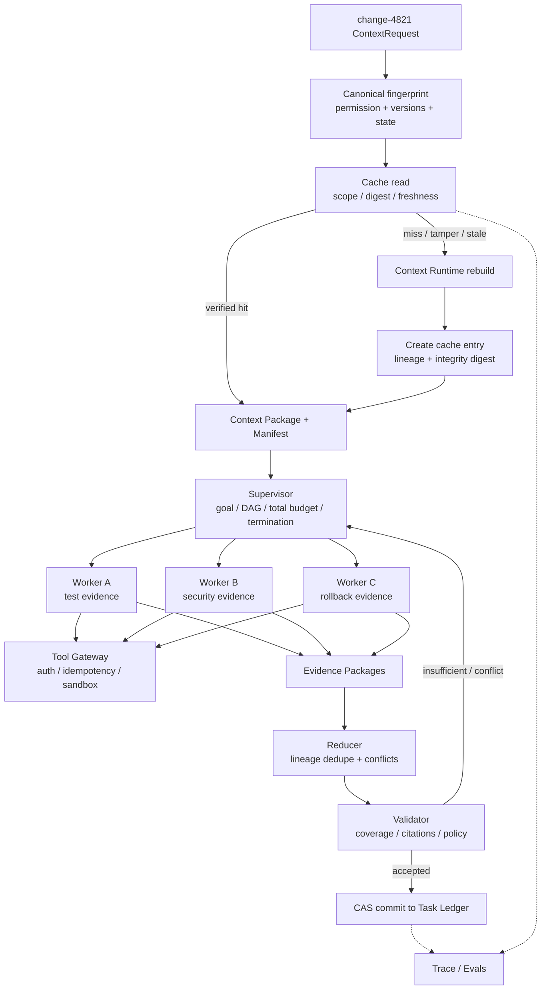

# A7 · Cache 与 Multi-Agent：安全复用、隔离协作与证据聚合

> 场景：`change-4821` 需要并行核验测试、权限影响和回滚方案。平台希望复用已验证 Context 以降低成本，但任何缓存命中和 Worker 扩散都不能放宽租户、目的、版本或工具权限。

[上一章：A6 Durable Memory](../06-durable-memory/README.md) · [20 周课程](../CURRICULUM.md) · [下一章：A8 Observability Capstone](../08-observability-capstone/README.md)

全章约束：断网、固定 clock、固定 seed、无真实 I/O；**offline≠production**。

## 先修与学习目标

先完成 [A4 Context Runtime](../04-context-runtime/README.md)、[A5 Evidence RAG](../05-evidence-rag/README.md) 与 [A6 Durable Memory](../06-durable-memory/README.md)。你应理解 Context Fingerprint、Evidence lineage、Ledger revision、CAS 和 Tool Gateway。

完成本章后，你应能：

- 说明哪些计算可以缓存、哪些必须 miss、哪些结果绝不能复用。
- 构造绑定 tenant/principal/purpose/policy/model/tool/index/state/freshness 的 permission-safe cache entry。
- 在 scope 变化、权限收紧、数据/策略/版本变化或 digest 被篡改时拒绝命中。
- 让 Supervisor 持有全局控制，而 Worker 只接收完成子任务所需的最小 Context Package。
- 用结构化 Evidence Package 聚合 claim、citation、uncertainty 与 ConflictSet，并按 lineage 去重。
- 以预算、权限、工具 capability、fan-out、终止条件和 CAS 控制多 Agent 放大效应。

## 核心理论与边界

### 缓存只复用已验证计算

缓存不能绕过当前权限、数据版本、策略或状态。凡是影响语义、可见性和工具行为的维度，都必须进入 cache identity；无法完整表达时宁可 miss。

当前离线教学 API 的 Context cache binding 包括：

```text
tenant + principal + purpose + permission digest + normalized query digest
+ policy snapshot + model profile + toolset + index snapshot
+ state revision + freshness bucket
```

生产实现还应按真实语义补入 Prompt/Packer、Embedding/Reranker、预算配置等版本；当前 API 没有显式携带的字段不能被文档假装已绑定。

`userId` 不是 Permission Digest。角色、群组、资源范围、目的、地域、审批和策略版本变化都可能改变可见性。权限减少必须立即失效；权限增加允许继续 miss，不能为了命中率扩大复用。

### 缓存层级与一致性

| 层 | 可缓存对象 | 关键约束 |
|---|---|---|
| Prefix | 静态系统指令、工具 Schema、固定示例 | 版本 namespace；不能含动态权限数据 |
| Query Plan | intent、来源计划、fallback | policy/catalog/planner 版本；高风险重验 |
| Retrieval / Rerank | candidate IDs、分数 | query/filter/permission/index/candidate hashes |
| Context Package | Package + Manifest | 完整 fingerprint、budget、state revision；短 TTL、只读 |
| Tool Result | 只读 API/SQL 结果 | 参数、principal scope、data snapshot；消费前复核 |
| State Projection | Session/Ledger/Checkpoint projection | revision key；写后失效、read-your-writes |
| Artifact | 解析、摘要、embedding、转码 | content-addressed + transform/model version |

副作用工具结果禁止复用。高风险权限或决策数据不允许 stale-while-revalidate。缓存命中只是“可复用候选”，消费前仍要检查授权、freshness、Manifest 完整性和 digest。

### Multi-Agent 是隔离的控制系统

Supervisor 持有全局 goal、依赖、预算、Ledger、共享已验证事实和终止权；Worker 只接收子任务所需的最小包。当前教学 `WorkerContextPackage` 精确携带 assignment/worker、tenant/purpose、policy snapshot、authority、budget、parent authority/budget digests、context build digest 与 `visibleItemIds`。生产包还应由上游任务合同绑定 objective、acceptance criteria、deadline 与 output schema。Worker 不读其他 Worker 私有轨迹，也不直接写全局 Ledger/Memory。

Reducer/Validator 的输入是结构化 Evidence Package，而不是隐藏推理或长聊天。聚合按 claim/entity/time/scope 对齐；相同 evidence lineage 只计一次；冲突进入 ConflictSet。多数票不能替代证据，Worker 数量也不能创造独立来源。

### Tool Gateway 是 capability 边界

Worker 收到“允许使用工具名称”不等于获得任意执行权。Tool Gateway 在每次调用时重新检查 capability、参数 Schema、purpose、审批、幂等键、沙箱、egress 和审计。模型只能提出 ToolIntent；不能通过检索内容或 Worker 输出扩大权限。

## 架构



## 逐步实验：复用 Context 并聚合 Worker 证据

本目录 `index.ts` 使用固定时间、seed、内存缓存和固定 Worker 输出，演示以下共享导出：

- `createContextCacheEntry`
- `readContextCache`
- `createWorkerContextPackage`
- `createWorkerEvidencePackage`
- `reduceWorkerEvidence`

它不会启动真实 Agent、调用模型、访问网络、执行工具或写生产缓存。

### 第 1 步：创建 permission-safe cache entry

用 `change-4821` 的 tenant、principal scope、purpose、policy、model、tool、index、state revision 和 freshness 构造 canonical binding，再由 `createContextCacheEntry` 生成带 integrity digest 的条目。记录 Package/Manifest lineage，而不是只缓存自由文本。

### 第 2 步：验证 hit、scope miss 与篡改拒绝

使用完全相同 binding 调用 `readContextCache`，应得到 verified hit。随后只改变 principal scope 或 purpose，应 miss；最后篡改 digest 或 payload，应 reject，而不是降级成普通 miss 后静默消费。

### 第 3 步：由 Supervisor 拆分最小任务包

用 `createWorkerContextPackage` 分别创建测试核验、安全核验与回滚核验任务。当前函数输入严格使用 `assignmentId`、`workerId`、`tenantId`、`purpose`、`policySnapshot`、父/子 `authority`、父/子 `budget`、`contextBuildDigest`、`visibleItemIds` 与 `at`；子 authority/budget 必须是父级子集。子目标、验收条件和 deadline 由上游 assignment 合同管理，不能臆造为当前 API 字段。

### 第 4 步：Worker 返回证据包

用 `createWorkerEvidencePackage` 产生 status、claims、VerifiedEvidence（其中包含 citation/provenance/permission）、uncertainties、consumed、traceId 和 digest。冲突由 `reduceWorkerEvidence` 在 claim/value 聚合时形成；当前 API 没有 artifact refs 字段。课程 fixture 不包含隐藏思维，只保留可审计的结构化结论。

### 第 5 步：Reducer 聚合

调用 `reduceWorkerEvidence`。检查 assignment、schema、policy 和 trace 完整性；按 claim/entity/time/scope 对齐；按 lineage 去重；保留冲突与不确定性；输出 consumed 数量与最终 status。Reducer 不得自己补证据。

### 第 6 步：运行命令并检查预期 JSON

```powershell
node node_modules/tsx/dist/cli.mjs agent-engineering/07-cache-multi-agent/index.ts
```

预期 stdout 是单个 JSON，成功退出码为 `0`：

```json
{
  "module": "A7",
  "status": "...",
  "claims": [],
  "conflicts": [],
  "consumed": {
    "tokens": 0,
    "toolCalls": 0
  },
  "permissionFingerprint": "sha256:...",
  "cache": {
    "hit": true,
    "scopeMiss": true,
    "tamperRejected": true
  },
  "safetyCounterexample": {},
  "boundary": {}
}
```

实际数组长度与 `consumed` 数值由 fixture 决定。验收关注 cache 三个布尔语义、permission fingerprint、Worker 最小可见性、lineage 去重、conflict 保留、确定性 Token/Tool 消耗与 offline 边界。

## 正例与反例

### 正例：命中后仍验证

相同 principal、purpose、policy、state revision 和 freshness 下命中 Context Package。读取端校验 digest、Manifest fingerprint 与 expiry，再做当前授权复核后消费。之后 reviewer 被降权为 observer，Permission Digest 改变，旧 entry 立即 miss；不会因 query 相同继续复用。

### 正例：独立 Worker、证据式聚合

测试 Worker 引用测试 artifact，安全 Worker 引用策略决策与隔离检查，回滚 Worker 引用演练记录。Supervisor 不广播完整审查历史。Reducer 发现测试与回滚证据来自不同 lineage，能构成交叉覆盖；一个口径冲突被显式返回 Validator。

### 反例 1：语义相似即跨用户命中

两个用户提出相同变更问题，但角色、目的或审批不同。只按 embedding 相似度复用答案会造成跨权限泄漏。语义缓存同样必须绑定 permission、versions、freshness 和 lineage；不满足则 miss。

### 反例 2：共享全局 scratchpad

所有 Worker 读写一个长 scratchpad，会广播敏感内容、形成顺序竞争、放大 Token，并让未验证推断污染全局状态。正确方案是私有 scratch + 最小 Context Package + 结构化 Evidence Package。

### 反例 3：多数票批准

三个 Worker 都引用同一旧测试报告并投“通过”，Reducer 若按票数批准就绕过 freshness 与 evidence independence。应按 lineage 去重后发现只有一个 stale 来源，并返回 insufficient。

### 反例 4：缓存副作用结果

将“已申请灰度”的工具返回缓存后，另一次运行直接命中，会混淆真实外部状态。副作用调用使用 idempotency/reconciliation，不使用结果缓存代替执行确认。

## 练习与答案检查点

### 练习 1：设计 cache key 变更表

分别改变 Prompt、ACL、Index、Ledger revision、Memory deletion 与 locale，判断哪些层失效。

答案检查点：Prompt 使 Prefix/Package namespace 变化；ACL 使受影响 principal 的 Retrieval/Package 失效；Index 使 Retrieval/Rerank/Package 失效；revision 使 State/Package 失效；Memory deletion 使相关 read/Package 沿 lineage purge；locale 只有确实影响语义/呈现时进入相关 key。

### 练习 2：拆 Worker 权限

为测试、安全、回滚三个 Worker 分配最小可见字段和工具。

答案检查点：每个 Worker 只看必要 state projection/evidence；安全 Worker 不自动获得部署工具；回滚 Worker 无权写全局 Ledger；所有工具仍经 Gateway 消费前授权；总预算与每 Worker 预算均有限制。

### 练习 3：处理重复与冲突

两个 Worker 引用同一 artifact，但给出不同结论。

答案检查点：不能当成两份独立证据；Reducer 保留同一 lineage 下的解释冲突，Validator 回看 citation 与 scope；若无法解析，返回 conflict/人工，而非取平均 confidence。

### 练习 4：篡改缓存

修改 cache payload 的一个 claim，但不更新 binding。

答案检查点：integrity digest 校验失败并 `tamperRejected=true`；不得仅将它视为 miss 后继续使用 payload；Trace 记录安全事件但不泄露敏感原文。

## 测试与验收矩阵

| 测试层 | Fixture / 操作 | 必须观察 | 失败行为 |
|---|---|---|---|
| Cache Hit | binding 完全一致 | verified hit，Manifest/digest 可校验 | 校验失败不消费 |
| Scope | tenant/principal/purpose 变化 | `scopeMiss=true` | critical veto，不回退旧值 |
| Version | policy/tool/index/state 变化 | 对应 namespace miss/purge | 重建 Context |
| Freshness | 高风险 entry 过期 | 不使用 stale | 实时重建或阻断 |
| Integrity | payload/digest mutation | `tamperRejected=true` | 安全事件、fail closed |
| Tool Cache | 副作用结果尝试复用 | 明确拒绝 | 使用幂等与 reconciliation |
| Worker Isolation | Worker 请求无关字段/工具 | 不可见或拒绝 | 不扩大 package |
| Budget | fan-out 或工具次数超限 | Supervisor 停止/降级 | 不无限追加 Agent |
| Evidence | 相同 lineage 多 Worker | 只计一次独立来源 | coverage 不虚增 |
| Conflict | claim/scope 对齐后不兼容 | conflicts 显式 | Validator/人工 |
| CAS | 聚合时 Ledger revision 已变 | 提交失败后重读重验 | 不覆盖新状态 |
| Determinism | 固定 fixture 两次运行 | status、claims、consumed 一致 | 定位集合顺序/时间漂移 |
| Boundary | 观察进程/网络/部署 | `boundary` 明确模拟 | offline 不等于 production |

本章验收门：权限缩减即时 miss；digest 篡改拒绝；副作用结果不缓存；Worker 最小权限与预算隔离；证据按 lineage 去重；冲突不静默；只有 Validator 通过的事实才能 CAS 提交 Ledger。

## 事实、推断与未知边界

### 已验证事实

- 本章离线入口覆盖 permission-safe cache create/read、Worker Context/Evidence Package 与 Reducer 合同。
- 固定 fixture 能证明 hit、scope miss、tamper rejection、隔离、lineage 去重和冲突输出。
- 示例不会启动真实多 Agent、工具、模型或生产缓存。

### 工程推断

- Context/Artifact 缓存与最小 Worker 包可降低 Token 和延迟，但净收益必须扣除授权复核、序列化、失效和 Reducer 成本。
- 多 Agent 只在子问题可并行且证据来源互补时有价值；简单任务可能因协调和 Token 放大而更差。

### 未知项

- 真实 Redis/分布式缓存的一致性、事件失效延迟、热点、容量和故障模式。
- 真实 Worker 调度、模型非确定性、并发竞争、队列背压和成本曲线。
- 组织对 capability、人工审批、跨地域数据和多 Agent trace 保留的政策。

## 从离线样例升级到生产

- [ ] 为 Prefix/Plan/Retrieval/Rerank/Package/Tool/State/Artifact 分层定义 owner、key、TTL、失效与一致性。
- [ ] 使用 canonical JSON 与加密完整性保护；至少绑定当前 API 的 tenant/principal/purpose/permission/query/policy/model/tool/index/state/freshness，并补齐 Prompt/Packer/Embedding/Reranker/预算等真实依赖版本。
- [ ] 接入 ACL/identity/source/policy/tool/index/state/memory/delete 事件，并验证 lineage purge 完成。
- [ ] 高风险权限与决策数据禁止 stale-while-revalidate；所有命中消费前再次授权与 freshness 检查。
- [ ] 副作用工具走 Tool Gateway 的审批、幂等、沙箱、egress、对账和补偿，不复用缓存结果。
- [ ] 为 Supervisor 建立 DAG、总预算、fan-out、deadline、重试、终止与人工升级规则。
- [ ] Worker 使用短期 capability 和最小 Context Package；在 production assignment 合同补齐 objective、acceptance criteria、deadline 和 output schema；私有 scratch 不进入共享 Trace 原文。
- [ ] Reducer/Validator 校验 Schema、policy、trace、citation、lineage、coverage 和 conflict；全局写入使用 CAS。
- [ ] 评测 Effective Cache Hit、P95、Token/Cost、Leakage、Evidence Independence、Conflict Recall、Token Amplification。
- [ ] 先做故障注入与 Shadow，再按租户/任务 Canary；保留旧 namespace 和快速 purge/rollback Runbook。

## 延伸学习

- [A4 · Context Runtime](../04-context-runtime/README.md)：Fingerprint 与 Manifest 的来源。
- [A6 · Durable Memory](../06-durable-memory/README.md)：Ledger revision、删除传播与恢复。
- [A8 · Observability Capstone](../08-observability-capstone/README.md)：把缓存与多 Agent 决策纳入 Trace、发布和回滚。
- [安全与 Guardrails](../../lessons/17-safety-and-guardrails/README.md)：深入工具授权与注入传播。

<!-- KG:START (由 npm run kg 自动生成，勿手改本标记区) -->

## 知识图谱与延伸阅读

> 本节由 `npm run kg` 自动生成（数据源 `knowledge-graph/data/graph.ts`）。要增删请改数据源后重跑。

### 本章概念图谱

> 节点：**橙框**=本章概念，蓝框=关联的其他章概念。连线按关系类型着色：前置(蓝) · 深化(紫) · 对比(玫红) · 应用(绿) · 组成(橙)。

```mermaid
graph LR
  classDef own fill:#fff7ed,stroke:#ea580c,stroke-width:3px,color:#7c2d12;
  classDef cross fill:#eef2ff,stroke:#6366f1,stroke-width:1.5px,color:#312e81;
  n_caemulti_permission_cache["Permission-safe Cache Fingerprint"]
  n_caemulti_worker_isolation["Worker 最小包与预算隔离"]
  n_caemulti_evidence_reducer["Evidence-aware Reducer"]
  n_caememory_checkpoint_resume["Checkpoint / Resume 协议（第ae-memory章）"]
  n_caecap_trace_replay["Trace Digest 与 Replay（第ae-capstone章）"]
  n_caememory_checkpoint_resume -->|前置| n_caemulti_permission_cache
  n_caemulti_permission_cache -->|组成| n_caemulti_worker_isolation
  n_caemulti_worker_isolation -->|前置| n_caemulti_evidence_reducer
  n_caemulti_evidence_reducer -->|前置| n_caecap_trace_replay
  class n_caemulti_permission_cache,n_caemulti_worker_isolation,n_caemulti_evidence_reducer own;
  class n_caememory_checkpoint_resume,n_caecap_trace_replay cross;
  linkStyle 0 stroke:#2563eb,stroke-width:2px;
  linkStyle 1 stroke:#d97706,stroke-width:2px;
  linkStyle 2 stroke:#2563eb,stroke-width:2px;
  linkStyle 3 stroke:#2563eb,stroke-width:2px;
```



### 与其他章节的关系

- `Checkpoint / Resume 协议` —**前置**→ `Permission-safe Cache Fingerprint`（第 ae-memory 章）
- `Evidence-aware Reducer` —**前置**→ `Trace Digest 与 Replay`（第 ae-capstone 章）

### 延伸阅读

- [Architecting efficient context-aware multi-agent framework for production](https://developers.googleblog.com/architecting-efficient-context-aware-multi-agent-framework-for-production/) — 生产多 Agent 的上下文边界、分工与聚合参考；本章进一步用权限指纹、最小包和 evidence reducer 固化合同 `blog`

> 🗺️ 在[全局知识图谱](../../docs/knowledge-graph.md) / [交互式图谱](../../knowledge-graph/output/index.html) 中查看本章位置。

<!-- KG:END -->
