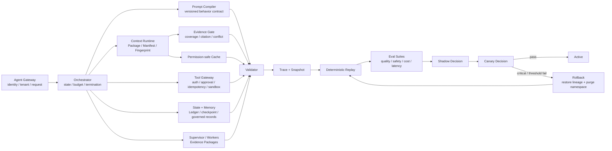

# A8 · Observability Capstone：Trace、Evals、发布与回滚闭环

> 场景：`change-4821` 已走完行为合同、Context、Evidence、Ledger/Memory、Cache 和 Multi-Agent 审查。现在必须回答：这次结论能否重放，候选能否进入 Shadow/Canary，哪些失败一票否决，以及如何证明回滚恢复了旧行为。

[上一章：A7 Cache 与 Multi-Agent](../07-cache-multi-agent/README.md) · [20 周课程](../CURRICULUM.md) · [返回 Agent 工程化学习中心](../README.md)

全章约束：断网、固定 clock、固定 seed、无真实 I/O；**offline≠production**。

## 先修与学习目标

完成 A1–A7，尤其是 [A3 Prompt Release Gate](../03-prompt-release-gate/README.md)、[A4 Context Runtime](../04-context-runtime/README.md)、[A6 Durable Memory](../06-durable-memory/README.md) 和 [A7 Cache 与 Multi-Agent](../07-cache-multi-agent/README.md)。你应已能解释 version lineage、critical veto、Manifest、Checkpoint、Permission Digest 与 Evidence Package。

完成本章后，你应能：

- 把一次生产变更审查拆成可归因的 spans，而不是只记录最终答案。
- 生成不泄露敏感原文的 Trace Digest，并关联 Prompt、Context、Cache、Tool、State、Approval 与 Outcome 版本。
- 使用固定 snapshot 重放 `change-4821`，区分确定性合同漂移与真实模型随机性。
- 设计 unit → offline golden → fault simulation → production replay/shadow → canary 的评测阶梯。
- 同时应用质量、安全、成本、延迟门，关键权限/越权/副作用失败一票否决。
- 形成发布、暂停、回滚的证据包与 Runbook，并明确 offline 不等于 production。

## 核心理论与边界

### 可观测性不是保存一大段日志

一次 Agent 运行至少分层观察：Run/State、Prompt compile、Context plan/retrieve/authorize/rerank/compress/pack、Memory read/write、Cache read/write、Model call、Tool request/approval/execute、Validation、Checkpoint/Resume、Release decision。每个层记录结构化输入摘要、版本、决策、耗时、Token/成本与错误类别，敏感正文留在受控 Artifact 或根本不记录。

Trace 的价值是回答因果问题：

- 没有事实，是 Query Plan、Recall、ACL 还是 Evidence Coverage 失败？
- 有证据仍答错，是 Pack/Compaction、模型未使用 citation，还是输出验证失败？
- 恢复偏航，是 checkpoint、版本漂移、Ledger projection，还是副作用对账失败？
- 越权内容出现，是 pre-filter、post-auth、cache fingerprint，还是 derived ACL 失效？

### Evals 是生产证据阶梯

| 层级 | 目的 | 典型证据 | 是否影响用户 |
|---|---|---|---|
| L1 Unit / Contract | Schema、不变量、哈希、CAS、错误码 | 固定 fixture、属性测试 | 否 |
| L2 Offline Golden | Prompt/Context/Evidence/Memory 行为回归 | fixture+seed exact coverage、gold labels | 否 |
| L3 Simulation | 超时、权限变化、缓存陈旧、篡改、崩溃 | fault injection、red team | 否 |
| L4 Replay / Shadow | 用脱敏生产分布比较候选与基线 | Manifest/Trace diff、预测门 | Shadow 不影响结果 |
| L5 Canary / A-B | 小流量验证真实质量、延迟、成本和安全 | 在线指标、自动回滚 | 是，必须受限 |

不能跳级。离线全绿只说明固定样例合同通过；没有真实身份、数据、模型、工具、负载与运维，就不能声称生产可用。

### Trace 与版本谱系

可重放 snapshot 至少绑定：run/request/trace IDs、PromptArtifact/behavior bundle、eval suite、policy、model、tool schema、Context Manifest/Fingerprint、Index/Reranker、Cache namespace、Ledger revision/checkpoint、Memory refs、approval、fixture/seed/clock 和 outcome。任何一个影响行为的版本未记录，重放相等都可能是假象。

### 发布与回滚是同一状态机

发布路径是 baseline → offline → shadow → canary → active；任一门失败进入 blocked/rollback。发布决策至少有四组门：

- **质量**：required claim coverage、citation validity、任务成功率、回归差异。
- **安全**：ACL/跨租户、注入、未授权工具、敏感输出、审计完整性。
- **成本**：Token、工具调用、缓存有效命中、单位任务成本。
- **延迟/可靠性**：P95/P99、超时、构建失败、checkpoint/resume、错误率。

安全关键失败不参与加权平均，直接 veto。回滚不仅切回 Prompt，还要处理 Context/Index/Policy/Tool/Cache namespace 与长任务 checkpoint 的兼容；旧 snapshot 必须仍可重建。

## 目标生产架构与当前教学边界

下图是八章最终应汇合的生产目标。当前 A8 离线 host 已真实接入 A1 RunManifest 与 A3 BehaviorBundle，并与 Context、Evidence、Task、Memory、Multi-Agent 和 review decision 一起形成 8 个 Trace spans；permission-safe cache、Tool Gateway 与真实 approval 仍分别由前章合同或生产升级项覆盖，`index.ts` 不会假装执行真实外部动作。



## 逐步实验：审查、重放、Shadow 与 Canary Capstone

本目录 `index.ts` 使用固定 snapshot、clock、seed 与内存适配器，调用以下共享导出：

- `runProductionChangeReview`
- `replayProductionChangeReview`
- `decideRuntimeRollout`
- `validateEnterpriseRuntimeSnapshot`

它复用前章合同来模拟完整链路，但不会调用真实模型、IAM、数据库、工具、缓存、发布或回滚系统。

### 第 1 步：固定输入合同

固定 `scenarioId`、`at`、非负整数 seed、A1 RunManifest、A3 BehaviorBundle、Context build 输入、Evidence candidates/requirements/policy snapshot、Task Ledger、Memory records 和可选 multi-agent packages。`runProductionChangeReview` 会对 exact schema，`prompt/model/toolset/outputContract/contextPolicy/permissionPolicy/evalSuite` 七个版本 surface，时间窗口、tenant/policy/authority 一致性和嵌套合同 fail closed；它不接受一份随意拼装的“尽力执行”输入。

### 第 2 步：运行生产变更审查模拟

调用 `runProductionChangeReview`。Trace 必须分别出现 `run.validate`、`behavior.pin`、`context.build`、`evidence.evaluate`、`task.hydrate`、`memory.read`、`multi_agent.reduce`、`review.decide`；不能只在一个总 span 里写“已通过”。同时检查 7 个版本 surface、authority、deadline、Evidence Gate 与 Reducer 冲突。Outcome 只有 `READY_FOR_HUMAN_APPROVAL` 或 `ABSTAIN`，前者仍不是自动部署。

### 第 3 步：验证产物并重放

先把 review 结果序列化再用 `validateEnterpriseRuntimeSnapshot` rehydrate；它校验 schema、嵌套 digest、Manifest/Fingerprint、Evidence coverage、Ledger、Memory、Reducer、outcome/reasons 与 Trace 时间。然后调用 `replayProductionChangeReview` 比较 expected/actual review digest。固定输入下必须匹配；若不匹配，优先检查时间、seed、集合排序、canonical JSON 和隐含全局状态。

### 第 4 步：Shadow 决策

用 `decideRuntimeRollout` 比较 baseline 与 candidate，但只产生 Shadow decision。Candidate 不改变用户结果。当前指标是 pass rate、evidence coverage、ACL violations、critical failures、P95 与 cost/task；任一 ACL/critical failure 都阻断，否则 Shadow 可返回 `advance-to-canary`。

### 第 5 步：Canary 决策与回滚演练

课程只模拟 Canary decision。构造一个一般指标略好但 ACL fixture 失败的候选，确认返回 `block`；再构造通过所有门的候选，当前函数会返回 `promote`，但在课程边界中它只是一份离线决策对象，不代表真实生产发布。真正回滚仍需外部控制面、旧 namespace、流量切换与重放验证。

### 第 6 步：运行命令并检查预期 JSON

```powershell
node node_modules/tsx/dist/cli.mjs agent-engineering/08-observability-capstone/index.ts
```

预期 stdout 是单个 JSON，成功退出码为 `0`：

```json
{
  "module": "A8",
  "outcome": "...",
  "runDigest": "sha256:...",
  "behaviorDigest": "sha256:...",
  "traceDigest": "sha256:...",
  "traceSpans": 8,
  "replayMatched": true,
  "shadowDecision": "...",
  "canaryDecision": "...",
  "safetyCounterexample": {},
  "boundary": {}
}
```

验收不要求特定“批准”字符串；它要求 Run/Behavior digests 可追溯、8 spans 齐全、outcome 与证据门一致、Trace Digest 可验证、重放匹配、Shadow/Canary 决策分层、安全反例被 veto、边界明确无真实发布。

## 正例与反例

### 正例：证据充分但仍分阶段发布

`change-4821` 的行为合同、required evidence、回滚演练、权限与状态均通过离线 Gate。Candidate 在 Shadow 中只旁路构建新 Package 并比较 Trace；通过后才具备进入小租户/低风险任务 Canary 的资格。Canary 仍设置泄漏、错误率、P95、成本与 checkpoint 指标，且有自动回滚与人工 owner。

### 正例：回滚恢复的是版本谱系

Canary 出现安全阈值失败。系统停止新流量，恢复 baseline Prompt/Policy/Packer/Index/Tool 兼容组合，切换或 purge 对应 Cache namespace，检查运行中任务的 checkpoint 兼容性，再用旧 snapshot 重放并验证 Trace。只修改一个 `latest` 指针不算完整回滚。

### 反例 1：平均分掩盖关键失败

候选平均质量从 0.82 升到 0.87，但跨租户用例泄漏一条证据。正确决策仍是 blocked；安全 critical suite 不参加加权抵消。

### 反例 2：Trace 只有最终输出

日志只保存“允许 Canary”，无法证明用过哪些证据、权限、Prompt、Cache、Tool 或 Ledger revision，也无法判断重放差异。它不是可审计 Trace，只是结果日志。

### 反例 3：offline 即 production

固定 fixture 无网络运行成功，不证明真实模型稳定、IAM 正确、索引及时、缓存隔离、工具幂等、Kubernetes 可用或告警有效。正确结论必须是“离线合同已验证，生产项未知”。

### 反例 4：记录敏感原文以求可观测

把完整 Prompt、用户文档和工具结果写入通用日志会制造第二条泄漏路径。Trace 应保存 ID、版本、决策、哈希、指标和受控 artifact refs；高敏正文按最小化与保留政策处理。

## 练习与答案检查点

### 练习 1：设计错误归因树

对“结论缺少回滚风险”列出排查顺序。

答案检查点：先看 required claim 与 Query Plan，再看 Recall/ACL/Freshness/Evidence coverage；证据充分则看 Pack/Compaction 与模型 citation 使用，最后看 Output Validator。不能第一步就归因“模型不聪明”。

### 练习 2：定义 critical veto

列出至少五个不允许平均分抵消的用例。

答案检查点：跨租户泄漏、未授权工具/副作用、权限摘要篡改未检出、关键 evidence 缺失却批准、重复副作用、删除后仍可见、审计谱系不可重建均可作为 critical；最终集合由安全与业务 owner 审批。

### 练习 3：区分 Shadow 与 Canary

候选在真实请求旁路生成结果但不返回用户，属于哪一层？

答案检查点：这是 Shadow/Replay；可使用真实分布但不改变用户结果。Canary 会实际影响受限流量，必须有明确租户/任务范围、指标、持续时间、owner 和回滚阈值。

### 练习 4：重放不匹配

snapshot 字段齐全但 Trace Digest 漂移。

答案检查点：检查 canonicalization、数组排序、clock、seed、非确定 ID、并发完成顺序和隐藏全局状态；若涉及真实模型，再区分确定性输入谱系和采样变异。不能通过更新 expected digest 掩盖根因。

## 测试与验收矩阵

| 层级 | Fixture / 操作 | 必须观察 | Release 行为 |
|---|---|---|---|
| Snapshot | 缺 policy/tool/index/seed/clock | validator 拒绝 | 不进入重放 |
| Integrity | Manifest 或 artifact digest 篡改 | 明确错误与 trace | critical veto |
| Replay | 固定 snapshot 重放两次 | `replayMatched=true` | 漂移阻断 |
| Prompt | candidate behavior diff | fixture+seed exact coverage | critical case 不可缺失 |
| Context | required item/预算/permission | Manifest 可解释 | 泄漏或缺硬约束 veto |
| Evidence | 低 authority/confidence/coverage | abstain，不批准 | required evidence 门 |
| Memory/State | 过期/错租户/CAS/恢复漂移 | 不可见或重验证 | 重复副作用 veto |
| Cache | scope change/digest mutation | miss / reject | 不复用旧 Package |
| Multi-Agent | 同 lineage 多 Worker/冲突 | 去重、ConflictSet | 不按多数票发布 |
| Tool | 未审批副作用意图 | Gateway 拒绝 | critical veto |
| Shadow | candidate 旁路比较 | 用户 outcome 不变 | 只产生预测决策 |
| Canary | 质量/安全/成本/延迟阈值 | 受限范围与自动回滚 | 任一 hard gate 触发回滚 |
| Audit | 从 release 找回 snapshot/trace | lineage 闭合 | 不可审计即阻断 |
| Boundary | 检查外部系统状态 | 明确全部模拟 | 不宣称真实发布 |

Capstone 验收门：snapshot 完整且不可篡改；固定重放匹配；Trace 可分层归因；质量、安全、成本、延迟门齐全；critical veto 生效；Shadow 与 Canary 边界清楚；回滚后旧谱系可重建；stdout 保持 machine-readable JSON。

## 最终交付物

学习者应提交：

1. `change-4821` 的版本化 Run/Prompt/Context/Evidence/State/Memory/Cache/Multi-Agent snapshot。
2. 正例、证据不足、跨租户、注入、缓存篡改、恢复漂移与回滚 fixture。
3. 一份分层 EvalReport，包含 coverage、citation、ACL、replay、Token/成本、延迟和安全门。
4. Shadow 与 Canary Decision Package，记录阈值、owner、范围、有效期、审批和回滚条件。
5. 生产 Runbook：告警、归因、降级、checkpoint/reconcile、purge、删除验证、回滚与事后复盘。

评分维度为正确性、可解释性、可回放性、安全、性能、可演进性和可运维性；任何安全 critical failure 使总分无效。

## 事实、推断与未知边界

### 已验证事实

- 本章离线入口覆盖真实 A1 RunManifest/A3 BehaviorBundle pin、生产变更审查模拟、产出 snapshot 验证、8-span Trace、确定性重放和 rollout 决策合同。
- 固定 fixture、clock 与 seed 能验证 Trace Digest、replay match、Shadow/Canary 分层和安全 veto。
- `shadowDecision` 与 `canaryDecision` 是模拟结果，不会改变真实生产流量或部署。

### 工程推断

- 分层 Trace + Manifest + Replay 能提高故障归因与发布信心，但会引入采集、存储、脱敏和治理成本。
- 自动回滚适合有清晰、快速、低误报指标的场景；高风险业务仍可能需要人工签字与分级降级。

### 未知项

- 真实模型、流量、数据、IAM、工具、缓存、队列和集群下的质量、P95/P99、成本与故障分布。
- 组织对 Trace 采样、敏感字段、保留、审计、Canary 范围和自动回滚权限的最终政策。
- 生产中长期任务跨版本恢复、数据迁移和多区域灾备的真实 RPO/RTO。

## 从离线 Capstone 升级到生产

- [ ] 建立 Control/Runtime/Data/Governance 四平面 owner、SLO、ADR、on-call 与变更审批。
- [ ] 接入真实 Agent Gateway、IAM/PDP/PEP、Model Gateway、Tool Gateway、State/Memory/Artifact/Cache stores。
- [ ] 所有副作用工具实施短期 capability、参数 Schema、审批、幂等、沙箱、egress、对账与补偿。
- [ ] Trace 默认脱敏；为高风险事件 100% 记录 ID/版本/decision/digest，并实现受控正文访问与可验证删除。
- [ ] 建立 Retrieval/Context/Memory/Long-Horizon/Security/Production Replay 数据集及版本 owner。
- [ ] 定义质量、安全、成本、延迟、可靠性门；安全关键失败 hard veto，不允许平均抵消。
- [ ] 在隔离环境做超时、撤权、缓存陈旧、篡改、崩溃、重复投递、删除传播和灾备演练。
- [ ] Shadow 不影响用户；Canary 明确租户/任务范围、持续时间、指标、审批与自动回滚。
- [ ] 保留 baseline Prompt/Policy/Index/Tool/Cache namespace 与 checkpoint 兼容策略，定期演练回滚重放。
- [ ] 只有真实生产证据通过且业务/安全/SRE owner 签字后，才能把状态描述为 production-ready。

## 延伸学习

- [A3 · Prompt Release Gate](../03-prompt-release-gate/README.md)：behavior bundle、Eval Suite、release 与 rollback。
- [Agent Eval Harness Capstone](../../capstone/agent-eval-harness/README.md)：扩展 Golden Set 与评测执行器。
- [评测与测试](../../lessons/15-evaluation-and-testing/README.md)：建立离线与在线评测策略。
- [Agent 趋势与架构](../../docs/agent-trends-architecture.md)：把本课程组件放回更大的系统视角。

<!-- KG:START (由 npm run kg 自动生成，勿手改本标记区) -->

## 知识图谱与延伸阅读

> 本节由 `npm run kg` 自动生成（数据源 `knowledge-graph/data/graph.ts`）。要增删请改数据源后重跑。

### 本章概念图谱

> 节点：**橙框**=本章概念，蓝框=关联的其他章概念。连线按关系类型着色：前置(蓝) · 深化(紫) · 对比(玫红) · 应用(绿) · 组成(橙)。

```mermaid
graph LR
  classDef own fill:#fff7ed,stroke:#ea580c,stroke-width:3px,color:#7c2d12;
  classDef cross fill:#eef2ff,stroke:#6366f1,stroke-width:1.5px,color:#312e81;
  n_caecap_trace_replay["Trace Digest 与 Replay"]
  n_caecap_shadow_canary["Shadow / Canary 质量门"]
  n_caecap_release_dossier["Release / Rollback Dossier"]
  n_caemulti_evidence_reducer["Evidence-aware Reducer（第ae-multi章）"]
  n_caeprompt_release_rollback["评估门禁与整包回滚（第ae-prompt章）"]
  n_caemulti_evidence_reducer -->|前置| n_caecap_trace_replay
  n_caecap_trace_replay -->|前置| n_caecap_shadow_canary
  n_caecap_shadow_canary -->|前置| n_caecap_release_dossier
  n_caecap_release_dossier -->|应用| n_caeprompt_release_rollback
  class n_caecap_trace_replay,n_caecap_shadow_canary,n_caecap_release_dossier own;
  class n_caemulti_evidence_reducer,n_caeprompt_release_rollback cross;
  linkStyle 0 stroke:#2563eb,stroke-width:2px;
  linkStyle 1 stroke:#2563eb,stroke-width:2px;
  linkStyle 2 stroke:#2563eb,stroke-width:2px;
  linkStyle 3 stroke:#059669,stroke-width:2px;
```



### 与其他章节的关系

- `Evidence-aware Reducer` —**前置**→ `Trace Digest 与 Replay`（第 ae-multi 章）
- `Release / Rollback Dossier` —**应用**→ `评估门禁与整包回滚`（第 ae-prompt 章）

### 延伸阅读

- [OpenAI Docs · Evaluate agent workflows](https://developers.openai.com/api/docs/guides/agent-evals) — OpenAI 官方 agent workflow eval 指南，对应离线评估、trace/replay 与发布门治理 `doc`

> 🗺️ 在[全局知识图谱](../../docs/knowledge-graph.md) / [交互式图谱](../../knowledge-graph/output/index.html) 中查看本章位置。

<!-- KG:END -->
