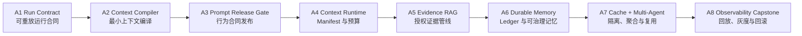

# Agent 工程化 20 周完整课程

> 贯穿案例：`change-4821` 是一项生产变更审查。学习者必须判断证据是否充分、是否允许进入灰度、何时拒绝或回滚，并能从 Trace 与 Manifest 重放结论。全部实验断网运行，使用固定时间与固定 seed；`offline` 只证明合同和算法样例可重复，不等于生产可用。

课程时长：**20 周、每周 6–8 小时、总计约 120–160 小时**。建议每周投入约 2 小时理论阅读、3–4 小时实验与 1–2 小时评测复盘。

[返回 Agent 工程化学习中心](./README.md)

## 课程要解决什么问题

课程不是把 Prompt、RAG、Memory、Cache 和 Multi-Agent 当作五个互不相干的技巧，而是把它们组织成一条可审查的生产链路：

- **Prompt 是版本化行为合同**：明确角色、目标、约束、工具协议、输出 Schema、失败策略和停止条件；它不是一段临时文案。
- **Context Runtime 是信息与证据运行时**：在身份、目的、时效和 Token 预算约束下，选择最小充分信息，并留下 Manifest、Fingerprint 与拒绝理由。
- **Orchestrator 是控制系统**：拥有状态机、任务图、预算、重试、恢复和终止权；它不把控制权交给检索内容或 Worker。
- **Tool Gateway 是授权与副作用边界**：执行前复核权限、参数、幂等键、审批与沙箱，执行后记录结果引用和对账信息。
- **Evals 与 Trace 是生产证据闭环**：离线 Golden Set、故障注入、回放、Shadow、Canary 和回滚必须共享同一版本谱系。

两份本地架构研究给出的共同结论是：先建立契约、Manifest、Trace 和可回放基线，再扩展记忆、缓存与多 Agent；没有证据闭环的“自动优化”只会扩大不可解释错误。本课程据此采用 30% 理论、50% 工程实验、20% 评测复盘的节奏。

## 本地研究依据与使用方式

- [Agent 工程化完整学习知识图谱与平台架构](../docs/solutions/Agent工程化完整学习知识图谱与平台架构.docx) 提供 Prompt/Context/Cache/Orchestrator/Evals 的平台分层、20 周依赖路线、四类项目与最终验收维度。
- [上下文工程化企业级 Context Runtime 完整架构与落地手册](../docs/solutions/上下文工程化企业级Context_Runtime完整架构与落地手册.docx) 提供 Request/Package/Manifest/Fingerprint、权限感知 Evidence、Token 预算、Memory/Ledger、缓存、多 Agent、Trace/Evals 和生产升级边界。

课程只提炼两份本地研究中的供应商中立工程结论，并用仓库内固定 fixture 验证；不会把任何厂商功能表、宣传指标或“开箱即生产”陈述当作事实。

## 学习路径与依赖

课程章节：

1. [A1 · Run Contract](./01-run-contract/README.md)
2. [A2 · Context Compiler](./02-context-compiler/README.md)
3. [A3 · Prompt Release Gate](./03-prompt-release-gate/README.md)
4. [A4 · Context Runtime](./04-context-runtime/README.md)
5. [A5 · Evidence RAG](./05-evidence-rag/README.md)
6. [A6 · Durable Memory](./06-durable-memory/README.md)
7. [A7 · Cache 与 Multi-Agent](./07-cache-multi-agent/README.md)
8. [A8 · Observability Capstone](./08-observability-capstone/README.md)

依赖门必须按顺序通过：没有 Tool Schema 与输出合同，不进入复杂多 Agent；没有 Context Manifest 与状态 revision，不做语义缓存；没有 Golden Set 与 Trace，不比较编排策略；没有权限、审批与幂等，不执行高风险写操作。

## 统一实验协议

所有周实验均围绕 `change-4821`，使用同一组不可变输入：固定 `tenant-acme`、固定 principal、固定权限快照、固定数据版本、固定时间 `2026-08-10T08:00:00.000Z` 与固定 seed。实验不得调用网络、真实模型、真实数据库、真实工具或真实部署系统。

每次交付至少保存五类证据：输入 fixture、版本化合同、machine-readable JSON 结果、正反例断言、复盘说明。学习者必须把结果分成：

- **已验证事实**：由当前 fixture、Schema、断言或哈希直接证明。
- **工程推断**：基于离线证据作出的设计判断，必须写出条件。
- **未知项**：需要线上依赖、真实负载、安全评审或业务 owner 才能确认。

## 20 周逐周课程

| 周 | 理论主题 | 必做实验 | 交付物 | 必须解释的反例 | 验收门 |
|---|---|---|---|---|---|
| 1 | Agent 运行的最小领域模型：run、request、attempt、event、artifact；“模型回答”与“生产执行”边界 | 用 A1 为 `change-4821` 建立固定 `runId`、输入摘要、版本快照和事件序列 | Run Manifest、事件时间线、失败分类 | 只保存最终文本，无法知道用了哪个 Prompt、Context 或 Tool | 相同输入重放得到同一摘要；缺少关键版本时 fail closed |
| 2 | 状态机、不变量、Handoff、预算与终止条件；Orchestrator 是控制面 | 注入非法状态迁移、超预算和摘要篡改，验证拒绝与交接 | 状态转移图、Handoff Envelope、三类失败 fixture | 用自由文本“继续执行”替代状态 revision 和 CAS | 非法迁移、篡改摘要、过期 revision 均被明确拒绝；完成里程碑基线演示 |
| 3 | Prompt 作为行为合同：Role、Goal、Inputs、Constraints、Process、Output Contract、Failure Policy、Stop Condition | 将 `change-4821` 审查 Prompt 拆为结构化 artifact 与 behavior bundle | PromptArtifact、模板变量清单、边界用例 | 把提示词当字符串修改，版本号不变、行为却漂移 | 合同缺字段、未知变量、非法状态不可编译；模板渲染确定性 |
| 4 | PromptOps：Registry、版本、fixture、seed、diff、eval suite 与关键 veto | 比较 baseline/candidate；构造普通指标提升但安全关键用例退化的候选 | 行为 diff、EvalReport、release decision | 只看平均分，忽略越权或高风险错误 | fixture+seed exact coverage；critical failure 一票否决；suite/version 谱系完整 |
| 5 | Prompt 发布、CAS、审计、回滚与环境迁移 | 发布候选、模拟并发发布冲突、执行回滚并证明旧版本可重建 | ReleaseRecord、RollbackRecord、审计链、ADR-001 | 直接把 `latest` 指向候选，未保留旧 behavior bundle | 发布与回滚都校验 expected revision；回滚目标和原因可追溯。**里程碑 M1 通过** |
| 6 | Context 不等于聊天历史；Context Runtime 的 Request/Item/Package/Manifest 边界 | 规划 `change-4821` 的 system、goal、state、evidence、memory、tools 分区 | ContextRequest、来源目录、选择/拒绝规则 | 将完整聊天、日志、网页原文平铺进窗口 | 每个进入/拒绝项有 reason、source、版本、权限与时效；Runtime 不替 Agent 规划业务目标 |
| 7 | Token 预算：输出预留、硬/软配额、弹性池、Utility 与压缩阶梯 C0–C4 | 在紧预算下保留硬约束和关键证据，丢弃低价值 memory；比较压缩前后哈希 | BudgetReport、压缩 lineage、消融记录 | 输入挤占输出预算；把安全策略或确认决策摘要掉 | `input + output reserve + safety <= window`；required 100% 保留；派生项可回到原始引用 |
| 8 | Context Manifest、Fingerprint、policy snapshot、freshness 与消费前复核 | 运行 A4 正例及跨租户/过期证据反例 | Package、Manifest、Fingerprint、边界分类 | 只用 userId 做权限摘要；复用旧 Package 绕过当前授权 | Package/Manifest 指纹一致；跨租户零泄漏；缓存或消费前重新鉴权 |
| 9 | 权限感知 RAG：查询规划、BM25/向量/结构化通道、ACL 前置、融合与 rerank | 用 A5 对固定候选做授权、去重、融合、重排 | QueryPlan、CandidateSet、EvidenceSet | 先全量召回敏感内容，再让模型“自行忽略” | forbidden 候选从未进入可见证据；排序与固定 seed 一致；部分超时显式标记 |
| 10 | Evidence Gate：覆盖、权威、时效、引用、冲突与不充分证据 | 对 `change-4821` 构造双源一致、口径冲突、陈旧、证据缺失四组 fixture | coverage map、citation map、ConflictSet、拒绝原因 | 多个 Agent 引用同一 lineage，却声称是独立交叉验证 | 关键 claim 有可访问 citation；冲突不静默选边；证据不足返回 `insufficient` |
| 11 | Context Evals：Recall@K、nDCG、ACL Precision、Freshness、Coverage、Context Precision/Utility | 做位置消融、无 Context 对照、distractor 注入与 Manifest 回放 | Context Golden Set、评测报告、错误归因树 | 仅让模型给自己打分，或只评最终答案 | 能区分检索、授权、装配、模型使用四类错误。**里程碑 M2：Context Runtime + Evidence RAG V1 通过** |
| 12 | Memory 是受治理断言，不是聊天副本；Working/Episodic/Semantic/Procedural/Task/Shared 分层 | 为变更审查提出 memory candidate，区分事实、偏好、经历与任务状态 | MemoryRecord、write policy、namespace 表 | 把模型推断自动写成事实，或把 Worker 草稿写入共享记忆 | 无来源只停留候选；默认最小作用域；敏感项按策略拒绝或短 TTL |
| 13 | Memory 写读、冲突、巩固、supersede、遗忘与删除传播 | 用 A6 提交、查询、冲突并存、纠正和删除；检查派生引用 | Memory audit chain、冲突决议、删除证明 | 新值覆盖旧值但丢失撤销链；删主记录不删缓存/派生项 | CAS、idempotency、provenance、TTL、删除 lineage 全部可审计 |
| 14 | 长任务 Task Ledger、Checkpoint、Compaction 与恢复协议 | 在副作用边界前后 checkpoint；模拟崩溃、重启、版本漂移和未确认动作 | Ledger revisions、Checkpoint、Resume Manifest、reconciliation 报告 | 恢复时重放全部聊天，或对未知副作用盲目重试 | 关键事实与决策 100% 保留；readiness step 无副作用；重复副作用为 0 |
| 15 | 状态与记忆的区别、Artifact 外置、恢复 SLO 与故障注入 | 对同一 checkpoint 重放并比较摘要、revision、artifact checksum | 长任务 Golden Set、故障注入报告、ADR-006/007 | 用 memory 替代强一致 Ledger，导致任务步骤回退 | 固定 fixture 重放一致；漂移可归因；删除/撤权后无法恢复越权内容。**里程碑 M3：Durable State & Memory 通过** |
| 16 | 多层缓存、Context Fingerprint、Permission Digest、版本 namespace 与失效 | 为 `change-4821` 生成缓存键；变更 ACL、Prompt、Index、Ledger revision 并观察 miss/purge | cache key 规范、失效矩阵、命中解释 | 只用 query 文本做语义缓存键；权限缩小时继续命中 | 影响语义或可见性的字段均入指纹；权限减少立即失效；副作用工具结果不复用 |
| 17 | Cache 一致性、安全与性能：stale 策略、lineage purge、cache poisoning、有效命中 | 注入跨租户缓存、陈旧 policy、错误 checksum；计算 effective hit | 安全反例报告、容量/降级草案、ADR-008 | 用高命中率掩盖旧数据或越权结果 | 高风险请求不允许 stale-while-revalidate；命中后仍做授权/时效复核；污染条目 fail closed |
| 18 | Multi-Agent：Supervisor、Worker、Reducer、Validator；最小 Context Package 与 Evidence Package | 用 A7 并行核验风险、回滚与测试证据，聚合冲突并 CAS 提交 Ledger | assignment、worker package、evidence package、reduce report | 广播全局上下文；多数票代替证据；Worker 直接写全局事实 | Worker 权限/预算隔离；lineage 去重；冲突显式；只提交验证事实。**里程碑 M4：Cache + Multi-Agent V1 通过** |
| 19 | 可观测与评测金字塔：unit、offline golden、fault simulation、production replay、shadow | 用 A8 生成 Trace Digest，重放相同审查，旁路比较新策略 | Trace、ReplayReport、ShadowDecision、红队结果 | Trace 记录敏感原文，或只留最终 outcome 无法归因 | 版本、Manifest、工具、状态、审批、结果可关联；脱敏重放匹配；关键安全失败阻断 |
| 20 | Canary、发布门禁、自动回滚、Runbook、SLO/成本与治理 | 对候选执行离线→Shadow→Canary 决策；模拟 ACL 泄漏、成本超限和回滚 | Release/rollback decision、最终报告、演示录像或命令记录、生产升级清单 | offline 全绿就宣称生产可用；回滚只改 Prompt 不处理 Context/Cache namespace | 质量/安全/成本/延迟四门齐全；critical veto；回滚谱系闭合。**最终 Capstone 通过** |

## 四个里程碑

### M1 · 版本化行为合同（第 5 周）

学习者能从 Run Contract 推导 PromptArtifact，使用固定 fixture+seed 比较行为差异，执行带 CAS 与审计谱系的发布/回滚。若关键安全用例退化，即使总分上升也必须拒绝。

### M2 · 信息与证据运行时（第 11 周）

学习者能构建最小充分 ContextPackage、完整 ContextManifest 和权限感知 EvidenceSet；能用消融与分层指标区分检索失败、证据不足、装配错误与模型未使用证据。

### M3 · 可恢复状态与受治理记忆（第 15 周）

学习者能以 Task Ledger/Checkpoint 保证长任务恢复，以 Memory Policy 管理跨会话断言；能处理 CAS 冲突、来源、撤销、TTL、删除传播与版本漂移。

### M4 · 安全规模化编排（第 18 周）

学习者能构造包含完整语义和权限边界的 Fingerprint，并让 Supervisor 以最小包分配 Worker；Reducer 依据独立 evidence lineage 聚合，而不是依据多数意见。

## 最终 Capstone：`change-4821` 生产变更审查

最终系统需要从一个固定 Run Manifest 开始，经过 Prompt behavior contract、Context Runtime、Evidence Gate、Ledger/Memory、Cache、Multi-Agent 聚合，输出可重放的 Trace 与发布决策。演示必须同时包含：

1. **正例**：证据覆盖、权限、时效和测试门均通过，允许进入受限 Canary。
2. **证据不足**：缺少关键回滚或测试证据，返回阻断而不是补写合理答案。
3. **安全反例**：跨租户来源、注入内容或权限摘要不一致，critical veto。
4. **恢复反例**：checkpoint 后策略或工具版本漂移，先重验证再继续。
5. **回滚**：Canary 安全或质量阈值触发，回滚 Prompt/Context/Cache 相关版本谱系，并证明旧运行可重建。

最终验收从七个维度评分：正确性、可解释性、可回放性、安全、性能、可演进性、可运维性。任一安全关键项失败，总分不生效。

## 课程完成标准

完成课程不等于跑通八个 CLI。学习者还应能回答：哪一个组件拥有控制权；哪一个对象是证据；哪个版本变化使缓存失效；为什么某条记忆能进入上下文；为何某次发布被拒绝；如何从 Trace 证明回滚确实恢复旧行为。

离线课程明确不覆盖真实 IAM/PDP、数据库隔离、消息投递、Kubernetes、真实模型非确定性、生产流量、成本计费和监管审计。这些均属于生产升级门，必须在真实环境重新验证。
