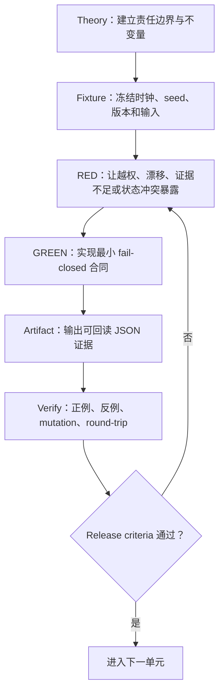

# Agent Engineering：完整课程与企业实践轨道

> 用 20 周把 Agent 从一次模型调用推进到可恢复、可审计、可评估、可灰度的工程系统。
>
> 课程入口：[20 周完整课程](./CURRICULUM.md) · [全站导航](../docs/navigation.md) · [完整大纲](../docs/curriculum.md) · [canonical 五平面架构](../docs/agent-trends-architecture.md)

## 课程承诺

这不是一份只讲术语的目录，也不是某个模型 SDK 的速成教程。每个单元都把理论、合同、代码、反例和发布证据放在一起：

1. 先解释为什么需要这一层，以及它不应该承担什么责任；
2. 再用 TypeScript 把关键不变量写成可运行合同；
3. 同时运行正常路径与故障路径，观察系统如何 fail closed；
4. 产出 manifest、ledger、evidence、trace 或 release decision 等机器可读 artifact；
5. 最后用验收门判断是否可以进入下一阶段，而不是用“Agent 自称成功”作为完成证据。

完成 A1–A8 后，你应该能够设计并解释一套最小企业 Agent Runtime，能明确回答：本次运行使用了什么行为版本、模型看见了哪些上下文、证据是否充分、权限是否扩大、状态能否恢复、缓存是否跨权限复用、候选为何可以发布，以及失败后能恢复什么、不能恢复什么。

## 一套架构，五种责任

[`docs/agent-trends-architecture.md`](../docs/agent-trends-architecture.md) 是本仓库的 **canonical 五平面责任模型**。本目录是它的 **可执行 companion（配套实践）**，不会另造一套平行架构。

贯穿全课的责任分工是：

- **Prompt**：版本化的行为合同，定义目标、约束、输出和失败策略，但不负责授权。
- **Context Runtime**：信息与证据运行时，负责身份/用途约束下的获取、筛选、预算、装配和可解释性。
- **Orchestrator**：执行控制，负责状态机、任务图、预算、取消、恢复、handoff 和完成条件。
- **Tool Gateway**：真实世界边界，负责授权、参数校验、幂等、sandbox、审批和副作用审计。
- **Evals / Trace**：生产证据闭环，负责回放、回归、灰度、监控和发布决策。


## 贯穿场景：生产变更审查 Agent

八个单元共同审查生产变更 `change-4821`：数据库连接池参数准备从 40 调到 80。系统不能只生成一句“可以发布”，而必须逐步证明：

- 本次 run 固定了哪个 prompt、model、toolset、context policy 和 permission policy；
- 请求属于哪个 tenant / principal / purpose，哪些资料在当前权限下可见；
- 发布策略、CI 结果、运行手册是否形成了可引用、足够且没有未解决冲突的证据；
- checkpoint、resume、memory、cache 和 handoff 是否保持幂等、隔离与 lineage；
- 候选 behavior bundle 是否通过 capability、regression、holdout 和 critical safety gate；
- Shadow / Canary 指标恶化时，是阻断候选、回滚配置，还是执行单独的补偿动作。

## A1–A8 完整学习路线

| 单元 | 理论焦点 | 必做实践与可观察产物 | 离线运行 |
| --- | --- | --- | --- |
| A1 [Run Contract](./01-run-contract/README.md) | 行为快照、生命周期、完成语义、handoff authority | run manifest、transition journal、outcome evidence、handoff envelope | `pnpm exec tsx agent-engineering/01-run-contract/index.ts` |
| A2 [Context Compiler](./02-context-compiler/README.md) | working context、trust、audience、预算与 provenance | context packet、stable prefix、included/excluded ledger、sufficiency | `pnpm exec tsx agent-engineering/02-context-compiler/index.ts` |
| A3 [Prompt Release Gate](./03-prompt-release-gate/README.md) | prompt-as-code、behavior bundle、eval、晋级与回滚 | typed render、semantic diff、eval report、promotion/rollback audit | `pnpm exec tsx agent-engineering/03-prompt-release-gate/index.ts` |
| A4 [Context Runtime](./04-context-runtime/README.md) | principal / tenant / purpose、policy snapshot、分区预算与指纹 | ContextRequest、ContextPackage、Manifest、Fingerprint、BudgetReport | `pnpm exec tsx agent-engineering/04-context-runtime/index.ts` |
| A5 [Evidence RAG](./05-evidence-rag/README.md) | 权限感知检索、claim/citation、冲突、relevance 与 sufficiency | Evidence Package、Coverage Map、Conflict Set、abstain decision | `pnpm exec tsx agent-engineering/05-evidence-rag/index.ts` |
| A6 [Durable State & Memory](./06-durable-memory/README.md) | CAS、checkpoint、幂等恢复、compaction、TTL 与遗忘 | Task Ledger、checkpoint、resume receipt、memory decision、deletion proof | `pnpm exec tsx agent-engineering/06-durable-memory/index.ts` |
| A7 [Cache & Multi-Agent](./07-cache-multi-agent/README.md) | permission-safe fingerprint、worker 隔离、budget tree、reducer | cache decision、Context Package、Evidence Package、reducer report | `pnpm exec tsx agent-engineering/07-cache-multi-agent/index.ts` |
| A8 [Observability Capstone](./08-observability-capstone/README.md) | trace/replay、shadow、canary、release/rollback/compensation | end-to-end trace、replay result、canary gate、最终 release dossier | `pnpm exec tsx agent-engineering/08-observability-capstone/index.ts` |

建议按 A1 → A8 顺序完成。若已经有 Agent 基础，可以先读 [20 周完整课程](./CURRICULUM.md) 的诊断表，再从第一个不能独立完成反例的单元开始；不要仅凭“看过这个术语”跳级。

## 学习方式：每章都走同一条工程闭环



每周建议投入 6–8 小时：约 30% 用于理论与架构图，50% 用于实验和故障注入，20% 用于复盘 artifact、补测试和记录仍未知的生产条件。完整逐周安排、里程碑与评分规则见 [CURRICULUM.md](./CURRICULUM.md)。

## 一键运行与验收

```bash
# A1–A3 基础合同回归
pnpm ae:smoke

# A4–A8 企业 Runtime 实践回归
pnpm ae:advanced:smoke

# 完整课程回归（基础 + 进阶）
pnpm ae:course:smoke

# 专题 TypeScript 边界
pnpm ae:typecheck

# 文档、架构、导航与研究边界
pnpm ae:research:test

# A1–A8 离线 demo 可发现性
pnpm demo:registry:test
```

课程的最低毕业门不是“命令 exit 0”，而是你能解释每条断言保护的生产失败模式，并能用 mutation 证明门禁不是恒真。A8 的最终 dossier 必须关联 run、behavior bundle、context fingerprint、evidence coverage、trace、eval 和 release audit。

## 四个里程碑与最终验收

| 里程碑 | 完成单元 | 交付物 | 不通过条件 |
| --- | --- | --- | --- |
| M1 可验证行为 | A1–A3 | 可恢复 run、可审计 context、不可变 behavior release | floating version、终态无 outcome oracle、critical regression 仍晋级 |
| M2 可解释信息 | A4–A5 | 身份/策略约束的 Context Runtime 与 Evidence RAG | 跨租户可见、secret 入模、citation 无 lineage、相关但不足仍作答 |
| M3 可持续执行 | A6 | CAS ledger、可恢复 compaction 与受治理 memory | replay 重复副作用、关键状态被压缩丢失、过期或争议记忆入模 |
| M4 安全规模化 | A7 | permission-safe cache、隔离 worker 与证据 reducer | permission digest 漏入 cache key、child 扩权、多数票覆盖证据冲突 |
| Final 可运营发布 | A8 | trace/replay/shadow/canary/release dossier | trace 无法重建 outcome、只看平均分、回滚声称撤销外部副作用 |

最终验收从七个维度评分：正确性、可解释性、可回放性、安全、性能/成本、可演进性、可运营性。任一安全关键项失败均不能被总平均分抵消。

## 与现有课程的分工

- [第 03 章：提示工程](../lessons/03-prompt-engineering/README.md) 讲 prompt 基础技巧；A3 把它提升为 code-managed behavior artifact 和发布门。
- [第 07 章：短期记忆与上下文](../lessons/07-short-term-memory/README.md) 讲会话窗口和摘要；A2、A4、A6 继续到多来源装配、长任务状态和受治理记忆。
- [第 15 章：评估与测试](../lessons/15-evaluation-and-testing/README.md) 与 [Agent Eval Harness](../capstone/agent-eval-harness/README.md) 讲通用 eval；A3、A8 负责把 eval 绑定到不可变行为包和发布生命周期。
- [RAG L11：检索后上下文工程](../rag-advanced/11-context-engineering/README.md) 负责检索片段处理；A5 增加身份、授权、citation、冲突和 sufficiency gate。
- [LangGraph 专题](../langgraph-advanced/README.md) 讲具体框架；本轨道保持 provider-neutral，训练框架背后的合同与治理机制。

## 证据边界

### 已验证事实

- 本轨道的实现是 provider-neutral 的确定性 TypeScript 合同；所有示例断网、固定时钟/seed，不读取 API key，也不会执行真实生产变更。
- Run、Session、Working Context、Task State、Memory、Artifact、Evidence、Prompt、Tool、Trace 与 Eval 是不同生命周期的对象，不能用一个无限增长的 `messages` 数组替代。
- 同一输入会产生可回读的 manifest、ledger、fingerprint、trace 或 decision；反例由合同拒绝或显式降级。

### 工程推断

- 把行为版本、上下文选择、证据覆盖和 release decision 一起固化，通常比只保存最终回答更容易定位回归。
- Context Runtime 作为独立信息运行时、Orchestrator 作为控制面、Tool Gateway 作为副作用边界，可以降低一个“超级 Agent 类”同时承担所有风险的耦合。

### 未知项与生产扩展点

- 离线 fixture **不证明真实模型质量、生产安全、跨厂商兼容或真实 SLO**。
- 本地 digest 是完整性证据，不是可信签名；真实系统仍需身份提供方、KMS/签名、ACL/DLP、sandbox、审批和脱敏审计。
- 内存 store 不证明分布式 lease、exactly-once、灾难恢复或生产数据库事务已经完成。
- 配置回滚只恢复行为版本，不能撤销已经发生的邮件、付款、数据库写入；外部副作用必须通过独立补偿或人工处置。

## 本课程依据

课程把两份本地设计文档转成可运行学习路径：

- [上下文工程化企业级 Context Runtime 完整架构与落地手册](../docs/solutions/上下文工程化企业级Context_Runtime完整架构与落地手册.docx)
- [Agent 工程化完整学习知识图谱与平台架构](../docs/solutions/Agent工程化完整学习知识图谱与平台架构.docx)

外部一手资料用于校准边界，而不是替代本地合同：

- [Anthropic · Demystifying evals for AI agents](https://www.anthropic.com/engineering/demystifying-evals-for-ai-agents)
- [Anthropic · Effective context engineering for AI agents](https://www.anthropic.com/engineering/effective-context-engineering-for-ai-agents)
- [OpenAI · The next evolution of the Agents SDK](https://openai.com/index/the-next-evolution-of-the-agents-sdk/)
- [OpenAI · Prompting](https://developers.openai.com/api/docs/guides/prompting)
- [Google · Context-aware multi-agent framework for production](https://developers.googleblog.com/architecting-efficient-context-aware-multi-agent-framework-for-production/)
- [Model Context Protocol · Tools specification](https://modelcontextprotocol.io/specification/draft/server/tools)

### Prompt 托管能力的时间边界

本轨道采用 provider-neutral 的 **code-managed prompt**。OpenAI 在 2026-08-10 可见的 Prompting 文档中记录 hosted reusable prompt objects 将于 **2026-11-30** 关闭；这是一项会变化的产品事实，不能被当成永久标准。课程的稳定原则是：行为依赖必须可版本化、可复现、可评估和可回滚，而不是绑定某个托管表面。
