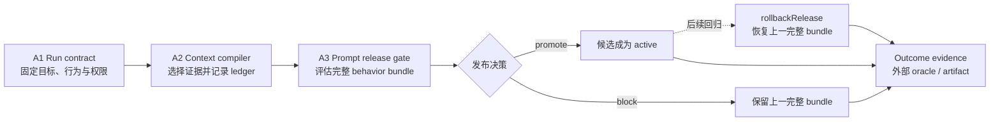

# Agent Engineering 实践轨道

> 把生产责任落实为可运行、可测试的合同：Run lifecycle -> Context Compiler -> Prompt release gate
>
> 全局入口：[课程导航](../docs/navigation.md) · [完整大纲](../docs/curriculum.md) · [Agent 趋势与生产架构蓝图](../docs/agent-trends-architecture.md)

## 这条轨道与架构蓝图是什么关系

[`docs/agent-trends-architecture.md`](../docs/agent-trends-architecture.md) 是本仓库的 **canonical 五平面责任模型**：它回答生产 Agent 的责任应如何分层、成熟度如何判断、风险由谁承担。这里是它的 **可执行 companion（配套实践）**：用一条离线纵切面，把其中的运行、上下文、提示词与评估责任压成可回归的 TypeScript 合同。

两者不是两套平行架构：

- 蓝图定义稳定的责任边界与决策语言；本轨道演示这些边界怎样进入 manifest、packet、ledger 与 release decision。
- 本轨道不会复制蓝图中的趋势、五平面和成熟度正文；遇到架构取舍，以蓝图为准。
- 离线实现是教学 reference，不是新的通用 Agent framework，也不绑定任何模型厂商。

## 贯穿场景：生产变更审查 Agent

三个单元共享同一个场景：一个 Agent 审查生产变更 `change-4821`，目标是判断“数据库连接池调整能否晋级”。它必须：

1. 固定本次运行使用的 prompt、context policy、toolset 与权限版本；
2. 把会话、变更说明、运行手册和工具结果编译成可审计的 working context；
3. 用 fixtures 比较候选 behavior bundle：候选有关键回归时阻断并保留当前 active；只有晋级后再发现运行期回归，才按 promotion audit 回滚上一完整 bundle。

## 学习路线

| 单元 | 核心问题 | 可观察产物 | 离线运行 |
| --- | --- | --- | --- |
| A1 [Run contract](./01-run-contract/README.md) | 一次运行到底固定了什么，何时才算完成，handoff 如何不扩权？ | run manifest、状态迁移、outcome evidence、handoff envelope | `node node_modules/tsx/dist/cli.mjs agent-engineering/01-run-contract/index.ts` |
| A2 [Context Compiler](./02-context-compiler/README.md) | Session / Memory / Artifact / Tool Result 怎样变成本轮可丢弃视图？ | context packet、预算、provenance、included/excluded ledger | `node node_modules/tsx/dist/cli.mjs agent-engineering/02-context-compiler/index.ts` |
| A3 [Prompt release gate](./03-prompt-release-gate/README.md) | Prompt 如何像代码一样版本化、测试、发布与整体回滚？ | typed render、bundle diff、promote/block/rollback decision | `node node_modules/tsx/dist/cli.mjs agent-engineering/03-prompt-release-gate/index.ts` |

建议按 A1 -> A2 -> A3 顺序学习。A2 产出的 context policy revision 会进入 A3 的 behavior bundle；A3 的 active bundle 又会在下一次 A1 manifest 中被固定。

## 共同证据边界

### 已验证事实

- 本轨道的实现是 provider-neutral 的确定性纯函数；三个示例不联网、不读取 API key，也不会执行真实生产变更。
- 同一输入会产生可回读的 manifest、packet、ledger 或 decision；反例由合同显式拒绝或降级，而不是靠讲解文字假定。
- Run、Session、Working Context、Memory、Artifact、Prompt、Tool 与 Eval 在示例中是不同对象，不能用一个 `messages` 数组代替全部生命周期。

### 工程推断

- 把行为版本、证据来源和 release decision 一起固化，通常比只保存最终回答更容易定位回归。
- 把 context 装配做成编译管线、把 prompt 当成行为 bundle 的一部分，能降低“某次输出变差却不知道改了什么”的排障成本。

### 未知项与生产扩展点

- 离线 fixture **不证明真实模型质量**，也不覆盖开放任务中的随机性、模型升级或多轮 trial 分布。
- 合同级 trust / authority / sensitivity 过滤 **不等于生产安全**；真实系统仍需身份认证、凭证隔离、sandbox、审批、脱敏审计与副作用幂等。
- 内存对象不证明持久化、分布式 lease、exactly-once、跨进程恢复或真实回滚已经完成。
- token 是教学估算，不等于任何厂商 tokenizer 或账单。

## 与现有课程的分工

- [第 03 章：提示工程](../lessons/03-prompt-engineering/README.md) 讲 prompt 基础技巧；A3 继续到 code-managed artifact、完整 bundle diff 与发布门。
- [第 07 章：短期记忆与上下文](../lessons/07-short-term-memory/README.md) 讲会话窗口和摘要；A2 继续到多来源、trust、audience、预算与 provenance。
- [第 15 章：评估与测试](../lessons/15-evaluation-and-testing/README.md) 与 [Agent Eval Harness](../capstone/agent-eval-harness/README.md) 讲通用 eval；A3 只补 prompt/context 可归因的候选发布门，不复制评测框架。
- [RAG L11：检索后的上下文工程](../rag-advanced/11-context-engineering/README.md) 负责检索片段的去重、压缩、预算和重排；A2 负责把检索结果与 Session / Memory / Artifact / Tool Result 一起编译成本轮 working context。

## 一手资料

- [OpenAI · The next evolution of the Agents SDK](https://openai.com/index/the-next-evolution-of-the-agents-sdk/)：harness、handoff、tracing、sandbox、artifact 与恢复责任（2026-04-15）。
- [Anthropic · Demystifying evals for AI agents](https://www.anthropic.com/engineering/demystifying-evals-for-ai-agents)：outcome、trajectory、多次 trial 与 grader 的评估边界（2026-01-09）。
- [Anthropic · Effective context engineering for AI agents](https://www.anthropic.com/engineering/effective-context-engineering-for-ai-agents)：有限 attention budget、compaction 与外置状态（2025-09-29）。
- [Google Developers Blog · Architecting efficient context-aware multi-agent framework for production](https://developers.googleblog.com/architecting-efficient-context-aware-multi-agent-framework-for-production/)：Session / Memory / Artifact sources、processors 与 working context（2025-12-04）。
- [OpenAI · Prompting](https://developers.openai.com/api/docs/guides/prompting)：把 prompts 作为 application code 管理、测试和回滚（核验于 2026-08-10）。
- [Anthropic · Prompt engineering overview](https://platform.claude.com/docs/en/build-with-claude/prompt-engineering/overview)：先定义成功标准与经验验证方法，再优化 prompt（核验于 2026-08-10）。
- [Model Context Protocol · 2026-07-28 release](https://blog.modelcontextprotocol.io/posts/2026-07-28/) 与 [Tools specification](https://modelcontextprotocol.io/specification/draft/server/tools)：协议能力、scope minimization 与“不默认信任 tool annotations”的 host 责任。

### Prompt 托管能力的时间边界

本轨道采用 provider-neutral 的 **code-managed prompt**。OpenAI 当前 Prompting 文档记录 **hosted reusable prompt objects（托管 prompt 对象）将于 2026-11-30 关闭**；仍介绍 hosted Prompt ID/version 的旧表面不作为本仓库的 canonical 真相，已有接入应按官方迁移路径复核。该日期是 2026-08-10 的文档快照，不应外推成永久不变的产品事实。
