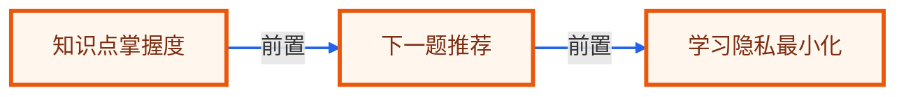

# 毕业项目 · 自适应学习教练 Agent

> 所属阶段：**毕业项目 · 教育科技实战**
> 预计用时：3-5 小时 | 难度：⭐⭐⭐⭐☆
> 全局导航：[课程导航](../../docs/navigation.md) · [完整大纲](../../docs/curriculum.md) · [毕业项目总览](../README.md) · [知识图谱](../../docs/knowledge-graph.md)

把学习目标、错题、掌握度和课程资源变成个性化练习路径，帮助学习者补弱项。

> 离线、零 key 可设计与验证：实现时先用 fixture 和确定性规则跑通端到端闭环。真实接入时，把 fixture 替换成业务系统数据源，把规则模块替换成可配置策略或模型调用，输出契约保持不变。

## 最终交付

- [ ] 一个学习教练工作流，输出知识点掌握度、下一题推荐、讲解计划和家长/导师摘要。
- [ ] 一组可复现 fixture，覆盖正常、边界和高风险样例。
- [ ] 一个分层 Agent 设计：输入归一、决策、工具/检索、人工确认、报告输出。
- [ ] 一套验收清单，可直接转成 smoke/eval 测试。
- [ ] 一段作品集/简历话术和面试追问准备。

## 适用角色

- 学习者
- 教师
- 教研团队

## 核心流程

```text
读取学习目标
  -> 分析错题和掌握度
  -> 映射知识点
  -> 选择下一步练习
  -> 生成讲解脚本
  -> 输出进度摘要
```

## 数据与接口

| 模块 | 职责 |
|------|------|
| `LearningGoalLoader` | LearningGoalLoader 负责本流程中的一个稳定边界，便于替换为真实 API 或数据库实现。 |
| `MistakeAnalyzer` | MistakeAnalyzer 负责本流程中的一个稳定边界，便于替换为真实 API 或数据库实现。 |
| `ConceptMasteryTracker` | ConceptMasteryTracker 负责本流程中的一个稳定边界，便于替换为真实 API 或数据库实现。 |
| `ExerciseRecommender` | ExerciseRecommender 负责本流程中的一个稳定边界，便于替换为真实 API 或数据库实现。 |
| `TutorBriefBuilder` | TutorBriefBuilder 负责本流程中的一个稳定边界，便于替换为真实 API 或数据库实现。 |

建议 fixture：

- `student-goals.json`
- `quiz-attempts.json`
- `concept-map.json`
- `exercise-bank.json`

最小输出契约：

```ts
type CapstoneResult = {
  status: "ok" | "needs_review" | "blocked";
  summary: string;
  evidence: Array<{ source: string; quote: string; confidence: "low" | "medium" | "high" }>;
  actions: Array<{ owner: string; nextStep: string; due?: string; requiresApproval: boolean }>;
  risks: Array<{ level: "low" | "medium" | "high"; reason: string }>;
};
```

## 护栏与人工确认

- 不做能力标签化伤害
- 未成年人数据最小化
- 低掌握度先补基础不惩罚
- 答案解释要可验证

## 里程碑

1. M0 错题和知识点映射
2. M1 掌握度和练习推荐
3. M2 讲解脚本和进度摘要

## 验收清单

- [ ] 错题映射到知识点
- [ ] 低掌握度推荐基础题
- [ ] 高掌握度推荐迁移题
- [ ] 学生隐私脱敏
- [ ] 解释引用题目规则
- [ ] 无题库时报缺口

## 可扩展方向

- 接 LMS/题库
- 生成教师备课建议
- 加入 spaced repetition
- 按学习风格调整解释模板

## 如何写进简历

> 实现自适应学习教练 Agent：基于学习目标、错题和知识图谱追踪掌握度，推荐下一步练习并生成讲解和进度摘要。

## 面试追问

1. 如何避免给学生贴负面标签？
2. 掌握度如何计算且可解释？
3. 题库缺口怎么处理？
4. 未成年人数据如何最小化？

<!-- KG:START (由 npm run kg 自动生成，勿手改本标记区) -->

## 知识图谱与延伸阅读

> 本节由 `npm run kg` 自动生成（数据源 `knowledge-graph/data/graph.ts`）。要增删请改数据源后重跑。

### 本章概念图谱

> 节点：**橙框**=本章概念，蓝框=关联的其他章概念。连线按关系类型着色：前置(蓝) · 深化(紫) · 对比(玫红) · 应用(绿) · 组成(橙)。



### 延伸阅读

_暂无（可在 `graph.ts` 的 `ARTICLES` 中新增本章关联文章）。_

> 🗺️ 在[全局知识图谱](../../docs/knowledge-graph.md) / [交互式图谱](../../knowledge-graph/output/index.html) 中查看本章位置。

<!-- KG:END -->
