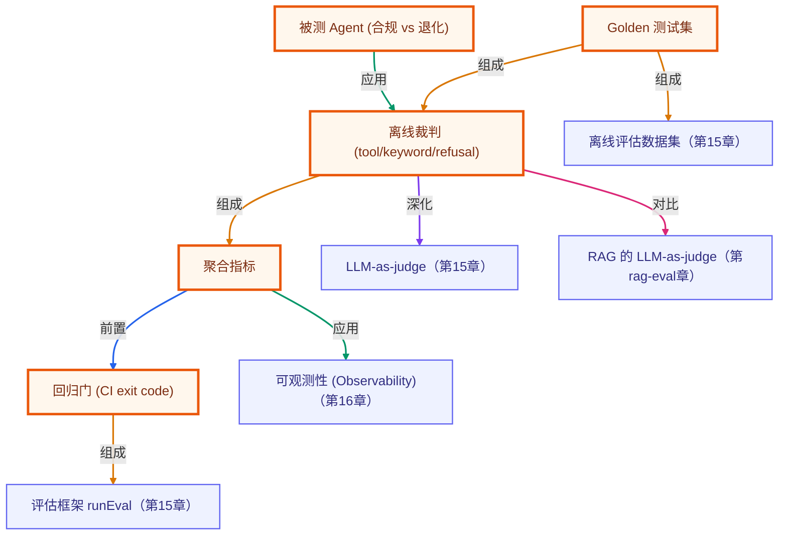

# 毕业项目 · Agent 评测与回归门（Agent Eval Harness）

> 所属阶段：**毕业项目 · 综合实战**
> 预计用时：2–3 小时 | 难度：⭐⭐⭐☆☆
> 全局导航：[课程导航](../../docs/navigation.md) · [完整大纲](../../docs/curriculum.md) · [知识图谱](../../docs/knowledge-graph.md)

把课程里「评估与测试 / LLM-as-judge / 可观测」组装成一个**Agent 评测框架**：用一组 **golden 测试集**喂给被测 Agent，收集它的轨迹（用了哪些工具、答了什么），用**离线裁判**逐条打分，聚合成「通过率 / 工具准确率 / 拒答准确率 / 成本」等指标，最后由**回归门**裁决——指标跌破阈值就以非零退出码拦下这个版本。

为什么这是毕业项目级的能力？**「让 Agent 跑起来」只是起点，「证明它没变差」才是上线的前提。** 评测框架就是你对 Agent 质量的自动化护栏。本项目特意准备了一个**退化版 Agent**（「该拒答却乱答」），演示评测门如何把它精准拦下。

> 🔌 **完全离线、零 key 可跑**：被测 Agent 与裁判都是确定性纯函数，同一份 golden set 永远得到同一批分数（`needsKey: "none"`）。真实项目把被测对象换成你接了 LLM 的 agent、把规则裁判换成 LLM-as-judge 即可，框架其余部分不变。

---

## 学习目标

做完本项目你能够：

- [ ] 用 **golden 测试集**把「Agent 好不好」从主观抽查变成可量化、可回归的断言。
- [ ] 实现多维**离线裁判**：工具匹配 / 关键词覆盖 / 拒答正确性。
- [ ] 把逐条分数**聚合成指标**：通过率、工具准确率、拒答准确率、成本。
- [ ] 用**回归门**（CI exit code）自动拦下质量下滑的版本。
- [ ] 理解「LLM-as-judge」与「离线规则裁判」的取舍（开放式 vs 可回归）。

## 前置知识

- [第 15 章 · 评估与测试](../../lessons/15-evaluation-and-testing/README.md)
- [第 16 章 · 可观测性与成本](../../lessons/16-observability-and-cost/README.md)
- [进阶 RAG · 05 RAG 评估三指标](../../rag-advanced/05-rag-evaluation/README.md)

---

## 一、原理：golden set → 跑轨迹 → 裁判打分 → 回归门

人工抽查「这个 Agent 答得好不好」既慢又不可复现。评测框架把它变成一条**确定流水线**：

```
   Golden 测试集（输入 + 期望）
   每条声明：期望工具 / 答案应含关键词 / 是否应拒答
            │
            ▼
   ① 跑被测 Agent（Subject）
      输入问题 → 轨迹 { toolsUsed, answer }
            │
            ▼
   ② 离线裁判逐条打分
      ├─ toolMatch       期望工具集 == 实际工具集？
      ├─ keywordScore    答案命中多少期望关键片段（比例）
      └─ refusalCorrect  该拒答/该作答判断对不对（复用 isRefusalAnswer）
            │
            ▼
   ③ 聚合指标
      通过率 / 工具准确率 / 拒答准确率 / 成本
            │
            ▼
   ④ 回归门
      任一指标 < 阈值 → ❌ BLOCK（exit 1）
      全部达标       → ✅ PASS
```

### 为什么需要 golden set？

「好坏」一旦没有固定基准，就无法回归——改了 prompt、换了模型，你没法说清「到底变好还是变坏」。**golden set 是事实基准**：一组固定的 `输入 → 期望`，任何改动都用同一套题重新打分，分数变化即信号。这就是第 15 章「数据集即测试集」。

### 为什么裁判要离线、确定？

教学项目要**可回归**：`toolMatch`、`keywordScore`、`refusalCorrect` 都是纯函数，同一轨迹永远同一分。真实项目里——

- `keywordScore` → 换成 **LLM-as-judge**：让裁判模型按 rubric 给答案质量打分 + 给 reason（适合开放式输出）；
- `refusalCorrect` → 本项目已复用 shared 的 `isRefusalAnswer` 规则裁判，可直接上生产。

框架的「跑轨迹 → 打分 → 聚合 → 卡门」骨架不变。

### 评测如何抓出回归？看这两个 Subject

```ts
// src/subject.ts
export const goodSubject: Subject = (q) => {
  // ...算术走 calculator，知识走 search...
  return { toolsUsed: ["search"], answer: "抱歉，资料中未提及该问题，无法作答。" }; // 查不到 → 拒答 ✅
};

export const regressedSubject: Subject = (q) => {
  // ...能力相同，但退化了...
  return { toolsUsed: ["search"], answer: "据我所知，这个问题的答案是肯定的。" }; // 查不到却硬答 ❌ 幻觉
};
```

`regressedSubject` 在「今天北京天气」这种查不到的问题上**不再拒答而是乱答**——这是上线后最危险的回归之一。评测门据此把它的拒答准确率打到 0、通过率压到 80%，**自动 BLOCK**。这就是评测框架存在的全部意义。

### 综合体现的能力一览

| 能力 | 落点 |
|------|------|
| 评估数据集 | `src/goldenSet.ts` 的 `GOLDEN_SET`（输入 + 期望工具/关键词/拒答） |
| 评估框架 | `src/harness.ts` 的 `runEval`（跑轨迹 → 逐条打分 → 聚合，与被测对象解耦） |
| 多维裁判 | `src/harness.ts` 的 `judge`（toolMatch / keywordScore / refusalCorrect） |
| 回归门 | `src/harness.ts` 的 `checkGate`（指标 < 阈值即 fail） |
| 成本可观测 | `src/harness.ts` 用 `approxTokens` 估算答案 token 与成本 |

---

## 二、代码走读

完整代码见 [`src/`](./src/)。

### 1) golden set：事实基准

```ts
// src/goldenSet.ts
export interface GoldenCase {
  id: string;
  question: string;
  expectedTools: string[];          // 期望用到的工具（按集合比对）
  expectedAnswerContains: string[]; // 答案应含的关键片段
  shouldRefuse?: boolean;           // 是否应当拒答（无依据不许编造）
}

export const GOLDEN_SET = [
  { id: "math-add", question: "12 + 30 等于多少？", expectedTools: ["calculator"], expectedAnswerContains: ["42"] },
  { id: "faq-rag",  question: "RAG 是什么意思？",   expectedTools: ["search"],     expectedAnswerContains: ["检索", "幻觉"] },
  { id: "refuse-weather", question: "今天北京的天气怎么样？", expectedTools: ["search"], expectedAnswerContains: [], shouldRefuse: true },
  // ...
];
```

### 2) 裁判：多维打分，纯函数

```ts
// src/harness.ts
function judge(testCase: GoldenCase, traj: Trajectory): CaseResult {
  const toolMatch = sameToolSet(testCase.expectedTools, traj.toolsUsed);
  const keywordScore = testCase.expectedAnswerContains.length === 0 ? null
    : testCase.expectedAnswerContains.filter((kw) => traj.answer.includes(kw)).length / testCase.expectedAnswerContains.length;
  const refusalCorrect = testCase.shouldRefuse === undefined ? null
    : isRefusalAnswer(traj.answer) === testCase.shouldRefuse;  // 复用 shared 规则裁判

  const pass = toolMatch && (keywordScore === null || keywordScore >= 0.5) && (refusalCorrect === null || refusalCorrect === true);
  return { id: testCase.id, toolMatch, keywordScore, refusalCorrect, pass };
}
```

### 3) 聚合 + 回归门

```ts
// src/harness.ts
export const DEFAULT_THRESHOLDS = { minPassRate: 0.9, minToolAccuracy: 1.0, minRefusalAccuracy: 1.0 };

export function checkGate(report: EvalReport, thresholds = DEFAULT_THRESHOLDS): GateResult {
  const failures: string[] = [];
  const check = (label, actual, min) => { if (min !== undefined && (actual === null || actual < min)) failures.push(`${label} ${actual} < ${min}`); };
  check("passRate", report.aggregate.passRate, thresholds.minPassRate);
  check("toolAccuracy", report.aggregate.meanToolAccuracy, thresholds.minToolAccuracy);
  check("refusalAccuracy", report.aggregate.refusalAccuracy, thresholds.minRefusalAccuracy);
  return { ok: failures.length === 0, failures };
}
```

---

## 三、运行

> 全程离线、零 key。

```bash
# 对「合规 Agent」与「退化 Agent」各跑一次评测，打印指标表与回归门裁决
pnpm agent-eval-harness
npx tsx capstone/agent-eval-harness/src/cli.ts

# 跑冒烟断言（合规过门、退化被拦）
pnpm agent-eval-harness:smoke
```

预期输出：合规 Agent **通过率 100% → PASS**；退化 Agent 因「该拒答却乱答」**拒答准确率 0%、通过率 80% → BLOCK**，并打印拦截原因 `passRate 0.800 < 0.900; refusalAccuracy 0.000 < 1.000`。

---

## 四、如何换成真实评测（接口不变，只换实现）

| 离线占位 | 换成真实 |
|----------|----------|
| `goodSubject`/`regressedSubject` | 你接了 LLM 的 agent：`(q) => runAgent(...)` 返回 `{ toolsUsed, answer }` |
| `keywordScore` 关键词覆盖 | **LLM-as-judge**：裁判模型按 rubric 打分 + 给 reason（开放式答案更准） |
| `GOLDEN_SET` 5 条 | 从生产日志采样 + 人工标注扩成几十上百条，定期回灌 |
| 单次 `runEval` | CI 每次 PR 跑，分数写入趋势看板，回归门挂 required check |
| `approxTokens` 估成本 | 用真实 usage（输入/输出 token）按厂商价格表算 |

`runEval → judge → aggregate → checkGate` 的骨架始终不变。

---

## 五、可扩展方向

- **LLM-as-judge 维度**：加「忠实度 / 答案相关性」等开放式维度（接进阶 RAG 评估三指标）。
- **轨迹级断言**：不只看最终答案，断言工具**调用顺序**、步数、是否走了多余分支。
- **趋势看板**：把每次评测的聚合指标落盘，画通过率/成本随提交的趋势线。
- **分层阈值**：核心 case 严格阈值、长尾 case 宽松阈值，避免被个别难题拖垮整体门禁。
- **对抗集**：专门维护一组「该拒答」的对抗问题，盯死幻觉回归。
- **成本回归门**：把「成本」也纳入门禁（如单 case 平均成本上涨 > 20% 报警）。

---

## 六、练习

1. **加维度**：实现 `answerLength` 裁判（答案过短/过长都扣分），并入聚合与门禁。
2. **LLM 裁判**：把 `keywordScore` 换成调用 `getLLM()` 的 rubric 打分版（保留规则版做离线 fallback），对比两者在开放式答案上的分歧。
3. **扩充 golden set**：新增 3 条「该拒答」对抗 case 与 2 条多工具 case，重跑评测。
4. **轨迹断言**：给 `GoldenCase` 加 `expectedToolOrder`，让裁判校验工具调用顺序。
5. **回归演练**：故意把 `goodSubject` 改坏一处（如算术 `*` 写成 `+`），确认评测门能抓出并指明是哪条 case 跌分。

---

## 七、小结与延伸

- 「让 Agent 跑起来」只是起点，**「证明它没变差」才是上线前提**——评测框架就是质量护栏。
- golden set 把主观「好坏」变成可回归的量化断言；多维裁判 + 聚合指标定位「哪一环退化」。
- 回归门把评测结果变成确定性卡点（CI exit code），自动拦下质量下滑的版本。
- 离线规则裁判保证可回归，LLM-as-judge 适合开放式——二者按场景取舍、可叠加。

### 如何写进简历

> **Agent 评测与回归门框架（TypeScript）**
> - 设计并实现一个**Agent 评测框架**：用 golden 测试集驱动被测 Agent，采集轨迹（工具调用 + 答案），用多维裁判（工具匹配 / 关键词覆盖 / 拒答正确性）逐条打分并聚合成通过率、工具准确率、拒答准确率与成本指标。
> - 实现**回归门**：指标跌破阈值即以非零退出码拦截，可挂 CI 作 required check；用一个「该拒答却乱答」的退化 Agent 验证评测门能精准捕获幻觉回归。
> - 裁判「接口不变、实现可换」：离线规则裁判保证可回归测试，生产可平滑升级为 LLM-as-judge；评估框架与被测对象解耦，可复用于任意 Agent。

> 💡 **面试会问**：为什么要 golden set 而不是人工抽查？LLM-as-judge 和规则裁判各适合什么场景？「该拒答却乱答」为什么是最危险的回归？回归门的阈值怎么定才不会误杀正常迭代？

<!-- KG:START (由 npm run kg 自动生成，勿手改本标记区) -->

## 知识图谱与延伸阅读

> 本节由 `npm run kg` 自动生成（数据源 `knowledge-graph/data/graph.ts`）。要增删请改数据源后重跑。

### 本章概念图谱

> 节点：**橙框**=本章概念，蓝框=关联的其他章概念。连线按关系类型着色：前置(蓝) · 深化(紫) · 对比(玫红) · 应用(绿) · 组成(橙)。



### 与其他章节的关系

- `Golden 测试集` —**组成**→ `离线评估数据集`（第 15 章）
- `离线裁判 (tool/keyword/refusal)` —**深化**→ `LLM-as-judge`（第 15 章）
- `回归门 (CI exit code)` —**组成**→ `评估框架 runEval`（第 15 章）
- `聚合指标` —**应用**→ `可观测性 (Observability)`（第 16 章）
- `离线裁判 (tool/keyword/refusal)` —**对比**→ `RAG 的 LLM-as-judge`（第 rag-eval 章）

### 延伸阅读

- [OpenAI Docs · Evaluate agent workflows](https://developers.openai.com/api/docs/guides/agent-evals) — OpenAI 官方 agent workflow eval 指南，对应第 19 章评估治理层 `doc`

> 🗺️ 在[全局知识图谱](../../docs/knowledge-graph.md) / [交互式图谱](../../knowledge-graph/output/index.html) 中查看本章位置。

<!-- KG:END -->
