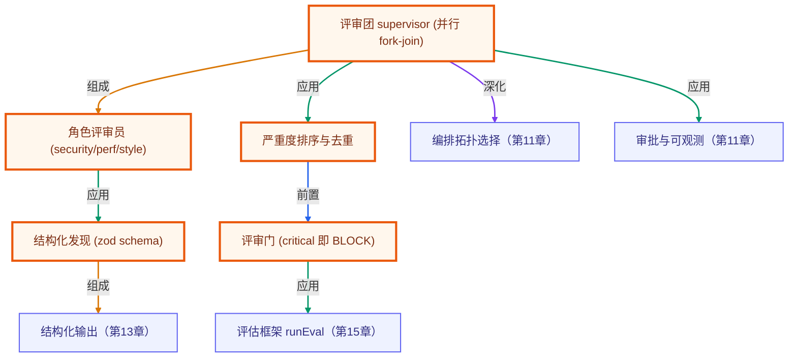

# 毕业项目 · 代码评审团（多智能体 Code Review Crew）

> 所属阶段：**毕业项目 · 综合实战**
> 预计用时：2–3 小时 | 难度：⭐⭐⭐☆☆
> 全局导航：[课程导航](../../docs/navigation.md) · [完整大纲](../../docs/curriculum.md) · [知识图谱](../../docs/knowledge-graph.md)

把课程里「多智能体编排 / 结构化输出 / 评估门禁」组装成一个**自动代码评审团**：给它一批改动文件，多个**角色评审员**（安全 / 性能 / 风格）**并行**各扫各的，supervisor 汇总去重、按严重度排序，最后由**评审门**裁决「能不能合并」——出现任何 critical 问题就 BLOCK。

这是「多 Agent 编排」最实用的落地形态之一：**并行异构 team（fork → 多角色 → join）**。每个评审员只关心自己的本职，互不依赖、可并发；supervisor 不关心单个角色怎么得出结论，只负责调度与合并。

> 🔌 **完全离线、零 key 可跑**：每个评审员是用确定性规则扫描的**纯函数 agent**，同一份输入永远得到同一批发现（`needsKey: "none"`）。真实项目把规则换成「给该角色的 system prompt + LLM 结构化输出」即可，并行调度与汇总骨架一行不动。

---

## 学习目标

做完本项目你能够：

- [ ] 把「多 Agent 编排」落成**并行异构 team**：角色分工 + 并发 + 汇总。
- [ ] 用 **zod schema** 校验每个 agent 的结构化产物，挡掉格式跑偏。
- [ ] 实现 supervisor 的**合并去重 + 严重度排序**，保证输出稳定可回归。
- [ ] 用**评审门**把质量判断变成确定性卡点（critical 即 BLOCK），可挂 CI。
- [ ] 理解「单行规则」与「跨行上下文规则」的差异（如 await 是否在循环内）。

## 前置知识

- [第 11 章 · 多智能体编排](../../lessons/11-multi-agent-orchestration/README.md)
- [第 13 章 · 结构化输出与校验](../../lessons/13-structured-output/README.md)
- [第 15 章 · 评估与测试](../../lessons/15-evaluation-and-testing/README.md)
- [进阶 LangGraph · 05 多 Agent 编排](../../langgraph-advanced/05-multi-agent-graph/README.md)

---

## 一、原理：并行异构 team（fork → 多角色 → join）

一个人评审代码，注意力有限，容易顾此失彼。把评审拆成**多个专职角色并行跑**，每个角色带着自己的「关注点偏见」扫描，再合并——这就是多 Agent 编排里的 **team 拓扑**：

```
              改动文件集（diff）
                    │
        ┌───────────┼───────────┐   ① fork：每个 (评审员 × 文件) 是独立任务，并发执行
        ▼           ▼           ▼
  🔒 security   ⚡ performance   🎨 style
  评审员         评审员          评审员
  (硬编码密钥/   (嵌套循环/      (var/== /any/
   SQL注入/eval/  循环内 await/   console.log)
   命令注入)      JSON.parse)
        │           │           │
        └───────────┼───────────┘   ② join：supervisor 收齐所有发现
                    ▼
            supervisor 汇总
              ├─ zod 校验（挡掉格式跑偏的发现）
              ├─ 去重（同文件同行同规则合并）
              └─ 按严重度排序（critical > major > minor）
                    │
                    ▼
            ③ 评审门裁决
         有 critical → ❌ BLOCK（拒绝合并）
         无 critical → ✅ PASS
```

### 为什么要角色分工而不是「一个大 prompt 全查」？

把「查安全、查性能、查风格」塞进一个 agent，注意力会被稀释，且任何一类规则的改动都要动整个 prompt。**拆成角色**后：每个角色聚焦、可独立演进、可并行（省墙钟时间）、可分别评估命中率。这正是第 11 章「过载且边界清晰才拆」的判据——代码评审恰好满足。

### 为什么 supervisor 只做调度与合并？

让 supervisor 不碰「单个角色内部怎么判断」，它只负责 **fork 任务 / join 结果 / 去重 / 排序 / 卡门**。这样换掉任何一个评审员的实现（规则 → LLM），supervisor 都不用改——**编排与执行解耦**。

### 单行规则 vs 跨行上下文规则

安全和风格问题大多**单行可判**（这一行有没有 `eval(`、`var`）。但「循环体内 await」「嵌套循环」需要**跨行上下文**——得知道「当前是否在循环块内」。所以 `performance` 评审员单独实现，维护一个简易的循环深度计数：

```ts
// src/reviewers.ts —— 性能评审员需要跨行上下文
let loopDepth = 0;
lines.forEach((line, i) => {
  const isLoopHead = /\b(for|while)\b\s*\(/.test(line);
  if (isLoopHead && loopDepth >= 1) push("nested-loop", "major", i);     // 嵌套循环 O(n²)
  if (loopDepth >= 1 && /\bawait\b/.test(line)) push("await-in-loop", "major", i); // 循环内串行 await
  if (isLoopHead) loopDepth++;
  else if (/^\s*\}/.test(line) && loopDepth > 0) loopDepth--;
});
```

### 综合体现的能力一览

| 能力 | 落点 |
|------|------|
| 多 Agent 编排 | `src/crew.ts` 的 `ReviewCrew`：fork 每个 (reviewer×file) 并发，join 后汇总 |
| 角色分工 | `src/reviewers.ts` 的 security / performance / style 三个纯函数 agent |
| 结构化输出 | `src/crew.ts` 的 `findingSchema`（zod 校验每条发现） |
| 严重度治理 | `src/crew.ts` 的去重 + `SEVERITY_ORDER` 排序 |
| 评估门禁 | `src/crew.ts` 的 `GateVerdict`（critical 即 BLOCK） |

---

## 二、代码走读

完整代码见 [`src/`](./src/)。

### 1) 评审员：纯函数 agent

```ts
// src/reviewers.ts
export interface Reviewer {
  role: ReviewerRole;                  // security / performance / style
  review: (file: CodeFile) => Finding[];
}

const SECURITY_RULES = [
  { rule: "hardcoded-secret", severity: "critical", pattern: /(api[_-]?key|secret|token|password)\s*[:=]\s*["'][^"']+["']|sk-[a-z0-9-]{8,}/i, message: "疑似硬编码密钥/口令，应改用环境变量。" },
  { rule: "sql-injection",   severity: "critical", pattern: /(SELECT|INSERT|UPDATE|DELETE)\b.*["'`]\s*\+/i, message: "SQL 字符串拼接，应参数化查询。" },
  { rule: "eval",            severity: "critical", pattern: /\beval\s*\(/, message: "eval 执行动态代码，攻击面巨大。" },
  { rule: "command-injection", severity: "critical", pattern: /(exec|execSync|spawn)\s*\(\s*["'`][^"'`]*["'`]?\s*\+/, message: "命令拼接执行，存在命令注入风险。" },
];
```

每个角色是 `(file) => Finding[]`——**输入文件、输出结构化发现**。真实项目把它换成「该角色的 system prompt + LLM 结构化输出」，签名不变。

### 2) supervisor：并行 fork-join + 校验 + 去重 + 排序

```ts
// src/crew.ts
async review(files: readonly CodeFile[]): Promise<ReviewReport> {
  // fork：每个 (reviewer × file) 是独立任务，并行执行
  const tasks = this.reviewers.flatMap((r) => files.map((f) => Promise.resolve().then(() => r.review(f))));
  const raw = (await Promise.all(tasks)).flat();                       // join

  const validated = raw.filter((f) => findingSchema.safeParse(f).success); // zod 校验
  const deduped = dedupe(validated);                                      // 同文件同行同规则合并
  deduped.sort((a, b) => SEVERITY_ORDER[a.severity] - SEVERITY_ORDER[b.severity] || a.path.localeCompare(b.path) || a.line - b.line);

  const blockers = deduped.filter((f) => f.severity === "critical");
  return { findings: deduped, countsBySeverity, gate: { ok: blockers.length === 0, blockers, reason: ... } };
}
```

> 注意：`Promise.resolve().then(() => r.review(f))` 把同步评审员包成可并发的任务。换成真 LLM 评审员时，`r.review` 本身是 async，这层骨架天然支持并发。

### 3) 评审门：把质量判断变成确定性卡点

```ts
const blockers = deduped.filter((f) => f.severity === "critical");
const gate = { ok: blockers.length === 0, blockers,
               reason: blockers.length === 0 ? "无 critical 问题，评审通过" : `存在 ${blockers.length} 个 critical，拒绝合并` };
```

CLI 据此 `exit 1`，就能直接挂进 CI——**有 critical 不许合并**。

---

## 三、运行

> 全程离线、零 key。

```bash
# 对内置样本跑评审团，分组打印发现 + 评审门裁决
pnpm code-review-crew
npx tsx capstone/code-review-crew/src/cli.ts

# 跑冒烟断言（断言关键发现、严重度计数、评审门 BLOCK）
pnpm code-review-crew:smoke
```

内置样本（[`src/samples.ts`](./src/samples.ts)）埋了已知问题：硬编码密钥、SQL 拼接、eval、命令注入（4 个 critical），嵌套循环、循环内 await（major），var/==/any/console.log（minor）。预期评审门 **BLOCK**。

---

## 四、如何换成真实评审（接口不变，只换实现）

| 离线占位 | 换成真实 |
|----------|----------|
| `SAMPLE_FILES` 内置样本 | 解析 `git diff` 得到的改动文件（path + content） |
| 规则版 `review(file)` | 给该角色的 system prompt + `getLLM()` 结构化输出（zod 仍校验 `findingSchema`） |
| 单机并行 `Promise.all` | 真 LLM 评审员天然 async，骨架直接支持并发 |
| CLI 打印 | GitHub Action 里把 findings 渲染成 PR review comments，`exit 1` 卡门 |

supervisor 的 fork-join、去重、排序、卡门逻辑始终不变。

---

## 五、可扩展方向

- **增量评审**：只评审 `git diff` 改动的行，而非整文件，降噪提速。
- **角色扩展**：加「可访问性 / 依赖安全 / 测试覆盖」评审员，路由式分派不同文件给不同角色。
- **置信度加权**：LLM 评审员给每条发现附 confidence，低置信度降级或转人工复核。
- **去重升级**：跨规则语义去重（同一行的「SQL 拼接」与「字符串拼接」合并为一条）。
- **门禁分级**：critical→BLOCK、major→警告但放行、minor→仅记录，阈值可配置。
- **修复建议**：每条发现附带「建议改法」的代码补丁（接结构化输出生成 diff）。

---

## 六、练习

1. **加角色**：实现一个 `dependency` 评审员，扫 `require('...')` / `import` 里的高危包（如 `child_process` 直接出现即 major）。
2. **跨行规则**：给性能评审员加「`for` 循环里 `array.push` 后又 `array.includes`（O(n²) 查找）」的检测。
3. **门禁策略**：把评审门改成可配置阈值（如「major ≥ 3 也 BLOCK」），并补 smoke 断言。
4. **真 diff**：写一个 `parseGitDiff(diffText)` 把 `git diff` 输出转成 `CodeFile[]`，跑真实改动。
5. **误报治理**：构造一个「字符串里出现 `eval` 但其实是注释/文档」的样本，改进规则避免误报。

---

## 七、小结与延伸

- 代码评审是「多 Agent 并行异构 team」的天然场景：角色分工聚焦、并发省时、supervisor 只调度合并。
- 用 **zod 校验**守住每个 agent 的结构化产物，用**去重 + 严重度排序**保证输出稳定可回归。
- 用**评审门**把主观的「质量好不好」变成确定性的「能不能合并」，直接挂 CI。

### 如何写进简历

> **多智能体代码评审团（TypeScript）**
> - 设计并实现一个**并行异构多 Agent 评审系统**：安全 / 性能 / 风格三个角色评审员并发扫描改动文件，supervisor 负责 fork-join 调度、结构化校验、去重与严重度排序。
> - 用 **zod schema** 校验每个 agent 的结构化发现，挡掉格式跑偏的产物；实现跨行上下文规则（循环内 await、嵌套循环 O(n²)）。
> - 用**评审门**把质量判断变成确定性卡点（critical 即 BLOCK），以非零退出码挂进 CI；评审员「接口不变、实现可换」，可从规则平滑升级为 LLM 结构化输出。

> 💡 **面试会问**：为什么把评审拆成多个角色而不是一个大 prompt？supervisor 为什么不碰单个角色的判断逻辑？单行规则和跨行上下文规则有什么区别？评审门怎么避免误报把正常 PR 拦死？

<!-- KG:START (由 npm run kg 自动生成，勿手改本标记区) -->

## 知识图谱与延伸阅读

> 本节由 `npm run kg` 自动生成（数据源 `knowledge-graph/data/graph.ts`）。要增删请改数据源后重跑。

### 本章概念图谱

> 节点：**橙框**=本章概念，蓝框=关联的其他章概念。连线按关系类型着色：前置(蓝) · 深化(紫) · 对比(玫红) · 应用(绿) · 组成(橙)。



### 与其他章节的关系

- `评审团 supervisor (并行 fork-join)` —**深化**→ `编排拓扑选择`（第 11 章）
- `评审团 supervisor (并行 fork-join)` —**应用**→ `审批与可观测`（第 11 章）
- `结构化发现 (zod schema)` —**组成**→ `结构化输出`（第 13 章）
- `评审门 (critical 即 BLOCK)` —**应用**→ `评估框架 runEval`（第 15 章）

### 延伸阅读

_暂无（可在 `graph.ts` 的 `ARTICLES` 中新增本章关联文章）。_

> 🗺️ 在[全局知识图谱](../../docs/knowledge-graph.md) / [交互式图谱](../../knowledge-graph/output/index.html) 中查看本章位置。

<!-- KG:END -->
