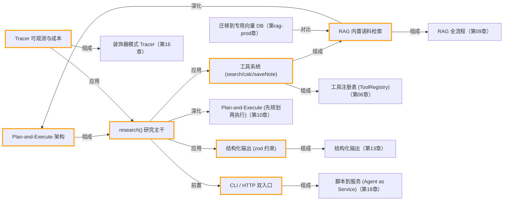

# 毕业项目 · Deep Research Agent（深度研究助手）

> 所属阶段：**毕业项目 · 综合实战**
> 预计用时：3–4 小时 | 难度：⭐⭐⭐⭐☆
> 全局导航：[课程导航](../../docs/navigation.md) · [完整大纲](../../docs/curriculum.md) · [知识图谱](../../docs/knowledge-graph.md)

把整套课程学到的能力，组装成一个**可运行、可写进简历**的小产品：给它一个研究问题，它会自己**规划 → 多轮检索与推理 → 产出一份带「引用来源」的结构化报告**，并在结尾告诉你这次花了多少 token、多少钱。

这不是又一个 demo，而是一个**麻雀虽小、五脏俱全**的研究型 Agent：工具系统、Agent 循环、RAG、规划、结构化输出、流式输出、可观测——前面每一章的知识点都在这里有落点。

---

## 学习目标

做完本项目你能够：

- [ ] 把零散的 Agent 能力**组装成一个端到端的产品**，而不只是孤立的 demo。
- [ ] 实现 **Plan-and-Execute**（先规划再执行）这一经典 Agent 架构。
- [ ] 用 **RAG** 给 Agent 一个「知识来源」，让回答可溯源、可引用。
- [ ] 用 **zod** 把「不确定的模型输出」收敛成「确定的结构化报告」。
- [ ] 给 Agent 加上**可观测性**：统计 tokens / 工具调用次数 / 估算成本。
- [ ] 把同一份核心逻辑同时暴露为 **CLI** 和 **HTTP 服务**（关注点分离的收益）。

## 前置知识

建议先完成以下章节（本项目是它们的综合应用）：

- [第 06 章 · 构建工具系统](../../lessons/06-building-a-tool-system/README.md)
- [第 04 章 · Agent 循环](../../lessons/04-the-agent-loop/README.md)
- [第 09 章 · 从零实现 RAG](../../lessons/09-rag-from-scratch/README.md)
- [第 10 章 · 推理模式（规划）](../../lessons/10-reasoning-patterns/README.md)
- [第 13 章 · 结构化输出与校验](../../lessons/13-structured-output/README.md)
- [第 14 章 · 流式输出与 UX](../../lessons/14-streaming-and-ux/README.md)
- [第 16 章 · 可观测性与成本](../../lessons/16-observability-and-cost/README.md)

---

## 一、原理：一次「深度研究」发生了什么

普通问答是「一问一答」；深度研究是「先想清楚要查什么，再分头去查，最后汇总成文」。我们用 **Plan-and-Execute** 架构实现这一点：

```
   研究问题
      │
      ▼
┌───────────────┐   ① 规划（LLM，结构化输出）
│  makePlan()   │   把大问题拆成 2~6 个可独立检索的子问题
└───────┬───────┘
        ▼
┌───────────────────────────────────────────────┐
│  runAgent() 多步循环（Agent 循环 + 工具系统）   │   ② 执行
│                                                │
│   思考 → search ──► 内存向量库（RAG 检索语料）  │
│        → calculator（安全数值推算）            │
│        → saveNote（把要点+来源记进笔记本）      │
│   …直到覆盖所有子问题或触达 maxSteps           │
└───────┬────────────────────────────────────────┘
        ▼
┌───────────────┐   ③ 汇总（LLM，zod 约束）
│ writeReport() │   基于「笔记 + 来源」产出结构化报告
└───────┬───────┘
        ▼
   结构化报告 + 引用来源
        │
        ▼
   ④ 全程被 Tracer 装饰，统计 tokens / 调用次数 / 成本
```

### 为什么要「先规划再执行」？

如果不规划，模型容易**边想边查、反复横跳**，既浪费工具调用，过程也难以审计。先让模型把「需要查哪些子问题」想清楚（一次便宜的短文本调用），执行阶段就有了清晰的待办清单——这能显著减少无效步骤，也让中间过程可复盘。

### 为什么 search 工具是 RAG，而不是真的联网？

为了**教学可复现**：项目内置了一段关于「TypeScript / Agent / 向量数据库」的虚构语料（见 [`src/corpus.ts`](./src/corpus.ts)），装载进 `MemoryVectorStore` 后，`search` 工具就对它做语义检索，**模拟联网搜索**。这样任何人 clone 下来不配真实搜索 API 也能跑出完整的「带引用」报告。想换成真实搜索时**接口不变、只换实现**（见下文「如何换成真实搜索」）。

### 综合体现的能力一览（≥7 项）

| 能力 | 落点 |
|------|------|
| 工具系统 | `src/tools.ts`：用 shared `defineTool` / `ToolRegistry` 定义 search / calculator / saveNote |
| Agent 循环 | `src/agent.ts`：用 shared `runAgent` 做多步推理 |
| RAG | `src/corpus.ts` + shared `MemoryVectorStore`，对内置语料做语义检索 |
| 规划 | `src/agent.ts` 的 `makePlan()`，先产出研究计划再执行 |
| 结构化输出 | `src/agent.ts` 的 `planSchema` / `reportSchema`（zod 约束 + 解析校验） |
| 流式输出 | `src/cli.ts` 用 `llm.stream()` 逐字播报「执行摘要」 |
| 可观测 | `src/agent.ts` 的 `Tracer`（装饰 LLMClient）+ 成本估算 |

---

## 二、代码走读

完整代码见 [`src/`](./src/)。这里贴几处关键设计。

### 1) 工具：一个 schema 同时管「描述」与「校验」

```ts
const search = defineTool({
  name: "search",
  description: "在知识库中按语义检索资料……需要事实依据时优先用它，不要凭空编造。",
  schema: z.object({
    query: z.string().min(1).describe("要检索的子问题"),
    k: z.number().int().min(1).max(8).optional(),
  }),
  execute: async ({ query, k }) => {
    const hits = await ctx.store.search(query, k ?? 4); // RAG 检索内置语料
    return { results: hits.map(/* 整理成 {source, content, score} */), note: "…" };
  },
});
```

工具用**工厂函数**创建（`createToolRegistry(ctx)`），把「向量库、笔记本、调用计数器」通过闭包注入——避免全局可变单例，每次研究任务都拿到干净的状态。

> `calculator` 没有用 `eval`，而是写了一个**白名单递归下降解析器**：模型生成的表达式属于「不可信外部输入」，必须在系统边界做安全校验。

### 2) 规划与汇总：结构化输出的两次落地

```ts
const planSchema = z.object({
  subQuestions: z.array(z.string()).min(1).max(6),
  strategy: z.string(),
});

// 让模型只输出 JSON，再用 parseJsonWithSchema 抠出 JSON 并用 zod 校验
const plan = parseJsonWithSchema(result.text, planSchema);
```

即使提示「只输出 JSON」，模型偶尔仍会包一层 ```` ```json ```` 或多说一句话。`parseJsonWithSchema` 先**提取**第一段 JSON、再用 **zod 校验**——比假设模型永远听话稳得多（失败时抛出带字段路径的清晰错误）。

### 3) 可观测：用「装饰器」无侵入地统计成本

```ts
class Tracer {
  client(): LLMClient {            // 对外仍是同一个 LLMClient 接口
    return {
      provider: this.inner.provider,
      model: this.inner.model,
      async chat(options) {
        const result = await self.inner.chat(options);
        self.inputTokens += result.usage.inputTokens;   // 每次调用都打点
        self.outputTokens += result.usage.outputTokens;
        return result;
      },
      stream: /* 同理透传并计入 done 块的 usage */,
    };
  }
}
```

`runAgent`、规划、汇总用的都是这个被包过的 client，**业务代码一行不用改**，就拿到了全链路的 token / 耗时 / 费用统计。这正是「透明替换」的威力。

### 4) 一份逻辑，两个入口

`research(question)` 是纯逻辑（不关心终端还是 HTTP）。于是：

- [`src/cli.ts`](./src/cli.ts)：命令行入口，实时展示进度 + 流式播报摘要 + 打印成本。
- [`src/server.ts`](./src/server.ts)：`node:http` 暴露 `POST /research`，**复用同一个 `research()`**。

---

## 三、运行

> 依赖：`search` 走语义检索需要 **embedding**，因此需要 `.env` 里配 `OPENAI_API_KEY`（embedding 默认用 OpenAI 的 `text-embedding-3-small`）。对话/规划/汇总走 `getLLM()`，由 `.env` 的 `LLM_PROVIDER` 决定（anthropic | openai），对应厂商的 key 也要配。详见 [环境搭建](../../docs/setup.md)。

### 命令行（CLI）

```bash
# 直接传研究问题
npx tsx capstone/deep-research-agent/src/cli.ts "TypeScript 严格模式对 AI 应用有什么价值？"

# 不带参数则进入交互式提问
npx tsx capstone/deep-research-agent/src/cli.ts

# 也可用 package.json 里的快捷脚本
pnpm capstone "向量数据库该怎么选型？"
```

临时切换厂商（仅本次运行）：

```bash
# PowerShell:
$env:LLM_PROVIDER="openai"; npx tsx capstone/deep-research-agent/src/cli.ts "什么是 RAG？"
# macOS / Linux:
LLM_PROVIDER=openai npx tsx capstone/deep-research-agent/src/cli.ts "什么是 RAG？"
```

预期输出：研究计划 → 各步检索进度 → 流式执行摘要 → 完整 Markdown 报告（含「参考来源」）→ 成本统计。

### HTTP 服务

```bash
npx tsx capstone/deep-research-agent/src/server.ts
# 默认监听 3000，可用 PORT 覆盖
```

调用：

```bash
# bash
curl -X POST http://localhost:3000/research \
  -H "Content-Type: application/json" \
  -d '{"question":"Agent 为什么要先规划再执行？"}'
```

```powershell
# PowerShell
curl.exe -X POST http://localhost:3000/research -H "Content-Type: application/json" -d '{\"question\":\"Agent 为什么要先规划再执行？\"}'
```

返回统一的 JSON 信封：`{ success, data: { plan, report, markdown, notes, cost }, error? }`。

---

## 四、如何换成真实搜索（接口不变，只换实现）

把 `search` 工具的 `execute` 从「检索内置语料」换成「调真实搜索 API」即可，**上层 agent 一行不用动**。以 [Tavily](https://tavily.com/) 为例：

```ts
// src/tools.ts —— 只改 search 的 execute
execute: async ({ query, k }) => {
  const res = await fetch("https://api.tavily.com/search", {
    method: "POST",
    headers: { "Content-Type": "application/json" },
    body: JSON.stringify({
      api_key: requireEnv("TAVILY_API_KEY"),
      query,
      max_results: k ?? 4,
    }),
  });
  const data = (await res.json()) as { results: { title: string; content: string; url: string }[] };
  // 关键：整理成和内置版完全一样的形状 { source, content, score }
  const results = data.results.map((r) => ({ source: r.title, content: r.content, score: 1 }));
  return { results, note: `命中 ${results.length} 条网络资料` };
},
```

这就是**工具系统**与**接口抽象**的核心收益：实现可换、契约不变。同理，`MemoryVectorStore` 也能平滑换成 pgvector / Pinecone / Qdrant（它们的接口刻意保持一致）。

---

## 五、可扩展方向

- **缓存检索结果**：相同子问题命中缓存，省 embedding 与搜索调用（直接降成本）。
- **多源融合**：同时跑「内置语料」与「真实联网」，对结果做去重与重排（rerank）。
- **报告落盘 / 导出**：把结构化报告渲染成 Markdown/PDF 存档，加版本历史。
- **多 Agent 协作**：一个「检索 Agent」+ 一个「批判 Agent」交叉验证事实（见 [第 11 章 · 多 Agent 编排](../../lessons/11-multi-agent-orchestration/README.md)）。
- **更省钱的规划**：规划这种短文本任务换更便宜的小模型，整体成本可显著下降。
- **上报可观测数据**：把 Tracer 的 span 上报到 LangSmith / OpenTelemetry，做线上监控。
- **流式全链路**：把进度与报告通过 SSE 推给前端，做成网页版研究助手。

### 进阶 RAG 系统连接

本项目里的 RAG 是研究型 agent 的一个 `search` 工具，重点是“让 agent 有可溯源的知识来源”。如果你的目标是单独打造知识库问答 / 文档检索 / RAG 平台，继续看 [RAG 系统实战项目](../../docs/rag-system-project.md)，并连接到 [songuu/rag-system](https://github.com/songuu/rag-system)。

两者分工：

| 项目 | 核心展示 |
|------|----------|
| Deep Research Agent | RAG 如何作为工具接进 agent loop,服务规划、研究、报告生成 |
| songuu/rag-system | RAG 系统本身如何工程化: ingestion、chunk、retrieval、rerank、citation、eval、治理 |

---

## 六、练习

1. **加一个工具**：实现一个 `summarize` 工具，把过长的检索片段压缩成要点后再记笔记，观察 token 用量变化。
2. **改规划策略**：让 `makePlan` 额外产出每个子问题的「优先级」，并在执行时按优先级排序。
3. **质量护栏**：在 `writeReport` 后加一步校验——若 `citations` 为空或引用了笔记里不存在的来源，则触发一次「修复重试」。
4. **真实搜索**：按第四节接入 Tavily，跑同一个问题，对比「内置语料」与「真实联网」的报告差异。
5. **成本对照**：把规划步骤的模型换成更便宜的小模型（显式 `getLLM("openai")` 或改 `.env`），对比最终成本与报告质量。

---

## 七、小结与延伸

- 深度研究 = **规划（想清楚查什么）+ 执行（带工具的 Agent 循环）+ 汇总（结构化成文）+ 可观测（知道花了多少）**。
- 把核心逻辑（`research()`）与展示层（CLI / HTTP）解耦，同一份能力就能多处复用。
- 工具的「接口不变、实现可换」，让你从「内置语料」无痛升级到「真实联网」。

### 如何写进简历

这个项目可以这样写进简历的「项目经历」一栏（按 STAR 法则，量化你的设计决策）：

> **Deep Research Agent · 深度研究助手（TypeScript）**
> - 设计并实现一个 **Plan-and-Execute** 架构的研究型 Agent：先由 LLM 产出结构化研究计划，再驱动多步 Agent 循环调用工具（语义检索 / 计算 / 笔记）收集证据，最终汇总为**带引用来源**的结构化报告。
> - 基于 **RAG**（embedding + 向量检索）为 Agent 提供可溯源的知识来源；用 **zod** 把不确定的模型输出收敛为类型安全的结构化产物，并实现「提取 + 校验 + 失败重试」保证稳定性。
> - 用**装饰器模式**为 LLM 客户端加上无侵入的**可观测性**，统计全链路 tokens / 工具调用次数并按价格表估算成本；通过 `provider` 无关抽象支持一键切换 Anthropic / OpenAI，避免厂商锁定。
> - 将核心逻辑与展示层解耦，**同一份能力**同时暴露为 CLI 与 HTTP 服务；工具采用「接口不变、实现可换」设计，可从内置语料无缝升级为真实联网搜索（Tavily）。

面试时这些都是很好的展开点：为什么先规划再执行、RAG 如何防幻觉、结构化输出怎么保证稳定、成本怎么算、为什么要做 provider 抽象。

> 💡 **面试会问**：Plan-and-Execute 相比直接让 Agent 自由发挥有什么优劣？RAG 是如何减少幻觉的？你怎么保证 LLM 一定吐出合法 JSON？一次研究任务的成本是怎么估算出来的？

<!-- KG:START (由 npm run kg 自动生成，勿手改本标记区) -->

## 知识图谱与延伸阅读

> 本节由 `npm run kg` 自动生成（数据源 `knowledge-graph/data/graph.ts`）。要增删请改数据源后重跑。

### 本章概念图谱



### 与其他章节的关系

- `research() 研究主干` —**深化**→ `Plan-and-Execute (先规划再执行)`（第 10 章）
- `工具系统 (search/calc/saveNote)` —**组成**→ `工具注册表 (ToolRegistry)`（第 06 章）
- `RAG 内置语料检索` —**组成**→ `RAG 全流程`（第 09 章）
- `结构化输出 (zod 约束)` —**组成**→ `结构化输出`（第 13 章）
- `Tracer 可观测与成本` —**组成**→ `装饰器模式 Tracer`（第 16 章）
- `CLI / HTTP 双入口` —**组成**→ `脚本到服务 (Agent as Service)`（第 18 章）
- `迁移到专用向量 DB` —**对比**→ `RAG 内置语料检索`（第 rag-prod 章）

### 延伸阅读

- [ReAct: Synergizing Reasoning and Acting in Language Models](https://arxiv.org/abs/2210.03629) — ReAct 原始论文，本章「思考+行动交替」范式的来源 `paper`
- [Retrieval-Augmented Generation for Knowledge-Intensive NLP Tasks](https://arxiv.org/abs/2005.11401) — RAG 原始论文 (Lewis et al., 2020)，提出检索增强生成范式 `paper`

> 🗺️ 在[全局知识图谱](../../docs/knowledge-graph.md) / [交互式图谱](../../knowledge-graph/output/index.html) 中查看本章位置。

<!-- KG:END -->
