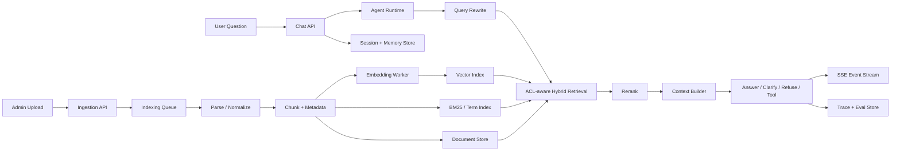
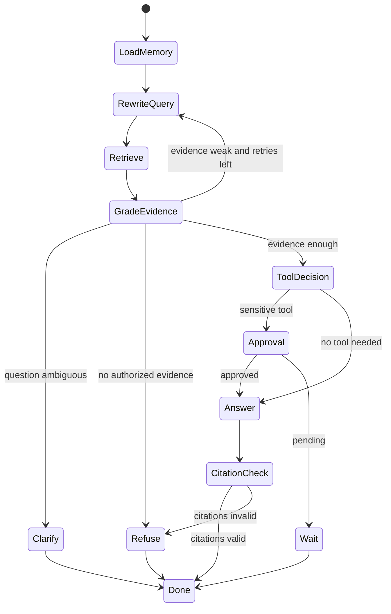

# 毕业项目 · 企业知识库 Agent

> 所属阶段：**毕业项目 · 纵向全栈实战**
> 预计用时：4-6 小时 | 难度：⭐⭐⭐⭐⭐
> 全局导航：[课程导航](../../docs/navigation.md) · [完整大纲](../../docs/curriculum.md) · [企业知识库 Agent 蓝图](../../docs/enterprise-knowledge-base-agent.md) · [RAG 架构蓝图](../../docs/rag-architecture.md)

这个项目把课程里的 RAG、记忆、工具、LangGraph、流式事件、评估、安全、部署串成一条企业知识库产品线。它不是再写一个问答 demo，而是把“上传资料 -> 建索引 -> 权限过滤 -> Agentic RAG -> 流式过程 -> 引用核验 -> trace/eval -> 定时巡检”做成可交付作品。

建议先读 [企业知识库 Agent 蓝图](../../docs/enterprise-knowledge-base-agent.md)，再按本文把蓝图拆成可执行里程碑。

---

## 最终交付

做完后，你应该能展示 6 个东西：

- [ ] 一个知识库：支持 collection、document version、chunk metadata、ACL。
- [ ] 一个问答入口：能检索、改写、重排、引用、拒答。
- [ ] 一个 Agent runtime：能决定答复、追问、重检索、调用工具、等待审批。
- [ ] 一个事件流 UI：能展示 status、evidence、tool、citation、token、error、done。
- [ ] 一个质量门：golden set 检查 retrieval、citation、refusal、safety。
- [ ] 一个后台任务面板：能看 indexing job、stale docs、unanswered queries、trace。

一句简历话术：

> 设计并实现企业知识库 Agent：文档 ingestion、混合检索、Agentic RAG、权限过滤、引用核验、流式事件协议、trace/eval 回归门和后台知识巡检闭环。

## 前置知识

| 能力 | 建议先学 |
|------|----------|
| Agent loop / tool | [第 04 章](../../lessons/04-the-agent-loop/README.md) · [第 06 章](../../lessons/06-building-a-tool-system/README.md) |
| 记忆 | [第 07 章](../../lessons/07-short-term-memory/README.md) |
| RAG | [第 09 章](../../lessons/09-rag-from-scratch/README.md) · [进阶 RAG](../../rag-advanced/01-chunking-strategies/README.md) |
| LangGraph | [进阶 LangGraph](../../langgraph-advanced/README.md) |
| 流式 UX | [第 14 章](../../lessons/14-streaming-and-ux/README.md) |
| Eval / trace / safety / deploy | [第 15-18 章](../../lessons/15-evaluation-and-testing/README.md) |

---

## 一、产品边界

### 用户角色

| 角色 | 目标 | 不能做什么 |
|------|------|------------|
| 普通成员 | 围绕有权限资料提问、总结、找出处 | 读取无权限 collection |
| 知识管理员 | 上传、更新、归档资料，查看缺口报告 | 绕过审计直接改历史版本 |
| 审批人 | 放行敏感工具调用或高风险答案 | 让 Agent 自动执行不可逆动作 |
| 系统维护者 | 看 trace、eval、成本、失败任务 | 直接读取用户长期记忆明文 |

### MVP 只做 4 条主流程

1. **上传资料**：Markdown / text / PDF 文本抽取后入库，生成 document version。
2. **索引资料**：chunk、metadata、embedding、BM25 term index 异步完成。
3. **知识问答**：用户提问后先过 ACL，再 hybrid retrieval、rerank、answer/refuse。
4. **质量回放**：每次回答保存 trace，golden set 可以重跑并比较退化。

不做：通用办公自动化、跨系统写操作、复杂 BI 报表、全自动删除资料。

---

## 二、核心数据模型

先按这些实体画 ERD，再决定用 JSON、SQLite、Postgres 还是外部服务。

| 实体 | 关键字段 | WHY |
|------|----------|-----|
| Tenant | `id`, `name`, `plan` | 多租户边界先进入模型，避免后补权限灾难 |
| User | `id`, `tenantId`, `roles` | retrieval filter 需要知道用户身份 |
| Collection | `id`, `tenantId`, `name`, `acl` | 知识库权限粒度 |
| Document | `id`, `collectionId`, `title`, `sourceUri`, `status` | 原始资料入口 |
| DocumentVersion | `id`, `documentId`, `version`, `contentHash`, `createdAt` | 文档更新后可回放、可回滚 |
| Chunk | `id`, `versionId`, `text`, `headingPath`, `metadata` | citation 的最小可引用单元 |
| EmbeddingRecord | `chunkId`, `model`, `vector`, `createdAt` | 模型升级后能重建索引 |
| ConversationSession | `id`, `userId`, `summary`, `updatedAt` | 短期记忆边界 |
| MemoryItem | `id`, `userId`, `scope`, `content`, `expiresAt` | 长期记忆必须可过期 |
| QueryTrace | `id`, `sessionId`, `question`, `events`, `cost`, `verdict` | 回放、评估、排障 |
| IndexingJob | `id`, `documentId`, `status`, `attempts`, `error` | 异步任务可重试 |
| EvalCase | `id`, `question`, `expectedChunks`, `expectedBehavior` | 防 retrieval / citation 退化 |

最关键设计：**答案 citation 指向 Chunk，Chunk 指向 DocumentVersion**。不要只存 URL，否则文档更新后无法证明当时引用的原文是什么。

---

## 三、系统架构



架构约束：

- ACL 放在 retrieval 阶段，不放在回答后处理。
- Agent 只能看 context builder 给它的 chunk，不直接扫全库。
- 每个事件、工具调用、引用、拒答都进入 trace。
- indexing 和 chat 解耦，上传大文件不能阻塞问答 API。

---

## 四、接口契约

先写接口，再替换实现。这样 M0 可以纯内存，M1 再接 Postgres/pgvector。

```ts
export interface DocumentStore {
  createDocument(input: CreateDocumentInput): Promise<DocumentRecord>;
  createVersion(input: CreateVersionInput): Promise<DocumentVersionRecord>;
  listChunks(versionId: string): Promise<ChunkRecord[]>;
  resolveCitation(chunkId: string): Promise<CitationRecord | null>;
}

export interface Retriever {
  retrieve(input: {
    tenantId: string;
    userId: string;
    query: string;
    collectionIds: string[];
    topK: number;
  }): Promise<RetrievedChunk[]>;
}

export interface MemoryStore {
  loadSession(sessionId: string): Promise<SessionMemory>;
  appendTurn(sessionId: string, turn: ConversationTurn): Promise<void>;
  summarize(sessionId: string): Promise<SessionSummary>;
}

export interface AgentEventSink {
  emit(event: AgentUiEvent): void | Promise<void>;
}
```

实现顺序：

1. `InMemoryDocumentStore` + `MemoryVectorStore`。
2. `JsonDocumentStore` + BM25 + fixture eval。
3. `PostgresDocumentStore` + pgvector 或 Milvus。
4. `RedisMemoryStore` + `TraceStore`。

---

## 五、API 设计

| Method | Path | 作用 | 必须校验 |
|--------|------|------|----------|
| `POST` | `/api/collections` | 创建知识库 | tenant、role、name 唯一性 |
| `POST` | `/api/documents` | 上传或导入资料 | 文件类型、大小、sourceUri、ACL |
| `GET` | `/api/documents/:id/versions` | 查看版本 | 用户是否能访问 collection |
| `POST` | `/api/indexing/jobs/:id/retry` | 重跑索引任务 | job 状态、attempt 上限 |
| `POST` | `/api/chat` | 普通 JSON 问答 | session、collection ACL、timeout |
| `GET` | `/api/chat/stream` | SSE 事件流 | same as chat + abort |
| `GET` | `/api/traces/:id` | 回放一次回答 | trace 所属用户 / 管理员 |
| `POST` | `/api/evals/run` | 跑 golden set | 管理员、隔离环境 |
| `GET` | `/api/reports/knowledge-gaps` | 缺口报告 | 管理员、PII 脱敏 |

错误返回统一带上下文：

```ts
type ApiError = {
  code: "FORBIDDEN" | "VALIDATION_FAILED" | "INDEXING_FAILED" | "TIMEOUT" | "UNKNOWN";
  message: string;
  context?: Record<string, unknown>;
  traceId?: string;
};
```

---

## 六、Agent Runtime

企业知识库 Agent 不该一上来就回答。它先判断证据是否足够。



控制点：

- `maxRetrieveRetries`: 默认 2。
- `minEvidenceScore`: 低于阈值拒答或追问。
- `allowedTools`: 由用户角色和 collection policy 决定。
- `citationCheck`: 答案引用必须来自本次 retrieved context。
- `humanApproval`: 写操作、外发、删除、跨系统请求必须可暂停。

---

## 七、事件流协议

UI 只流 token 不够。用 JSONL/SSE 传状态。

```json
{"type":"status","stage":"rewrite","message":"正在改写问题"}
{"type":"status","stage":"retrieve","message":"正在检索知识库"}
{"type":"evidence","chunkId":"chk_01","title":"请假制度","score":0.83}
{"type":"citation","label":"[1]","chunkId":"chk_01","uri":"kb://hr/leave-policy#v3"}
{"type":"token","text":"根据制度，"}
{"type":"tool_call","name":"createTicket","args":{"kind":"missing_doc"}}
{"type":"done","traceId":"trc_20260618_001"}
```

UI 最小状态机：

| 事件 | UI 行为 |
|------|---------|
| `status` | 顶部步骤条变化 |
| `evidence` | 侧栏展示证据卡片 |
| `citation` | 答案引用可点击 |
| `tool_call` | 展示工具名称和审批状态 |
| `approval_required` | 挂起输入，显示审批卡片 |
| `error` | 保留 traceId，允许重试 |
| `done` | 固定最终答案，写入 trace 链接 |

---

## 八、测试与验收

按风险分层测试，不为文档堆测试，也不让核心链路裸奔。

| 风险层级 | 覆盖对象 | 示例 |
|----------|----------|------|
| L1 冒烟 | CLI / API 能跑通 | 上传 fixture -> 提问 -> 有 citation |
| L2 标准 | 纯函数和接口 | chunk、ACL filter、citation check、error shape |
| L3 严格 | RAG / Agent 决策 | recall@k、refusal、query rewrite retry、事件序列 |
| L4 全面 | 权限 / 审批 / 数据安全 | 越权检索、PII、prompt injection、HITL resume |

最小 golden set：

| case | 期望 |
|------|------|
| 有答案问题 | 命中指定 chunk，答案带 citation |
| 无答案问题 | 拒答，不编造 |
| 越权问题 | retrieval 结果为空，不泄露 chunk 标题 |
| 注入资料 | 检索到也不执行资料中的指令 |
| 文档更新 | 新版本生效，旧 chunk 不再污染 |
| 模糊问题 | 请求澄清或改写后再检索 |

---

## 九、推荐目录结构

```text
enterprise-knowledge-base-agent/
├── apps/
│   ├── api/                 # HTTP + SSE
│   └── web/                 # chat, admin, trace
├── packages/
│   ├── core/                # domain types, errors, events
│   ├── ingestion/           # parse, chunk, metadata
│   ├── retrieval/           # bm25, vector, hybrid, rerank
│   ├── runtime/             # agent graph, tools, approval
│   ├── memory/              # session, summary, long-term memory
│   └── evals/               # golden set, judges, metrics
├── fixtures/
│   ├── documents/
│   └── eval-cases.json
├── docker-compose.yml
└── README.md
```

课程仓库里先写 capstone 文档和离线 checkpoint；独立作品集仓库再按这个结构拆包。

---

## 十、4 周实现路线

### Week 1：M0 离线闭环

- 建 domain types、fixtures、chunker、BM25 / memory vector。
- 写 CLI：`ask "..."` 返回 answer + citations。
- 写 golden set：有答案、无答案、越权、引用越界。

### Week 2：M1 API + 事件流

- `POST /documents`、`POST /chat`、`GET /chat/stream`。
- SSE 统一输出 `AgentUiEvent`。
- trace 保存 query rewrite、retrieval、rerank、context、cost。

### Week 3：M1 作品集 UI

- Chat 页面：答案、证据、引用、步骤。
- Admin 页面：documents、versions、indexing jobs。
- Trace 页面：一次回答完整回放。

### Week 4：M2 企业增强

- ACL-aware retrieval。
- Redis session memory 或 Postgres session summary。
- 定时任务：stale docs、unanswered queries、knowledge gaps。
- Docker compose：api、web、worker、db、redis、vector。

---

## 十一、验收清单

- [ ] 上传同一文档的新版本后，旧版本 chunk 不再参与默认检索。
- [ ] 用户无权限 collection 时，retrieval 阶段就过滤掉。
- [ ] 引用必须来自本次 context，不能引用没检索到的资料。
- [ ] 无答案问题拒答，并把缺口写入 trace。
- [ ] 注入文本在 retrieved chunk 内出现时，不改变 system/tool policy。
- [ ] SSE 事件包含 status、evidence、citation、token、error、done。
- [ ] trace 能回放每个检索候选、rerank 分数、最终 context。
- [ ] eval gate 低于阈值时非零退出。
- [ ] indexing job 可重试，失败有错误上下文。
- [ ] README 能解释为什么 ACL 在 retrieval 阶段做。

---

## 十二、面试追问

1. 为什么 citation 要绑定到 document version，而不是只存文档 URL？
2. ACL 为什么必须在 retrieval filter 中完成？
3. Hybrid retrieval 和 rerank 分别解决什么问题？
4. Agentic RAG 什么时候应该改写重试，什么时候应该拒答？
5. UI 为什么要流事件而不是只流 token？
6. 长期记忆和企业知识库有什么边界？什么不能写入用户记忆？
7. 如何证明一次线上回答没有越权使用资料？
8. 文档更新后如何避免旧 chunk 污染新答案？
9. Eval gate 应该看 recall@k、faithfulness、citation validity 还是用户满意度？
10. 定时知识缺口报告如何避免把 PII 带进摘要？

## 延伸

- 蓝图：[企业知识库 Agent 蓝图](../../docs/enterprise-knowledge-base-agent.md)
- 系统边界：[RAG 完整架构蓝图](../../docs/rag-architecture.md)
- 最小验收点：[RAG System Checkpoint](../rag-system/README.md)
- 外部作品集连接：[RAG 系统实战项目](../../docs/rag-system-project.md)

<!-- KG:START (由 npm run kg 自动生成，勿手改本标记区) -->

## 知识图谱与延伸阅读

> 本节由 `npm run kg` 自动生成（数据源 `knowledge-graph/data/graph.ts`）。要增删请改数据源后重跑。

_本章概念尚未录入图谱（可在 `graph.ts` 的 `CONCEPTS` 中补充）。_

### 延伸阅读

- [Retrieval-Augmented Generation for Knowledge-Intensive NLP Tasks](https://arxiv.org/abs/2005.11401) — RAG 原始论文 (Lewis et al., 2020)，提出检索增强生成范式 `paper`

> 🗺️ 在[全局知识图谱](../../docs/knowledge-graph.md) / [交互式图谱](../../knowledge-graph/output/index.html) 中查看本章位置。

<!-- KG:END -->
