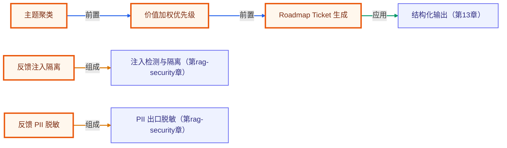

# 毕业项目 · 用户反馈洞察 Agent（Feedback Intelligence）

> 所属阶段：**毕业项目 · 综合实战**
> 预计用时：2–3 小时 | 难度：⭐⭐⭐☆☆
> 全局导航：[课程导航](../../docs/navigation.md) · [完整大纲](../../docs/curriculum.md) · [知识图谱](../../docs/knowledge-graph.md)

把客服、销售、社区和应用商店里的原始反馈，整理成产品团队能直接排期的主题、优先级和 roadmap ticket。这个项目展示的是产品运营里很常见、也最容易自动化的一条链路：**不可信输入 → 安全隔离 → PII 脱敏 → 主题聚类 → 价值加权 → 任务化**。

> 完全离线、零 key 可跑：主题分类用确定性关键词规则。上线时可以把 `matchesTheme` 换成 embedding 聚类或 LLM 结构化分类，报告契约不变。

## 学习目标

- [ ] 对用户文本先做提示注入隔离，再做后续分析。
- [ ] 在反馈入库/展示前统一 PII 脱敏。
- [ ] 用账号层级与严重度给主题加权，而不是只按数量排序。
- [ ] 把洞察输出成 owner 明确的 roadmap ticket。

## 核心流程

```text
多渠道反馈
  -> detectInjection 隔离恶意输入
  -> redactPii 脱敏
  -> 主题规则/聚类
  -> enterprise/pro/free + severity 加权
  -> owner + recommendation + ticket
```

## 运行

```bash
pnpm feedback-intelligence
pnpm feedback-intelligence:smoke
```

## 可扩展方向

- 把关键词规则换成 embedding 聚类，保留人工可解释 label。
- 从 Zendesk/Intercom/App Store 拉取真实 feedback batch。
- 把 roadmap ticket 推到 Linear/Jira，并带样本链接。
- 加趋势分析：本周新增、环比、主题老化天数。

## 如何写进简历

> **用户反馈洞察 Agent（TypeScript）**：实现多渠道反馈的注入隔离、PII 脱敏、主题聚类、价值加权和 roadmap ticket 生成；用 enterprise 权重与严重度排序，帮助产品团队从噪音中提取可排期问题。

> 面试会问：为什么产品反馈也要做提示注入检测？只按反馈数量排序有什么问题？如何证明聚类结果能稳定复现？

<!-- KG:START (由 npm run kg 自动生成，勿手改本标记区) -->

## 知识图谱与延伸阅读

> 本节由 `npm run kg` 自动生成（数据源 `knowledge-graph/data/graph.ts`）。要增删请改数据源后重跑。

### 本章概念图谱

> 节点：**橙框**=本章概念，蓝框=关联的其他章概念。连线按关系类型着色：前置(蓝) · 深化(紫) · 对比(玫红) · 应用(绿) · 组成(橙)。



### 与其他章节的关系

- `反馈注入隔离` —**组成**→ `注入检测与隔离`（第 rag-security 章）
- `反馈 PII 脱敏` —**组成**→ `PII 出口脱敏`（第 rag-security 章）
- `Roadmap Ticket 生成` —**应用**→ `结构化输出`（第 13 章）

### 延伸阅读

_暂无（可在 `graph.ts` 的 `ARTICLES` 中新增本章关联文章）。_

> 🗺️ 在[全局知识图谱](../../docs/knowledge-graph.md) / [交互式图谱](../../knowledge-graph/output/index.html) 中查看本章位置。

<!-- KG:END -->
