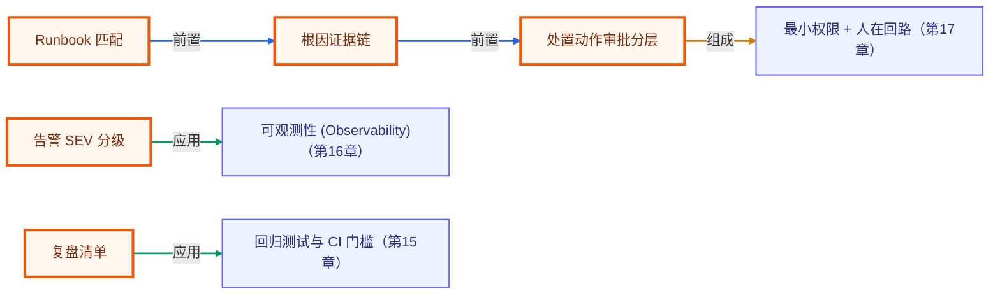

# 毕业项目 · 告警响应 Agent（Incident Responder）

> 所属阶段：**毕业项目 · 综合实战**
> 预计用时：2–3 小时 | 难度：⭐⭐⭐⭐☆
> 全局导航：[课程导航](../../docs/navigation.md) · [完整大纲](../../docs/curriculum.md) · [知识图谱](../../docs/knowledge-graph.md)

把真实线上故障处理拆成一条可回归的 Agent 流程：接收告警与日志，自动分级，匹配 runbook，给出根因、处置动作、客户话术与复盘清单。它不是聊天 demo，而是可以放进运维值班场景的骨架。

> 完全离线、零 key 可跑：所有判断由确定性规则完成。真实接入时，把告警源换成 Prometheus/PagerDuty，把 runbook 存到数据库，把高风险动作接审批系统即可。

## 学习目标

- [ ] 把告警、日志、runbook 串成端到端 incident workflow。
- [ ] 区分安全诊断动作与需要审批的变更动作。
- [ ] 生成面向用户的低风险状态话术，避免泄漏内部错误细节。
- [ ] 把复盘清单变成固定产物，而不是靠事后记忆补。

## 核心流程

```text
告警 + 日志
  -> SEV 分级
  -> runbook 匹配
  -> 根因证据链
  -> 处置动作（safe / approval-required）
  -> 客户话术
  -> postmortem checklist
```

## 运行

```bash
pnpm incident-responder
pnpm incident-responder:smoke
```

## 可扩展方向

- 接 PagerDuty / Opsgenie，把 `AlertEvent` 换成真实 webhook。
- 把 `Runbook` 存进知识库，使用 BM25/向量混合检索匹配症状。
- 将 `approval-required` 动作接入 Slack 审批或内部变更系统。
- 把 `postmortemChecklist` 落成 Jira/Linear 任务。

## 如何写进简历

> **告警响应 Agent（TypeScript）**：实现告警分级、日志证据聚合、runbook 匹配、处置动作审批分层、客户话术与复盘清单生成；离线 smoke 覆盖 SEV1 分级、根因定位、审批边界与脱敏话术。

> 面试会问：为什么不能让 Agent 自动执行所有修复命令？怎么把“诊断”和“变更”拆成不同权限边界？客户话术为什么不能直接复述日志？

<!-- KG:START (由 npm run kg 自动生成，勿手改本标记区) -->

## 知识图谱与延伸阅读

> 本节由 `npm run kg` 自动生成（数据源 `knowledge-graph/data/graph.ts`）。要增删请改数据源后重跑。

### 本章概念图谱

> 节点：**橙框**=本章概念，蓝框=关联的其他章概念。连线按关系类型着色：前置(蓝) · 深化(紫) · 对比(玫红) · 应用(绿) · 组成(橙)。



### 与其他章节的关系

- `告警 SEV 分级` —**应用**→ `可观测性 (Observability)`（第 16 章）
- `处置动作审批分层` —**组成**→ `最小权限 + 人在回路`（第 17 章）
- `复盘清单` —**应用**→ `回归测试与 CI 门槛`（第 15 章）

### 延伸阅读

_暂无（可在 `graph.ts` 的 `ARTICLES` 中新增本章关联文章）。_

> 🗺️ 在[全局知识图谱](../../docs/knowledge-graph.md) / [交互式图谱](../../knowledge-graph/output/index.html) 中查看本章位置。

<!-- KG:END -->
