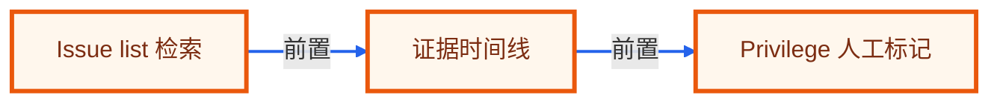

# 毕业项目 · 法务证据发现 Agent

> 所属阶段：**毕业项目 · 企业法务实战**
> 预计用时：4-5 小时 | 难度：⭐⭐⭐⭐☆
> 全局导航：[课程导航](../../docs/navigation.md) · [完整大纲](../../docs/curriculum.md) · [毕业项目总览](../README.md) · [知识图谱](../../docs/knowledge-graph.md)

把邮件、合同、聊天记录和案件 issue list 组织成证据发现流程，帮助法务定位相关材料和时间线。

> 离线、零 key 可设计与验证：实现时先用 fixture 和确定性规则跑通端到端闭环。真实接入时，把 fixture 替换成业务系统数据源，把规则模块替换成可配置策略或模型调用，输出契约保持不变。

## 最终交付

- [ ] 一个 e-discovery 工作流，输出证据候选、相关性理由、时间线和 privilege/敏感标记。
- [ ] 一组可复现 fixture，覆盖正常、边界和高风险样例。
- [ ] 一个分层 Agent 设计：输入归一、决策、工具/检索、人工确认、报告输出。
- [ ] 一套验收清单，可直接转成 smoke/eval 测试。
- [ ] 一段作品集/简历话术和面试追问准备。

## 适用角色

- 法务团队
- 合规调查员
- 外部律师协作人

## 核心流程

```text
导入文档批次
  -> 按 issue list 检索
  -> 去重与聚类
  -> 生成时间线
  -> 标记 privilege 风险
  -> 输出证据包索引
```

## 数据与接口

| 模块 | 职责 |
|------|------|
| `DocumentBatchLoader` | DocumentBatchLoader 负责本流程中的一个稳定边界，便于替换为真实 API 或数据库实现。 |
| `IssueMatcher` | IssueMatcher 负责本流程中的一个稳定边界，便于替换为真实 API 或数据库实现。 |
| `NearDuplicateClusterer` | NearDuplicateClusterer 负责本流程中的一个稳定边界，便于替换为真实 API 或数据库实现。 |
| `TimelineBuilder` | TimelineBuilder 负责本流程中的一个稳定边界，便于替换为真实 API 或数据库实现。 |
| `PrivilegeMarker` | PrivilegeMarker 负责本流程中的一个稳定边界，便于替换为真实 API 或数据库实现。 |

建议 fixture：

- `emails.json`
- `issue-list.md`
- `contracts.json`
- `custodian-map.json`

最小输出契约：

```ts
type CapstoneResult = {
  status: "ok" | "needs_review" | "blocked";
  summary: string;
  evidence: Array<{ source: string; quote: string; confidence: "low" | "medium" | "high" }>;
  actions: Array<{ owner: string; nextStep: string; due?: string; requiresApproval: boolean }>;
  risks: Array<{ level: "low" | "medium" | "high"; reason: string }>;
};
```

## 护栏与人工确认

- 不删除原始证据
- privilege 标记必须人工复核
- 所有筛选保留审计日志
- 时间线只引用原始时间戳

## 里程碑

1. M0 文档导入和 issue 匹配
2. M1 去重聚类和时间线
3. M2 privilege 标记和证据包

## 验收清单

- [ ] 同一邮件线程去重
- [ ] issue 命中带理由
- [ ] 时间线按时间排序
- [ ] privilege 关键词触发标记
- [ ] 无关文档不进入包
- [ ] 审计日志覆盖每次筛选

## 可扩展方向

- 接对象存储和 OCR
- 导出 review platform CSV
- 按 custodian 做范围过滤
- 加入人工复核状态机

## 如何写进简历

> 实现法务证据发现 Agent：围绕 issue list 检索企业文档，完成去重聚类、时间线构建、privilege 标记和审计可追溯证据包。

## 面试追问

1. e-discovery 为什么必须保留原始证据？
2. 相关性判断如何可解释？
3. privilege 为什么只能标记不能自动结论？
4. 如何处理重复邮件线程？

<!-- KG:START (由 npm run kg 自动生成，勿手改本标记区) -->

## 知识图谱与延伸阅读

> 本节由 `npm run kg` 自动生成（数据源 `knowledge-graph/data/graph.ts`）。要增删请改数据源后重跑。

### 本章概念图谱

> 节点：**橙框**=本章概念，蓝框=关联的其他章概念。连线按关系类型着色：前置(蓝) · 深化(紫) · 对比(玫红) · 应用(绿) · 组成(橙)。



### 延伸阅读

_暂无（可在 `graph.ts` 的 `ARTICLES` 中新增本章关联文章）。_

> 🗺️ 在[全局知识图谱](../../docs/knowledge-graph.md) / [交互式图谱](../../knowledge-graph/output/index.html) 中查看本章位置。

<!-- KG:END -->
