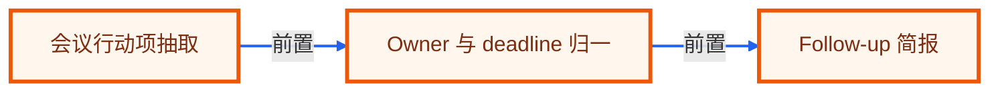

# 毕业项目 · 会议行动项 Agent

> 所属阶段：**毕业项目 · 协作效率实战**
> 预计用时：2-3 小时 | 难度：⭐⭐⭐☆☆
> 全局导航：[课程导航](../../docs/navigation.md) · [完整大纲](../../docs/curriculum.md) · [毕业项目总览](../README.md) · [知识图谱](../../docs/knowledge-graph.md)

把会议纪要、发言片段和历史决议整理成 owner、deadline、风险和后续追踪项，解决会后没人知道谁该做什么的问题。

> 离线、零 key 可设计与验证：实现时先用 fixture 和确定性规则跑通端到端闭环。真实接入时，把 fixture 替换成业务系统数据源，把规则模块替换成可配置策略或模型调用，输出契约保持不变。

## 最终交付

- [ ] 一个可离线演示的 meeting-to-action 工作流，能输出行动项、风险、跟进提醒和复盘摘要。
- [ ] 一组可复现 fixture，覆盖正常、边界和高风险样例。
- [ ] 一个分层 Agent 设计：输入归一、决策、工具/检索、人工确认、报告输出。
- [ ] 一套验收清单，可直接转成 smoke/eval 测试。
- [ ] 一段作品集/简历话术和面试追问准备。

## 适用角色

- 项目经理
- 团队负责人
- 会议记录人

## 核心流程

```text
导入会议纪要
  -> 识别决议与待办
  -> 抽取 owner 和 deadline
  -> 合并重复行动项
  -> 标记阻塞风险
  -> 生成 follow-up 简报
```

## 数据与接口

| 模块 | 职责 |
|------|------|
| `TranscriptParser` | TranscriptParser 负责本流程中的一个稳定边界，便于替换为真实 API 或数据库实现。 |
| `DecisionExtractor` | DecisionExtractor 负责本流程中的一个稳定边界，便于替换为真实 API 或数据库实现。 |
| `ActionItemResolver` | ActionItemResolver 负责本流程中的一个稳定边界，便于替换为真实 API 或数据库实现。 |
| `RiskClassifier` | RiskClassifier 负责本流程中的一个稳定边界，便于替换为真实 API 或数据库实现。 |
| `FollowUpReporter` | FollowUpReporter 负责本流程中的一个稳定边界，便于替换为真实 API 或数据库实现。 |

建议 fixture：

- `meeting-notes.md`
- `team-roster.json`
- `project-decisions.json`
- `action-history.json`

最小输出契约：

```ts
type CapstoneResult = {
  status: "ok" | "needs_review" | "blocked";
  summary: string;
  evidence: Array<{ source: string; quote: string; confidence: "low" | "medium" | "high" }>;
  actions: Array<{ owner: string; nextStep: string; due?: string; requiresApproval: boolean }>;
  risks: Array<{ level: "low" | "medium" | "high"; reason: string }>;
};
```

## 护栏与人工确认

- 不把讨论观点误判为承诺
- 缺 owner 时生成待确认项
- 隐私片段默认不进入外发摘要
- deadline 冲突时保留证据原文

## 里程碑

1. M0 纪要解析和行动项抽取
2. M1 owner/deadline 归一与风险标记
3. M2 follow-up 报告和回归样例

## 验收清单

- [ ] 空纪要返回无行动项
- [ ] 重复行动项合并
- [ ] 缺 owner 进入待确认
- [ ] deadline 解析失败保留原文
- [ ] 敏感片段不外发
- [ ] 报告包含证据引用

## 可扩展方向

- 接入 Google Meet/Zoom transcript
- 同步 Linear/Jira 任务
- 生成周会滚动状态
- 把历史延期率纳入风险评分

## 如何写进简历

> 实现会议行动项 Agent：从纪要中抽取决议、owner、deadline、风险和 follow-up 简报，支持重复合并、缺失字段待确认与敏感内容外发隔离。

## 面试追问

1. 如何区分讨论、决议和行动项？
2. owner 缺失时为什么不能硬猜？
3. 如何避免把敏感发言写进外发邮件？
4. 行动项生成后如何做回归测试？

<!-- KG:START (由 npm run kg 自动生成，勿手改本标记区) -->

## 知识图谱与延伸阅读

> 本节由 `npm run kg` 自动生成（数据源 `knowledge-graph/data/graph.ts`）。要增删请改数据源后重跑。

### 本章概念图谱

> 节点：**橙框**=本章概念，蓝框=关联的其他章概念。连线按关系类型着色：前置(蓝) · 深化(紫) · 对比(玫红) · 应用(绿) · 组成(橙)。



### 延伸阅读

_暂无（可在 `graph.ts` 的 `ARTICLES` 中新增本章关联文章）。_

> 🗺️ 在[全局知识图谱](../../docs/knowledge-graph.md) / [交互式图谱](../../knowledge-graph/output/index.html) 中查看本章位置。

<!-- KG:END -->
