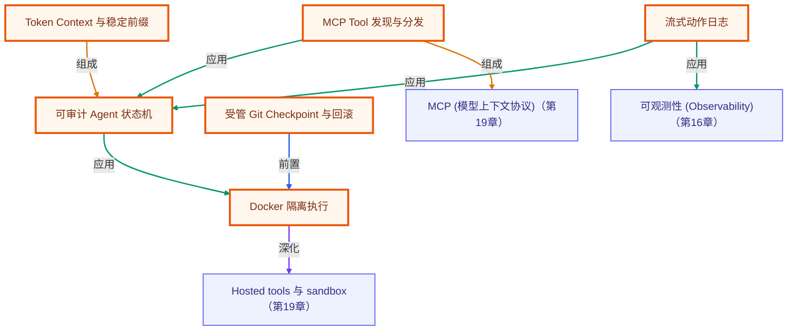

# 毕业项目 · Mini Agent Harness

> **TypeScript / Node.js 20+ / MCP / Docker / Git Checkpoint**
>
> 所属阶段：毕业项目 · Agent Runtime 综合实战
> 全局导航：[课程导航](../../docs/navigation.md) · [完整大纲](../../docs/curriculum.md) · [知识图谱](../../docs/knowledge-graph.md)

`mini-agent-harness` 不是让模型直接操作宿主机的玩具 CLI。它用一个零 key、可重复的 `invoice-regression` 场景，完整跑出：

```text
MCP tools/list + read_text(task.json)
  → 基线金额验收失败（实际 4950 分，期望 4050 分）
  → 有限 self-correction
  → 写入修复后的 invoice.mjs 与 result.json
  → Git checkpoint rollback 回到故意错误的基线
```

日志只展示可审计的动作、状态和截断后的错误摘要；不会输出模型隐藏推理。

## 5 分钟直接跑

前置：Node.js 20+、pnpm；默认路径还需要 Docker Engine 或 Docker Desktop 已启动。第一次在受信任网络中使用镜像时，可先执行 `docker pull node:20-alpine`；Harness 不会在 Agent 执行时隐式拉镜像。

```bash
pnpm install

# 先确认当前用户可以连接 Docker daemon
docker version

# 默认、Docker-required 的完整闭环
pnpm mini-agent-harness -- --scenario invoice-regression --rollback --keep-workspace --verbose
```

这条默认命令只在 Docker preflight 成功后才会执行代码。它会打印受管临时工作区路径；`--keep-workspace` 让你在最后检查现场，`--rollback` 则在修复验收后立即恢复到错误基线。

若 Docker daemon 无法验证，默认命令必须以 `SANDBOX_DOCKER_UNAVAILABLE`（环境阻塞，通常为 exit 2）停止。此时没有任何代码被改为在宿主机自动执行；这次运行也不能声称验证了隔离、修复或回滚。

只有在你确认 fixture 与本地环境都可信时，才可显式运行开发教学路径：

```bash
pnpm mini-agent-harness -- --scenario invoice-regression --development-fallback --rollback --keep-workspace --verbose
```

`--development-fallback` 使用宿主 Node 子进程来展示同一条控制流。它不是安全沙箱：即使最小化环境变量、限制超时和清理子进程，代码仍与宿主共享用户权限、文件系统、进程与网络边界。不要把模型生成或第三方提供的代码交给此模式。

## 你应该看到什么

以下为关键观察点；时间、checkpoint 短 ID 和颜色会变化，字段语义不变。

| 顺序 | 预期日志或现场证据 | 这证明什么 |
| --- | --- | --- |
| 1 | `mcp tools/list → ... read_text` | Agent 先动态发现 MCP 工具，而不是假定工具存在。 |
| 2 | `tool read_text OK: ... task.json ...` | Planner 的任务输入来自受控 MCP 读取。 |
| 3 | `sandbox docker ERROR ... expected 4050, actual 4950` | 基线的折扣符号错误被真实验收捕获，而非在 Planner 中硬编码成成功。 |
| 4 | `retry #1` | 失败摘要被作为可见 observation 反馈，且只有有限次数的修正预算。 |
| 5 | `sandbox docker OK ... INVOICE_REGRESSION_FIXED totalCents=4050` | 修复动作已写入 `invoice.mjs`、写出 `result.json`，并通过金额验收。 |
| 6 | `rollback restored git:<短 ID>` | Git checkpoint 恢复了修复前的错误基线。 |

使用 `--development-fallback` 时，第 3、5 步会显示 `development-node`，而不是 `docker`。这证明控制流可用，不证明 Docker 隔离可用。

一次成功的核心轨迹近似如下：

```text
state       THINKING
mcp         tools/list → ... read_text
action      通过 MCP read_text 读取订单回归任务与验收目标
tool        read_text OK: { ... expectedTotalCents: 4050 ... }
sandbox     docker ERROR exit=1 timeout=false ... expected 4050, actual 4950
retry       #1: sandbox failed: ...
sandbox     docker OK exit=0 timeout=false INVOICE_REGRESSION_FIXED totalCents=4050
rollback    restored git:<checkpoint>
```

## 看工作区，而不是只看终端

Harness 只会创建自己的临时受管工作区，不会把当前仓库作为 checkpoint 或 Docker mount。带 `--keep-workspace` 的命令会输出其绝对路径。典型结构如下：

```text
<managed-workspace>/
├─ .mini-agent-harness-workspace  # 受管目录 marker
├─ .git/                          # 仅在这个新临时目录中创建
├─ task.json                      # 固定的订单、折扣与 4050 分验收目标
├─ invoice.mjs                    # 初始为故意错误版；修复时短暂变为正确版
└─ result.json                    # 仅修复验收后出现；rollback 后会被移除
```

本场景固定为：小计 `4500` 分，折扣 `450` 分，正确总额 `4050` 分。错误基线将折扣加回去，所以得到 `4950` 分。带 `--rollback` 结束后，检查 `invoice.mjs` 应再次看到加号，`result.json` 应不存在；省略 `--rollback` 才能保留通过的 `result.json` 以便检查。

```powershell
# 把 <工作区路径> 替换为 CLI 打印的 managed workspace
Get-Content -Raw "<工作区路径>\invoice.mjs"
Test-Path "<工作区路径>\result.json"
```

回滚只恢复这个受管工作区的文件状态。它不会撤销数据库写入、HTTP 请求、发出的消息、远程 MCP 副作用或容器外部资源。

## 常用入口与证据边界

| 命令 | 用途 | 通过后可以说什么 | 不能据此说什么 |
| --- | --- | --- | --- |
| `pnpm mini-agent-harness:demo` | 零 key、可信 fixture 的演示入口 | 确定性 Planner 与场景链路可以运行 | 真实 LLM 行为或 Docker 隔离已经验证 |
| `pnpm mini-agent-harness:smoke` | 零 Docker 的核心控制流 smoke | MCP 读取、4950→4050 修复、有限重试与 rollback 契约通过 | Docker daemon 可用或容器隔离已生效 |
| `pnpm mini-agent-harness:test` | AgentLoop、MCP、policy、checkpoint 等离线测试 | 已纳入的接口/行为回归通过 | 真实容器、真实远端 MCP 或真实模型已验证 |
| `pnpm mini-agent-harness:docker:e2e` | Docker 中的完整 `invoice-regression` 端到端链路 | 当前 daemon 可启动受限容器，并跑完本 README 的真实流程 | Docker 可抵御所有内核、镜像或供应链攻击 |
| `pnpm mini-agent-harness:docker:smoke` | Docker 写入与超时清理的窄验收 | 当前环境的容器执行、受管挂载和 timeout kill 可用 | 整个 Agent 编排或生产隔离完备 |

Docker 相关命令若因 daemon、权限或镜像不可用而退出 2，应记录为环境阻塞。不要用 `--development-fallback` 替代 Docker 验收，也不要把 fallback 的通过结果写成安全验证。

## 默认安全路径与明确边界

- **Docker 默认且 fail-closed。** 没有通过 daemon preflight，就不执行模型或 Planner 生成的代码；不会静默降级到 Node。
- **Docker 不是 VM。** 容器是有限的内核级隔离。不要挂载家目录、当前项目、Docker socket、凭据或敏感目录；生产还需要 rootless 或专用 worker、镜像治理、egress 策略与更强隔离。
- **MCP Server 是信任边界。** Demo 的 `read_text` 只接受受管工作区内相对路径。接入真实 Server 前应核对服务端身份、工具权限、参数 schema、网络出口与副作用。
- **策略不是安全证明。** 命令预检用于早拒绝和可读报错；安全性依赖受限容器配置、最小挂载、权限与资源限制，而不依赖字符串黑名单。
- **日志不是思维链。** 记录的是工具名、参数摘要、checkpoint、退出码、timeout 和截断输出；不要记录完整 secrets、环境变量或模型隐藏推理。

## 把固定 Planner 换成真实 LLM adapter

内置 `DemoPlanner` 故意只会处理 `invoice-regression`，以便零 key 的教学与测试可重复。要接入真实模型，保留它作为 fixture，并新建实现 `AgentPlanner` 的 Provider adapter；不要把 LLM 自由文本直接当 shell 命令。

建议按下面的边界替换：

1. 在 adapter 中把 `PlannerInput` 的任务、已发现工具、受限 observation 和 context 序列化为稳定的请求；凭据从进程安全配置读取，不写入受管工作区或日志。
2. 让模型只返回经 schema 校验的 `AgentAction`：`tool`、受限的 `sandbox` 或 `complete`。工具名必须来自本轮 `tools/list` 的 allowlist，参数必须通过各工具 schema。
3. `sandbox` action 仍经过 `SandboxPolicy` 和 Docker runner；不要让 adapter 决定挂载、网络、用户权限或回滚目标。
4. 对模型输出、工具错误和 sandbox stderr 保留可读摘要，并继续使用 `AgentLoop` 的 `maxCorrections` 预算。不要把隐藏推理写进事件或拿它作为控制协议。
5. 先保留本 README 的 fixture、smoke 与 Docker E2E；再增加真实 Provider 的 mock、超时、限流和 golden regression tests。

最小的成功标准不是模型能写任意代码，而是它仍遵守这条可验证链路：发现工具 → 读取受控任务 → 观察断言失败 → 在有限预算内提交受控修复 → 让验收与 checkpoint 给出证据。

## 连接你自己的 MCP Server

教学场景使用本地 stdio demo server，并实际调用 `read_text(task.json)`。CLI 也保留独立的工具发现入口，方便先审查外部 Server 暴露了什么能力；该子命令只执行 `tools/list`，**不会**调用远端工具或把它接入本场景的固定 Planner。

```bash
# 新的远端集成优先 Streamable HTTP；生产地址必须使用 HTTPS
pnpm mini-agent-harness -- tools --url https://mcp.example.com/mcp

# 仅为历史服务显式启用 legacy SSE；http 只允许 loopback 开发地址
pnpm mini-agent-harness -- tools --url http://127.0.0.1:3000/sse --legacy-sse

# 本地 stdio Server；传输由 Harness 创建子进程，shell=false
pnpm mini-agent-harness -- tools --stdio-command node --stdio-arg ./my-mcp-server.mjs
```

开始让真实模型调用这些工具前，应先补上 Server allowlist、工具参数 schema、认证、工具级审批和外部副作用的幂等/补偿策略；本项目不会把“能列出工具”误写成“已经安全自动执行”。

## 验收清单

- [ ] 默认命令仅在 Docker daemon 可用时运行；daemon 不可用时 fail closed，并清楚报告环境阻塞。
- [ ] 日志包含 `tools/list`、`read_text(task.json)`、`expected 4050, actual 4950`、一次有限 correction、`totalCents=4050` 和 rollback 证据。
- [ ] `--rollback --keep-workspace` 后，受管工作区中的 `invoice.mjs` 恢复故意错误基线，`result.json` 已移除。
- [ ] `--development-fallback` 的日志明确显示非 Docker 运行时，并且文档/报告不把它归为安全沙箱验收。
- [ ] `:smoke`、`:test`、`:docker:e2e` 与 `:docker:smoke` 的结果按上述不同证据边界分别记录。
- [ ] 任何真实 MCP 或 LLM 接入都经过 allowlist、schema、超时、日志脱敏和外部副作用审批设计。

## 目录定位

```text
capstone/mini-agent-harness/
├─ src/cli.ts               # CLI 和 --scenario 入口
├─ src/demo-scenario.ts     # invoice-regression fixture 与金额验收
├─ src/demo-planner.ts      # 零 key 的确定性 Planner
├─ src/demo-runtime.ts      # 工作区、MCP、Planner、checkpoint 的统一装配
├─ src/agent-loop.ts        # 状态机与有限 self-correction
├─ src/mcp-client.ts        # tools/list / tools/call
├─ src/sandbox-runner.ts    # Docker-first runner 与显式 development fallback
├─ src/checkpoint.ts        # 受管 Git checkpoint / rollback
└─ src/*test.mts            # 离线行为与边界测试
```

## 许可证

本项目随仓库采用 [MIT License](../../LICENSE)。

<!-- KG:START (由 npm run kg 自动生成，勿手改本标记区) -->

## 知识图谱与延伸阅读

> 本节由 `npm run kg` 自动生成（数据源 `knowledge-graph/data/graph.ts`）。要增删请改数据源后重跑。

### 本章概念图谱

> 节点：**橙框**=本章概念，蓝框=关联的其他章概念。连线按关系类型着色：前置(蓝) · 深化(紫) · 对比(玫红) · 应用(绿) · 组成(橙)。



### 与其他章节的关系

- `MCP Tool 发现与分发` —**组成**→ `MCP (模型上下文协议)`（第 19 章）
- `Docker 隔离执行` —**深化**→ `Hosted tools 与 sandbox`（第 19 章）
- `流式动作日志` —**应用**→ `可观测性 (Observability)`（第 16 章）

### 延伸阅读

- [OpenAI Agents SDK for TypeScript](https://openai.github.io/openai-agents-js/) — OpenAI 官方 TypeScript Agents SDK 文档，对应 agent、tool、handoff、guardrail、session、tracing、MCP 等 SDK 层能力 `doc`
- [OpenAI Docs · Sandbox agents](https://developers.openai.com/api/docs/guides/agents/sandboxes) — Agents SDK sandbox 文档，对应 code execution / long-running task 的隔离执行与生产化边界 `doc`
- [Effective context engineering for AI agents](https://www.anthropic.com/engineering/effective-context-engineering-for-ai-agents) — Anthropic 官方：上下文是有限资源，需主动裁剪、压缩和按需装配，对应 compiler、runtime 与长期任务压缩 `blog`

> 🗺️ 在[全局知识图谱](../../docs/knowledge-graph.md) / [交互式图谱](../../knowledge-graph/output/index.html) 中查看本章位置。

<!-- KG:END -->
