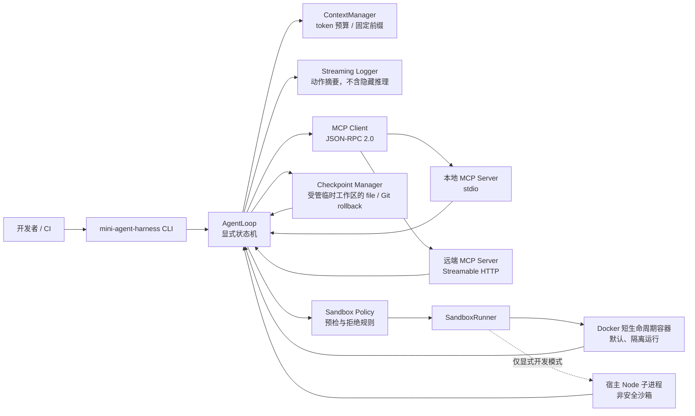
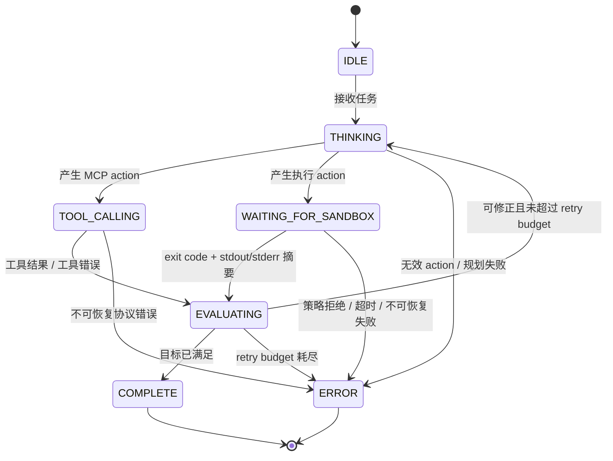

# 毕业项目 · Mini Agent Harness

> **TypeScript / Node.js 20+ / MCP / Docker / Git Checkpoint**
>
> 所属阶段：毕业项目 · Agent Runtime 综合实战
> 全局导航：[课程导航](../../docs/navigation.md) · [完整大纲](../../docs/curriculum.md) · [知识图谱](../../docs/knowledge-graph.md)

`mini-agent-harness` 是一个可运行的本地 CLI：它把 **MCP 工具发现与调用**、**受约束的代码/Bash 执行**、**上下文管理**、**Agent 状态机**、**Git 检查点与回滚**串成一条可观察的 Agent 执行链路。

它不是“让模型直接碰宿主机”的 Demo，而是把 Agent 最容易失控的几个边界显式化：工具协议边界、执行隔离边界、状态迁移边界，以及文件修改的可回退边界。

## 先读：安全与能力边界

- **默认要求 Docker。** 需要执行模型生成的 Node.js、Python 或 Bash 时，CLI 以 Docker 容器作为默认运行时；Docker 不可用时，安全执行任务应当失败并给出可诊断错误，而不是悄悄在宿主机运行。
- **Node fallback 不是安全沙箱。** 它仅服务于本地开发、单元测试或已完全可信的脚本；即使有超时和子进程清理，也仍共享宿主机的用户权限、文件系统与网络环境，绝不能拿来执行不可信的模型输出。
- **Docker 也不是绝对安全保证。** 容器是内核级隔离而非 VM；不要挂载宿主机敏感目录、Docker socket 或凭据，不要把本项目当作多租户远程代码执行服务。生产场景还需要 rootless Docker/独立节点、镜像供应链治理、审计和更强隔离。
- **日志不输出模型隐藏推理（chain-of-thought）。** CLI 只流式输出可验证的动作摘要：时间戳、状态迁移、工具名、参数摘要、检查点 ID、退出码、超时标记与已截断的 stdout/stderr。
- **MCP Server 仍是信任边界。** 远端 MCP 工具可能读取数据或产生副作用；接入前应核对服务端身份、工具描述、权限范围与网络出口策略。

---

## 交付物与学习目标

完成后，你将拥有一个可以写入简历的 `mini-agent-harness` CLI，并能够解释下列工程决策：

| 能力 | 本项目中的落点 |
| --- | --- |
| MCP 协议通信 | JSON-RPC 2.0 Client、stdio 本地子进程、Streamable HTTP 远端连接、动态工具发现与分发 |
| 安全执行 | Docker 短生命周期容器、命令预检、网络/权限/资源限制、超时强制清理 |
| Context 工程 | token 估算、固定前缀、滑动窗口/摘要触发点，以及 KV Cache 命中条件 |
| Agent 编排 | 显式异步状态机、受限重试、自我修正输入与流式事件 |
| 可回滚状态 | 每次可写操作前创建 Git checkpoint，按会话生成的 checkpoint ID 恢复 |
| 可验证交付 | MCP、策略、沙箱、状态机、回滚逻辑的离线测试和 Docker 冒烟验证 |

## 架构总览



执行主线是：

```text
输入任务
  → 规划动作
  → 发现/调用 MCP Tool
  → 创建 checkpoint（若将发生受管文件修改）
  → 沙箱执行
  → 评估结果
  → 完成，或携带“可见错误摘要”进行有限次数修正
```

## 目录与职责

```text
capstone/mini-agent-harness/
├─ README.md
└─ src/
   ├─ cli.ts                # CLI 入口与演示编排
   ├─ agent-loop.ts         # 状态机、工具回调、有限重试
   ├─ mcp-client.ts         # MCP transport、tools/list 与 tools/call
   ├─ demo-mcp-server.ts    # 供本地 smoke 使用的 stdio MCP Server
   ├─ demo-planner.ts       # 零 key、一次故意失败的 Dogfooding Planner
   ├─ sandbox-policy.ts     # 输入预检与明确拒绝原因
   ├─ sandbox-runner.ts     # Docker / 明确标记为 unsafe 的 Node fallback
   ├─ context-manager.ts    # token 预算、窗口与摘要契约
   ├─ checkpoint.ts         # Git checkpoint、列举与 rollback
   ├─ logger.ts             # 结构化事件到终端的流式渲染
   ├─ smoke.ts              # 可信 development-node 的零 Docker 编排 smoke
   ├─ docker-smoke.ts       # Docker 真容器 + timeout kill 验收
   ├─ types.ts              # Planner、MCP、Sandbox、Context 的稳定接口
   └─ *.test.mts            # AgentLoop / foundation / MCP 纯逻辑与集成边界测试
```

文件名以仓库当前实现为准；职责划分刻意保持稳定：**协议、策略、执行、编排、持久化不互相吞没**，因此可以独立替换模型提供商或某一种运行时。

---

## 1. MCP：从“能连上”到“能安全分发”

### 支持范围

| 场景 | Transport | 用途 |
| --- | --- | --- |
| 本地工具 | `StdioClientTransport` | 启动本地 MCP Server 子进程，通过 stdin/stdout 交换 JSON-RPC 消息 |
| 远端工具 | `StreamableHTTPClientTransport` | 连接符合现代 MCP Streamable HTTP 规范的远端 Server |
| Tool 能力 | `tools/list` + `tools/call` | 分页发现工具、缓存可展示元数据、按工具名和参数分发 |
| 旧服务迁移 | `SSEClientTransport`（deprecated） | 仅通过显式 legacy 入口连接 pre-Streamable-HTTP Server，不作为新接入默认值 |

MCP 中的 **Tools、Resources、Prompts** 是不同能力域。本项目 v1 的可执行闭环聚焦于 **Tools**：发现、参数校验、调用、错误归因、连接关闭。Resources/Prompts 可以按同一 Client 生命周期继续扩展，但不能因为 Server “可能支持”就假定已经接入。

### stdio 与 Streamable HTTP 的区别

- **stdio**：Harness 管理子进程生命周期，最适合本地开发工具；Server 的协议输出必须保持在 stdout，诊断日志应写 stderr，避免污染 JSON-RPC 通道。
- **Streamable HTTP**：Harness 作为 HTTP Client 连接远端 MCP Server，适合跨机器或托管服务；必须考虑认证、证书、超时、重试与可访问的网络边界。
- **传统 HTTP + SSE 是 legacy 边界**：Client 保留显式、标为 deprecated 的 `connectLegacySse`，仅用于 pre-Streamable-HTTP Server 的迁移兼容；新接入仍应选择 Streamable HTTP。不要把“HTTP 响应可流式返回”误写成“已支持 legacy SSE transport”，也不要在新代码中把 legacy SSE 当成默认远端方案。

### 一次 Tool Call 的最小闭环

```text
initialize / capabilities 协商
  → tools/list（处理 nextCursor，直到工具目录完整）
  → 根据模型/Planner 的结构化 action 选择 tool
  → tools/call(name, arguments)
  → 将结构化结果或错误摘要回填 AgentLoop
  → close transport / 结束子进程
```

Demo MCP Server 仅暴露 `echo` 与受限的 `read_text`，用于验证协议和分发。后者只接受配置工作区内的相对路径，解析真实路径后再次检查边界，并限制单文件读取大小；它不把“读取任意宿主机文件”伪装成安全能力。真实接入时应为每个 Server 建立允许列表、参数 Schema、超时和审计规则。

---

## 2. SandboxRunner：执行隔离的分层防线

### Docker 默认模式

Docker Runner 为每次执行创建短生命周期容器，并以 Docker API 对应的配置建立以下防线：

| 防线 | 目的 |
| --- | --- |
| 禁止网络 | 防止命令直接外连、下载二进制或扫描内网 |
| 只读根文件系统 | 降低对容器系统路径的持久化篡改面 |
| 非 root 用户 | 避免默认 root 带来的额外权限 |
| `CAP_DROP=ALL` 与 `no-new-privileges` | 收缩 Linux capabilities，并阻止进程提升权限 |
| 内存、CPU、进程数限制 | 限制资源耗尽与 fork bomb 的影响半径 |
| 超时 + 强制 stop/remove | 运行超时后终止容器，并清理短生命周期资源 |
| 命令策略预检 | 对已知高风险/越权模式给出可读拒绝原因，作为隔离前的第二道防线 |

容器只挂载 Harness 创建的受管临时工作区到 `/workspace`，并用受限 tmpfs 提供 `/tmp`；不会把当前项目、家目录或 Docker socket 作为默认 mount。Policy 会拒绝典型的父目录逃逸、敏感系统路径、环境变量读取、破坏性命令、网络命令和嵌套容器命令。

策略过滤不是安全证明：Shell 语法、解释器行为和新型逃逸方式都不能靠黑名单穷尽。因此执行不可信内容时，**容器配置优先于字符串过滤**；过滤只负责尽早拒绝显而易见的危险意图并改善可观测性。

### Node fallback 的真实含义

| 运行时 | 是否可执行 | 隔离结论 | 允许场景 |
| --- | --- | --- | --- |
| Docker（默认） | Docker daemon 可用时 | 有限的容器级隔离；仍需遵循上述主机与供应链边界 | 模型生成的代码、Bash、Dogfooding |
| Node fallback（显式开发模式） | Docker 不可用或测试注入时 | **不是安全沙箱**；仅有最小环境、子进程超时/清理等可靠性控制 | 已审计的本地 Node fixture、开发调试 |

当前 fallback 仅支持 Node runtime；Python/Bash 没有 Docker 时不会被伪装成可运行。Docker 不可用时，请执行 Docker 冒烟命令确认原因（daemon 未启动、权限、镜像缺失等），而不是将 fallback 当作“自动降级的安全执行”。CI 若要验证隔离能力，也应把 Docker 环境作为必备条件。

---

## 3. ContextManager：token 预算与 KV Cache 不是一回事

每一轮都把全部历史原样塞回模型，最终会导致成本、延迟和注意力质量一起失控。`ContextManager` 负责：

1. 默认用 `o200k_base` tokenizer 估算固定前缀与动态消息的 token，并为模型输出预留预算；
2. 构造后冻结固定 system prefix；模型 adapter 若把工具 Schema 放进 prompt，也应保持它的序列化顺序稳定；
3. 达到预算时优先保留最近原文；若注入摘要器，则保留有界摘要和最近原文，摘要器异常时确定性降级为滑动窗口；
4. 为每次截断/摘要产生可见事件，避免“上下文突然忘了”的黑盒行为。

固定前缀有助于模型提供商的 **prompt/KV cache** 命中，但命中取决于提供商、模型版本、缓存 TTL、字节级前缀一致性和请求路由。Harness 只能让请求形状更有利于命中，**不能保证或伪造 cache hit**；token 估算也应被视为预算依据，而不是账单的唯一事实来源。

---

## 4. AgentLoop：显式状态机与受限自我修正



状态机的价值不是多画一个枚举，而是让每个阶段都能回答：

- 当前在做什么，下一步允许做什么？
- 哪些输入来自 MCP，哪些来自容器，哪些是 checkpoint 元数据？
- 哪些错误可重试，最多重试几次？
- 是否已经产生副作用，回滚锚点在哪里？

当沙箱失败时，Loop 只把 **命令、退出码、截断后的 stderr、策略原因和尝试次数**作为纠错上下文交给 Planner/模型适配层；不会记录或展示模型隐藏思维链。重试必须受 `maxRetries` 约束，防止“错误 → 再试”形成无限循环。

---

## 5. Checkpoint：让 Agent 的文件副作用可撤销

Checkpoint 不直接操作用户当前仓库。`createManagedWorkspace()` 会在系统临时目录下创建带 marker 的独立工作区；`CheckpointStore` 只接受该受管目录，拒绝用户指定路径、符号链接和已有 Git 仓库。

它提供两种快照实现：

| 策略 | 默认值 | 实现 |
| --- | --- | --- |
| `file` | 是 | 在受管 checkpoint store 保存文件快照 |
| `git` | 可选 | 只在新的受管临时工作区初始化 Git，并以 commit SHA 保存 checkpoint |

AgentLoop 会在每次 MCP Tool 和 Sandbox action 的**前后**创建 checkpoint 事件；最新的“Sandbox action 前”锚点可由 `rollbackLastStep()` 显式恢复。失败不会在后台偷偷回滚——调用方必须决定是保留现场排查，还是执行这次受管 rollback。

```text
准备 Tool / Sandbox action → 创建 checkpoint A → 执行动作 → 创建 checkpoint B
                                             ├─ 成功：保留证据并继续
                                             └─ 失败：保留现场；调用方可显式 rollback A 再重新规划
```

这项能力的边界同样需要说清：

- rollback 会改变受管临时工作区内容；file 策略复制快照，Git 策略会在这个已验证目录内执行 `reset --hard` 和清理未跟踪文件。它不会触碰调用者的主仓库。
- AgentLoop 只能回滚会话中记录的“Sandbox action 前”checkpoint，不能接受模型随意提供的路径或 Git revision 作为回滚目标。
- file/Git checkpoint 解决的是**受管临时工作区的文件状态**，不自动回滚数据库、远端 API、已发出的消息或容器外部副作用；这类操作需要幂等键、补偿事务或人工审批。

---

## 6. 流式日志：可审计动作，不泄露隐藏推理

典型输出应类似：

```text
12:01:03  state       THINKING
12:01:03  mcp         tools/list → 2 tool(s): echo, read_text
12:01:04  action      读取受控工作区中的任务 fixture
12:01:04  checkpoint  before file:ab12cd34 (before-tool-read_text)
12:01:04  tool        read_text OK: ...
12:01:05  sandbox     docker ERROR exit=1 timeout=false SANDBOX_EXIT_NONZERO
12:01:05  retry       #1: sandbox failed: ...
```

日志需要面向排障而不是“展示模型在想什么”。实践中还应避免把 token、密码、完整环境变量、未截断的工具响应写入终端或 CI 日志；本项目的输出摘要不等于完整的 secrets redaction 系统。

---

## 运行

### 前置条件

- Node.js **20+**
- pnpm
- Docker Engine / Docker Desktop（默认安全执行与 Docker 冒烟必需）
- 需要接入真实模型时，由你的 Planner/Provider 适配层提供相应凭据；内置协议/逻辑测试不应把真实模型调用作为前置条件

```bash
pnpm install

# 先确认 Docker daemon 与当前用户权限可用
docker version

# 首次容器验证在受信任环境预拉演示镜像；Runner 不会在执行 Agent 任务时隐式拉取
docker pull node:20-alpine
```

### 命令

```bash
# 默认 Docker-required 的端到端演示：stdio MCP → 故意失败一次 → 修正 → 完成
pnpm mini-agent-harness

# 仅可信 fixture 可显式启用宿主 Node fallback，并验证 rollback
pnpm mini-agent-harness -- --development-fallback --rollback

# 保留 Harness 创建的临时工作区以便人工检查（默认会清理）
pnpm mini-agent-harness -- --keep-workspace

# 零 Docker 的核心 smoke；它会明确使用 development-node，而不是声称已隔离
pnpm mini-agent-harness:smoke

# 运行 AgentLoop、Context/Policy/Checkpoint 和 MCP 的完整离线测试集
pnpm mini-agent-harness:test

# 实际启动 Docker 受限容器：写入受管 workspace，并验证超时 kill
pnpm mini-agent-harness:docker:smoke
```

| 命令结果 | 客观含义 |
| --- | --- |
| `pnpm mini-agent-harness` | 默认必须能 ping Docker daemon；daemon 不可用时以 **exit 2** fail closed，不自动在宿主机执行 |
| `mini-agent-harness:smoke` 通过 | MCP 发现/调用、有限修正、Git rollback 等核心编排按断言工作；它刻意使用 `development-node` 可信 fixture，**不证明** Docker daemon 可用或隔离已生效 |
| `mini-agent-harness:docker:smoke` 通过 | 当前环境可实际启动受限容器并得到预期结果；**不证明** 容器可抵御所有内核/供应链攻击 |
| Docker smoke 因 daemon 不可用退出 2 | 环境阻塞；不要用 Node fallback 替代该安全验收 |
| `mini-agent-harness:test` 通过 | 所有已纳入测试的行为通过；仍应在真实 MCP Server、真实模型和目标部署环境做集成验证 |

### 接入外部 MCP Server

```bash
# 远端默认使用 Streamable HTTP；CLI 只列出 Tools，不会调用它们
pnpm mini-agent-harness -- tools --url https://mcp.example.com/mcp

# 仅为 pre-Streamable-HTTP 服务显式开启 legacy SSE 兼容
pnpm mini-agent-harness -- tools --url http://127.0.0.1:3000/sse --legacy-sse

# 启动并列出本地 stdio MCP Server 的 Tools（shell=false）
pnpm mini-agent-harness -- tools --stdio-command node --stdio-arg ./my-mcp-server.mjs
```

远端 URL 默认要求 `https`；开发期仅允许 loopback 使用 `http`。Demo 子进程以受管工作区为 `cwd`，并只传入 `MINI_AGENT_HARNESS_WORKSPACE`、`PATH` 和 Windows 运行时所需变量，而不是继承完整宿主环境。

---

## Dogfooding：让 Harness 验证自己

内置 Dogfooding 是一条可直接运行的、零模型 key 闭环：

```bash
# Docker 默认路径：读取 task.txt → 失败一次 → 基于错误摘要修正 → 写 result.txt → 回滚验证
pnpm mini-agent-harness -- --rollback

# 只有 Docker 被环境阻塞时，才可用可信 fixture 演示控制流；它不是安全验收
pnpm mini-agent-harness -- --development-fallback --rollback
```

它在 Harness 创建的受管临时工作区中完成：

1. 启动 demo MCP Server，动态发现 `echo` 与 `read_text`，并实际调用 `read_text` 读取 `task.txt`；
2. Demo Planner 的第一次 Node 脚本刻意抛错，产生可见的 sandbox 错误摘要；
3. Loop 在 retry budget 内把该摘要作为 observation，第二次脚本写入 `result.txt`；
4. 每个 Tool/Sandbox action 前后记录 checkpoint；带 `--rollback` 时显式执行 `rollbackLastStep()`，验证 `result.txt` 被恢复删除；
5. 另行执行 `pnpm mini-agent-harness:docker:smoke`，把“策略/配置存在”和“真实 Docker 能执行并超时 kill”分开验收。

进一步的毕业答辩扩展任务可以是：“在受管工作区写出 `sum(a, b)` 与 `node:test` 用例，在无网络 Docker 容器中执行；故意写错期望值，再只根据 stderr 摘要修正它。” 这不需要外网，却能继续扩展本项目的 MCP、沙箱、有限 self-correction、流式日志和 Git rollback 证据链。

---

## 验收清单

### MCP

- [ ] 可通过 stdio 启动并关闭本地 MCP Server。
- [ ] 可连接 Streamable HTTP MCP Server，并报告连接/协议错误的上下文。
- [ ] `tools/list` 正确处理分页，不把第一页当成完整工具目录。
- [ ] `tools/call` 将工具名、结构化参数、成功结果和错误结果明确回传给 AgentLoop。
- [ ] 不把 legacy SSE 当作默认远端 transport；旧服务有迁移/适配边界说明。

### Sandbox 与可靠性

- [ ] 默认执行路径要求 Docker；Docker 不可用时安全任务 fail closed。
- [ ] Docker 容器无网络、非 root、只读根、capability 收缩、禁止提权，并有资源/超时限制。
- [ ] 高风险命令预检得到明确拒绝原因；不把它当成唯一安全机制。
- [ ] 超时后容器/子进程被终止并清理。
- [ ] Node fallback 显式标注为 development-only / unsafe，不作为不可信代码执行路径。

### Agent Runtime

- [ ] 状态只能按合法边迁移，并可从日志还原一次执行经过。
- [ ] 可修正失败带有 retry budget，达到上限进入 `ERROR`。
- [ ] Context 达到预算后按策略摘要/滑动，而不是无界增长。
- [ ] 日志输出动作摘要和错误证据，不输出模型隐藏推理。
- [ ] 每个 MCP Tool / Sandbox action 前后都有 checkpoint 事件；回滚只接受本会话记录的受管 checkpoint。

---

## 两周实施路线

| 时间 | 目标 | 可交付证据 |
| --- | --- | --- |
| Day 1–2 | MCP Client + demo Server | stdio / Streamable HTTP 连接、工具分页发现、Tool Call 测试 |
| Day 3–4 | SandboxRunner | Docker 受限容器、策略拒绝、超时清理、Docker smoke |
| Day 5 | ContextManager | token 预算、窗口/摘要测试、稳定前缀说明 |
| Day 6–7 | AgentLoop + Checkpoint | 状态迁移、有限修正、临时 Git 仓库 rollback 测试 |
| Day 8–10 | CLI + Streaming Logger | 清晰的动作事件、错误摘要、可复现 demo |
| Day 11–14 | Dogfooding + 文档 | 端到端 smoke、架构图、验收表、README 与简历话术 |

---

## 生产化前还要补什么

- **身份与授权**：远端 MCP 的 OAuth/token、Server allowlist、工具级权限和审批。
- **隔离升级**：rootless/专用 worker、只读凭据、seccomp/AppArmor、网络 egress allowlist，必要时 VM/microVM。
- **副作用治理**：数据库与外部 API 的幂等键、事务/补偿、人工确认点。
- **审计与观测**：结构化日志落库、trace ID、敏感字段脱敏、指标与告警。
- **模型治理**：Provider adapter、模型超时/限流、prompt/version 管理、Golden set 与回归门。

## 如何写进简历

> **Mini Agent Harness｜TypeScript / Node.js / MCP / Docker**
>
> - 从零实现本地 Agent Harness CLI：基于 JSON-RPC MCP Client 接入 stdio 与 Streamable HTTP Server，动态分页发现 Tools 并将结构化 Tool Call 分发回 Agent Loop。
> - 设计 Docker 短生命周期执行器：默认无网络、非 root、只读根文件系统、capability 收缩、资源/超时限制与强制清理；将 Node fallback 明确隔离为仅开发期的非安全模式。
> - 实现可观测 Agent 状态机、token 上下文预算、受限 self-correction，以及 Git checkpoint/rollback；终端只输出可审计动作摘要，不暴露模型隐藏推理。

## 面试追问与回答方向

1. **为什么还要做命令过滤，Docker 不够吗？**
   过滤用于早拒绝和给出可读原因，Docker 才是主要隔离层；两者都不是万能，生产要继续做权限、网络和主机隔离。

2. **stdio、Streamable HTTP 和 legacy SSE 怎么选？**
   本地子进程优先 stdio；远端新集成优先 Streamable HTTP；legacy SSE 只作为迁移兼容边界，不能和现代 Streamable HTTP 混为一谈。

3. **Node fallback 为什么不能叫 sandbox？**
   子进程仍使用宿主用户的权限和环境，超时只能提高可靠性，不能构成文件、网络和权限隔离。

4. **KV Cache 为什么不等于“我把 prompt 放内存里”？**
   KV Cache 属于模型服务端推理缓存；应用侧能做的是稳定 prefix、工具顺序和请求形状，提高命中机会，但无法保证命中。

5. **Git rollback 能回滚哪些东西？**
   只能恢复受管 Git 工作区的文件状态；DB、发出的请求和第三方副作用要靠幂等、补偿或审批。

6. **为什么不展示模型思考过程？**
   运行审计需要的是可验证 action、输入输出摘要和状态转换；隐藏推理既不稳定，也不应成为产品日志或调试依赖。

## 许可证

本项目随仓库采用 [MIT License](../../LICENSE)。
