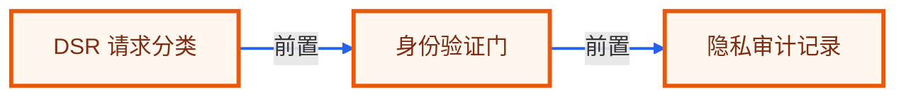

# 毕业项目 · 隐私数据请求 Agent

> 所属阶段：**毕业项目 · 隐私合规实战**
> 预计用时：4-5 小时 | 难度：⭐⭐⭐⭐⭐
> 全局导航：[课程导航](../../docs/navigation.md) · [完整大纲](../../docs/curriculum.md) · [毕业项目总览](../README.md) · [知识图谱](../../docs/knowledge-graph.md)

把用户的数据访问/删除请求、身份验证状态、系统目录和法定时限组织成 DSR 处理队列。

> 离线、零 key 可设计与验证：实现时先用 fixture 和确定性规则跑通端到端闭环。真实接入时，把 fixture 替换成业务系统数据源，把规则模块替换成可配置策略或模型调用，输出契约保持不变。

## 最终交付

- [ ] 一个隐私请求处理工作流，输出请求分类、身份验证缺口、系统清单、导出/删除计划和审计记录。
- [ ] 一组可复现 fixture，覆盖正常、边界和高风险样例。
- [ ] 一个分层 Agent 设计：输入归一、决策、工具/检索、人工确认、报告输出。
- [ ] 一套验收清单，可直接转成 smoke/eval 测试。
- [ ] 一段作品集/简历话术和面试追问准备。

## 适用角色

- 隐私合规团队
- 数据平台
- 客服团队

## 核心流程

```text
导入 DSR 请求
  -> 分类访问/删除/更正
  -> 检查身份验证
  -> 映射系统数据位置
  -> 生成执行计划
  -> 输出审计记录
```

## 数据与接口

| 模块 | 职责 |
|------|------|
| `DsrRequestClassifier` | DsrRequestClassifier 负责本流程中的一个稳定边界，便于替换为真实 API 或数据库实现。 |
| `IdentityVerificationGate` | IdentityVerificationGate 负责本流程中的一个稳定边界，便于替换为真实 API 或数据库实现。 |
| `DataSystemMapper` | DataSystemMapper 负责本流程中的一个稳定边界，便于替换为真实 API 或数据库实现。 |
| `RetentionPolicyChecker` | RetentionPolicyChecker 负责本流程中的一个稳定边界，便于替换为真实 API 或数据库实现。 |
| `AuditTrailBuilder` | AuditTrailBuilder 负责本流程中的一个稳定边界，便于替换为真实 API 或数据库实现。 |

建议 fixture：

- `dsr-requests.json`
- `system-inventory.json`
- `retention-policy.md`
- `identity-checks.json`

最小输出契约：

```ts
type CapstoneResult = {
  status: "ok" | "needs_review" | "blocked";
  summary: string;
  evidence: Array<{ source: string; quote: string; confidence: "low" | "medium" | "high" }>;
  actions: Array<{ owner: string; nextStep: string; due?: string; requiresApproval: boolean }>;
  risks: Array<{ level: "low" | "medium" | "high"; reason: string }>;
};
```

## 护栏与人工确认

- 身份未验证不进入导出/删除
- 不自动删除生产数据
- 保留期限和 legal hold 优先
- 审计日志不可省略

## 里程碑

1. M0 请求分类和身份门
2. M1 系统映射和保留策略
3. M2 执行计划和审计记录

## 验收清单

- [ ] 未验证请求被阻断
- [ ] 删除请求检查 legal hold
- [ ] 访问请求生成系统清单
- [ ] 期限临近报警
- [ ] 审计日志含决策原因
- [ ] PII 最小展示

## 可扩展方向

- 接工单系统
- 接数据目录
- 生成用户回复模板
- 按 GDPR/CCPA 维护 SLA

## 如何写进简历

> 实现隐私数据请求 Agent：分类 DSR 请求，执行身份验证门、系统数据映射、保留策略检查和审计记录生成。

## 面试追问

1. 为什么身份未验证不能继续？
2. 删除请求和 legal hold 冲突怎么办？
3. DSR SLA 如何监控？
4. 审计日志要记录哪些决策？

<!-- KG:START (由 npm run kg 自动生成，勿手改本标记区) -->

## 知识图谱与延伸阅读

> 本节由 `npm run kg` 自动生成（数据源 `knowledge-graph/data/graph.ts`）。要增删请改数据源后重跑。

### 本章概念图谱

> 节点：**橙框**=本章概念，蓝框=关联的其他章概念。连线按关系类型着色：前置(蓝) · 深化(紫) · 对比(玫红) · 应用(绿) · 组成(橙)。



### 延伸阅读

_暂无（可在 `graph.ts` 的 `ARTICLES` 中新增本章关联文章）。_

> 🗺️ 在[全局知识图谱](../../docs/knowledge-graph.md) / [交互式图谱](../../knowledge-graph/output/index.html) 中查看本章位置。

<!-- KG:END -->
