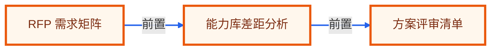

# 毕业项目 · RFP 方案标书 Agent

> 所属阶段：**毕业项目 · 售前方案实战**
> 预计用时：4-6 小时 | 难度：⭐⭐⭐⭐☆
> 全局导航：[课程导航](../../docs/navigation.md) · [完整大纲](../../docs/curriculum.md) · [毕业项目总览](../README.md) · [知识图谱](../../docs/knowledge-graph.md)

把客户 RFP、公司能力库、案例库和合规要求整理成响应矩阵，生成可审查的方案骨架。

> 离线、零 key 可设计与验证：实现时先用 fixture 和确定性规则跑通端到端闭环。真实接入时，把 fixture 替换成业务系统数据源，把规则模块替换成可配置策略或模型调用，输出契约保持不变。

## 最终交付

- [ ] 一个 RFP 响应工作流，输出需求映射、差距清单、方案大纲、风险和评审 checklist。
- [ ] 一组可复现 fixture，覆盖正常、边界和高风险样例。
- [ ] 一个分层 Agent 设计：输入归一、决策、工具/检索、人工确认、报告输出。
- [ ] 一套验收清单，可直接转成 smoke/eval 测试。
- [ ] 一段作品集/简历话术和面试追问准备。

## 适用角色

- 售前架构师
- 销售
- 交付经理

## 核心流程

```text
解析 RFP 要求
  -> 匹配能力库
  -> 标记差距与风险
  -> 生成响应矩阵
  -> 组装方案大纲
  -> 输出评审清单
```

## 数据与接口

| 模块 | 职责 |
|------|------|
| `RfpRequirementParser` | RfpRequirementParser 负责本流程中的一个稳定边界，便于替换为真实 API 或数据库实现。 |
| `CapabilityMatcher` | CapabilityMatcher 负责本流程中的一个稳定边界，便于替换为真实 API 或数据库实现。 |
| `GapAnalyzer` | GapAnalyzer 负责本流程中的一个稳定边界，便于替换为真实 API 或数据库实现。 |
| `ResponseMatrixBuilder` | ResponseMatrixBuilder 负责本流程中的一个稳定边界，便于替换为真实 API 或数据库实现。 |
| `ProposalAssembler` | ProposalAssembler 负责本流程中的一个稳定边界，便于替换为真实 API 或数据库实现。 |

建议 fixture：

- `rfp.md`
- `capability-library.json`
- `case-studies.json`
- `compliance-requirements.json`

最小输出契约：

```ts
type CapstoneResult = {
  status: "ok" | "needs_review" | "blocked";
  summary: string;
  evidence: Array<{ source: string; quote: string; confidence: "low" | "medium" | "high" }>;
  actions: Array<{ owner: string; nextStep: string; due?: string; requiresApproval: boolean }>;
  risks: Array<{ level: "low" | "medium" | "high"; reason: string }>;
};
```

## 护栏与人工确认

- 不能承诺能力库不存在的功能
- 高风险差距必须显式披露
- 引用案例必须可追溯
- 报价和法律承诺不自动生成

## 里程碑

1. M0 RFP 要求结构化
2. M1 能力匹配和差距分析
3. M2 响应矩阵和方案大纲

## 验收清单

- [ ] 强制要求被全部抽取
- [ ] 未知能力进入差距清单
- [ ] 案例引用包含来源
- [ ] 风险项不被隐藏
- [ ] 响应矩阵覆盖率可计算
- [ ] 空能力库失败

## 可扩展方向

- 接 CRM opportunity
- 生成演示脚本
- 接审批流
- 按行业模板调整方案结构

## 如何写进简历

> 实现 RFP 方案标书 Agent：解析客户 RFP，匹配能力库和案例库，生成响应矩阵、差距风险、方案大纲和评审清单。

## 面试追问

1. RFP Agent 如何避免夸大承诺？
2. 能力库缺口如何呈现给销售？
3. 响应矩阵为什么比直接写方案重要？
4. 如何做行业模板复用？

<!-- KG:START (由 npm run kg 自动生成，勿手改本标记区) -->

## 知识图谱与延伸阅读

> 本节由 `npm run kg` 自动生成（数据源 `knowledge-graph/data/graph.ts`）。要增删请改数据源后重跑。

### 本章概念图谱

> 节点：**橙框**=本章概念，蓝框=关联的其他章概念。连线按关系类型着色：前置(蓝) · 深化(紫) · 对比(玫红) · 应用(绿) · 组成(橙)。



### 延伸阅读

_暂无（可在 `graph.ts` 的 `ARTICLES` 中新增本章关联文章）。_

> 🗺️ 在[全局知识图谱](../../docs/knowledge-graph.md) / [交互式图谱](../../knowledge-graph/output/index.html) 中查看本章位置。

<!-- KG:END -->
