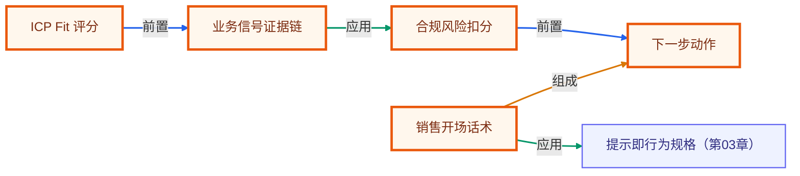

# 毕业项目 · 销售线索研究 Agent（Sales Lead Researcher）

> 所属阶段：**毕业项目 · 综合实战**
> 预计用时：2–3 小时 | 难度：⭐⭐⭐☆☆
> 全局导航：[课程导航](../../docs/navigation.md) · [完整大纲](../../docs/curriculum.md) · [知识图谱](../../docs/knowledge-graph.md)

把公开线索、招聘信号、技术栈、痛点和合规风险整理成一份销售可执行的 account brief：谁优先跟、为什么跟、怎么开场、下一步做什么。它适合展示 Agent 在增长、销售和 B2B 业务里的实用价值。

> 完全离线、零 key 可跑：ICP 评分和话术生成用确定性规则。真实接入时，把 `LeadAccount` 换成网页抓取/CRM/新闻源，把评分公式替换成可配置模型即可。

## 学习目标

- [ ] 从多种业务信号里计算 fit、urgency、risk。
- [ ] 把 lead 分成 priority / nurture / disqualify。
- [ ] 生成面向销售的 talk track 与 next action。
- [ ] 在外呼材料里脱敏私人联系方式，保留合规边界。

## 核心流程

```text
公开资料 + CRM 线索
  -> ICP fit
  -> urgency 信号
  -> compliance risk
  -> qualification
  -> talk track + next action
  -> 联系信息脱敏
```

## 运行

```bash
pnpm sales-lead-researcher
pnpm sales-lead-researcher:smoke
```

## 可扩展方向

- 接网页搜索和公司官网抓取，自动抽取招聘/预算/痛点信号。
- 与 CRM 同步，把 priority lead 写回 HubSpot/Salesforce。
- 对 outbound 话术加品牌合规与禁用词检查。
- 加入竞品安装信号，生成差异化切入点。

## 如何写进简历

> **销售线索研究 Agent（TypeScript）**：实现 B2B account research 流程，按行业 fit、业务痛点、招聘/预算信号与合规风险给线索评分，输出优先级、证据链、销售开场话术和 next action，并对私人联系方式做脱敏。

> 面试会问：为什么销售 Agent 不能只看“公司规模”？合规风险为什么是扣分项？如何避免外呼话术泄漏私人联系方式？

<!-- KG:START (由 npm run kg 自动生成，勿手改本标记区) -->

## 知识图谱与延伸阅读

> 本节由 `npm run kg` 自动生成（数据源 `knowledge-graph/data/graph.ts`）。要增删请改数据源后重跑。

### 本章概念图谱

> 节点：**橙框**=本章概念，蓝框=关联的其他章概念。连线按关系类型着色：前置(蓝) · 深化(紫) · 对比(玫红) · 应用(绿) · 组成(橙)。



### 与其他章节的关系

- `销售开场话术` —**应用**→ `提示即行为规格`（第 03 章）

### 延伸阅读

- [Lead scoring](https://en.wikipedia.org/wiki/Lead_scoring) — Lead scoring 概念入口，对应 fit、行为信号、风险和销售优先级的结构化评分 `doc`

> 🗺️ 在[全局知识图谱](../../docs/knowledge-graph.md) / [交互式图谱](../../knowledge-graph/output/index.html) 中查看本章位置。

<!-- KG:END -->
