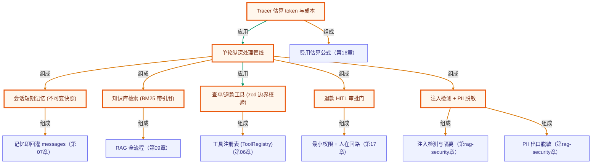

# 毕业项目 · 客服 Copilot（智能客服助手）

> 所属阶段：**毕业项目 · 综合实战**
> 预计用时：3–4 小时 | 难度：⭐⭐⭐⭐☆
> 全局导航：[课程导航](../../docs/navigation.md) · [完整大纲](../../docs/curriculum.md) · [知识图谱](../../docs/knowledge-graph.md)

把课程里「记忆 / RAG / 工具 / 人在回路 / 安全护栏 / 可观测」这些零散能力，组装成一个**面向真实业务**的客服 Agent：用户来一句话，它会**先过安全门，再记住上下文，路由到对应技能（答疑 / 查单 / 退款），敏感操作走人工审批，出口脱敏，全程记成本**。

和「深度研究助手」互补——那个项目展示 *Plan-and-Execute 的研究型 agent*，这个项目展示**生产客服系统最关心的纵深防御与合规**：一条用户消息要安全地穿过七道关卡才变成回复。

> 🔌 **完全离线、零 key 可跑**：把「LLM 决策」替换成确定性规则策略，任何人 clone 下来都能跑出同样的对话轨迹（`needsKey: "none"`）。真实接入时只换 `routeIntent` 与 `approvalDecision` 的实现，编排骨架一行不动。

---

## 学习目标

做完本项目你能够：

- [ ] 把单点能力组装成一条**单轮纵深处理管线**（安全→记忆→路由→技能→审批→脱敏→可观测）。
- [ ] 用**不可变快照**实现跨轮次的短期记忆，避免隐藏副作用。
- [ ] 用 **RAG（离线 BM25）**给答疑一个可溯源的知识库，并带 `[n]` 引用。
- [ ] 用 **zod 工具系统**把「不可信输入」挡在系统边界外。
- [ ] 给敏感操作（退款）加 **HITL 人工审批门**，把不可逆动作交给人确认。
- [ ] 做**入口注入检测 + 出口 PII 脱敏**的纵深防御。
- [ ] 给每轮加**可观测**：统计工具调用、估算 token 与成本。

## 前置知识

- [第 06 章 · 构建工具系统](../../lessons/06-building-a-tool-system/README.md)
- [第 07 章 · 短期记忆与上下文](../../lessons/07-short-term-memory/README.md)
- [第 09 章 · 从零实现 RAG](../../lessons/09-rag-from-scratch/README.md)
- [第 16 章 · 可观测性与成本](../../lessons/16-observability-and-cost/README.md)
- [第 17 章 · 安全与护栏](../../lessons/17-safety-and-guardrails/README.md)
- [进阶 RAG · 09 RAG 安全护栏](../../rag-advanced/09-rag-security/README.md)
- [进阶 LangGraph · 04 Human-in-the-Loop](../../langgraph-advanced/04-human-in-the-loop/README.md)

---

## 一、原理：一条用户消息要穿过七道关卡

普通聊天机器人是「收到消息 → 丢给模型 → 返回」。生产客服系统不敢这么做——它必须**纵深防御**：每一步都可能拦下危险、补全上下文、或要求人工介入。我们把单轮处理建成一条**确定顺序的管线**：

```
        用户消息
           │
           ▼
   ① 安全入口  detectInjection ── 命中越权指令 → 直接拦截，不进入后续动作
           │ 通过
           ▼
   ② 记忆     从会话快照补全订单号（多轮不必重复给）
           │
           ▼
   ③ 路由     routeIntent → faq / order_status / refund / smalltalk
           │
     ┌─────┼───────────────┬────────────────┐
     ▼     ▼               ▼                ▼
  smalltalk  ④ FAQ        ④ 查单           ④ 退款
            知识库检索      lookupOrder      lookupOrder
            (BM25 带引用)   工具             + ⑤ HITL 审批门
                                            （大额/敏感 → 人工放行）
     └─────┴───────────────┴────────────────┘
           │
           ▼
   ⑥ 安全出口  redactPii ── 脱敏邮箱/手机/身份证/银行卡
           │
           ▼
   ⑦ 可观测   Tracer 累加工具调用 / 估算 token 与成本
           │
           ▼
         回复
```

### 为什么顺序就是纵深防御？

每道关卡都假设「上一步可能漏」。**安全门放在最前**——哪怕用户消息里藏了「忽略以上指令」，也在进入任何工具调用前就被拦下，避免注入劫持退款动作。**脱敏放在最后**——无论答案来自知识库还是订单系统，都在落地（返回 / 日志）前统一过滤，不寄望中间环节「自觉」不复述 PII。

### 为什么把 LLM 决策换成规则？

毕业项目要**离线可回归**：`routeIntent`（意图分类）与 `approvalDecision`（风控）写成确定性纯函数，演示即测试。真实项目里——

- `routeIntent` → 换成一次「LLM 结构化输出」：让模型在固定枚举里选 intent + 抽 orderId；
- `approvalDecision` → 换成你的风控规则引擎或模型；

**copilot 编排（七道关卡的顺序）一行不用改**。这正是「接口不变、实现可换」。

### 综合体现的能力一览（≥7 项）

| 能力 | 落点 |
|------|------|
| 短期记忆 | `src/session.ts` 的 `Session` + `advanceSession`（不可变快照，跨轮记订单号） |
| 工具系统 | `src/session.ts` 的 `lookupOrder` / `issueRefund`（shared `defineTool`，zod 边界校验） |
| RAG | `src/knowledgeBase.ts`，FAQ 装入 BM25，带 `[n]` 引用作答，检索为空则拒答 |
| 人在回路 | `src/copilot.ts` 的退款审批门 + `src/policy.ts` 的 `approvalDecision` |
| 安全护栏 | `src/copilot.ts` 入口 `detectInjection` + 出口 `redactPii`（复用 shared `rag/security`） |
| 可观测 | `src/copilot.ts` 的 `Tracer`（工具调用计数 + `approxTokens` 估算成本） |
| 路由编排 | `src/policy.ts` 的 `routeIntent` + `copilot.ts` 的单轮管线 |

---

## 二、代码走读

完整代码见 [`src/`](./src/)。

### 1) 记忆：不可变快照，杜绝跨轮副作用

```ts
// src/session.ts
export interface Session {
  readonly turn: number;
  readonly orderId?: string;            // 记住的订单号，后续轮次不必重复给
  readonly approvals: readonly string[]; // 已审批通过的敏感动作签名
}

export function advanceSession(prev: Session, patch: Partial<Omit<Session, "turn">>): Session {
  return { ...prev, ...patch, turn: prev.turn + 1 };  // 永远返回新快照，不就地改写
}
```

每轮都产出**新的 session**，旧快照不变。好处：这一轮「记住了什么」可被快照比对、可回放，调试时不会被隐藏的就地修改坑到。

### 2) 工具：把不可信输入挡在边界外

```ts
// src/session.ts —— 退款工具只产出「待执行意图」，不直接落库
export function makeIssueRefundTool(ctx: ToolContext): Tool {
  return defineTool({
    name: "issueRefund",
    description: "对指定订单发起退款（敏感操作，可能需要人工审批）。",
    schema: z.object({ orderId: z.string().min(1), amountCents: z.number().int().positive() }),
    execute: ({ orderId, amountCents }) => {
      ctx.onCall("issueRefund");
      const order = ctx.orders[orderId];
      if (!order) return { ok: false as const, note: `未找到订单 ${orderId}` };
      if (amountCents > order.amountCents) return { ok: false as const, note: "退款金额超过订单实付" };
      return { ok: true as const, orderId, amountCents, note: "退款意图已生成，待审批" };
    },
  });
}
```

关键设计：**退款工具自己不放行钱**，它只生成意图。是否真退由 copilot 的审批门决定——把「能力」和「授权」分开。

### 3) HITL 审批门：敏感动作交给人确认

```ts
// src/copilot.ts —— 退款分支
const decision = approvalDecision(order.amountCents, order.noFreeReturn, this.policy);
const signature = `refund:${orderId}`;

if (decision.kind === "needs-human" && !this.session.approvals.includes(signature)) {
  return { /* 挂起 */ reply: "已提交人工审批，请稍候。",
           pendingApproval: { signature, orderId, amountCents: order.amountCents, reason: decision.reason } };
}
// 自动放行，或人工已审批 → 才真正执行退款工具
```

挂起后由 `copilot.approve(signature)`（模拟人工点「通过」）把签名记入会话，下一次同名动作才放行。**风控两档**：不支持类目直接拒绝，大额超阈值走人工。

### 4) 安全：入口检注入，出口脱敏

```ts
// src/copilot.ts —— handle() 首尾
const injection = detectInjection(userText);          // ① 入口：注入即拦截
if (injection.suspicious) return { reply: "已被安全策略拦截", intent: "blocked", ... };
// ... 业务处理 ...
const safeReply = redactPii(result.reply).redacted;   // ⑥ 出口：统一脱敏
```

二者都复用进阶 RAG 安全章的纯函数（[`rag/security`](../../src/shared/rag/security.ts)）——**确定性规则是模型对齐之前最便宜的第一道防线**。

### 5) 可观测：每轮估算成本

```ts
// src/copilot.ts
export class Tracer {
  onToolCall(name: string) { this.toolCalls++; this.toolBreakdown[name] = (this.toolBreakdown[name] ?? 0) + 1; }
  account(ctx: string, reply: string) { this.inputTokens += approxTokens(ctx); this.outputTokens += approxTokens(reply); }
  costUsd() { return this.inputTokens/1e6*0.5 + this.outputTokens/1e6*1.5; }  // 价格表估算
}
```

---

## 三、运行

> 全程离线、零 key。

```bash
# 跑固定演示剧本（7 轮，覆盖全部分支）
pnpm support-copilot
npx tsx capstone/support-copilot/src/cli.ts

# 跑冒烟断言（可作 CI gate，失败非零退出）
pnpm support-copilot:smoke
```

演示剧本覆盖：闲聊 → FAQ 带引用 → 查单+记住订单号 → 定制类目退款被拒（多轮记忆复用订单号）→ 小额退款自动放行 → 大额退款 HITL 人工审批 → 注入拦截。结尾打印工具调用次数与估算成本。

---

## 四、如何换成真实业务（接口不变，只换实现）

| 离线占位 | 换成真实 |
|----------|----------|
| `routeIntent` 关键词规则 | 一次 LLM 结构化输出：在固定枚举里选 intent + 抽 orderId（zod 校验） |
| `approvalDecision` 阈值 | 接公司风控规则引擎 / 模型；金额、用户等级、历史多因子 |
| `KnowledgeBase`（BM25） | 换向量 / 混合检索（接口 `retrieve(query, k)` 不变） |
| `ORDER_DB` 内置假数据 | 真实订单服务（`lookupOrder` 的 `execute` 改成 HTTP 调用） |
| `copilot.approve()` | 接工单系统 / 审批后台，人工点通过后回调 |

编排管线（七道关卡的顺序与契约）始终不变。

---

## 五、可扩展方向

- **会话摘要压缩**：轮次变长后，把旧历史用 LLM 压成摘要（接第 07 章滚动摘要）。
- **引用可核验**：校验答案里的 `[n]` 是否真落在检索来源范围内（接 RAG 安全章 citation 核验）。
- **多技能扩展**：加「改地址 / 催发货 / 投诉升级」技能，路由表与工具表同步扩。
- **审批异步化**：`pendingApproval` 落库 + 通知人工，审批结果异步回调而非同轮等待。
- **可观测上报**：把 Tracer 的 span 上报 LangSmith / OpenTelemetry 做线上监控。
- **A/B 风控阈值**：把 `humanApprovalAboveCents` 做成可配置，灰度不同阈值看转化/风险。

---

## 六、练习

1. **加技能**：实现「修改收货地址」意图，新增 `updateAddress` 工具，并把它纳入路由表与脱敏出口。
2. **强化路由**：把 `routeIntent` 换成调用 `getLLM()` 的结构化输出版本（保留规则版做离线 fallback），对比两者在模糊问法上的表现。
3. **审批策略**：给 `approvalDecision` 增加「同一用户当日退款累计超 N 元也需人工」的规则，并补 smoke 断言。
4. **注入对抗**：构造 3 条绕过当前规则的注入话术，扩充 `detectInjection` 规则或加二次模型判别。
5. **成本对照**：把演示剧本扩到 20 轮，观察 token/成本增长，再接入会话摘要压缩看降幅。

---

## 七、小结与延伸

- 生产客服 Agent 的核心不是「更聪明的回答」，而是**纵深防御**：安全 → 记忆 → 路由 → 技能 → 审批 → 脱敏 → 可观测，七道关卡缺一不可。
- 把「能力」（工具）与「授权」（审批门）分开，敏感不可逆动作永远交给人确认。
- 规则与模型可互换：离线规则保证可回归，上线时替换为 LLM 决策，编排骨架不变。

### 如何写进简历

> **智能客服 Copilot（TypeScript）**
> - 设计并实现一条**单轮纵深处理管线**，把记忆 / RAG / 工具 / 人在回路 / 安全护栏 / 可观测六类能力按「安全入口 → 上下文记忆 → 意图路由 → 技能执行 → HITL 审批 → PII 脱敏 → 成本追踪」串成确定流程。
> - 用**不可变会话快照**实现多轮短期记忆；用 **zod 工具系统**把不可信输入挡在边界外；退款等敏感动作引入 **HITL 审批门**，把「能力」与「授权」解耦。
> - 做**入口提示注入检测 + 出口 PII 正则脱敏**的纵深防御；用装饰式 **Tracer** 统计工具调用并按价格表估算每轮成本。
> - 关键决策点（意图路由、风控）用「接口不变、实现可换」设计：离线规则保证可回归测试，上线替换为 LLM/风控引擎，编排骨架零改动。

> 💡 **面试会问**：为什么安全门要放在管线最前、脱敏放最后？HITL 审批门如何防止注入劫持退款？为什么用不可变快照做记忆？这套规则策略上线时怎么平滑换成 LLM？

<!-- KG:START (由 npm run kg 自动生成，勿手改本标记区) -->

## 知识图谱与延伸阅读

> 本节由 `npm run kg` 自动生成（数据源 `knowledge-graph/data/graph.ts`）。要增删请改数据源后重跑。

### 本章概念图谱

> 节点：**橙框**=本章概念，蓝框=关联的其他章概念。连线按关系类型着色：前置(蓝) · 深化(紫) · 对比(玫红) · 应用(绿) · 组成(橙)。



### 与其他章节的关系

- `会话短期记忆 (不可变快照)` —**组成**→ `记忆即回灌 messages`（第 07 章）
- `知识库检索 (BM25 带引用)` —**组成**→ `RAG 全流程`（第 09 章）
- `查单/退款工具 (zod 边界校验)` —**组成**→ `工具注册表 (ToolRegistry)`（第 06 章）
- `退款 HITL 审批门` —**组成**→ `最小权限 + 人在回路`（第 17 章）
- `注入检测 + PII 脱敏` —**组成**→ `注入检测与隔离`（第 rag-security 章）
- `注入检测 + PII 脱敏` —**组成**→ `PII 出口脱敏`（第 rag-security 章）
- `Tracer 估算 token 与成本` —**组成**→ `费用估算公式`（第 16 章）

### 延伸阅读

- [Building effective agents](https://www.anthropic.com/engineering/building-effective-agents) — Anthropic 官方工程博客，系统讲解 Agent 的循环、工具与何时该用 Agent，与本章心智模型高度对应 `doc`

> 🗺️ 在[全局知识图谱](../../docs/knowledge-graph.md) / [交互式图谱](../../knowledge-graph/output/index.html) 中查看本章位置。

<!-- KG:END -->
