# AI 创意 Agent 平台产品文档 PRD

**项目代号：AICrew Studio**  
**文档版本：v1.0**  
**文档类型：产品需求文档 / Product Requirement Document**  
**文档用途：基于 RoboNeo 类产品的核心产品思维，抽象并重构为一个可独立开发的新 AI 创意 Agent 项目**  
**目标形态：Web + 移动端 + API + Agent 工作流平台**  
**核心方向：AI 多 Agent 内容生产平台，面向电商广告、社媒增长、短剧/剧情视频、品牌视觉资产生产**

---

## 目录

- [0. 文档说明](#0-文档说明)
- [1. 产品核心思维提炼](#1-产品核心思维提炼)
- [2. 新项目定义](#2-新项目定义)
- [3. 市场与用户场景](#3-市场与用户场景)
- [4. 产品战略](#4-产品战略)
- [5. 产品信息架构](#5-产品信息架构)
- [6. 核心产品闭环](#6-核心产品闭环)
- [7. Agent Team 设计](#7-agent-team-设计)
- [8. Skill 系统设计](#8-skill-系统设计)
- [9. Brand Memory / 品牌记忆系统](#9-brand-memory--品牌记忆系统)
- [10. 核心功能 PRD](#10-核心功能-prd)
- [11. 关键业务流程](#11-关键业务流程)
- [12. 页面与交互设计](#12-页面与交互设计)
- [13. 数据模型设计](#13-数据模型设计)
- [14. 技术架构](#14-技术架构)
- [15. API 设计](#15-api-设计)
- [16. 生成任务状态机](#16-生成任务状态机)
- [17. 积分与计费系统](#17-积分与计费系统)
- [18. 内容编辑器设计](#18-内容编辑器设计)
- [19. 输出与导出](#19-输出与导出)
- [20. 内容安全与合规](#20-内容安全与合规)
- [21. 运营后台](#21-运营后台)
- [22. MVP 版本范围](#22-mvp-版本范围)
- [23. 开发路线图](#23-开发路线图)
- [24. 研发任务拆解](#24-研发任务拆解)
- [25. 核心 Prompt 模板](#25-核心-prompt-模板)
- [26. 质量指标体系](#26-质量指标体系)
- [27. 商业模式](#27-商业模式)
- [28. 增长策略](#28-增长策略)
- [29. 竞争壁垒设计](#29-竞争壁垒设计)
- [30. 风险与应对](#30-风险与应对)
- [31. 验收标准](#31-验收标准)
- [32. 团队配置建议](#32-团队配置建议)
- [33. 项目文件结构建议](#33-项目文件结构建议)
- [34. MVP 示例用户故事](#34-mvp-示例用户故事)
- [35. 关键算法与逻辑](#35-关键算法与逻辑)
- [36. Landing Page 文案结构](#36-landing-page-文案结构)
- [37. 首批 Skill 详细设计](#37-首批-skill-详细设计)
- [38. 用户权限体系](#38-用户权限体系)
- [39. 通知系统](#39-通知系统)
- [40. 国际化设计](#40-国际化设计)
- [41. 埋点设计](#41-埋点设计)
- [42. 开发优先级 Backlog](#42-开发优先级-backlog)
- [43. 最小可运行 Demo 方案](#43-最小可运行-demo-方案)
- [44. 核心判断](#44-核心判断这个项目应该怎么做才不会变成普通-ai-工具)
- [45. 最终产品蓝图](#45-最终产品蓝图)
- [46. 结论](#46-结论)
- [47. 公开参考来源](#47-公开参考来源)

---

# 0. 文档说明

本文不是对 RoboNeo 的功能照搬，而是将 RoboNeo 已公开产品形态背后的**核心产品思维**拆解出来，转化为一个可以直接进入立项、设计、研发、测试和商业化验证的新项目文档。

公开信息显示，RoboNeo 的关键特征包括：自然语言交互、多 Agent Teams、Scriptwriter / Designer / Director / Operator 等专业角色协作、端到端内容生产、短剧、社媒内容、电商视频、图像编辑、视频生成、品牌设计、产品摄影、音频处理等能力。其官网也把能力分为 AI Agent、AI Video Tools、AI Image Tools、AI Audio Tools，并强调面向 TikTok、Instagram、YouTube 等平台的可规模化社媒内容生产。

RoboNeo 类产品的真正价值，不是“能生成图片或视频”，而是把用户的商业目标、素材、品牌信息、平台规则、创意策略、脚本、视觉、视频、音频、文案、导出与复用整合成一个可持续生产内容的系统。

因此，本文档提出的新项目不是一个普通的 AI 生成器，而是一个：

> **AI Creative Operating System for Commerce, Social Media, and Video Storytelling.**

中文可理解为：

> **面向电商、社媒和视频叙事的 AI 创意生产操作系统。**

---

# 1. 产品核心思维提炼

## 1.1 RoboNeo 类产品的底层判断

AI 创意工具的竞争已经从“单点生成能力”进入“生产结果交付能力”。

早期 AI 工具解决的是：

> 用户输入 prompt → 模型生成图片/视频/文案 → 用户自行筛选和后期处理

RoboNeo 类产品的思路是：

> 用户输入商业目标 → AI 理解任务 → 多 Agent 拆解工作流 → 调用不同模型和工具 → 生成成套资产 → 形成可复用创作经验 → 持续优化下一次产出

因此，新项目不能只做“生图工具”“生视频工具”“AI 修图工具”，而应该做：

> **AI 内容生产操作系统**

---

## 1.2 核心产品公式

```text
用户目标
+ 原始素材
+ 品牌资产
+ 平台规则
+ 创作模板
+ 多 Agent 分工
+ 多模型路由
+ 生成与编辑工具
+ 版本管理
+ 数据反馈
= 可发布、可复用、可迭代的商业内容资产
```

---

## 1.3 产品本质图

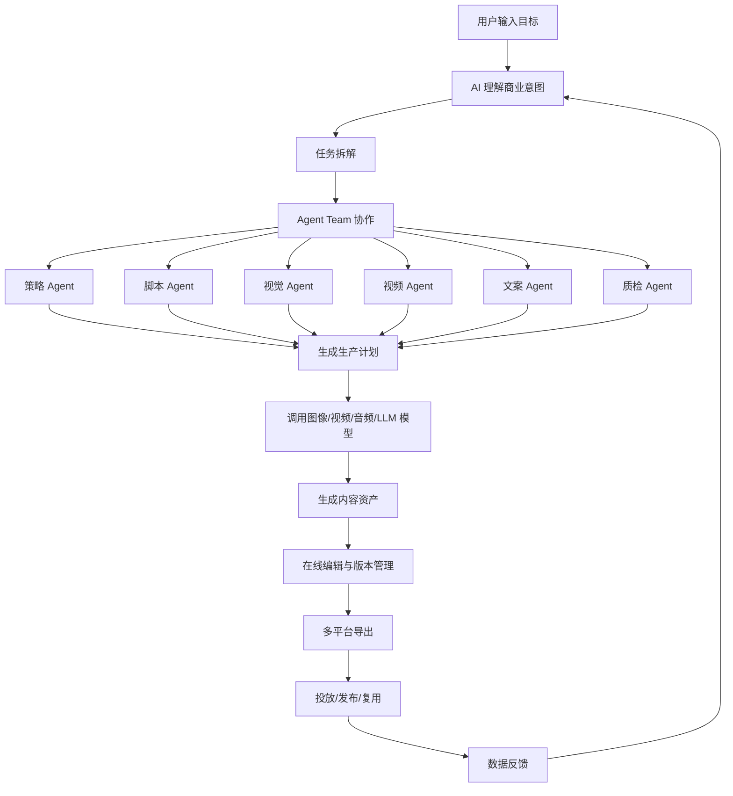

---

## 1.4 产品思维拆解表

| 层级 | 表面功能 | 深层产品思维 | 新项目应继承的能力 |
|---|---|---|---|
| 输入层 | 聊天生成内容 | 自然语言成为创意操作系统入口 | 对话式 Brief 收集器 |
| 协作层 | Agent Teams | 用 AI 模拟真实创意团队 | 多 Agent 编排系统 |
| 复用层 | Skills | 将成功流程模板化 | 工作流模板 / Skill Marketplace |
| 记忆层 | 品牌资产记忆 | 用户不用重复描述风格和偏好 | Brand Kit + Memory |
| 生产层 | 图像/视频/音频工具 | 聚合模型，交付最终资产 | 模型路由 + 工具链 |
| 商业层 | 电商/社媒/短剧 | 解决高频商业内容生产 | 垂直场景包 |
| 增长层 | 生成爆款内容 | 不是做素材，而是做增长结果 | 数据反馈 + 内容评分 |
| 变现层 | 订阅 + 积分 | AI 生成成本货币化 | Credit Engine + SaaS 订阅 |

---

## 1.5 新项目必须抓住的 7 个关键词

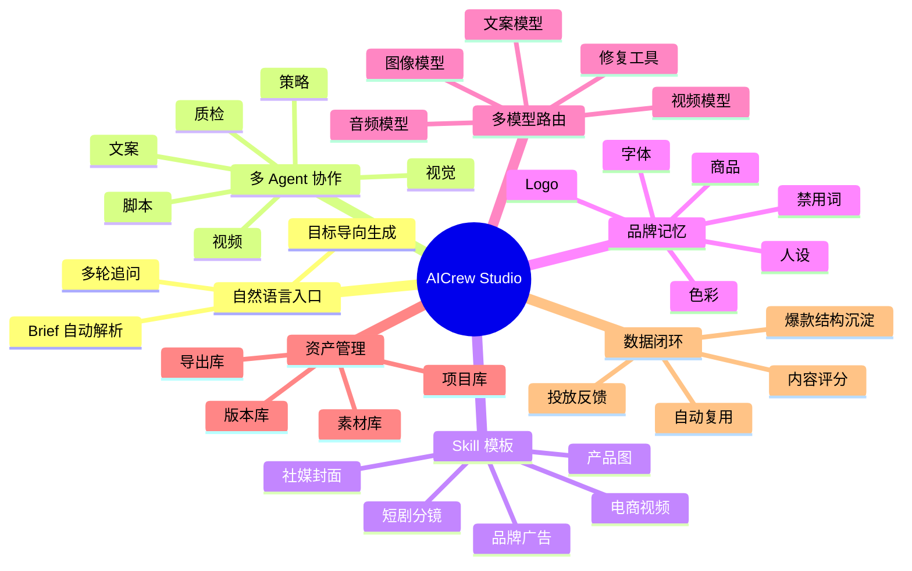

---

# 2. 新项目定义

## 2.1 项目名称

**AICrew Studio**

可替代命名：

| 方向 | 名称 |
|---|---|
| 国际化 | AICrew Studio |
| 偏电商 | SellFlow AI |
| 偏短视频 | ViralCrew AI |
| 偏品牌营销 | BrandCrew AI |
| 偏中文市场 | 灵创工场 / 智作工场 / 内容舰队 |
| 偏 Agent 概念 | CrewOS / AgentStudio / ContentOps AI |

本文统一使用 **AICrew Studio**。

---

## 2.2 产品一句话定位

**AICrew Studio 是一个面向电商、社媒和短视频团队的 AI 多 Agent 内容生产平台，用户只需输入目标和素材，系统即可自动完成策略、脚本、视觉、视频、文案、封面、导出与复用。**

---

## 2.3 产品愿景

让一个人也能拥有一支完整的 AI 创意制作团队。

---

## 2.4 产品使命

降低商业内容生产门槛，让中小商家、独立创作者、内容团队和营销人员以更低成本、更快速度、更稳定质量生产可发布、可投放、可复用的图文视频资产。

---

## 2.5 产品边界

### 2.5.1 我们做什么

1. 做内容生产的完整工作流。
2. 做从 Brief 到成片/成套素材的端到端系统。
3. 做多 Agent 协作，而不是单个聊天机器人。
4. 做电商、社媒、短剧、品牌广告等高频内容场景。
5. 做品牌记忆、素材复用、版本管理和输出规范。
6. 做 AI 生成内容的成本控制、队列管理和多模型路由。
7. 做面向商业化的积分与订阅体系。

### 2.5.2 我们不做什么

1. 不做纯模型公司。
2. 不做 Photoshop / Premiere 的完整替代品。
3. 不做开放式无限制 AI 生成社区。
4. 不做只靠 prompt 玩具化生成的小工具。
5. 不在 MVP 阶段做全平台自动发布和复杂广告投放管理。
6. 不在 MVP 阶段做大型企业 DAM / MRM 系统。

---

# 3. 市场与用户场景

## 3.1 目标用户

| 用户类型 | 典型身份 | 高频需求 | 核心痛点 | 付费意愿 |
|---|---|---|---|---|
| 跨境电商卖家 | Shopify / Amazon / TikTok Shop 卖家 | 商品图、广告视频、Listing 图、短视频 | 素材生产慢、成本高、不会剪辑 | 高 |
| 内容运营 | TikTok / Reels / Shorts 运营 | 日更视频、封面、标题、热点改编 | 内容产能不足、爆款不可复用 | 高 |
| 独立创作者 | 博主、知识博主、剧情号 | 脚本、封面、短视频、角色形象 | 一个人做不完全流程 | 中高 |
| 小型广告团队 | Agency、投放团队 | 多版本广告素材、A/B 测试 | 设计和剪辑产能瓶颈 | 高 |
| 品牌方 | 中小消费品牌 | 品牌图文、活动海报、广告短片 | 缺少稳定视觉一致性 | 中高 |
| 短剧团队 | 微短剧、剧情号团队 | 剧本、分镜、角色图、视频片段 | 前期制作成本高 | 中高 |

---

## 3.2 用户核心任务 JTBD

```text
当我需要持续生产商业内容时，
我希望只输入产品、目标平台、受众和风格，
系统就能像一个创意团队一样，
帮我自动完成策划、脚本、视觉、视频、文案、封面和导出，
这样我就可以用更少的人、更少的钱、更短时间发布更多可测试的内容。
```

---

## 3.3 核心使用场景

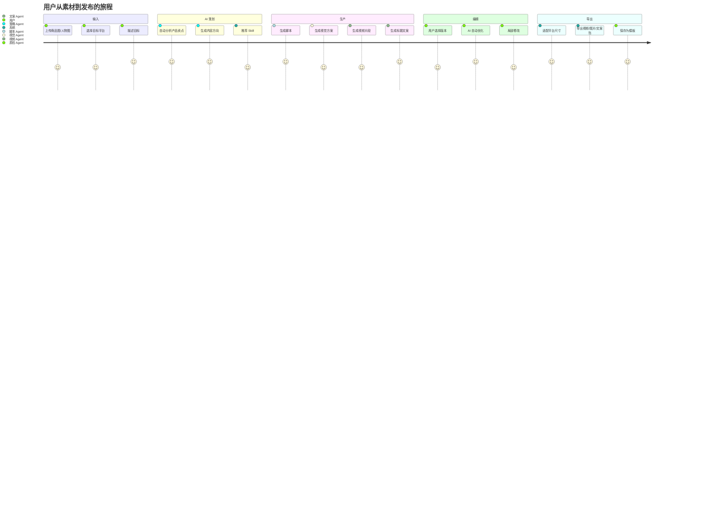

---

# 4. 产品战略

## 4.1 MVP 切入点

MVP 不建议一开始做“所有内容创作”，而应切入最有付费意愿、最容易标准化、最需要批量生产的场景：

> **电商商品短视频 + 社媒广告素材生成**

原因：

1. 电商卖家有明确商业结果。
2. 商品素材结构化程度高。
3. 视频广告模板可复用。
4. 用户愿意为节省拍摄、设计、剪辑成本付费。
5. 容易做生成成本计费。
6. 容易形成案例和裂变传播。
7. 后续可扩展到社媒内容、短剧、品牌广告。

---

## 4.2 阶段性定位

| 阶段 | 产品定位 | 核心能力 | 商业目标 |
|---|---|---|---|
| MVP | AI 电商广告视频生成器 | 商品图 → 多版本广告视频 | 验证付费 |
| V1 | AI 内容生产工作台 | Agent Team + 素材库 + 视频/图文生成 | 提升留存 |
| V2 | AI 创意团队平台 | Skill Marketplace + 品牌记忆 + 团队协作 | 扩大 ARPU |
| V3 | 内容增长操作系统 | 数据反馈 + 爆款复用 + 发布集成 | 建立壁垒 |
| V4 | 开放 Agent 生态 | 第三方 Skill / 模型 / 插件 | 平台化 |

---

## 4.3 产品差异化

| 传统 AI 工具 | AICrew Studio |
|---|---|
| 只生成单张图或单条视频 | 生成完整内容包 |
| 用户自己写 prompt | 系统主动提问并生成 Brief |
| 每次从零开始 | 记住品牌、商品、风格、历史素材 |
| 手动选择模型 | 系统自动路由模型 |
| 没有项目管理 | 有项目、版本、资产、导出记录 |
| 没有商业场景 | 围绕电商、社媒、短剧等场景 |
| 只给结果 | 给策略、脚本、分镜、成品和复用模板 |

---

# 5. 产品信息架构

## 5.1 总体信息架构

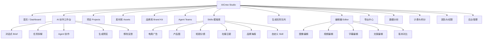

---

## 5.2 核心模块清单

| 模块 | 说明 | MVP | V1 | V2 |
|---|---|---:|---:|---:|
| 用户系统 | 注册、登录、个人信息 | ✅ | ✅ | ✅ |
| Onboarding | 采集用户行业、目标、品牌信息 | ✅ | ✅ | ✅ |
| 对话式工作台 | 通过自然语言创建任务 | ✅ | ✅ | ✅ |
| Agent Team | 多 Agent 分工协作 | 半自动 | ✅ | ✅ |
| Skill 模板 | 可复用内容生产流程 | ✅ | ✅ | ✅ |
| 素材库 | 图片、视频、Logo、字体、商品 | ✅ | ✅ | ✅ |
| 品牌库 | 品牌色、字体、语气、禁用规则 | 基础 | ✅ | ✅ |
| 图像生成 | 商品图、背景、海报、封面 | ✅ | ✅ | ✅ |
| 视频生成 | 图生视频、脚本文生视频、广告短片 | ✅ | ✅ | ✅ |
| 音频生成 | BGM、配音、降噪 | ❌ | ✅ | ✅ |
| 在线编辑器 | 简单裁剪、换文案、换背景、重生成 | ✅ | ✅ | ✅ |
| 版本管理 | 生成历史、对比、回滚 | ✅ | ✅ | ✅ |
| 导出中心 | 多尺寸、多格式导出 | ✅ | ✅ | ✅ |
| 团队协作 | 多成员、评论、权限 | ❌ | 基础 | ✅ |
| 数据反馈 | 内容评分、发布效果、A/B 测试 | ❌ | 基础 | ✅ |
| 订阅积分 | 会员、积分包、消耗明细 | ✅ | ✅ | ✅ |
| 后台管理 | 用户、任务、成本、模型监控 | ✅ | ✅ | ✅ |
| API 开放 | 企业 API、Webhook | ❌ | ❌ | ✅ |

---

# 6. 核心产品闭环

## 6.1 创作闭环

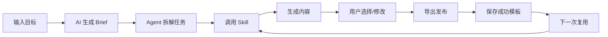

---

## 6.2 资产闭环

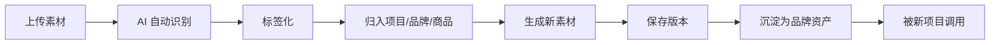

---

## 6.3 数据闭环

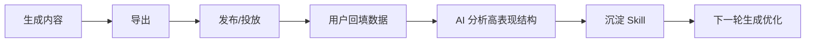

---

# 7. Agent Team 设计

## 7.1 Agent Team 核心设计原则

1. **Agent 不是聊天角色，而是任务执行单元。**
2. **每个 Agent 必须有输入、输出、工具、评价标准。**
3. **Agent 之间通过结构化数据交接，而不是通过自然语言自由聊天。**
4. **最终必须由 Orchestrator 统一调度。**
5. **用户只看到简洁过程，不暴露复杂技术。**
6. **每一步可回溯、可重试、可计费。**

---

## 7.2 Agent 总体架构

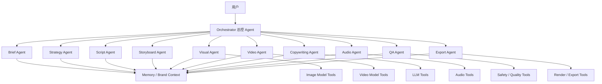

---

## 7.3 Agent 角色定义

| Agent | 中文名称 | 主要职责 | 输入 | 输出 |
|---|---|---|---|---|
| Orchestrator Agent | 总控 Agent | 拆解任务、分配 Agent、控制流程、处理失败重试 | 用户目标、素材、品牌记忆 | 任务计划、执行结果 |
| Brief Agent | 需求理解 Agent | 将用户自然语言转成结构化 Brief | 对话、上传素材 | Creative Brief JSON |
| Strategy Agent | 策略 Agent | 选择内容方向、受众、卖点、平台风格 | Brief、行业、平台 | 内容策略 |
| Script Agent | 脚本 Agent | 生成短视频脚本、分镜台词、旁白 | 策略、产品信息 | 脚本 |
| Storyboard Agent | 分镜 Agent | 拆分镜头、画面、时长、转场 | 脚本 | 分镜表 |
| Visual Agent | 视觉 Agent | 生成/编辑图像、背景、封面、产品图 | 分镜、素材、品牌库 | 图片资产 |
| Video Agent | 视频 Agent | 图生视频、片段合成、转场、动效 | 图片、分镜、脚本 | 视频片段 |
| Copywriting Agent | 文案 Agent | 标题、Hook、CTA、广告文案 | 策略、平台 | 文案包 |
| Audio Agent | 音频 Agent | BGM、配音、降噪、字幕 | 脚本、视频节奏 | 音频/字幕 |
| QA Agent | 质检 Agent | 检查品牌一致性、画面问题、违规风险 | 全部资产 | 质检报告 |
| Export Agent | 导出 Agent | 适配平台尺寸、格式、码率 | 成品内容 | 导出包 |
| Learning Agent | 学习 Agent | 沉淀成功流程、更新偏好 | 历史项目、反馈 | Skill/Memory 更新 |

---

## 7.4 Agent 协作时序图

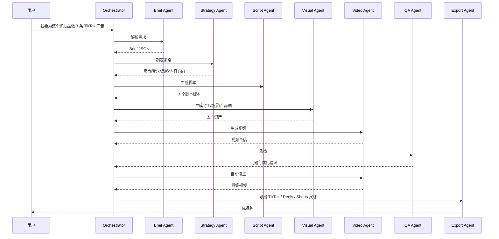

---

# 8. Skill 系统设计

## 8.1 Skill 的定义

Skill 是一个可复用的 AI 工作流模板。

它不是简单 prompt，而是包含：

1. 适用场景
2. 所需输入
3. Agent 编排顺序
4. 模型工具配置
5. 输出格式
6. 质量检查规则
7. 成本估算
8. 可编辑参数
9. 成功案例
10. 版本记录

---

## 8.2 Skill 示例结构

```json
{
  "skill_id": "ecom_tiktok_product_ad_v1",
  "name": "TikTok 电商商品广告视频",
  "category": "ecommerce_video",
  "description": "基于商品图和卖点生成 15 秒 TikTok 竖屏广告视频",
  "required_inputs": [
    "product_images",
    "product_name",
    "target_audience",
    "selling_points",
    "platform",
    "language"
  ],
  "optional_inputs": [
    "brand_kit",
    "reference_video",
    "promotion_info",
    "voiceover_style"
  ],
  "agents": [
    "brief_agent",
    "strategy_agent",
    "script_agent",
    "storyboard_agent",
    "visual_agent",
    "video_agent",
    "copywriting_agent",
    "qa_agent",
    "export_agent"
  ],
  "output": {
    "video": ["9:16 mp4", "1:1 mp4"],
    "cover": ["png"],
    "copy": ["title", "caption", "hashtags", "cta"],
    "script": ["json", "markdown"]
  },
  "estimated_credits": 80,
  "quality_rules": [
    "product_must_be_visible",
    "logo_not_distorted",
    "hook_within_3_seconds",
    "cta_must_exist",
    "no_forbidden_claims"
  ]
}
```

---

## 8.3 Skill 分类

| 分类 | Skill 示例 | MVP |
|---|---|---:|
| 电商广告 | 商品图生成 TikTok 广告视频 | ✅ |
| 电商图 | 白底图、场景图、详情页图 | ✅ |
| 社媒内容 | Reels/Shorts 内容包 | ✅ |
| 短剧 | 角色设定、剧本、分镜、片段 | V1 |
| 品牌设计 | Logo、海报、KV、活动视觉 | V1 |
| 本地生活 | 门店探店视频、促销海报 | V2 |
| 教育知识 | 课程短视频、知识卡片 | V2 |
| 游戏动漫 | 角色图、宣传短片、剧情预告 | V2 |
| 企业营销 | 白皮书视觉、活动视频、销售物料 | V3 |

---

## 8.4 Skill Marketplace

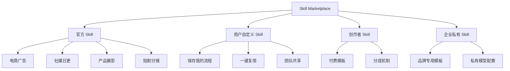

---

# 9. Brand Memory / 品牌记忆系统

## 9.1 为什么必须做品牌记忆

AI 创意工具最大的留存壁垒不是生成效果，而是：

> 用户下一次使用时，不需要重新解释自己是谁、品牌是什么、产品是什么、风格是什么、什么不能说。

品牌记忆会保存用户偏好、品牌资产、历史高表现内容和合规规则，使跨项目创作保持连续性。

---

## 9.2 品牌记忆结构

```mermaid
flowchart TD
    A[Brand Memory] --> B[品牌基础信息]
    A --> C[视觉系统]
    A --> D[语言系统]
    A --> E[商品系统]
    A --> F[人群系统]
    A --> G[合规规则]
    A --> H[历史高表现内容]

    B --> B1[品牌名]
    B --> B2[行业]
    B --> B3[官网]
    B --> B4[品牌定位]

    C --> C1[Logo]
    C --> C2[品牌色]
    C --> C3[字体]
    C --> C4[图片风格]
    C --> C5[参考图]

    D --> D1[语气]
    D --> D2[禁用词]
    D --> D3[常用 CTA]
    D --> D4[语言市场]

    E --> E1[SKU]
    E --> E2[卖点]
    E --> E3[价格]
    E --> E4[适用场景]

    F --> F1[目标用户]
    F --> F2[年龄]
    F --> F3[地域]
    F --> F4[痛点]

    G --> G1[不可承诺疗效]
    G --> G2[不可使用竞品词]
    G --> G3[授权限制]

    H --> H1[历史视频]
    H --> H2[转化数据]
    H --> H3[爆款结构]
```

---

## 9.3 品牌库字段

| 字段 | 类型 | 是否必填 | 说明 |
|---|---|---:|---|
| brand_id | string | ✅ | 品牌唯一 ID |
| brand_name | string | ✅ | 品牌名称 |
| industry | enum | ✅ | 行业 |
| positioning | text | ✅ | 品牌定位 |
| logo_assets | array | 否 | Logo 文件 |
| primary_colors | array | 否 | 主色 |
| secondary_colors | array | 否 | 辅色 |
| fonts | array | 否 | 字体 |
| tone_of_voice | enum/text | 否 | 品牌语气 |
| forbidden_words | array | 否 | 禁用词 |
| allowed_claims | array | 否 | 允许表达 |
| restricted_claims | array | 否 | 风险表达 |
| target_audience | object | 否 | 目标用户 |
| product_catalog | array | 否 | 商品库 |
| reference_assets | array | 否 | 参考素材 |
| best_performing_assets | array | 否 | 高表现内容 |
| locale | array | 否 | 语言与市场 |
| created_at | datetime | ✅ | 创建时间 |
| updated_at | datetime | ✅ | 更新时间 |

---

# 10. 核心功能 PRD

## 10.1 功能优先级定义

| 优先级 | 含义 |
|---|---|
| P0 | MVP 必须有，没有则产品无法成立 |
| P1 | V1 重要能力，影响留存和商业化 |
| P2 | 增强能力，影响规模化和差异化 |
| P3 | 生态能力，后续平台化 |

---

## 10.2 用户注册与登录

### 功能目标

让用户快速进入创作流程，降低首次使用门槛。

### 功能范围

| 功能 | 优先级 | 说明 |
|---|---:|---|
| 邮箱注册登录 | P0 | 基础账户 |
| Google 登录 | P0 | 海外市场必备 |
| Apple 登录 | P1 | iOS 端必备 |
| 手机号登录 | P1 | 中文市场 |
| 游客试用 | P0 | 可生成低清水印结果 |
| 邀请码 | P2 | 增长和封测 |
| 企业 SSO | P3 | 企业版 |

### 关键规则

1. 游客可体验，但导出前必须注册。
2. 新用户注册后赠送免费积分。
3. 用户首次进入必须完成轻量 Onboarding。
4. 登录状态必须同步 Web 与移动端。
5. 多端同时登录需要记录设备。

---

## 10.3 Onboarding

### 目标

在 60 秒内建立用户的初始创作上下文。

### 流程图

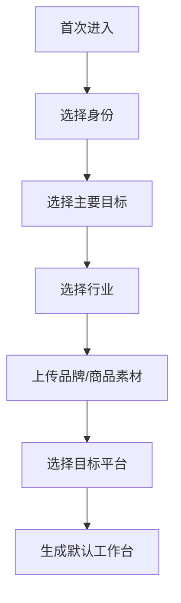

### Onboarding 问题

| 问题 | 类型 | 示例 |
|---|---|---|
| 你主要做什么？ | 单选 | 电商卖家 / 内容创作者 / 广告团队 / 品牌方 |
| 你最常创建什么内容？ | 多选 | 商品视频 / 社媒短视频 / 海报 / 产品图 |
| 你的主要平台是？ | 多选 | TikTok / Instagram / YouTube / 小红书 / 抖音 |
| 你的行业是？ | 单选 | 美妆 / 服饰 / 3C / 家居 / 食品 |
| 是否有品牌资产？ | 上传 | Logo、商品图、参考视频 |
| 你的风格偏好？ | 多选 | 高级感 / 真实 UGC / 促销强转化 / 清新自然 |
| 生成语言？ | 多选 | 中文 / 英文 / 日文 / 西班牙文 |

### 输出

```json
{
  "user_type": "ecommerce_seller",
  "main_goal": "generate_product_ads",
  "industry": "beauty",
  "platforms": ["tiktok", "instagram_reels"],
  "default_language": "en",
  "style_preference": ["ugc", "conversion_focused"],
  "brand_initialized": true
}
```

---

## 10.4 Dashboard 首页

### 目标

让用户快速开始新项目、继续旧项目、查看生成任务和积分消耗。

### 页面线框

```text
┌──────────────────────────────────────────────────────────────┐
│ AICrew Studio                          积分 1,280   Upgrade  │
├──────────────────────────────────────────────────────────────┤
│ 你好，今天想创作什么？                                      │
│ ┌──────────────────────────────────────────────────────────┐ │
│ │ 输入你的目标：例如“为这款面霜做 3 条 TikTok 广告视频”      │ │
│ └──────────────────────────────────────────────────────────┘ │
│ [上传素材] [选择 Skill] [从历史项目复用] [开始生成]          │
├──────────────────────────────────────────────────────────────┤
│ 推荐 Skill                                                   │
│ [商品广告视频] [产品场景图] [社媒封面] [短剧分镜]             │
├──────────────────────────────────────────────────────────────┤
│ 最近项目                                                     │
│ 项目名称        类型        状态        更新时间       操作     │
│ Serum Ad 01     电商视频    已完成      10分钟前       打开     │
│ Summer Sale     海报套图    生成中      2小时前        查看     │
├──────────────────────────────────────────────────────────────┤
│ 生成队列                                                     │
│ 任务 A：视频生成中 67%                                      │
│ 任务 B：封面生成中 22%                                      │
└──────────────────────────────────────────────────────────────┘
```

### 核心组件

| 组件 | 优先级 | 说明 |
|---|---:|---|
| 全局输入框 | P0 | 自然语言入口 |
| 推荐 Skill | P0 | 降低使用门槛 |
| 最近项目 | P0 | 继续工作 |
| 积分余额 | P0 | 计费透明 |
| 生成队列 | P0 | 管理等待 |
| 新手任务 | P1 | 提升激活 |
| 成功案例 | P1 | 引导用户 |

---

## 10.5 AI 创作工作台

### 目标

这是产品的核心页面。用户在这里通过对话、素材、Agent 任务和编辑预览完成内容生产。

### 页面结构

```text
┌────────────────────────────────────────────────────────────────────────┐
│ 项目：TikTok 商品广告视频                         [保存] [导出] [分享] │
├───────────────┬────────────────────────────────────┬───────────────────┤
│ 左侧：上下文   │ 中间：AI 对话与任务流               │ 右侧：预览与资产   │
│               │                                    │                   │
│ Brand Kit     │ User: 为这个产品做 3 条广告          │ 预览视频 1         │
│ Product Info  │ AI: 我会先分析卖点...               │ ┌───────────────┐ │
│ Assets        │                                    │ │               │ │
│ References    │ Agent Plan:                         │ │  video preview │ │
│               │ 1. 策略分析                         │ │               │ │
│               │ 2. 脚本生成                         │ └───────────────┘ │
│               │ 3. 分镜生成                         │                   │
│               │ 4. 图像生成                         │ 资产列表          │
│               │ 5. 视频合成                         │ [封面] [字幕]     │
│               │                                    │ [脚本] [文案]     │
├───────────────┴────────────────────────────────────┴───────────────────┤
│ 快捷修改： [更真实UGC] [更高级] [缩短到15秒] [换开头Hook] [重新生成]    │
└────────────────────────────────────────────────────────────────────────┘
```

### 主要能力

| 功能 | 优先级 | 说明 |
|---|---:|---|
| 对话式输入 | P0 | 通过自然语言控制任务 |
| Brief 自动结构化 | P0 | 把对话转成 JSON |
| Agent 执行状态展示 | P0 | 用户知道 AI 在做什么 |
| 素材引用 | P0 | 可指定图片、视频、Logo |
| 多版本生成 | P0 | 一次生成多个方案 |
| 局部修改 | P0 | 修改脚本、封面、背景、时长 |
| 版本回滚 | P1 | 回到旧版本 |
| Agent 结果展开 | P1 | 查看策略、脚本、分镜 |
| 协作评论 | P2 | 团队评审 |

---

## 10.6 Brief Agent 功能

### 目标

将用户的自然语言输入转换为结构化任务。

### 输入示例

```text
帮我用这张产品图做 3 条 TikTok 广告视频，目标是推广一款补水面霜，面向 25-35 岁女性，风格要像真实用户分享，视频 15 秒，英文文案。
```

### 输出示例

```json
{
  "task_type": "ecommerce_ad_video",
  "platform": "tiktok",
  "quantity": 3,
  "duration": 15,
  "language": "en",
  "product": {
    "name": "Hydrating Face Cream",
    "category": "skincare",
    "selling_points": ["hydration", "light texture", "daily use"]
  },
  "target_audience": {
    "gender": "female",
    "age_range": "25-35",
    "interest": ["skincare", "beauty", "self-care"]
  },
  "creative_style": ["ugc", "authentic", "conversion_focused"],
  "required_outputs": ["video", "cover", "caption", "hashtags", "script"],
  "constraints": {
    "aspect_ratio": "9:16",
    "max_duration": 15,
    "avoid_claims": ["medical cure", "guaranteed result"]
  }
}
```

### 规则

1. 如果关键信息缺失，最多追问 3 个问题。
2. 如果用户不回答，系统使用默认值继续。
3. Brief 必须可编辑。
4. Brief 是后续所有 Agent 的唯一事实来源。
5. 用户上传素材后，Brief Agent 自动识别图片内容并补全字段。

---

## 10.7 Strategy Agent 功能

### 目标

把 Brief 转换成内容策略。

### 输出结构

| 字段 | 说明 |
|---|---|
| core_angle | 核心创意角度 |
| audience_pain | 用户痛点 |
| hook_options | 前 3 秒 Hook |
| content_structure | 内容结构 |
| platform_style | 平台风格 |
| emotional_trigger | 情绪触发 |
| cta | 行动号召 |
| compliance_notes | 合规提醒 |

### 示例输出

```json
{
  "core_angle": "Morning skincare routine for busy women",
  "audience_pain": "Skin feels dry after long workdays",
  "hook_options": [
    "My skin used to feel tight every morning...",
    "One step I added to my morning routine",
    "Dry skin? Try this before makeup"
  ],
  "content_structure": [
    "Pain point hook",
    "Product close-up",
    "Texture demonstration",
    "Before/after feeling",
    "CTA"
  ],
  "platform_style": "TikTok UGC, handheld, fast cuts, subtitles",
  "emotional_trigger": "relief and daily confidence",
  "cta": "Try it today",
  "compliance_notes": [
    "Avoid medical claims",
    "Avoid guaranteed skin transformation claims"
  ]
}
```

---

## 10.8 Script Agent 功能

### 目标

生成可直接用于视频生产的脚本。

### 脚本格式

| 镜头 | 时长 | 画面 | 旁白/字幕 | 动作 | 备注 |
|---|---:|---|---|---|---|
| 1 | 0-3s | 用户拿起面霜，近景 | “Dry skin before makeup?” | 快速推近 | Hook |
| 2 | 3-6s | 展示质地 | “This feels light but super hydrating.” | 涂抹 | 卖点 |
| 3 | 6-10s | 产品与妆前场景 | “I use it every morning.” | 场景切换 | 使用场景 |
| 4 | 10-13s | 产品特写 | “No heavy feeling.” | 光线增强 | 质感 |
| 5 | 13-15s | Logo + CTA | “Try it today.” | 收尾 | CTA |

### 支持类型

| 类型 | MVP | 说明 |
|---|---:|---|
| UGC 广告脚本 | ✅ | 电商转化 |
| 产品展示脚本 | ✅ | 商品卖点 |
| 开箱脚本 | P1 | 商品体验 |
| 短剧脚本 | P1 | 剧情内容 |
| 知识视频脚本 | P2 | 教育内容 |
| 品牌大片脚本 | P2 | 高级广告 |

---

## 10.9 Storyboard Agent 功能

### 目标

将脚本转为可生成视频的分镜结构。

### 分镜 JSON

```json
{
  "storyboard": [
    {
      "scene_id": "s1",
      "duration": 3,
      "visual_prompt": "A realistic UGC-style close-up shot of a woman holding a skincare cream in a bright bathroom, handheld camera, natural morning light",
      "camera": "quick push-in",
      "subject": "woman and product",
      "text_overlay": "Dry skin before makeup?",
      "asset_reference": ["product_image_01"],
      "generation_method": "image_to_video"
    }
  ]
}
```

---

## 10.10 Visual Agent 功能

### 目标

负责图片生成、图像编辑、产品图、封面、背景、风格统一。

在新项目中，这类能力应该被产品化为“视觉 Agent 可调用工具”，而不是零散按钮。

### 工具清单

| 工具 | MVP | 说明 |
|---|---:|---|
| 背景移除 | ✅ | 商品图处理 |
| 背景替换 | ✅ | 场景图 |
| 商品图增强 | ✅ | 清晰度、光线 |
| 产品场景图 | ✅ | 广告素材 |
| 封面生成 | ✅ | 视频封面 |
| 文字海报 | P1 | 活动图 |
| 人像修图 | P1 | 创作者场景 |
| 角色一致性 | P2 | 短剧 |
| 图层拆分 | P2 | 高级编辑 |
| 虚拟试穿 | P2 | 服饰场景 |

---

## 10.11 Video Agent 功能

### 目标

负责视频生成、视频合成、镜头连续性、转场、字幕、封面适配。

### 视频生成类型

| 类型 | MVP | 说明 |
|---|---:|---|
| 图生视频 | ✅ | 商品图/人物图动起来 |
| 文生视频 | P1 | 从脚本直接生成 |
| 首尾帧视频 | P1 | 控制镜头变化 |
| 视频增强 | P1 | 提高清晰度 |
| 视频转绘画风格 | P2 | 动漫/风格化 |
| Motion Transfer | P2 | 动作迁移 |
| 多镜头连续视频 | P2 | 短剧/广告 |
| 自动剪辑合成 | ✅ | 片段组合 |
| 字幕烧录 | ✅ | 社媒视频必备 |
| 多尺寸导出 | ✅ | TikTok/Reels/Shorts |

---

## 10.12 Copywriting Agent 功能

### 目标

生成可发布的文案包。

### 输出

```json
{
  "titles": [
    "My new morning skincare step",
    "Dry skin before makeup? Try this",
    "A lightweight cream for daily hydration"
  ],
  "captions": [
    "Added this to my morning routine and love how lightweight it feels.",
    "A simple hydration step before makeup."
  ],
  "hashtags": [
    "#skincare",
    "#morningroutine",
    "#beautytips",
    "#hydration"
  ],
  "cta": [
    "Shop now",
    "Try it today",
    "Add it to your routine"
  ]
}
```

### 支持平台

| 平台 | 文案特点 |
|---|---|
| TikTok | 短 Hook、强节奏、话题标签 |
| Instagram Reels | 生活方式、审美、标签 |
| YouTube Shorts | 标题清晰、搜索友好 |
| 小红书 | 种草感、真实体验、分点说明 |
| 抖音 | 强开头、强情绪、转化 CTA |
| Amazon | 商品卖点、合规表述 |
| Shopify | 促销、品牌语气、转化导向 |

---

## 10.13 QA Agent 功能

### 目标

降低生成失败、品牌偏差、合规风险。

### 检查维度

| 维度 | 检查内容 |
|---|---|
| 内容完整性 | 是否有 Hook、卖点、CTA |
| 视觉质量 | 是否模糊、变形、产品缺失 |
| 品牌一致性 | 是否符合品牌色、Logo、语气 |
| 平台适配 | 尺寸、时长、字幕、安全边距 |
| 合规风险 | 禁用词、医疗承诺、侵权、敏感内容 |
| 成本异常 | 是否多次失败、消耗过高 |
| 用户目标匹配 | 是否满足 Brief |

### QA 输出示例

```json
{
  "quality_score": 86,
  "issues": [
    {
      "type": "visual",
      "severity": "medium",
      "message": "Product logo is slightly blurred in scene 3",
      "suggestion": "Regenerate scene 3 with product visibility constraint"
    },
    {
      "type": "copy",
      "severity": "low",
      "message": "CTA could be stronger",
      "suggestion": "Replace 'Learn more' with 'Shop now'"
    }
  ],
  "auto_fix_available": true
}
```

---

# 11. 关键业务流程

## 11.1 流程一：商品图生成广告视频

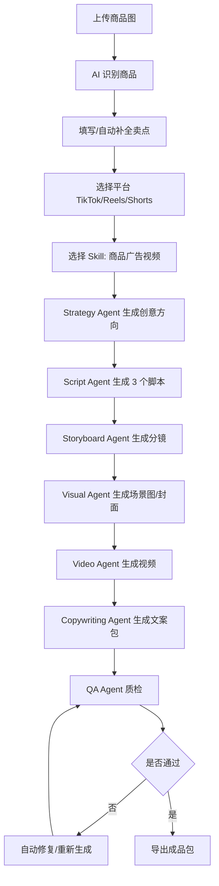

---

## 11.2 流程二：批量生成广告变体

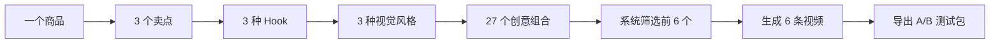

---

## 11.3 流程三：短剧内容生产

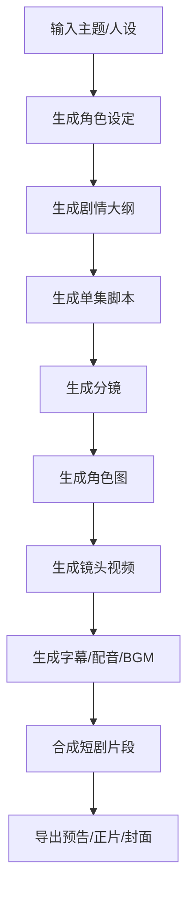

---

## 11.4 流程四：社媒日更内容包

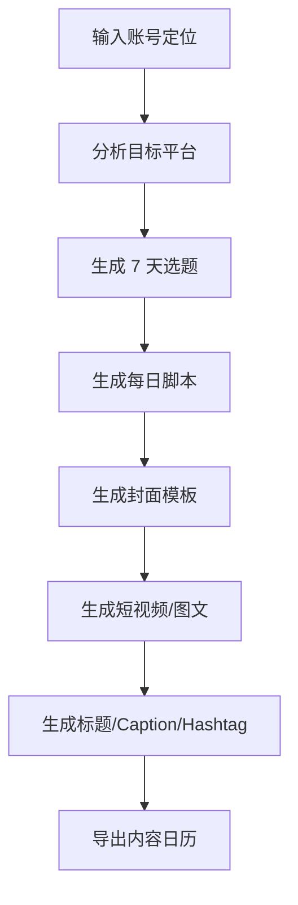

---

# 12. 页面与交互设计

## 12.1 首页

```text
┌─────────────────────────────────────────────────────────────────────┐
│ Logo        Workbench  Projects  Assets  Skills  Brand  Billing     │
├─────────────────────────────────────────────────────────────────────┤
│ Create with your AI Creative Team                                   │
│ ┌─────────────────────────────────────────────────────────────────┐ │
│ │ What do you want to create today?                               │ │
│ │ "Create 3 TikTok ads for this product..."                       │ │
│ └─────────────────────────────────────────────────────────────────┘ │
│ [Upload Product] [Choose Skill] [Use Brand Kit] [Start]             │
├─────────────────────────────────────────────────────────────────────┤
│ Recommended for you                                                 │
│ ┌─────────────┐ ┌─────────────┐ ┌─────────────┐ ┌─────────────┐    │
│ │ Product Ad  │ │ Product Shot│ │ Social Pack │ │ Short Drama │    │
│ └─────────────┘ └─────────────┘ └─────────────┘ └─────────────┘    │
├─────────────────────────────────────────────────────────────────────┤
│ Recent Projects                                                     │
│ [Serum TikTok Ads] [Summer Launch] [UGC Video Set]                  │
└─────────────────────────────────────────────────────────────────────┘
```

---

## 12.2 Skill 选择页

```text
┌──────────────────────────────────────────────────────────────┐
│ Skill Library                                                 │
├──────────────────────────────────────────────────────────────┤
│ Search: [ product video, UGC, poster, short drama... ]        │
│ Category: [Ecommerce] [Social] [Video] [Image] [Brand]        │
├──────────────────────────────────────────────────────────────┤
│ ┌─────────────────────┐ ┌─────────────────────┐              │
│ │ TikTok Product Ad   │ │ Product Photography │              │
│ │ 15s / 9:16 / UGC    │ │ Scene image set     │              │
│ │ Cost: 80 credits    │ │ Cost: 25 credits    │              │
│ │ [Use Skill]         │ │ [Use Skill]         │              │
│ └─────────────────────┘ └─────────────────────┘              │
│ ┌─────────────────────┐ ┌─────────────────────┐              │
│ │ Short Drama Opener  │ │ Social Content Pack │              │
│ │ Script + Storyboard │ │ 7-day content plan  │              │
│ │ Cost: 120 credits   │ │ Cost: 150 credits   │              │
│ │ [Use Skill]         │ │ [Use Skill]         │              │
│ └─────────────────────┘ └─────────────────────┘              │
└──────────────────────────────────────────────────────────────┘
```

---

## 12.3 项目工作台

```text
┌────────────────────────────────────────────────────────────────────────────┐
│ Project: Hydrating Cream TikTok Ads              Status: Generating 67%    │
├──────────────┬───────────────────────────────────────┬─────────────────────┤
│ Context      │ AI Crew                               │ Output Preview       │
│              │                                       │                     │
│ Brand        │ Strategy Agent ✅                      │ ┌─────────────────┐ │
│ Product      │ Script Agent ✅                        │ │                 │ │
│ Assets       │ Storyboard Agent ✅                    │ │   Video Draft   │ │
│ References   │ Visual Agent ⏳                        │ │                 │ │
│ Constraints  │ Video Agent Waiting                    │ └─────────────────┘ │
│              │ QA Agent Waiting                       │                     │
│              │                                       │ Versions            │
│              │ Chat                                  │ V1  V2  V3           │
│              │ ┌───────────────────────────────────┐ │                     │
│              │ │ Make the hook more emotional       │ │ Assets              │
│              │ └───────────────────────────────────┘ │ Cover / Script / CTA │
└──────────────┴───────────────────────────────────────┴─────────────────────┘
```

---

## 12.4 素材库页面

```text
┌────────────────────────────────────────────────────────────┐
│ Assets                                                     │
├────────────────────────────────────────────────────────────┤
│ Filters: [Image] [Video] [Logo] [Product] [Reference]      │
│ Search: [ serum, skincare, summer campaign... ]            │
├────────────────────────────────────────────────────────────┤
│ ┌──────────┐ ┌──────────┐ ┌──────────┐ ┌──────────┐       │
│ │Product 1 │ │Logo      │ │UGC Ref   │ │Scene Img │       │
│ │tag: SKU  │ │tag:Brand │ │tag:Video │ │tag:Ad    │       │
│ └──────────┘ └──────────┘ └──────────┘ └──────────┘       │
├────────────────────────────────────────────────────────────┤
│ AI tags: skincare, product, cream, white bottle, bathroom   │
└────────────────────────────────────────────────────────────┘
```

---

## 12.5 品牌库页面

```text
┌─────────────────────────────────────────────────────────────┐
│ Brand Kit: GlowSkin                                         │
├─────────────────────────────────────────────────────────────┤
│ Logo                                                        │
│ [Primary Logo] [White Logo] [Icon]                          │
├─────────────────────────────────────────────────────────────┤
│ Colors                                                      │
│ Primary: #F8DAD8   Secondary: #FFFFFF   Accent: #B8867B     │
├─────────────────────────────────────────────────────────────┤
│ Voice                                                       │
│ Tone: friendly, clean, science-backed, not exaggerated       │
│ Forbidden: cure, guaranteed, medical treatment               │
├─────────────────────────────────────────────────────────────┤
│ Products                                                    │
│ Hydrating Cream / Serum / Cleanser                          │
├─────────────────────────────────────────────────────────────┤
│ Best Performing Content                                     │
│ [UGC Routine Video] [Before Makeup Hook] [Texture Closeup]  │
└─────────────────────────────────────────────────────────────┘
```

---

## 12.6 编辑器页面

```text
┌───────────────────────────────────────────────────────────────────────┐
│ Editor: TikTok Ad V2                                                  │
├────────────────────┬──────────────────────────────┬───────────────────┤
│ Timeline           │ Preview                      │ Properties        │
│ Scene 1  0-3s      │ ┌──────────────────────────┐ │ Text Overlay      │
│ Scene 2  3-6s      │ │                          │ │ Font              │
│ Scene 3  6-10s     │ │       Video Preview      │ │ Color             │
│ Scene 4  10-13s    │ │                          │ │ Motion            │
│ Scene 5  13-15s    │ └──────────────────────────┘ │ Regenerate Scene  │
├────────────────────┴──────────────────────────────┴───────────────────┤
│ Quick AI Edit: [Change hook] [Replace background] [Shorten] [Upscale]  │
└───────────────────────────────────────────────────────────────────────┘
```

---

# 13. 数据模型设计

## 13.1 ER 图

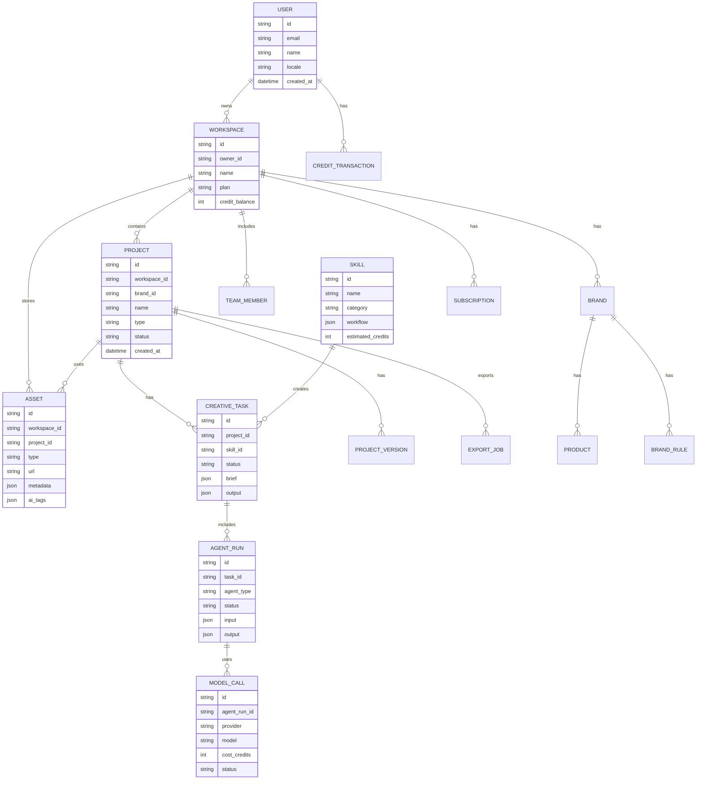

---

## 13.2 核心数据表

### users

| 字段 | 类型 | 说明 |
|---|---|---|
| id | uuid | 用户 ID |
| email | varchar | 邮箱 |
| password_hash | varchar | 密码哈希 |
| name | varchar | 用户名 |
| avatar_url | text | 头像 |
| locale | varchar | 默认语言 |
| timezone | varchar | 时区 |
| onboarding_completed | boolean | 是否完成引导 |
| created_at | timestamp | 创建时间 |
| updated_at | timestamp | 更新时间 |

---

### workspaces

| 字段 | 类型 | 说明 |
|---|---|---|
| id | uuid | 工作区 ID |
| owner_id | uuid | 所有者 |
| name | varchar | 工作区名称 |
| plan | enum | free / starter / pro / business |
| credit_balance | int | 积分余额 |
| storage_used | bigint | 已用存储 |
| created_at | timestamp | 创建时间 |
| updated_at | timestamp | 更新时间 |

---

### brands

| 字段 | 类型 | 说明 |
|---|---|---|
| id | uuid | 品牌 ID |
| workspace_id | uuid | 工作区 |
| name | varchar | 品牌名 |
| industry | varchar | 行业 |
| positioning | text | 品牌定位 |
| tone_of_voice | jsonb | 语气 |
| visual_style | jsonb | 视觉风格 |
| colors | jsonb | 品牌色 |
| fonts | jsonb | 字体 |
| forbidden_words | jsonb | 禁用词 |
| compliance_rules | jsonb | 合规规则 |
| created_at | timestamp | 创建时间 |

---

### assets

| 字段 | 类型 | 说明 |
|---|---|---|
| id | uuid | 素材 ID |
| workspace_id | uuid | 工作区 |
| project_id | uuid | 项目，可为空 |
| brand_id | uuid | 品牌，可为空 |
| type | enum | image / video / audio / document / logo |
| source | enum | upload / generated / imported |
| url | text | 文件地址 |
| thumbnail_url | text | 缩略图 |
| metadata | jsonb | 宽高、时长、格式等 |
| ai_tags | jsonb | AI 标签 |
| embedding_id | varchar | 向量索引 ID |
| created_by | uuid | 创建者 |
| created_at | timestamp | 创建时间 |

---

### creative_tasks

| 字段 | 类型 | 说明 |
|---|---|---|
| id | uuid | 任务 ID |
| project_id | uuid | 项目 |
| skill_id | uuid | Skill |
| task_type | enum | image / video / campaign / script |
| brief | jsonb | 结构化需求 |
| status | enum | draft / running / failed / completed |
| progress | int | 进度 |
| output | jsonb | 输出 |
| error_message | text | 错误 |
| estimated_credits | int | 预估积分 |
| actual_credits | int | 实际积分 |
| created_at | timestamp | 创建时间 |
| completed_at | timestamp | 完成时间 |

---

### agent_runs

| 字段 | 类型 | 说明 |
|---|---|---|
| id | uuid | Agent 执行 ID |
| task_id | uuid | 所属任务 |
| agent_type | varchar | Agent 类型 |
| input | jsonb | 输入 |
| output | jsonb | 输出 |
| status | enum | pending / running / failed / completed |
| started_at | timestamp | 开始时间 |
| completed_at | timestamp | 完成时间 |
| error | text | 错误信息 |

---

### credit_transactions

| 字段 | 类型 | 说明 |
|---|---|---|
| id | uuid | 积分流水 ID |
| workspace_id | uuid | 工作区 |
| user_id | uuid | 用户 |
| type | enum | grant / consume / refund / purchase |
| amount | int | 积分数量 |
| balance_after | int | 变动后余额 |
| reference_type | varchar | 关联对象类型 |
| reference_id | uuid | 关联对象 |
| description | text | 说明 |
| created_at | timestamp | 创建时间 |

---

# 14. 技术架构

## 14.1 总体架构图

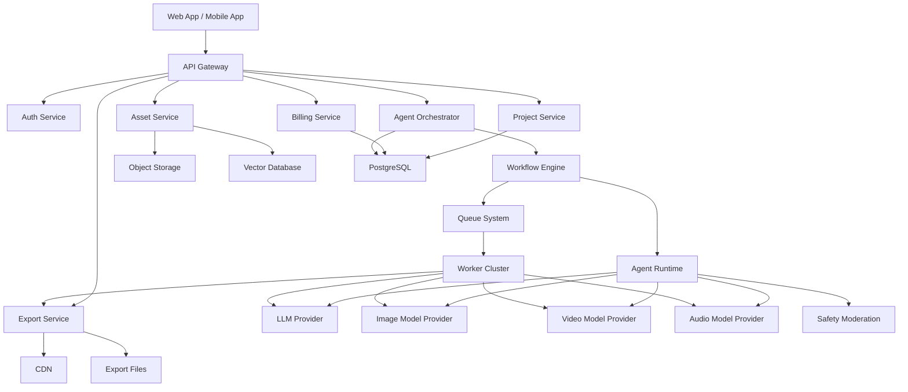

---

## 14.2 推荐技术栈

| 层级 | 推荐 |
|---|---|
| 前端 Web | Next.js / React / TypeScript |
| 移动端 | React Native / Flutter |
| 后端 | Node.js NestJS 或 Python FastAPI |
| 数据库 | PostgreSQL |
| 缓存 | Redis |
| 队列 | BullMQ / Celery / RabbitMQ |
| 对象存储 | S3 / R2 / OSS |
| 向量库 | pgvector / Qdrant / Pinecone |
| 工作流引擎 | Temporal / Inngest / 自研 DAG Engine |
| 实时进度 | WebSocket / Server-Sent Events |
| 支付 | Stripe / Paddle / Lemon Squeezy |
| 监控 | Sentry / OpenTelemetry / Grafana |
| 模型层 | OpenAI / Gemini / Claude / Kling / Runway / Stability / Replicate / 自研模型 |
| 内容安全 | 自研规则 + 第三方 Moderation API |
| 视频处理 | FFmpeg / Remotion / MoviePy / Cloud Render |

---

## 14.3 模型路由设计

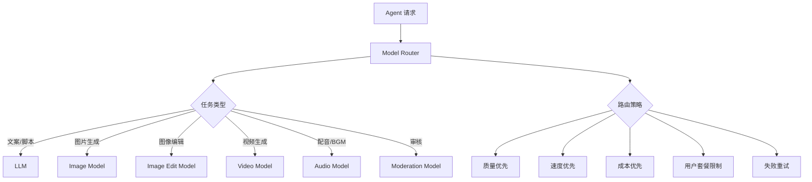

---

## 14.4 模型路由规则

| 规则 | 说明 |
|---|---|
| 免费用户 | 默认使用低成本模型，限制分辨率和队列优先级 |
| 付费用户 | 使用高质量模型，支持更高分辨率 |
| 视频任务 | 根据时长、清晰度、风格选择模型 |
| 图像编辑 | 优先选择稳定性高的图像编辑模型 |
| 失败重试 | 同模型重试 1 次，失败后切换备用模型 |
| 成本阈值 | 单任务超预算前提示用户 |
| 排队策略 | Pro / Business 用户优先 |
| 地域策略 | 根据用户地区选择合规供应商 |
| 内容安全 | 审核未通过不调用生成模型或不导出 |

---

## 14.5 当前实现架构总览

当前实现建议采用 **Demo-first vertical slice**：先做一条能完整演示商业价值的闭环，再把每个模块替换成可扩展服务。它不是把 V3/V4 平台一次性做完，而是优先证明：

> 用户上传商品素材并输入目标后，系统可以稳定产出一个可预览、可质检、可导出的内容包。


### 架构分层说明

| 层级 | 当前实现 | 后续扩展 |
|---|---|---|
| Client Experience | Web 工作台、素材上传、任务进度、结果预览、导出包下载 | 移动端、团队评论、版本对比、多人协作 |
| API & Domain Services | Gateway、Auth、Project、Asset、Creative Task、Billing Ledger | 企业 SSO、多品牌、多工作区、公开 API |
| Agent Orchestration | Orchestrator 串行执行 Brief → Strategy → Script → Visual → Video → QA → Export | DAG 并行、人工审批节点、Skill Marketplace |
| Execution & Model Fabric | 队列 + Worker + Model Router；先接 1-2 个模型供应商 | 多供应商竞价、区域路由、质量/成本动态调度 |
| Data Plane | PostgreSQL、Redis、Object Storage、Trace Store、Brand Memory | Vector DB、内容反馈仓、投放数据回流 |
| Observability & Cost | 任务事件、错误上下文、积分预估、模型成本流水 | OpenTelemetry、SLO、自动退款、质量回归门 |

### 当前实现边界

| 能力 | Demo 版本 | 产品化版本 |
|---|---|---|
| 多 Agent | 后端按固定顺序串行模拟 Agent 步骤 | DAG Engine 并行/条件分支/人工审批 |
| Brand Memory | 项目内品牌字段和素材标签 | 跨项目长期记忆、向量检索、禁用词策略 |
| 视频生成 | 调用单一视频模型生成短片段 | 多模型路由、分镜级重试、片段合成 |
| 编辑器 | 预览、重生成、下载 | 时间线编辑、局部重绘、字幕/音频编辑 |
| 计费 | 预估积分 + 完成后扣费 | 失败退款、模型成本归因、套餐限额 |
| 质量 | 基础规则评分和内容审核 | 多维 QA、品牌一致性、平台合规评分 |

---

## 14.6 核心服务边界

| 服务 | 负责什么 | 不负责什么 | 关键数据 |
|---|---|---|---|
| Project Service | 项目、平台、目标、输出规格 | 模型调用 | project、creative brief |
| Asset Service | 上传、转码、素材标签、引用关系 | 生成策略 | asset、asset_version |
| Skill Service | Skill 定义、参数、默认 Agent 编排 | 运行时状态 | skill、workflow_template |
| Creative Task Service | 任务创建、状态机、进度聚合 | 具体模型推理 | task、task_step |
| Orchestrator | Agent 步骤调度、失败重试、上下文传递 | UI 渲染、支付扣款 | agent_run、step_output |
| Model Router | 模型选择、fallback、预算限制 | 业务策略决策 | model_call、provider_policy |
| Billing Service | 积分预估、扣费、退款、流水 | 生成质量判断 | credit_transaction |
| Export Service | 平台尺寸、码率、封面、文案包 | 内容策略 | export_job、export_file |
| QA Service | 审核、质量评分、品牌一致性检查 | 最终商业判断 | qa_report、policy_violation |

---

## 14.7 生产流程图

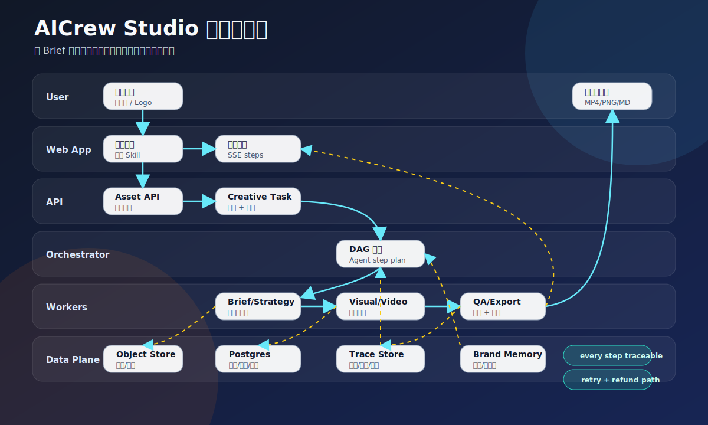

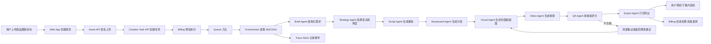

---

## 14.8 数据与事件流

### 任务事件

每个生成任务至少记录以下事件，用于 UI 进度、失败排查、计费归因和质量回放：

```json
{
  "type": "agent_step_completed",
  "task_id": "task_001",
  "step": "visual_agent",
  "status": "completed",
  "duration_ms": 12800,
  "cost_estimate": 18,
  "output_refs": ["asset_generated_cover_001"],
  "trace_id": "trace_001"
}
```

### 数据归属

| 数据 | 存储 | 生命周期 | 为什么 |
|---|---|---|---|
| 原始素材 | Object Storage | 用户删除前保留 | 生成可复用、可追溯 |
| 生成资产 | Object Storage + CDN | 按套餐保留 | 支持预览、导出、版本回滚 |
| Brief / Script / Storyboard | PostgreSQL JSONB | 项目生命周期 | 可编辑、可保存为 Skill |
| Agent Step Output | PostgreSQL JSONB | 任务生命周期 | 支持失败恢复和 trace |
| Model Call Metadata | Trace Store | 运营保留周期 | 成本、失败率、供应商评估 |
| Brand Memory | PostgreSQL + Vector DB | 工作区长期保留 | 保持风格一致和复用 |
| Credit Ledger | PostgreSQL append-only | 长期保留 | 对账、退款、用户信任 |

---

## 14.9 部署拓扑

```mermaid
flowchart TD
    U[User Browser] --> CDN[CDN / Static Assets]
    U --> WAF[WAF / Rate Limit]
    WAF --> API[API Gateway]
    API --> WEB[Web App SSR/API]
    API --> AUTH[Auth Service]
    API --> TASK[Creative Task Service]
    API --> ASSET[Asset Service]
    API --> BILL[Billing Service]

    TASK --> REDIS[Redis Queue]
    REDIS --> WORKER[Worker Cluster]
    WORKER --> ORCH[Agent Orchestrator]
    ORCH --> ROUTER[Model Router]
    ROUTER --> LLM[LLM Provider]
    ROUTER --> IMG[Image Provider]
    ROUTER --> VID[Video Provider]
    ROUTER --> AUD[Audio Provider]
    ROUTER --> MOD[Moderation Provider]

    WEB --> PG[(PostgreSQL)]
    TASK --> PG
    ASSET --> OBJ[(Object Storage)]
    ORCH --> TRACE[(Trace Store)]
    BILL --> LEDGER[(Credit Ledger)]
    OBJ --> CDN
```

部署原则：

1. Web/API 与 Worker 解耦，生成任务不可阻塞普通页面。
2. 任务状态以数据库为准，SSE 只是展示通道。
3. 模型供应商只通过 Model Router 访问，避免 API key 散落。
4. 资产和导出文件都走 Object Storage + CDN，便于权限控制和过期链接。
5. Credit Ledger append-only，退款通过反向流水，不直接改历史。

---

## 14.10 失败、重试与降级策略

| 失败点 | 用户可见状态 | 系统动作 | 计费策略 |
|---|---|---|---|
| 素材上传失败 | 上传失败，可重试 | 重新获取 signed URL | 不扣费 |
| Brief 缺字段 | 要求补充信息或使用默认模板 | 追问或套默认值 | 不扣费 |
| LLM 超时 | 任务继续等待或自动重试 | 同模型重试 1 次，再 fallback | 未产出不扣费 |
| 图片生成低质 | 展示 QA 建议，可局部重试 | 调整 prompt 或换模型 | 只扣成功版本 |
| 视频模型失败 | 标记该变体失败，其他变体继续 | fallback 或降级到图文广告包 | 按成功产出扣费 |
| 审核不通过 | 不允许导出，提示修改原因 | 返回安全建议 | 退回未使用积分 |
| 导出失败 | 结果保留，可重新导出 | 重跑 export worker | 不重复扣生成费 |

---

# 15. API 设计

## 15.1 创建项目

```http
POST /api/projects
```

### Request

```json
{
  "workspace_id": "ws_001",
  "name": "Hydrating Cream TikTok Ads",
  "type": "ecommerce_video",
  "brand_id": "brand_001"
}
```

### Response

```json
{
  "project_id": "proj_001",
  "status": "created"
}
```

---

## 15.2 上传素材

```http
POST /api/assets/upload
```

### Request

```json
{
  "workspace_id": "ws_001",
  "project_id": "proj_001",
  "type": "image",
  "purpose": "product_image"
}
```

### Response

```json
{
  "asset_id": "asset_001",
  "upload_url": "signed_upload_url",
  "status": "waiting_upload"
}
```

---

## 15.3 创建创作任务

```http
POST /api/creative-tasks
```

### Request

```json
{
  "project_id": "proj_001",
  "skill_id": "ecom_tiktok_product_ad_v1",
  "user_prompt": "Create 3 TikTok ads for this hydrating cream.",
  "asset_ids": ["asset_001"],
  "options": {
    "platform": "tiktok",
    "duration": 15,
    "language": "en",
    "quantity": 3,
    "style": "ugc"
  }
}
```

### Response

```json
{
  "task_id": "task_001",
  "status": "queued",
  "estimated_credits": 80,
  "estimated_outputs": [
    "3 videos",
    "3 covers",
    "3 captions",
    "3 scripts"
  ]
}
```

---

## 15.4 获取任务状态

```http
GET /api/creative-tasks/{task_id}
```

### Response

```json
{
  "task_id": "task_001",
  "status": "running",
  "progress": 67,
  "current_agent": "visual_agent",
  "steps": [
    {
      "agent": "brief_agent",
      "status": "completed"
    },
    {
      "agent": "strategy_agent",
      "status": "completed"
    },
    {
      "agent": "script_agent",
      "status": "completed"
    },
    {
      "agent": "visual_agent",
      "status": "running"
    }
  ]
}
```

---

## 15.5 实时任务事件

```http
GET /api/creative-tasks/{task_id}/events
```

### SSE Event

```json
{
  "event": "agent_completed",
  "task_id": "task_001",
  "agent": "script_agent",
  "progress": 35,
  "message": "3 scripts generated successfully."
}
```

---

## 15.6 修改生成结果

```http
POST /api/creative-tasks/{task_id}/revise
```

### Request

```json
{
  "target": "scene_1",
  "instruction": "Make the opening hook more dramatic and add a stronger product close-up.",
  "preserve": ["brand_style", "product_visibility", "duration"]
}
```

### Response

```json
{
  "revision_id": "rev_001",
  "status": "queued",
  "estimated_credits": 20
}
```

---

## 15.7 导出

```http
POST /api/export-jobs
```

### Request

```json
{
  "project_id": "proj_001",
  "version_id": "ver_003",
  "formats": [
    {
      "platform": "tiktok",
      "aspect_ratio": "9:16",
      "resolution": "1080x1920",
      "format": "mp4"
    },
    {
      "platform": "instagram",
      "aspect_ratio": "1:1",
      "resolution": "1080x1080",
      "format": "mp4"
    }
  ]
}
```

### Response

```json
{
  "export_job_id": "exp_001",
  "status": "queued"
}
```

---

# 16. 生成任务状态机

```mermaid
stateDiagram-v2
    [*] --> Draft
    Draft --> Precheck
    Precheck --> PaymentCheck
    PaymentCheck --> Queued
    Queued --> Running
    Running --> AgentProcessing
    AgentProcessing --> ModelGenerating
    ModelGenerating --> AssetProcessing
    AssetProcessing --> QualityCheck
    QualityCheck --> Completed
    QualityCheck --> NeedsRevision
    NeedsRevision --> Running
    Running --> Failed
    Failed --> Retry
    Retry --> Running
    Failed --> Refunded
    Completed --> Exporting
    Exporting --> Exported
    Exported --> [*]
```

---

# 17. 积分与计费系统

## 17.1 计费设计原则

AI 生成内容存在真实模型调用成本，因此必须设计积分系统。建议采用：

> 免费积分 + 订阅套餐 + 积分包 + 企业版

---

## 17.2 积分消耗建议

| 操作 | 免费用户 | 付费用户 | 建议积分 |
|---|---:|---:|---:|
| Brief 解析 | 免费 | 免费 | 0 |
| 脚本生成 | 免费限量 | 免费 | 1-3 |
| 商品图背景移除 | 限量 | 免费/低价 | 2 |
| 产品场景图 | 限量 | 标准 | 5-10 |
| 封面图生成 | 限量 | 标准 | 5 |
| 15 秒低清视频 | 限量 | 标准 | 40 |
| 15 秒高清视频 | 不支持 | 标准 | 80 |
| 30 秒高清视频 | 不支持 | 标准 | 150 |
| 多版本广告包 | 不支持 | 标准 | 200-500 |
| 视频增强 | 不支持 | 标准 | 30-80 |
| 批量导出 | 限量 | 标准 | 5-20 |
| 高级模型 | 不支持 | Pro | 按模型溢价 |

---

## 17.3 套餐建议

| 套餐 | 目标用户 | 月费建议 | 积分 | 权益 |
|---|---|---:|---:|---|
| Free | 试用用户 | $0 | 每日少量 | 水印、低清、慢队列 |
| Starter | 独立创作者 | $9-15 | 500-800 | 无水印、基础视频 |
| Pro | 电商卖家/运营 | $29-49 | 2,000-4,000 | 高清、批量、品牌库 |
| Studio | 小团队 | $99-199 | 10,000+ | 团队协作、优先队列 |
| Business | 企业 | 定制 | 定制 | 私有 Skill、API、合规支持 |

---

## 17.4 积分扣费规则

1. 任务开始前展示预估积分。
2. 任务成功后扣除最终积分。
3. 模型失败且无可用结果时自动退还。
4. 用户主动取消时按已消耗模型成本扣除部分积分。
5. 重新生成需再次计费。
6. 局部修改按修改范围计费。
7. 高级模型需要额外积分。
8. 付费用户享有更高队列优先级。
9. 积分过期规则必须清晰展示。
10. 所有积分流水可查询。

---

# 18. 内容编辑器设计

## 18.1 编辑对象

| 对象 | 可编辑项 |
|---|---|
| 脚本 | 镜头、台词、字幕、CTA |
| 图片 | 背景、主体、光线、风格、尺寸 |
| 视频 | 时长、镜头顺序、字幕、音乐、封面 |
| 文案 | 标题、Caption、Hashtag、CTA |
| 品牌 | Logo、颜色、语气、禁用词 |
| 分镜 | 镜头描述、运动方式、参考图 |

---

## 18.2 编辑方式

| 编辑方式 | 示例 |
|---|---|
| 自然语言修改 | “把开头改得更抓人” |
| 参数调整 | 时长 15s → 10s |
| 局部重生成 | 只重生成第 2 个镜头 |
| 替换素材 | 换一张产品图 |
| 版本复制 | 基于 V2 复制为 V3 |
| 模板复用 | 保存为自定义 Skill |

---

## 18.3 版本管理

```mermaid
gitGraph
    commit id: "V1 初始生成"
    branch edit-hook
    checkout edit-hook
    commit id: "V2 修改 Hook"
    commit id: "V3 增强 CTA"
    checkout main
    branch visual-style
    checkout visual-style
    commit id: "V4 更换背景"
    checkout main
    merge edit-hook
    commit id: "V5 最终版"
```

---

# 19. 输出与导出

## 19.1 输出包结构

一次完整任务不应该只输出一个视频，而应该输出一个内容包。

### 电商广告输出包

```text
Output Package
├── videos
│   ├── tiktok_9x16_v1.mp4
│   ├── reels_9x16_v1.mp4
│   └── shorts_9x16_v1.mp4
├── covers
│   ├── cover_v1.png
│   └── cover_v2.png
├── copy
│   ├── captions.md
│   ├── hashtags.txt
│   └── ad_copy_variants.csv
├── script
│   ├── script.md
│   └── storyboard.json
├── assets
│   ├── product_cutout.png
│   └── background_scene.png
└── report
    └── quality_report.pdf
```

---

## 19.2 平台导出规范

| 平台 | 尺寸 | 时长建议 | 格式 |
|---|---|---:|---|
| TikTok | 9:16 | 6-30s | MP4 |
| Instagram Reels | 9:16 | 6-30s | MP4 |
| YouTube Shorts | 9:16 | 15-60s | MP4 |
| 小红书视频 | 3:4 / 9:16 | 15-60s | MP4 |
| 抖音 | 9:16 | 6-30s | MP4 |
| Facebook Ads | 1:1 / 4:5 / 9:16 | 15-30s | MP4 |
| Amazon Listing | 1:1 / 16:9 | 15-45s | MP4 |
| Shopify | 1:1 / 16:9 | 10-30s | MP4/WebM |

---

# 20. 内容安全与合规

## 20.1 必须建立合规系统

此类产品会处理用户上传的图片、视频、品牌素材、肖像、商品素材、营销文案和生成内容，因此必须在产品层面内置：

1. 内容审核
2. 商业授权提示
3. 肖像权提示
4. 品牌侵权检测
5. 医疗/金融/功效类高风险声明限制
6. 用户上传素材责任声明
7. 数据删除能力
8. 企业私有数据隔离
9. 生成内容可追溯
10. 模型供应商数据处理说明

---

## 20.2 内容风险分类

| 风险 | 示例 | 处理方式 |
|---|---|---|
| 侵权 | 使用未授权 Logo、明星肖像 | 阻断或提示 |
| 肖像权 | 上传他人照片生成广告 | 要求确认授权 |
| 医疗功效 | “100% 治愈痘痘” | 替换为合规表达 |
| 金融承诺 | “保证收益” | 阻断 |
| 成人/暴力 | 暴露、血腥内容 | 阻断 |
| 欺诈广告 | 虚假促销、误导性前后对比 | 警告或阻断 |
| 平台政策 | 不符合广告平台规则 | 提示修改 |
| 数据隐私 | 上传客户个人信息 | 脱敏或阻断 |
| 商标混淆 | 模仿竞品包装 | 提示风险 |

---

## 20.3 合规检查流程

```mermaid
flowchart TD
    A[用户输入/上传素材] --> B[输入审核]
    B --> C{是否通过}
    C -- 否 --> D[提示修改]
    C -- 是 --> E[Agent 生成内容]
    E --> F[输出审核]
    F --> G{是否存在风险}
    G -- 高风险 --> H[阻断导出]
    G -- 中风险 --> I[提示用户确认/修改]
    G -- 低风险 --> J[自动修正]
    G -- 无风险 --> K[允许导出]
```

---

# 21. 运营后台

## 21.1 后台模块

| 模块 | 功能 |
|---|---|
| 用户管理 | 用户列表、套餐、状态、封禁 |
| 工作区管理 | 团队、存储、积分 |
| 项目管理 | 项目查询、异常任务 |
| 任务队列 | 排队、失败、重试、取消 |
| 模型监控 | 成本、成功率、耗时 |
| 积分流水 | 消费、购买、退款 |
| 内容审核 | 风险内容、申诉 |
| Skill 管理 | 创建、上下架、版本 |
| 模板管理 | 官方模板、分类 |
| 支付订单 | 订单、订阅、退款 |
| 数据看板 | DAU、生成量、成本、收入 |
| 日志审计 | 用户操作、管理员操作 |

---

## 21.2 后台数据看板

```text
┌──────────────────────────────────────────────────────────────┐
│ Admin Dashboard                                               │
├──────────────────────────────────────────────────────────────┤
│ DAU: 12,450      Paid Users: 1,230       MRR: $58,000         │
│ Generated Assets: 89,000    Video Jobs: 12,300                │
├──────────────────────────────────────────────────────────────┤
│ Model Cost                                                    │
│ LLM: $1,200   Image: $4,800   Video: $18,500   Audio: $600    │
├──────────────────────────────────────────────────────────────┤
│ Job Success Rate                                              │
│ Script 98%   Image 93%   Video 81%   Export 99%               │
├──────────────────────────────────────────────────────────────┤
│ Top Skills                                                    │
│ 1. TikTok Product Ad                                          │
│ 2. Product Photography                                        │
│ 3. UGC Video Pack                                             │
└──────────────────────────────────────────────────────────────┘
```

---

# 22. MVP 版本范围

## 22.1 MVP 目标

用 8-12 周做出可商业验证的版本：

> 用户上传商品图，输入需求，选择平台，系统自动生成 3 条可导出的竖屏广告视频，并附带封面、标题、Caption、Hashtag 和脚本。

---

## 22.2 MVP 必做功能

| 模块 | 功能 |
|---|---|
| 账户 | 邮箱/Google 登录 |
| Onboarding | 用户身份、行业、平台、品牌信息 |
| 工作台 | 自然语言输入 + 素材上传 |
| Skill | TikTok 商品广告视频 Skill |
| Agent | Brief、Strategy、Script、Visual、Video、Copywriting、QA、Export |
| 素材库 | 上传、自动标签、项目关联 |
| 视频生成 | 商品图生成短视频 |
| 图像生成 | 封面、背景、产品场景图 |
| 文案生成 | 标题、Caption、Hashtag、CTA |
| 导出 | MP4、PNG、Markdown |
| 积分 | 免费积分、积分消耗、余额 |
| 支付 | 基础订阅或积分包 |
| 后台 | 任务、用户、积分、模型成本 |
| 监控 | 失败率、生成耗时、成本 |

---

## 22.3 MVP 不做功能

| 功能 | 原因 |
|---|---|
| 完整移动端 | Web 先验证 |
| 自动发布到社媒 | 授权复杂，先做导出 |
| 企业 SSO | 先验证中小用户 |
| Skill Marketplace | 先做官方 Skill |
| 复杂视频时间线编辑 | 成本高，先做轻编辑 |
| 多人实时协作 | V1 再做 |
| 完整短剧生产 | V1/V2 扩展 |
| 私有模型部署 | 企业版再做 |
| 广告投放管理 | V3 数据闭环再做 |

---

# 23. 开发路线图

## 23.1 12 周路线

```mermaid
gantt
    title AICrew Studio MVP 12 周开发计划
    dateFormat  YYYY-MM-DD
    section 产品与设计
    产品需求冻结           :a1, 2026-06-18, 7d
    UI/UX 原型             :a2, after a1, 10d
    设计评审               :a3, after a2, 3d

    section 后端
    用户/工作区/项目        :b1, 2026-06-25, 14d
    素材库/对象存储         :b2, after b1, 10d
    Agent Orchestrator     :b3, after b1, 21d
    积分/支付              :b4, after b2, 14d
    后台管理               :b5, after b3, 14d

    section AI 工作流
    Brief Agent            :c1, 2026-07-02, 7d
    Strategy/Script Agent  :c2, after c1, 10d
    Visual/Video Agent     :c3, after c2, 21d
    QA/Export Agent        :c4, after c3, 10d

    section 前端
    Dashboard              :d1, 2026-07-02, 10d
    Workbench              :d2, after d1, 21d
    Editor/Preview         :d3, after d2, 14d
    Billing                :d4, after d3, 7d

    section 测试上线
    内测                   :e1, 2026-08-20, 7d
    修复优化               :e2, after e1, 7d
    公测上线               :e3, after e2, 3d
```

---

## 23.2 版本规划

| 版本 | 时间 | 目标 | 核心功能 |
|---|---|---|---|
| v0.1 | 第 4 周 | 内部 Demo | 上传素材、Brief、脚本、单视频生成 |
| v0.3 | 第 8 周 | Alpha | 3 条广告视频、封面、文案、导出 |
| v0.5 | 第 12 周 | Public Beta | 支付、积分、后台、任务队列 |
| v1.0 | 第 16-20 周 | 商业版 | 品牌库、更多 Skill、视频增强 |
| v1.5 | 第 24 周 | 团队版 | 团队协作、评论、共享 Skill |
| v2.0 | 第 32 周 | 增长版 | 数据反馈、爆款复用、内容评分 |
| v3.0 | 第 48 周 | 平台版 | Skill Marketplace、API、插件 |

---

# 24. 研发任务拆解

## 24.1 前端任务

| 模块 | 任务 |
|---|---|
| 基础框架 | Next.js 项目、路由、状态管理、权限 |
| 登录注册 | 邮箱、Google OAuth、会话管理 |
| Dashboard | 首页、最近项目、推荐 Skill |
| Workbench | 对话区、Agent 状态、预览区 |
| 素材上传 | 拖拽上传、进度、缩略图 |
| 素材库 | 网格、标签、筛选、搜索 |
| Brand Kit | 品牌信息表单、Logo、颜色 |
| Skill Library | 卡片、分类、详情 |
| Task Progress | WebSocket/SSE 实时状态 |
| Preview | 图片/视频预览、版本切换 |
| Editor | 文案修改、局部重生成、导出 |
| Billing | 套餐、积分、支付记录 |
| Admin | 用户、任务、模型成本 |

---

## 24.2 后端任务

| 模块 | 任务 |
|---|---|
| Auth Service | JWT、OAuth、权限 |
| Workspace Service | 工作区、成员、套餐 |
| Project Service | 项目 CRUD、版本 |
| Asset Service | 上传签名、存储、AI 标签 |
| Brand Service | 品牌库、商品库 |
| Skill Service | Skill 配置、版本 |
| Agent Orchestrator | 任务拆解、Agent 执行 |
| Queue Worker | 异步任务、重试 |
| Model Router | 模型选择、供应商调用 |
| Credit Service | 预估、扣费、退款 |
| Export Service | 视频合成、格式转换 |
| Notification Service | 任务完成通知 |
| Admin Service | 管理后台 |
| Analytics Service | 指标统计 |

---

## 24.3 AI 工程任务

| 模块 | 任务 |
|---|---|
| Prompt System | Agent Prompt、结构化输出 |
| Brief Parser | 用户输入解析 |
| Image Understanding | 商品图识别、标签 |
| Strategy Generator | 内容策略 |
| Script Generator | 视频脚本 |
| Storyboard Generator | 分镜 |
| Visual Prompt Generator | 视觉 prompt |
| Video Prompt Generator | 视频 prompt |
| QA Evaluator | 内容质量评分 |
| Compliance Checker | 风险检查 |
| Memory Retrieval | 品牌记忆召回 |
| Skill Compiler | Skill 转执行 DAG |
| Auto Retry | 失败修复策略 |
| Cost Optimizer | 模型成本控制 |

---

# 25. 核心 Prompt 模板

## 25.1 Brief Agent Prompt

```text
你是一个商业内容创作需求分析 Agent。
你的任务是把用户的自然语言需求、上传素材信息、品牌上下文，转化为结构化 Creative Brief。

你必须：
1. 识别任务类型。
2. 识别目标平台。
3. 识别目标用户。
4. 识别产品卖点。
5. 识别内容风格。
6. 识别输出格式。
7. 识别限制条件。
8. 如果信息缺失，生成最多 3 个澄清问题。
9. 如果用户没有回答，使用合理默认值。

输出必须是 JSON，不要输出解释性文字。
```

---

## 25.2 Strategy Agent Prompt

```text
你是一个增长型创意策略 Agent。
你的任务是基于 Creative Brief，生成适合目标平台的内容策略。

你必须输出：
1. 核心创意角度。
2. 目标用户痛点。
3. 前 3 秒 Hook。
4. 内容结构。
5. 情绪触发点。
6. 平台风格。
7. CTA。
8. 合规风险提醒。

要求：
- 策略必须具体。
- 不要使用空泛描述。
- 必须适合短视频平台。
- 如果是电商产品，必须突出卖点和使用场景。
```

---

## 25.3 Script Agent Prompt

```text
你是一个短视频广告脚本 Agent。
请根据内容策略生成可执行的视频脚本。

输出为 Markdown 表格，字段包括：
- 镜头编号
- 时长
- 画面描述
- 旁白/字幕
- 镜头运动
- 目的
- 备注

规则：
1. 总时长不能超过 Brief 中的限制。
2. 前 3 秒必须有 Hook。
3. 每个镜头必须服务于转化。
4. 必须包含产品露出。
5. 结尾必须包含 CTA。
```

---

## 25.4 QA Agent Prompt

```text
你是一个商业内容质检 Agent。
你的任务是检查生成内容是否满足 Brief、品牌规则、平台规范和基本合规要求。

请从以下维度评分：
1. Brief 匹配度
2. 产品可见度
3. Hook 强度
4. 品牌一致性
5. 视觉质量
6. 文案质量
7. 平台适配
8. 合规风险

输出 JSON：
{
  "quality_score": 0-100,
  "pass": true/false,
  "issues": [],
  "auto_fix_suggestions": []
}
```

---

# 26. 质量指标体系

## 26.1 北极星指标

> **每个活跃工作区每周成功导出的可发布内容包数量**

定义：

```text
Weekly Successful Exported Content Packages per Active Workspace
```

为什么不是“生成次数”：

1. 生成次数容易虚高。
2. 用户真正要的是可用结果。
3. 导出说明内容达到用户最低满意标准。
4. 内容包比单资产更能体现产品价值。
5. 能同时反映激活、留存和商业价值。

---

## 26.2 产品指标

| 指标 | 定义 | 目标 |
|---|---|---:|
| 新用户激活率 | 注册后 24 小时内完成一次导出 | >35% |
| 首次生成成功率 | 第一次任务成功完成 | >80% |
| 导出率 | 生成任务中最终导出的比例 | >45% |
| 任务失败率 | 生成失败任务占比 | <10% |
| 平均生成耗时 | 从提交到可预览 | <5 分钟 |
| 二次编辑率 | 用户对结果进行修改 | 30-60% |
| 复用率 | 使用历史 Skill/品牌库的任务比例 | >40% |
| 次周留存 | 新用户第二周仍使用 | >25% |
| 付费转化率 | 免费用户转付费 | >5% |
| 单任务毛利 | 收入 - 模型成本 | >60% |

---

## 26.3 AI 质量指标

| 指标 | 说明 |
|---|---|
| Brief 解析准确率 | 用户需求结构化是否正确 |
| 脚本可用率 | 脚本是否可直接生成视频 |
| 产品可见率 | 视频中商品是否清晰出现 |
| 品牌一致率 | 是否符合品牌库 |
| 视频生成成功率 | 模型成功返回结果 |
| 用户采纳率 | 用户是否选择该版本 |
| 局部重生成率 | 结果需修改程度 |
| QA 自动修复成功率 | 自动修复后是否通过 |
| 单任务平均成本 | 模型调用成本 |
| 生成耗时 P95 | 慢任务体验 |

---

# 27. 商业模式

## 27.1 收入结构

```mermaid
flowchart TD
    A[收入] --> B[订阅]
    A --> C[积分包]
    A --> D[企业版]
    A --> E[Skill Marketplace 抽成]
    A --> F[API 调用]
    A --> G[增值服务]

    B --> B1[Starter]
    B --> B2[Pro]
    B --> B3[Studio]

    C --> C1[小积分包]
    C --> C2[大积分包]

    D --> D1[团队席位]
    D --> D2[私有数据]
    D --> D3[定制 Skill]

    E --> E1[创作者模板]
    E --> E2[行业工作流]

    F --> F1[企业批量生成 API]
```

---

## 27.2 毛利控制

| 成本项 | 控制方法 |
|---|---|
| LLM 成本 | 缓存 Brief、模板化 Prompt、小模型处理简单任务 |
| 图像模型成本 | 分辨率分层、免费用户低清 |
| 视频模型成本 | 限制时长、排队、预估积分、失败重试控制 |
| 存储成本 | 免费用户存储限制、归档策略 |
| 带宽成本 | CDN、导出文件有效期 |
| 审核成本 | 自动审核优先，人工只处理申诉 |
| 客服成本 | 任务失败自动解释和退款规则 |

---

## 27.3 定价策略

### 免费版

目标：让用户体验价值，但不形成成本黑洞。

限制：

1. 每日免费积分。
2. 低清导出。
3. 带水印。
4. 慢队列。
5. 限制视频时长。
6. 限制项目数量。
7. 限制历史保存时间。

### Pro 版

目标：服务高频创作者和电商卖家。

权益：

1. 高清导出。
2. 无水印。
3. 更高积分。
4. 优先队列。
5. 品牌库。
6. 批量生成。
7. 更多 Skill。
8. 商用授权说明。
9. 历史项目长期保存。

### Studio 版

目标：小团队和 Agency。

权益：

1. 多成员。
2. 团队品牌库。
3. 评论协作。
4. 私有 Skill。
5. 更高并发。
6. 成本报表。
7. API Beta。
8. 专属模板。

---

# 28. 增长策略

## 28.1 获客路径

| 渠道 | 策略 |
|---|---|
| TikTok / Reels | 展示“1 张商品图 → 3 条广告视频” |
| YouTube | 长教程、案例拆解 |
| Product Hunt | 国际 SaaS 冷启动 |
| Shopify App Store | 电商插件化 |
| Chrome Extension | 网页商品图一键生成广告 |
| 社群 | 跨境电商、独立站、短视频运营 |
| Affiliate | 给 AI 工具博主分佣 |
| 模板 SEO | “AI product video generator”等关键词 |
| 免费工具页 | 背景移除、产品图生成、封面生成 |
| 案例库 | 行业模板和前后对比 |

---

## 28.2 增长飞轮

```mermaid
flowchart LR
    A[用户生成内容] --> B[导出带水印]
    B --> C[内容在社媒传播]
    C --> D[新用户看到工具标识]
    D --> E[注册试用]
    E --> F[生成自己的内容]
    F --> A

    E --> G[付费去水印]
    G --> H[更多生成]
    H --> I[沉淀模板]
    I --> J[提升成功率]
    J --> H
```

---

## 28.3 SEO 页面矩阵

| 页面类型 | 示例 |
|---|---|
| 工具页 | AI Product Video Generator |
| 工具页 | AI Product Photography |
| 工具页 | AI TikTok Ad Generator |
| 工具页 | AI UGC Video Generator |
| 工具页 | AI Background Remover |
| 场景页 | AI Tools for Shopify Sellers |
| 场景页 | AI Video Ads for Beauty Products |
| 场景页 | TikTok Ads for Amazon Sellers |
| 模板页 | 15-second product ad template |
| 博客页 | How to turn product photos into videos |
| 案例页 | How a skincare store made 50 ads in 1 hour |

---

# 29. 竞争壁垒设计

## 29.1 可复制与不可复制

| 能力 | 是否容易被复制 | 壁垒来源 |
|---|---:|---|
| 生图 | 高 | 模型商品化 |
| 生视频 | 中高 | 模型供应商开放 |
| 对话入口 | 高 | UI 容易复制 |
| Agent 编排 | 中 | 工作流与稳定性 |
| Skill 库 | 中 | 行业经验和模板数量 |
| 品牌记忆 | 中低 | 用户迁移成本 |
| 历史资产库 | 中低 | 数据沉淀 |
| 数据反馈闭环 | 低 | 真实投放数据 |
| 团队协作流程 | 中 | 工作流嵌入 |
| 企业合规能力 | 低 | 长期服务能力 |

---

## 29.2 长期护城河

1. **高质量 Skill 库**
   - 每个行业都有成熟内容流程。
   - 用户可以保存自己的成功流程。
   - 优质 Skill 形成平台资产。

2. **品牌记忆与商品库**
   - 用户越用越省事。
   - 迁移到其他工具成本提高。

3. **生成结果反馈**
   - 哪种 Hook、画面、CTA 表现更好。
   - 系统自动学习高表现结构。

4. **团队协作嵌入**
   - 内容生产流程进入团队日常。
   - 不只是工具，而是工作台。

5. **成本与模型路由能力**
   - 同样价格下生成更稳定。
   - 同样质量下成本更低。

6. **垂直行业合规**
   - 美妆、保健品、金融、教育等高风险行业有专门规则。
   - 企业更愿意付费。

---

# 30. 风险与应对

## 30.1 产品风险

| 风险 | 表现 | 应对 |
|---|---|---|
| 生成结果不可控 | 用户不满意 | 多版本生成、局部重生成、QA Agent |
| 视频生成失败率高 | 等待久、扣费争议 | 队列、重试、失败退款 |
| 用户不会写需求 | 首次失败 | Onboarding、模板、示例 Prompt |
| 功能太多导致复杂 | 用户迷失 | MVP 聚焦电商广告 |
| 成本过高 | 毛利差 | 积分系统、模型路由、分层质量 |
| 同质化 | 被大厂复制 | Skill、Memory、数据闭环 |
| 合规风险 | 侵权/虚假广告 | 审核、授权确认、风险提示 |
| 留存不足 | 新鲜感后流失 | 品牌库、复用、内容日历 |
| 付费转化低 | 免费用户薅羊毛 | 水印、低清、队列限制 |
| 质量波动 | 模型供应不稳定 | 多供应商冗余 |

---

## 30.2 技术风险

| 风险 | 应对 |
|---|---|
| 模型 API 不稳定 | 多模型 fallback |
| 视频任务耗时长 | 异步队列 + 进度可视化 |
| 存储成本高 | 生命周期管理 |
| 生成内容过大 | 压缩与分辨率策略 |
| 任务状态复杂 | 状态机 + Workflow Engine |
| Prompt 不稳定 | 结构化输出 + JSON Schema 验证 |
| 并发高 | 队列削峰 + 用户优先级 |
| 数据丢失 | 对象存储版本、数据库备份 |
| Agent 死循环 | 最大步骤限制 |
| 成本失控 | 任务预算上限 |

---

# 31. 验收标准

## 31.1 MVP 验收

| 项目 | 标准 |
|---|---|
| 注册登录 | 用户可完成注册、登录、退出 |
| Onboarding | 用户可完成身份、平台、行业选择 |
| 素材上传 | 可上传至少 5 张图片 |
| 商品识别 | 系统可识别基础商品信息 |
| Brief | 用户输入可转结构化 JSON |
| Skill | 可选择 TikTok 商品广告 Skill |
| 脚本生成 | 可生成至少 3 个脚本 |
| 视频生成 | 可生成至少 1 条 9:16 MP4 |
| 多版本 | 可生成 3 个版本 |
| 封面 | 每条视频有封面 |
| 文案 | 每条视频有标题、Caption、Hashtag |
| QA | 生成质量评分和问题列表 |
| 编辑 | 支持修改 Hook、CTA、字幕 |
| 导出 | 可下载视频和文案包 |
| 积分 | 可展示预估、扣费、余额 |
| 失败处理 | 失败有提示和退款逻辑 |
| 后台 | 可查看用户、任务、成本 |
| 监控 | 可查看任务成功率和耗时 |

---

## 31.2 性能标准

| 指标 | MVP 目标 |
|---|---:|
| 页面首屏加载 | <3 秒 |
| 图片上传成功率 | >98% |
| Brief 解析耗时 | <10 秒 |
| 脚本生成耗时 | <20 秒 |
| 图像生成耗时 | <60 秒 |
| 15 秒视频生成耗时 | <5 分钟 |
| 任务成功率 | >80% |
| 导出成功率 | >95% |
| WebSocket/SSE 延迟 | <2 秒 |
| 支付成功回调 | <10 秒 |

---

# 32. 团队配置建议

## 32.1 MVP 最小团队

| 角色 | 人数 | 职责 |
|---|---:|---|
| 产品负责人 | 1 | PRD、路线图、验收 |
| UI/UX 设计师 | 1 | 原型、视觉、交互 |
| 前端工程师 | 2 | Web App、编辑器、状态流 |
| 后端工程师 | 2 | API、任务队列、支付 |
| AI 工程师 | 2 | Agent、Prompt、模型路由 |
| 全栈/DevOps | 1 | 部署、监控、存储 |
| QA | 1 | 测试、回归 |
| 增长/运营 | 1 | 模板、案例、用户反馈 |

最小可行团队：6-8 人。  
理想 MVP 团队：10-12 人。

---

## 32.2 组织结构图

```mermaid
flowchart TD
    A[Founder / Product Lead] --> B[Product]
    A --> C[Engineering]
    A --> D[AI]
    A --> E[Growth]

    B --> B1[PRD]
    B --> B2[UX]
    B --> B3[User Research]

    C --> C1[Frontend]
    C --> C2[Backend]
    C --> C3[DevOps]
    C --> C4[QA]

    D --> D1[Agent Workflow]
    D --> D2[Model Router]
    D --> D3[Prompt Engineering]
    D --> D4[Evaluation]

    E --> E1[SEO]
    E --> E2[Templates]
    E --> E3[Creator Partnerships]
    E --> E4[Customer Success]
```

---

# 33. 项目文件结构建议

## 33.1 前端

```text
apps/web
├── app
│   ├── dashboard
│   ├── workbench
│   ├── projects
│   ├── assets
│   ├── brand
│   ├── skills
│   ├── billing
│   └── admin
├── components
│   ├── chat
│   ├── editor
│   ├── asset-picker
│   ├── agent-status
│   ├── video-preview
│   └── billing
├── lib
│   ├── api.ts
│   ├── auth.ts
│   ├── sse.ts
│   └── utils.ts
└── stores
    ├── project-store.ts
    ├── asset-store.ts
    └── task-store.ts
```

---

## 33.2 后端

```text
apps/api
├── src
│   ├── auth
│   ├── users
│   ├── workspaces
│   ├── projects
│   ├── assets
│   ├── brands
│   ├── skills
│   ├── creative-tasks
│   ├── agents
│   ├── model-router
│   ├── billing
│   ├── exports
│   ├── admin
│   └── common
├── workers
│   ├── creative-task.worker.ts
│   ├── model-call.worker.ts
│   ├── export.worker.ts
│   └── moderation.worker.ts
└── prisma
    └── schema.prisma
```

---

## 33.3 Agent 服务

```text
services/agent-runtime
├── agents
│   ├── brief_agent.py
│   ├── strategy_agent.py
│   ├── script_agent.py
│   ├── storyboard_agent.py
│   ├── visual_agent.py
│   ├── video_agent.py
│   ├── copywriting_agent.py
│   ├── qa_agent.py
│   └── export_agent.py
├── workflows
│   ├── ecommerce_video.yaml
│   ├── product_photo.yaml
│   ├── social_pack.yaml
│   └── short_drama.yaml
├── prompts
│   ├── brief.md
│   ├── strategy.md
│   ├── script.md
│   └── qa.md
├── tools
│   ├── image_tools.py
│   ├── video_tools.py
│   ├── audio_tools.py
│   └── moderation_tools.py
└── evaluation
    ├── quality_score.py
    └── compliance_score.py
```

---

# 34. MVP 示例用户故事

## 34.1 用户故事 1：电商卖家生成 TikTok 广告

```text
作为一个 Shopify 卖家，
我想上传一张商品图并输入产品卖点，
让系统自动生成 3 条 TikTok 广告视频，
这样我可以快速测试不同创意方向。
```

### 验收条件

1. 用户可上传商品图。
2. 用户可输入商品名称和卖点。
3. 系统生成 3 个脚本。
4. 系统生成 3 条视频。
5. 每条视频有封面和文案。
6. 用户可下载视频。
7. 用户可看到积分消耗。

---

## 34.2 用户故事 2：运营修改 Hook

```text
作为一个短视频运营，
我想让 AI 把视频开头改得更抓人，
这样我可以提高视频完播率。
```

### 验收条件

1. 用户可选择某条视频。
2. 用户可输入修改指令。
3. 系统只修改开头镜头。
4. 原视频其他部分保持不变。
5. 生成新版本。
6. 新旧版本可对比。

---

## 34.3 用户故事 3：保存成功模板

```text
作为一个广告投放人员，
我想把表现好的广告结构保存成模板，
这样下次可以快速复用。
```

### 验收条件

1. 用户可从项目中点击“保存为 Skill”。
2. 系统保存脚本结构、镜头结构、文案结构。
3. 用户可命名 Skill。
4. 下次新项目可调用该 Skill。
5. Skill 可设为私有或团队共享。

---

# 35. 关键算法与逻辑

## 35.1 Brief 缺失字段补全逻辑

```mermaid
flowchart TD
    A[用户输入] --> B[解析字段]
    B --> C{是否缺失关键字段}
    C -- 否 --> D[生成 Brief]
    C -- 是 --> E{缺失数量}
    E -- 少于等于3 --> F[追问用户]
    E -- 大于3 --> G[使用默认模板]
    F --> H{用户是否回答}
    H -- 是 --> D
    H -- 否 --> G
    G --> D
```

---

## 35.2 内容质量评分

```text
quality_score =
  brief_match_score * 0.20
+ product_visibility_score * 0.20
+ hook_strength_score * 0.15
+ visual_quality_score * 0.15
+ brand_consistency_score * 0.10
+ platform_fit_score * 0.10
+ compliance_score * 0.10
```

---

## 35.3 任务成本预估

```text
estimated_credits =
  llm_steps * llm_unit_cost
+ image_generations * image_unit_cost
+ video_seconds * video_second_cost
+ audio_seconds * audio_second_cost
+ export_count * export_unit_cost
+ retry_buffer
```

---

## 35.4 自动重试策略

```mermaid
flowchart TD
    A[模型调用失败] --> B{失败类型}
    B -->|超时| C[同模型重试 1 次]
    B -->|内容违规| D[返回用户修改]
    B -->|模型错误| E[切换备用模型]
    B -->|结果低质| F[调整 Prompt 重试]
    C --> G{是否成功}
    E --> G
    F --> G
    G -- 是 --> H[继续流程]
    G -- 否 --> I[任务失败/部分退款]
```

---

# 36. Landing Page 文案结构

## 36.1 首页 Hero

```text
Your AI Creative Team for Product Videos, Social Ads, and Brand Content.

Upload a product photo. Describe your goal.
AICrew Studio plans, writes, designs, edits, and exports ready-to-post content for you.
```

中文版本：

```text
让一个人拥有一支 AI 创意团队

上传商品图，输入目标。
AICrew Studio 自动完成策略、脚本、分镜、视觉、视频、文案和导出。
```

---

## 36.2 核心卖点

| 模块 | 文案 |
|---|---|
| 多 Agent | Scriptwriter、Designer、Video Editor、Strategist 协同工作 |
| 电商广告 | 一张商品图生成多条广告视频 |
| 品牌记忆 | 记住你的 Logo、色彩、语气和产品卖点 |
| 多平台导出 | 自动适配 TikTok、Reels、Shorts |
| Skill 复用 | 把成功流程变成一键模板 |
| 成本透明 | 生成前预估积分，失败自动处理 |

---

# 37. 首批 Skill 详细设计

## 37.1 TikTok Product Ad Skill

| 项 | 内容 |
|---|---|
| 输入 | 商品图、商品名、卖点、目标人群 |
| 输出 | 3 条 15 秒视频、3 张封面、3 组文案 |
| Agent | Brief、Strategy、Script、Storyboard、Visual、Video、Copy、QA、Export |
| 积分 | 80-200 |
| 适合 | Shopify、TikTok Shop、Amazon 卖家 |
| 风格 | UGC、促销、测评、开箱 |
| 导出 | 9:16 MP4、封面 PNG、文案 Markdown |

---

## 37.2 Product Photography Skill

| 项 | 内容 |
|---|---|
| 输入 | 商品图、目标场景、品牌风格 |
| 输出 | 6-12 张产品场景图 |
| Agent | Brief、Visual、QA |
| 积分 | 30-80 |
| 适合 | 商品详情页、广告图、社媒图 |
| 风格 | 极简、高级、生活方式、节日促销 |
| 导出 | PNG/JPG |

---

## 37.3 Social Content Pack Skill

| 项 | 内容 |
|---|---|
| 输入 | 账号定位、产品/主题、平台、周期 |
| 输出 | 7 天选题、脚本、封面、Caption |
| Agent | Strategy、Script、Visual、Copy |
| 积分 | 100-300 |
| 适合 | 内容运营、创作者 |
| 导出 | 内容日历、图片、脚本 |

---

## 37.4 Short Drama Starter Skill

| 项 | 内容 |
|---|---|
| 输入 | 题材、人设、冲突、时长 |
| 输出 | 角色设定、剧情大纲、分镜、预告片段 |
| Agent | Strategy、Script、Storyboard、Visual、Video |
| 积分 | 200-500 |
| 适合 | 剧情号、短剧团队 |
| 阶段 | V1/V2 |

---

# 38. 用户权限体系

| 角色 | 权限 |
|---|---|
| Owner | 所有权限、支付、删除工作区 |
| Admin | 管理成员、品牌、项目、Skill |
| Editor | 创建和编辑项目 |
| Viewer | 查看和评论 |
| Billing Manager | 管理套餐和发票 |
| Guest | 仅访问指定项目 |

---

# 39. 通知系统

| 事件 | 通知方式 |
|---|---|
| 任务完成 | 站内通知、邮件 |
| 任务失败 | 站内通知 |
| 积分不足 | 弹窗、邮件 |
| 订阅即将到期 | 邮件 |
| 团队成员评论 | 站内通知 |
| 导出完成 | 站内通知 |
| 审核风险 | 弹窗提示 |
| 新 Skill 上线 | 邮件/站内 |

---

# 40. 国际化设计

## 40.1 支持语言

MVP：

1. 英文
2. 中文

V1：

1. 日文
2. 韩文
3. 西班牙文
4. 葡萄牙文
5. 法文
6. 德文

## 40.2 本地化内容

| 项 | 说明 |
|---|---|
| UI 文案 | 多语言 |
| Prompt | 每种语言独立优化 |
| 平台风格 | 不同地区平台内容风格不同 |
| 合规规则 | 地区差异 |
| 支付 | 币种、本地支付方式 |
| 模板 | 按市场提供本地化 Skill |

---

# 41. 埋点设计

## 41.1 核心事件

| 事件名 | 触发时机 |
|---|---|
| user_registered | 用户注册 |
| onboarding_completed | 完成引导 |
| asset_uploaded | 上传素材 |
| project_created | 创建项目 |
| skill_selected | 选择 Skill |
| task_started | 开始生成 |
| agent_step_completed | Agent 步骤完成 |
| generation_failed | 生成失败 |
| generation_completed | 生成完成 |
| result_previewed | 查看结果 |
| result_revised | 修改结果 |
| export_started | 开始导出 |
| export_completed | 导出完成 |
| credits_consumed | 消耗积分 |
| plan_upgraded | 升级套餐 |
| skill_saved | 保存 Skill |
| brand_created | 创建品牌 |

---

## 41.2 漏斗

```mermaid
flowchart TD
    A[访问首页] --> B[注册]
    B --> C[完成 Onboarding]
    C --> D[上传素材]
    D --> E[选择 Skill]
    E --> F[开始生成]
    F --> G[预览结果]
    G --> H[编辑/重生成]
    H --> I[导出]
    I --> J[付费/复购]
```

---

# 42. 开发优先级 Backlog

## 42.1 P0

- 用户注册登录
- 工作区
- 项目创建
- 素材上传
- 对话式输入
- Brief Agent
- Strategy Agent
- Script Agent
- Visual Agent 基础图像生成
- Video Agent 基础图生视频
- Copywriting Agent
- QA Agent 基础评分
- TikTok Product Ad Skill
- 任务队列
- 任务状态展示
- 积分系统
- 导出 MP4/PNG/MD
- 后台任务管理
- 基础内容审核

## 42.2 P1

- Brand Kit
- 多平台尺寸导出
- 视频字幕编辑
- 局部重生成
- 版本管理
- 支付订阅
- Product Photography Skill
- Social Content Pack Skill
- 图片编辑工具
- 视频增强
- 邮件通知
- 模型路由优化

## 42.3 P2

- 团队协作
- 自定义 Skill
- 短剧 Skill
- 音频生成
- 角色一致性
- 数据反馈
- 内容评分优化
- SEO 工具页
- Affiliate 系统
- API Beta

## 42.4 P3

- Skill Marketplace
- 插件生态
- 企业 SSO
- 私有部署
- 广告平台数据集成
- 自动发布
- 高级权限
- 多品牌集团管理

---

# 43. 最小可运行 Demo 方案

## 43.1 Demo 目标

在最短时间内做出一个投资人/早期用户能理解的 Demo：

> 上传一张商品图 → 输入一句需求 → 生成脚本 + 封面 + 15 秒视频 + 文案包。

---

## 43.2 Demo 可简化部分

| 完整产品 | Demo 简化 |
|---|---|
| 多 Agent 真并行 | 后端串行模拟 |
| 完整视频编辑器 | 只做预览和重生成 |
| 完整品牌库 | 只上传 Logo 和选择色彩 |
| 多模型路由 | 只接 1-2 个模型 |
| 支付系统 | 只做积分模拟 |
| 后台管理 | 简单任务列表 |
| Skill Marketplace | 固定 3 个 Skill |

---

## 43.3 当前实现案例：TikTok 商品广告 Demo 闭环

当前实现案例选择 **TikTok Product Ad Skill**，原因是它能最小化覆盖 AICrew Studio 的核心价值：用户目标、商品素材、Agent 分工、模型生成、质量检查、导出与积分成本。

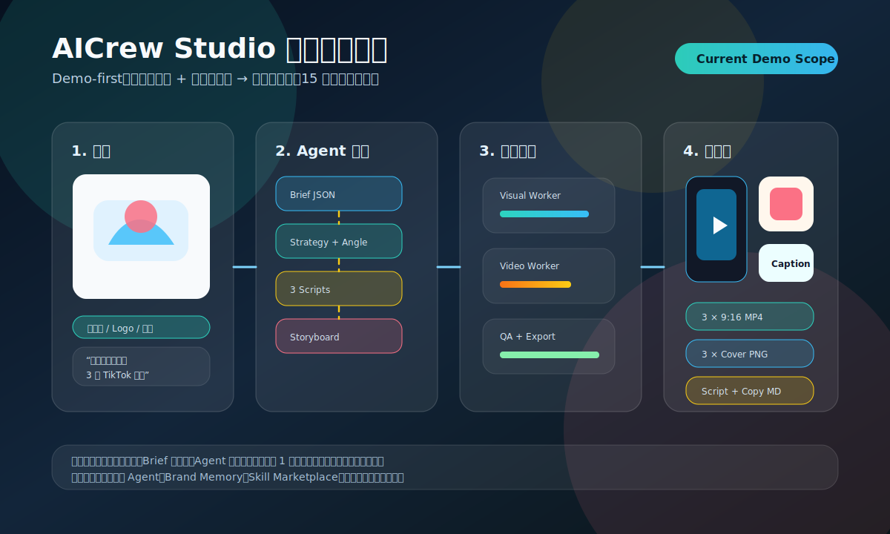

### 案例输入

| 输入项 | 示例 | 必填 | 当前实现处理 |
|---|---|---:|---|
| 商品图 | 1-3 张护肤品/小家电/服饰图 | ✅ | 上传后进入 Asset Library，生成缩略图和基础标签 |
| 商品名 | Hydrating Cream | ✅ | 写入 Creative Brief |
| 卖点 | 快速吸收、无油腻、适合敏感肌 | ✅ | Strategy Agent 提炼 Hook |
| 目标平台 | TikTok | ✅ | 默认 9:16、15 秒、前三秒强 Hook |
| 受众 | 18-30 岁通勤女性 | 建议 | 缺失时使用 Skill 默认画像 |
| 品牌元素 | Logo、主色、禁用词 | 可选 | Demo 先使用项目级 brand fields |

### 案例输出

| 输出 | 当前 Demo | 产品化版本 |
|---|---|---|
| 视频 | 1-3 条 9:16 MP4，15 秒左右 | 多平台多比例、多片段拼接、批量 A/B |
| 封面 | 每条视频 1 张 PNG | 可编辑封面、品牌模板、批量尺寸 |
| 脚本 | Hook、镜头、旁白、CTA | 分镜级时间轴、可保存为 Skill |
| 文案包 | 标题、Caption、Hashtag、CTA | 多语言、本地化平台风格 |
| QA 报告 | 商品可见性、Hook、CTA、合规风险 | 品牌一致性、平台政策、历史表现预测 |
| 积分明细 | 预估积分 + 成功扣费 | 供应商成本归因、失败退款、团队账单 |

### 当前实现流程

```mermaid
sequenceDiagram
    participant User as 用户
    participant Web as Web 工作台
    participant API as Creative Task API
    participant O as Orchestrator
    participant W as Workers
    participant M as Model Router
    participant Store as Data / Asset Store

    User->>Web: 上传商品图并输入目标
    Web->>API: 创建 project + creative task
    API->>Store: 保存素材、Brief、任务状态
    API-->>Web: 返回 task_id 和 estimated_credits
    API->>O: 入队 TikTok Product Ad Skill
    O->>W: 执行 Brief / Strategy / Script
    W->>Store: 写入脚本和分镜
    O->>W: 执行 Visual / Video
    W->>M: 请求图片/视频模型
    M-->>W: 返回生成资产
    W->>Store: 保存视频、封面、模型调用记录
    O->>W: 执行 QA / Export
    W->>Store: 保存 QA 报告和导出文件
    Store-->>Web: SSE 推送步骤与产物引用
    Web-->>User: 预览、重生成或下载内容包
```

### 实现切片

| 切片 | 必须实现 | 验收信号 |
|---|---|---|
| 输入层 | 项目创建、商品图上传、目标输入、Skill 选择 | 创建任务后能看到 task_id 和积分预估 |
| Agent 层 | Brief、Strategy、Script、Visual、Video、QA、Export 步骤 | 任务详情页展示每步 status 和 output |
| 模型层 | 至少 1 个 LLM + 1 个图像或视频供应商 | 有真实模型调用记录和失败 fallback |
| 资产层 | 上传素材、生成封面、生成视频、文案包 | Asset Library 可回看所有产物 |
| 质量层 | 基础审核、商品可见、CTA、平台比例检查 | QA 报告能阻止不合规导出 |
| 计费层 | estimated_credits、consume、refund | Credit Ledger 可追溯 |
| 导出层 | MP4、PNG、Markdown 文案包 | 用户可下载完整内容包 |

### 案例验收标准

1. 用户不需要写复杂 prompt，只需输入商品和目标。
2. 系统必须输出结构化 Brief、脚本、分镜和最终内容包。
3. 每个 Agent 步骤必须可追踪，有状态、有输入、有输出、有错误上下文。
4. 失败不会吞掉任务：用户能看到失败步骤、失败原因和可重试动作。
5. 积分扣费必须可解释：预估、实际消耗、失败退款都可查。
6. 导出包必须完整：视频、封面、标题、Caption、Hashtag、脚本、QA 报告。
7. 案例可以保存为 Skill，为下一次商品广告复用。

---

## 43.4 当前实现的信息架构与页面落点

| 页面 | Demo 中的作用 | 关键组件 |
|---|---|---|
| Landing Page | 解释“上传商品图生成广告内容包”的价值 | Hero、案例前后对比、价格入口 |
| Onboarding | 采集行业、平台、品牌基础信息 | Brand fields、目标平台、多语言 |
| Dashboard | 显示项目、积分、最近任务 | Project cards、Task status、Credit balance |
| Workbench | 当前实现核心页面 | Chat brief、Asset picker、Agent timeline、Preview |
| Project Detail | 保存脚本、分镜、版本、产物 | Version list、QA report、Export history |
| Export Center | 下载内容包 | MP4、PNG、Markdown、ZIP |
| Admin Tasks | 排查失败和成本 | Queue status、model calls、trace |

### 页面级流程图

```mermaid
flowchart TD
    A[Landing Page] --> B[Sign Up / Login]
    B --> C[Onboarding]
    C --> D[Dashboard]
    D --> E[Create Project]
    E --> F[Workbench]
    F --> G[Upload Assets]
    F --> H[Select TikTok Product Ad Skill]
    H --> I[Agent Timeline]
    I --> J[Preview Result]
    J --> K{满意吗}
    K -- 是 --> L[Export Center]
    K -- 否 --> M[Revise / Regenerate]
    M --> I
    L --> N[Save as Skill]
    N --> D
```

---

# 44. 核心判断：这个项目应该怎么做才不会变成普通 AI 工具

## 44.1 不要围绕模型做产品

错误路径：

```text
我们接入了很多模型，所以我们很强。
```

正确路径：

```text
用户不关心模型，用户关心能不能更快拿到可发布内容。
```

---

## 44.2 不要围绕 Prompt 做产品

错误路径：

```text
我们提供很多 prompt 模板。
```

正确路径：

```text
我们把 prompt、素材、品牌、流程、质检、导出封装成 Skill。
```

---

## 44.3 不要只生成单个结果

错误路径：

```text
生成一张图或一条视频。
```

正确路径：

```text
生成一个内容包：视频 + 封面 + 标题 + Caption + Hashtag + 脚本 + 分镜 + 可复用模板。
```

---

## 44.4 不要只做创作，要做复用

错误路径：

```text
每次用户重新输入需求。
```

正确路径：

```text
每次创作都沉淀品牌记忆、素材、历史结果和成功 Skill。
```

---

## 44.5 不要把 Agent 做成噱头

错误路径：

```text
页面上显示几个 Agent 头像。
```

正确路径：

```text
每个 Agent 有明确输入、输出、工具、状态、失败处理和质量标准。
```

---

# 45. 最终产品蓝图

```mermaid
flowchart TD
    A[AICrew Studio] --> B[自然语言创作入口]
    A --> C[多 Agent 内容团队]
    A --> D[Skill 工作流模板]
    A --> E[品牌记忆系统]
    A --> F[素材资产库]
    A --> G[多模型生成引擎]
    A --> H[在线编辑器]
    A --> I[导出与内容包]
    A --> J[数据反馈系统]
    A --> K[订阅积分商业化]

    B --> L[降低创作门槛]
    C --> M[提升流程完成度]
    D --> N[提升复用效率]
    E --> O[提升用户迁移成本]
    F --> P[沉淀数据资产]
    G --> Q[控制质量与成本]
    H --> R[提升结果可用率]
    I --> S[连接真实发布]
    J --> T[形成增长飞轮]
    K --> U[形成收入闭环]
```

---

# 46. 结论

AICrew Studio 的本质不是 AI 生图、生视频、修图或剪辑工具，而是：

> **一个以商业内容结果为中心的 AI 创意生产系统。**

从 RoboNeo 类产品的公开产品方向可以提炼出最重要的 5 个原则：

1. **自然语言不是聊天入口，而是生产指令入口。**
2. **Agent 不是角色包装，而是流程自动化单元。**
3. **Skill 不是模板，而是可复用的生产方法。**
4. **品牌记忆不是辅助功能，而是长期留存壁垒。**
5. **内容生成不是终点，可发布、可复用、可迭代才是终点。**

如果要基于这个逻辑开发一个完整新项目，最优路径不是做“大而全 AI 创作平台”，而是：

```text
第一阶段：
电商商品图 → 多版本短视频广告内容包

第二阶段：
社媒内容包 + 品牌库 + 更多 Skill

第三阶段：
团队协作 + 数据反馈 + 自定义 Skill

第四阶段：
Skill Marketplace + 企业 API + 内容增长操作系统
```

最终目标是把产品从一个“AI 工具”推进为：

> **AI Creative Operating System for Commerce, Social Media, and Video Storytelling.**

---

# 47. 公开参考来源

> 以下来源用于理解 RoboNeo 公开产品定位、功能结构、Agent Teams 方向、商业化方式与合规边界。实际开发新产品时，应避免复制对方品牌、UI、文案、图标、代码、素材、商标和具体专有设计。

1. RoboNeo 官网：https://www.roboneo.com/
2. RoboNeo AI Video Generator 页面：https://www.roboneo.com/ai-video-generator
3. RoboNeo User Agreement：https://www.roboneo.com/user-agreement
4. RoboNeo Privacy Policy：https://www.roboneo.com/privacy-policy
5. Meitu 官方媒体页面：https://www.meitu.com/en/media/
6. Meitu 发布 RoboNeo Agent Teams 相关公开信息：https://www.businesswire.com/news/home/20260430927187/en/Meitu-Upgrades-RoboNeo-with-Industry-First-Agent-Teams-for-Visual-Content-Creation
7. Meitu Multimedia Festival 相关公开信息：https://www.businesswire.com/news/home/20260617295605/en/2026-Meitu-Multimedia-Festival-Unveils-8-AI-Products-DeclaresYour-AI-Crew-Assembled.

---

# 附录 A：推荐研发里程碑检查清单

## A.1 第 1-2 周

- [ ] 确定 MVP 只做“商品图 → 广告视频内容包”
- [ ] 确定用户画像：跨境电商卖家 / 短视频运营
- [ ] 完成首页、工作台、Skill 页面、素材库、品牌库原型
- [ ] 确定首批 3 个 Skill
- [ ] 确定模型供应商与备用模型
- [ ] 建立任务状态机
- [ ] 建立积分成本模型

## A.2 第 3-6 周

- [ ] 完成注册登录
- [ ] 完成项目与素材库
- [ ] 完成 Brief Agent
- [ ] 完成 Strategy Agent
- [ ] 完成 Script Agent
- [ ] 完成 Storyboard Agent
- [ ] 完成图像生成链路
- [ ] 完成基础任务队列

## A.3 第 7-10 周

- [ ] 完成图生视频链路
- [ ] 完成文案包生成
- [ ] 完成 QA Agent
- [ ] 完成导出
- [ ] 完成积分扣费
- [ ] 完成失败重试
- [ ] 完成后台任务监控

## A.4 第 11-12 周

- [ ] 完成 Alpha 测试
- [ ] 修复主要失败路径
- [ ] 完成新用户引导
- [ ] 完成套餐页
- [ ] 完成案例页
- [ ] 上线 Public Beta

---

# 附录 B：首批后台管理指标

| 指标 | 说明 |
|---|---|
| 注册用户数 | 累计注册 |
| 活跃工作区 | 最近 7 天有生成任务 |
| 任务提交数 | 用户发起的创作任务 |
| 任务完成率 | completed / submitted |
| 任务失败率 | failed / submitted |
| 平均任务耗时 | submitted 到 completed |
| 视频生成成本 | 每条视频平均模型成本 |
| 单任务积分收入 | 每个任务实际消耗积分 |
| 毛利估算 | 积分价值 - 模型成本 |
| 导出率 | exported / completed |
| 首次导出率 | 新用户首个任务导出率 |
| 付费转化率 | paid users / registered users |
| Top Skill | 使用最多的 Skill |
| 高失败模型 | 失败率最高的模型供应商 |

---

# 附录 C：首批产品页面清单

| 页面 | 路由 | MVP |
|---|---|---:|
| Landing Page | / | ✅ |
| 登录 | /login | ✅ |
| 注册 | /signup | ✅ |
| Onboarding | /onboarding | ✅ |
| Dashboard | /dashboard | ✅ |
| 新建项目 | /projects/new | ✅ |
| 工作台 | /workbench/:projectId | ✅ |
| 项目列表 | /projects | ✅ |
| 项目详情 | /projects/:projectId | ✅ |
| 素材库 | /assets | ✅ |
| Skill Library | /skills | ✅ |
| Brand Kit | /brand | P1 |
| Billing | /billing | ✅ |
| Export Center | /exports | ✅ |
| Admin Dashboard | /admin | ✅ |
| Admin Tasks | /admin/tasks | ✅ |
| Admin Models | /admin/models | ✅ |

---

# 附录 D：推荐数据库枚举

```sql
CREATE TYPE user_role AS ENUM ('owner', 'admin', 'editor', 'viewer', 'guest');
CREATE TYPE project_type AS ENUM ('ecommerce_video', 'product_photo', 'social_pack', 'short_drama', 'brand_design');
CREATE TYPE task_status AS ENUM ('draft', 'queued', 'running', 'failed', 'completed', 'cancelled');
CREATE TYPE asset_type AS ENUM ('image', 'video', 'audio', 'document', 'logo');
CREATE TYPE asset_source AS ENUM ('upload', 'generated', 'imported');
CREATE TYPE credit_transaction_type AS ENUM ('grant', 'consume', 'refund', 'purchase', 'expire');
CREATE TYPE subscription_plan AS ENUM ('free', 'starter', 'pro', 'studio', 'business');
```

---

# 附录 E：首批 Skill YAML 示例

```yaml
id: ecom_tiktok_product_ad_v1
name: TikTok Product Ad
category: ecommerce_video
version: 1.0
estimated_credits: 120
required_inputs:
  - product_images
  - product_name
  - selling_points
  - target_audience
  - platform
optional_inputs:
  - brand_kit
  - reference_video
  - promotion_info
workflow:
  - agent: brief_agent
    output: creative_brief
  - agent: strategy_agent
    input: creative_brief
    output: strategy
  - agent: script_agent
    input: strategy
    output: scripts
    config:
      variants: 3
  - agent: storyboard_agent
    input: scripts
    output: storyboards
  - agent: visual_agent
    input: storyboards
    output: visual_assets
  - agent: video_agent
    input: visual_assets
    output: videos
  - agent: copywriting_agent
    input: videos
    output: copy_package
  - agent: qa_agent
    input:
      - videos
      - copy_package
    output: qa_report
  - agent: export_agent
    input:
      - videos
      - copy_package
      - qa_report
    output: export_package
quality_rules:
  - product_must_be_visible
  - hook_within_3_seconds
  - cta_required
  - avoid_medical_claims
  - match_platform_aspect_ratio
exports:
  - platform: tiktok
    aspect_ratio: '9:16'
    resolution: '1080x1920'
    format: mp4
  - platform: instagram_reels
    aspect_ratio: '9:16'
    resolution: '1080x1920'
    format: mp4
```

---

# 附录 F：项目决策摘要

| 决策 | 结论 |
|---|---|
| 首个垂直场景 | 电商广告短视频 |
| 首个核心用户 | 跨境电商卖家和社媒运营 |
| 首个核心输出 | 视频 + 封面 + 文案 + 脚本 + 分镜 |
| 核心壁垒 | Skill + Brand Memory + 数据闭环 |
| 商业化 | 订阅 + 积分包 |
| 技术核心 | Agent Orchestrator + Model Router + Asset Pipeline |
| MVP 周期 | 8-12 周 |
| 不建议首发做 | 大而全 AI 工具、全量移动端、自动投放、企业私有部署 |
