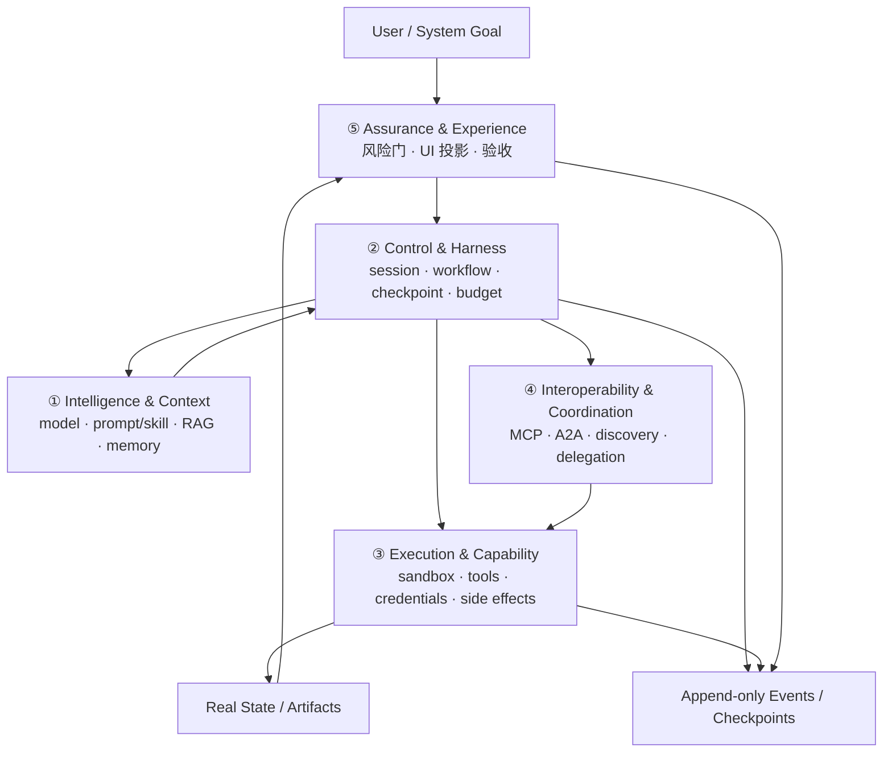

# 2026 Agent 发展趋势与五平面架构蓝图

> 证据截至：**2026-07-31**。本文优先采用官方工程文章、协议规范、标准机构材料和原始评测说明；产品版本、协议状态和 benchmark 数字会变化，落地前应重新核对原文。
>
> 关联入口：[课程导航](./navigation.md) · [第 19 章 · Agent 前沿发展与生态拆解](../lessons/19-agent-ecosystem-and-frontier/README.md) · [第 20 章 · Agent 前沿文章库](../lessons/20-agent-frontier-news/README.md) · [进阶 LangGraph 专题](../langgraph-advanced/README.md)

这份蓝图回答的不是“哪个 Agent 框架最好”，而是两个更稳定的问题：

1. 最近一年 Agent 工程真正发生了哪些结构性变化？
2. 怎样把这些变化吸收到一个可恢复、可验证、可治理的系统框架里？

## 先给结论

2026 年 Agent 的竞争单位正在从“模型 + prompt + loop”变成一套完整的工程系统：

```text
模型能力
  × 上下文与状态质量
  × harness 控制能力
  × 隔离执行与权限边界
  × 协议互操作
  × 结果验证与用户体验
```

因此，本文保留课程第 19 章已有的**八层生态视图**，再补一张**五平面生产架构视图**：

- 八层生态回答：缺的是模型、协议、SDK、runtime、数据、UI、观测还是安全？这一层该买、该用开源，还是手写？
- 五平面架构回答：一次真实任务里，谁管理上下文，谁控制状态，谁执行副作用，谁负责互操作，谁证明结果可信？

两张图不是替代关系。生态层偏选型，生产平面偏职责与契约。

## 证据口径

| 标签 | 本文含义 | 使用方式 |
|------|----------|----------|
| 已验证事实 | 能回到官方文档、规范、标准机构说明或原始研究页面的陈述 | 就近给出来源和日期，不把厂商案例外推成行业定律 |
| 工程推断 | 基于多条事实形成的架构判断 | 明确标成“推断”，并给出适用条件 |
| 未知项 | 当前公开证据无法稳定回答，或强依赖业务数据的问题 | 保留为上线前 gate，不用乐观假设填空 |
| 反证/限制 | 会让趋势失效、收益反转或指标被误读的条件 | 和正向信号一起呈现 |

## 七个高信号趋势

### 趋势一：Harness 正在成为能力边界

**已验证事实**

- OpenAI 在 2026-02-11 的 [Harness engineering](https://openai.com/index/harness-engineering/) 中，把仓库指令、工具、反馈环、测试和环境组织视为 coding agent 产出的关键组成。
- Anthropic 在 2025-11-26 的 [Effective harnesses for long-running agents](https://www.anthropic.com/engineering/effective-harnesses-for-long-running-agents) 中，用初始化 agent、持续编码 agent、进度文件和清晰状态交接解决跨上下文窗口任务。
- Anthropic 后续在 2026-03-24 的 [Harness design for long-running apps](https://www.anthropic.com/engineering/harness-design-long-running-apps) 中强调：harness 必须随模型变化重新评估，旧脚手架可能限制新模型。
- Vercel 在 2026-06-25 发布 [AI SDK 7](https://vercel.com/changelog/ai-sdk-7)，把可恢复的 `WorkflowAgent`、sandbox、tool approval、外部 harness adapters 和新版 telemetry 纳入 TypeScript agent 平台。

**工程推断**

Agent 平台的核心资产不再只是 prompt，而是可版本化的任务协议、工具描述、状态结构、恢复策略、验证命令和执行环境。模型可以替换，harness 仍应保留业务语义和证据链。

**反证/限制**

厂商内部案例不能直接证明某套 harness 对所有模型、所有仓库都有效。过度脚手架会增加 token、延迟和路径依赖；每次模型或工具升级都应做有/无 harness 对照。AI SDK 7 还要求 Node.js 22 与 ESM，这是一条需要显式迁移验证的 breaking boundary；支持可恢复 workflow 也不等于替代需要显式状态拓扑的复杂 graph。

### 趋势二：Session、Context、Memory、Artifact 开始分离

**已验证事实**

- Anthropic 在 2026-04-08 的 [Managed Agents](https://www.anthropic.com/engineering/managed-agents) 中，把 session 表达为追加式事件日志，把 harness 与隔离执行环境解耦，并支持重启、唤醒与跨进程恢复。
- OpenAI 在 2026-04-15 的 [The next evolution of the Agents SDK](https://openai.com/index/the-next-evolution-of-the-agents-sdk/) 中，把 sandbox、长周期任务、状态快照与恢复纳入 agent runtime 演进方向。
- Anthropic 的 [Effective context engineering for AI agents](https://www.anthropic.com/engineering/effective-context-engineering-for-ai-agents) 把上下文视为有限注意力预算，建议按需加载、压缩和外置笔记，而不是无限追加历史。

**工程推断**

生产系统至少要区分：

- `session`：任务身份与生命周期；
- `context`：本轮模型真正看到的工作集；
- `memory`：跨轮可检索、可更新的长期信息；
- `artifact`：代码、报告、数据等可独立验收的产物；
- `event log`：发生过什么以及如何恢复。

把它们都塞进 message history，会同时破坏可恢复性、成本和审计。

**反证/限制**

更多记忆不等于更好。错误摘要、过期偏好和被污染的长期记忆会稳定地放大错误；OWASP 在 2026-05-13 的 [Memory is a feature. It is also an attack surface](https://genai.owasp.org/2026/05/13/memory-is-a-feature-it-is-also-an-attack-surface/) 中专门提醒了持久化记忆的投毒面。

### 趋势三：上下文工程从“写 prompt”变成运行时调度

**已验证事实**

长任务 harness 与 context engineering 的共同做法包括：渐进披露、工作集裁剪、阶段性摘要、外置计划/进度、在需要时重新读取真实文件，而不是让单个上下文无限增长。

**工程推断**

上下文应像缓存和内存一样被管理：

```text
任务意图
  -> 选择当前阶段
  -> 加载最小规则/工具/证据
  -> 执行并写事件/产物
  -> 压缩可恢复摘要
  -> 下一阶段重新装配
```

最重要的指标不是“用了多少上下文”，而是进入上下文的每个 token 是否改变当前决策。

**未知项**

不存在跨模型通用的最佳压缩阈值。摘要频率、检索 top-k、工具说明长度和上下文保留策略必须用本项目的成功率、成本和恢复质量校准。

### 趋势四：协议正在分层，而不是由一个协议包办一切

**已验证事实**

- [MCP 2026-07-28 specification](https://modelcontextprotocol.io/specification/2026-07-28) 继续定义 AI 应用与工具、资源和上下文能力之间的协议边界，并推进无状态核心、扩展、授权与一致性测试。
- [A2A v1.0 specification](https://a2a-protocol.org/latest/specification/) 面向独立 agent 的能力发现、消息、任务状态与 artifact 交换。[v1.0 announcement](https://a2a-protocol.org/latest/announcing-1.0/) 将其定义为首个 stable、production-ready 版本，并加入多协议绑定、版本协商、多租户与签名 Agent Card；interaction protocol 存在 breaking changes，但 Agent Card 可以同时声明 v0.3 与 v1.0 以支持渐进迁移。
- Linux Foundation 在 [Agentic AI Foundation](https://www.linuxfoundation.org/press/linux-foundation-announces-the-formation-of-the-agentic-ai-foundation) 中把 MCP、goose 与 AGENTS.md 等项目纳入中立治理。

**工程推断**

至少要分清三类契约：

| 契约 | 连接什么 | 不能替代什么 |
|------|----------|--------------|
| Tool/Context Protocol | Agent 与工具、资源、上下文能力 | 业务工作流和 agent 身份治理 |
| Agent-to-Agent Protocol | 独立 agent 的发现、委托、状态与 artifact | 进程内函数调用和全局一致性 |
| Product Event Protocol | token、步骤、审批、引用、错误如何投影给 UI | 工具授权和跨组织认证 |

**反证/限制**

协议只解决“怎样说话”，不会自动解决对方是否可信、权限是否最小、版本是否兼容、失败如何补偿。协议接入必须和身份、授权、审计、超时、幂等一起验收。

### 趋势五：Multi-agent 从默认叙事回到拓扑选择

**已验证事实**

Google Research 在 2026-01-28 的 [Towards a science of scaling agent systems](https://research.google/blog/towards-a-science-of-scaling-agent-systems-when-and-why-agent-systems-work/) 中比较了 180 组配置：集中式多 agent 在可并行金融任务上最高提升 80.9%，但在顺序依赖任务上多种多 agent 方案下降 39%–70%；独立 agent 的错误放大明显高于集中协调。

**工程推断**

是否多 agent 应由任务拓扑决定：

- 可独立分片、能分别验收、上下文差异大：适合并行 worker；
- 强顺序依赖、共享状态频繁、修复需要同一心智模型：优先单 agent 或确定性 workflow；
- 需要专业分工但必须统一决策：用 manager-worker，并让 manager 持有最终状态；
- 只是想“多想几遍”：先用单 agent 的反思/验证环，不要先引入通信成本。

**反证/限制**

多 agent 的收益必须扣除 token、等待、冲突合并和错误传播成本。单次演示中“看起来更聪明”不等于单位成功任务成本更低。

### 趋势六：评估从最终答案扩展到轨迹和真实状态

**已验证事实**

- Anthropic 在 2026-01-09 的 [Demystifying evals for AI agents](https://www.anthropic.com/engineering/demystifying-evals-for-ai-agents) 中区分 task、trial、grader、transcript、outcome、eval harness 与 agent harness，并建议对随机系统运行多次 trial。
- OpenAI 在 2026-07-08 的 [Separating signal from noise in coding evaluations](https://openai.com/index/separating-signal-from-noise-coding-evaluations/) 中估计 SWE-Bench Pro 约 30% 任务存在破损或有效性问题，说明 benchmark 本身也需要审计。
- METR 的 [Time Horizon](https://metr.org/time-horizons/) 明确提醒：时间跨度衡量的是某成功概率下、任务对应的人类完成时长，不是 agent 能连续自治多久；超过 16 小时的估计仍不稳定。

**工程推断**

最小生产评估应同时验证：

1. `outcome`：数据库、文件、工单或环境最终状态是否正确；
2. `trajectory`：工具、参数、顺序、重试和审批是否合规；
3. `evidence`：结论能否回到来源、日志、state diff 或测试；
4. `economics`：每个成功任务的成本、延迟和人工介入；
5. `stability`：多次 trial、边界输入和恢复路径是否稳定。

**反证/限制**

高分可能来自数据泄漏、无效任务、grader 漏洞或 harness 特化。任何 benchmark 数字都必须同时报告任务集、环境、模型版本、harness、预算和失败定义。

### 趋势七：安全从“每次询问用户”转向确定性隔离与身份治理

**已验证事实**

- Anthropic 在 2026-05-25 的 [How we contain Claude](https://www.anthropic.com/engineering/how-we-contain-claude) 中指出，依赖频繁权限弹窗会造成审批疲劳，并把 VM、sandbox、网络出口和凭证隔离作为确定性边界。
- NIST 在 2026-02 宣布 [AI Agent Standards Initiative](https://www.nist.gov/news-events/news/2026/02/announcing-ai-agent-standards-initiative-interoperable-and-secure)；agent 身份与授权材料当前仍是 [Initial Public Draft（概念草案）](https://csrc.nist.gov/pubs/other/2026/02/05/accelerating-the-adoption-of-software-and-ai-agent/ipd)，它说明互操作必须与身份、认证、委托权限和审计一起设计，但不是已稳定标准。
- OpenTelemetry 在 [AI agent observability](https://opentelemetry.io/blog/2025/ai-agent-observability/) 中说明 agent 观测语义仍在演进，现阶段需要保留厂商事件到内部稳定 schema 的适配层。

**工程推断**

安全边界应尽量发生在模型之前和模型之外：

- 凭证按任务、租户和工具动态收缩；
- 文件、网络、进程和浏览器执行放进隔离环境；
- 写操作使用幂等键、预算、租约和 state diff；
- 高风险节点让人确认“证据 + 影响 + 可回滚方式”，而不是只显示一个 Approve；
- 所有委托都带主体、授权范围、期限和审计关联 id。

**未知项**

A2A v1.0 的基础协议已经稳定，但跨组织 agent 身份、不可抵赖委托、实现一致性和长期记忆治理仍在快速演进。不要把协议稳定误写成跨域信任与治理控制面已经完成。

## 五平面生产架构



### 平面一：Intelligence & Context

负责模型选择、指令、skills、RAG、短期工作集、长期记忆读取和上下文预算。

- 输入契约：目标、当前状态、允许读取的证据、输出 schema；
- 输出契约：候选决策、结构化意图、引用和不确定性；
- 不负责：进程存活、工具副作用、最终业务状态确认。

### 平面二：Control & Harness

负责 session 生命周期、workflow/loop、阶段切换、checkpoint、取消、重试、预算、租约和恢复。

- 输入契约：目标、当前 checkpoint、policy snapshot；
- 输出契约：下一状态、执行意图、事件、恢复点；
- 不负责：直接持有高权限凭证或把模型文本当作已完成结果。

### 平面三：Execution & Capability

负责 sandbox、文件/网络/浏览器/代码工具、凭证注入、超时、幂等和副作用。

- 输入契约：经过校验的 capability request、主体、范围、预算、幂等键；
- 输出契约：结果、错误上下文、state diff、artifact、审计 id；
- 不负责：自主扩大权限或决定任务是否最终成功。

### 平面四：Interoperability & Coordination

负责 MCP、A2A、能力发现、版本协商、委托拓扑、task/artifact/status 交换。

- 输入契约：协议版本、能力声明、认证上下文、任务边界；
- 输出契约：可追踪委托、状态、artifact 引用、兼容性错误；
- 不负责：替代内部 workflow、对远端声明盲目信任。

### 平面五：Assurance & Experience

负责用户可见事件、HITL、trace、eval、policy gate、成本/SLO、结果验收和回滚入口。

- 输入契约：轨迹事件、真实 state diff、引用、成本、风险；
- 输出契约：通过/阻断/需人工、可解释 UI 投影、回归样本；
- 不负责：把“日志存在”误当成“结果正确”。

## 八层生态如何映射到五平面

| 八层生态视图 | 主要生产平面 | 说明 |
|--------------|--------------|------|
| 模型接口层 | Intelligence & Context | 模型只是决策部件，不持有任务生命周期 |
| 工具协议层 | Execution + Interoperability | 工具执行与协议连接必须分开 |
| Agent SDK 层 | Control & Harness | SDK 常封装 loop、handoff、session、trace |
| 编排 runtime 层 | Control & Harness | checkpoint、interrupt、durable execution 属控制职责 |
| 数据/RAG 层 | Intelligence & Context | 负责证据与记忆，不直接证明业务结果 |
| 产品/UI 层 | Assurance & Experience | 把内部事件投影成进度、审批、引用和错误 |
| 观测评估层 | Assurance & Experience | 同时看 outcome、trajectory、cost 与稳定性 |
| 安全治理层 | Control + Execution + Assurance | 安全是跨平面约束，不是末尾过滤器 |

## 最小跨平面事件契约

框架之间可以替换，但事件语义应尽量稳定：

```ts
type AgentEvent =
  | { type: "session.started"; sessionId: string; goal: string }
  | { type: "step.planned"; stepId: string; evidenceRefs: string[] }
  | { type: "capability.requested"; tool: string; risk: "read" | "write" | "high" }
  | { type: "approval.required"; reason: string; impact: string; rollback?: string }
  | { type: "artifact.created"; artifactId: string; mediaType: string }
  | { type: "state.changed"; target: string; beforeHash?: string; afterHash: string }
  | { type: "task.completed"; outcomeEvidence: string[] }
  | { type: "task.failed"; code: string; message: string; recoverable: boolean };
```

关键原则：

- 模型输出的是**意图**，执行平面返回的是**事实**；
- trace 记录的是**发生过什么**，grader 判断的是**是否满足目标**；
- checkpoint 用于**恢复**，artifact 用于**交付与验收**；
- UI 只消费稳定事件，不直接解析某个框架的内部回调。

## 成熟度 L0–L4

| 等级 | Intelligence & Context | Control & Harness | Execution & Capability | Interop & Coordination | Assurance & Experience |
|------|------------------------|-------------------|------------------------|------------------------|------------------------|
| L0 Demo | 单 prompt / 全历史 | 内存 loop | 直接调用工具 | 私有函数 | 看最终文本 |
| L1 Bounded Workflow | 结构化输出、最小上下文 | 有界步骤、显式停止 | allowlist、参数校验、超时 | 固定 adapter | 日志 + 离线 smoke |
| L2 Recoverable Product | RAG/记忆分层、版本化摘要 | session、checkpoint、取消、恢复 | sandbox、幂等写、错误上下文 | MCP 版本/能力协商 | trace、固定 eval、HITL、引用 |
| L3 Governed Platform | 按任务装配上下文、模型路由 | policy snapshot、预算、租约、队列 | 动态最小权限、凭证隔离、state diff | 选择性 A2A、身份与委托审计 | outcome + trajectory gate、红队、SLO |
| L4 Adaptive Portfolio | 以线上失败更新策略但可回滚 | 多 runtime 统一控制契约 | 短生命周期环境、能力供应链治理 | conformance、跨域信任策略 | 持续评估、成本/质量前沿、自动降级 |

成熟度不是“功能越多等级越高”。如果场景只需要 L1，有边界的 L1 比不可解释的 L3 更可靠。

## 决策矩阵

| 场景 | 默认形态 | 需要升级的信号 | 不要先做什么 |
|------|----------|----------------|--------------|
| 单轮知识问答 | 单 agent + RAG | 引用错误、权限隔离、连续追问 | 不要先上多 agent |
| 确定性业务流程 | workflow + 局部模型节点 | 分支爆炸、需要人工判断 | 不要让模型接管所有控制流 |
| 长周期研究/编码 | harness + session + artifact | 跨窗口、重启、并行子任务 | 不要只依赖上下文压缩 |
| 有写副作用的自动化 | control + isolated execution | 多租户、批量写、不可逆操作 | 不要把确认弹窗当唯一防线 |
| 多客户端复用工具 | MCP + capability policy | 版本协商、远程认证、资源订阅 | 不要复制多套私有 connector |
| 跨组织 agent 委托 | A2A + identity + audit | 异步任务、artifact 交付、跨域授权 | 不要把进程内 worker 包装成“开放 agent” |
| 可并行宽任务 | manager-worker | 子任务可独立验收且上下文不同 | 不要共享一个可变全局草稿 |
| 强顺序依赖任务 | 单 agent / deterministic graph | 某阶段可稳定独立验收时再拆 | 不要因“更智能”默认多 agent |
| 高风险决策 | evidence gate + human owner | 风险可量化、回滚可验证后再自动化 | 不要让 LLM judge 成为唯一裁判 |

## 落到当前仓库

| 当前能力 | 主要章节/模块 | 对应平面 |
|----------|---------------|----------|
| 手写 loop、工具 schema 与 registry | 第 04–06 章 | Control / Execution |
| context、memory、RAG | 第 07–09 章、`rag-advanced` | Intelligence & Context |
| 多 agent 拓扑 | 第 11 章 | Interoperability & Coordination |
| LangGraph 状态、checkpoint、HITL | 第 12 章、`langgraph-advanced` | Control & Harness |
| streaming 与用户步骤投影 | 第 14 章 | Assurance & Experience |
| eval、trace、cost | 第 15–16 章 | Assurance & Experience |
| guardrails、sandbox 思维与部署 | 第 17–18 章 | Execution / Assurance |
| 生态与协议选型 | 第 19–20 章 | 五平面横向映射 |

当前最有价值的继续演进方向，不是再造一个全能 orchestrator，而是补齐可验证的薄契约：

1. 用稳定事件 schema 隔离 LangGraph/SDK 内部事件和前端投影；
2. 把 session、context、memory、artifact、event log 明确分开；
3. 为工具执行补主体、权限范围、预算、幂等键和 state diff；
4. 只在可并行且可独立验收时使用多 agent；
5. 用 outcome + trajectory + 成本共同决定是否晋级。

## 反证、未知项与上线 gate

### 已知不能直接外推

- 厂商内部 agent 使用数据不能代表普通团队的基线。
- 单一 benchmark 排名不能脱离 harness、预算、任务有效性和环境版本。
- “支持 MCP/A2A”不等于互操作、安全和失败恢复已经完成。
- “有 HITL”不等于人能做出高质量判断；审批界面必须给证据、影响和回滚信息。
- “有 memory”不等于长期正确；记忆需要来源、版本、TTL、删除与投毒检测。

### 项目必须自己回答

- 哪类失败最贵：错误结果、漏结果、延迟、人工成本还是越权？
- session 保留多久，谁能读取，怎样删除和导出？
- 哪些 side effect 可幂等重试，哪些必须事务或人工恢复？
- 多 agent 是否真的提高每个成功任务的质量/成本比？
- 哪个真实状态是最终 truth：文本答案、文件 hash、数据库 state diff、测试结果还是人工签字？

### 上线前最小 gate

- 有固定任务集和多次 trial，而不是只演示 happy path；
- 关键工具有 allowlist、超时、错误上下文和审计；
- 写操作有幂等/事务/回滚边界；
- session 可暂停、恢复、取消；
- UI 能区分进行中、需审批、已完成、可恢复失败和不可恢复失败；
- 完成态由真实 outcome evidence 驱动，不由模型一句“完成了”驱动；
- 版本、协议、模型、prompt/skill、harness 和评测数据都可追踪。

## 一句话原则

> 让模型负责提出下一步，让 harness 负责控制下一步，让隔离环境负责执行下一步，让证据负责证明这一步真的完成。
