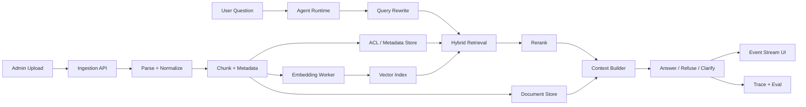

# 企业知识库 Agent 蓝图

> 关联入口：[课程导航](./navigation.md) · [企业知识库 Agent Capstone](../capstone/enterprise-knowledge-base-agent/README.md) · [RAG 完整架构蓝图](./rag-architecture.md) · [RAG 系统实战项目](./rag-system-project.md) · [进阶 LangGraph 专题](../langgraph-advanced/README.md)

这份蓝图补齐一条纵向路线：把课程里的 agent loop、工具、记忆、RAG、流式 UX、评估、部署，串成一个“企业级知识库 Agent”作品集项目。

它不替代主课。主课仍然是“先手写，后框架”。这份文档回答的是：学完之后，怎样把这些能力组合成一个接近真实产品的系统。

如果你已经决定动手做，直接进入 [毕业项目 · 企业知识库 Agent](../capstone/enterprise-knowledge-base-agent/README.md)。蓝图负责“系统应该长什么样”，capstone 负责“怎么拆任务、怎么验收、怎么写进作品集”。

## 最小产品形态

目标用户不是“随便聊天”，而是企业内部成员围绕私有资料做问答、检索、总结和任务跟进。

```text
上传资料 -> 索引入库 -> 提问 -> 检索证据 -> Agent 判断是否需要工具/追问/拒答
       -> 流式展示过程 -> 返回答案和引用 -> 记录 trace/eval/反馈
```

最小 MVP 只做 5 件事：

1. 上传或导入 Markdown / PDF / 网页文本。
2. 按 collection 建知识库，并保留 document version。
3. 用 hybrid retrieval + rerank 找证据。
4. 用 Agentic RAG 决策：答、改写后再检索、请求澄清、拒答。
5. 用事件流展示 token、工具调用、检索证据、引用和错误。

## 端到端架构



## 模块拆分

| 模块 | 课程来源 | 作品集里要补什么 |
|------|----------|------------------|
| Agent loop | 第 04-06 章 | tool registry、权限、超时、错误上下文 |
| 短期记忆 | 第 07 章 | session memory、摘要、用户偏好隔离 |
| RAG 基础 | 第 08-09 章 | 文档版本、引用校验、无答案拒答 |
| 进阶 RAG | `rag-advanced` | hybrid、rerank、query rewrite、eval、安全 |
| LangGraph | `langgraph-advanced` | checkpointer、HITL、multi-agent、event streaming |
| 流式 UX | 第 14/18 章 | token/tool/state/citation/error 统一事件协议 |
| 可观测 | 第 16 章 | trace 页面、成本统计、失败样本回放 |
| 部署 | 第 18 章 | Docker compose、worker、queue、health check |

## 基础设施选型

先用内存/JSON 把接口跑通，再换真实基础设施。不要在第一天就把学习者拖进一堆服务。

| 能力 | 本地教学版 | 作品集版 | 生产版 | 何时升级 |
|------|------------|----------|--------|----------|
| 文档元数据 | JSON 文件 | PostgreSQL | PostgreSQL + migration + audit | 需要多 collection / 多用户 |
| 向量检索 | `MemoryVectorStore` | pgvector / Milvus | Milvus / Qdrant / OpenSearch vector | 数据量超过内存或要过滤 |
| 全文检索 | 本地 BM25 | ElasticSearch / OpenSearch | ElasticSearch / OpenSearch | 精确术语、型号、中文分词重要 |
| 图谱关系 | Markdown heading / metadata | Neo4j 可选 | Neo4j / Graph DB 可选 | 需要实体关系推理和 Graph RAG |
| 会话短期记忆 | 进程内对象 | Redis | Redis cluster | 多实例部署或会话恢复 |
| 长期记忆 | 手写摘要 / JSON | Postgres + vector memory | Mem0-style memory service | 需要跨会话用户偏好和事实 |
| 原始文件 | 本地目录 | S3/R2/OSS | Object storage + lifecycle | 文件大、需审计和回放 |
| 异步任务 | 手动脚本 | queue + worker | queue + retry + DLQ | 解析/embedding 不该阻塞 API |

选型原则：

- **先接口，后实现**：先定义 `VectorIndex`、`DocumentStore`、`MemoryStore`，再替换 Milvus/Redis/Neo4j。
- **检索先控权限**：ACL 必须进入 retriever filter，不靠回答后处理兜底。
- **重服务进 capstone**：Milvus、ElasticSearch、Neo4j、Redis 适合 Docker compose 作品集，不适合基础章节前置。

## 记忆分层

企业知识库 Agent 至少有 5 层记忆，每层生命周期不同：

| 层 | 存什么 | 生命周期 | 典型存储 | 风险 |
|----|--------|----------|----------|------|
| 当前轮 context | 本轮问题、检索证据、工具结果 | 单次请求 | 内存 | 太大、引用混乱 |
| 会话短期记忆 | 最近多轮消息、任务目标、未完成事项 | 一个 session | 内存 / Redis | 泄露其他用户上下文 |
| 摘要记忆 | 被压缩的旧对话、关键决策 | session 或 thread | Redis / Postgres | 摘要丢事实或编造 |
| 用户长期记忆 | 偏好、角色、常用项目、稳定事实 | 跨会话 | Postgres + vector | 隐私、过期事实 |
| 组织知识库 | 文档、SOP、政策、代码说明 | 长期、可版本化 | Document DB + vector DB | 权限、陈旧、注入 |

判断口诀：**会话状态进 Redis，稳定事实进长期记忆，企业资料进 RAG，过程证据进 trace。**

## 事件流协议

企业知识库 Agent 的 UI 不应只流 token。用户需要知道系统正在检索、调用工具、等待审批，还是已经拒答。

```ts
type AgentUiEvent =
  | { type: "token"; text: string }
  | { type: "status"; stage: "rewrite" | "retrieve" | "rerank" | "answer" }
  | { type: "tool_call"; name: string; args: Record<string, unknown> }
  | { type: "tool_result"; name: string; ok: boolean; preview: string }
  | { type: "evidence"; chunkId: string; title: string; score: number }
  | { type: "citation"; label: string; chunkId: string; uri: string }
  | { type: "memory"; action: "read" | "write" | "summarize"; scope: string }
  | { type: "approval_required"; reason: string; payload: unknown }
  | { type: "error"; code: string; message: string }
  | { type: "done"; traceId: string };
```

实现顺序：

1. 第 14 章先流文本和 `onStep`。
2. 第 18 章把事件包装成 SSE。
3. LangGraph L6 把 `updates` / `values` / `custom` 归一化成 UI event。
4. 企业知识库项目把 retrieval、citation、memory、approval 全部接入同一事件流。

## 定时任务型 Agent

企业知识库不是只有“用户问一句”。真实产品常有后台 Agent：

| 任务 | 输入 | 输出 | 风险控制 |
|------|------|------|----------|
| 每日知识库增量同步 | 外部文档源 | 新增/更新/删除 job | 幂等 upsert、失败重试 |
| 每周知识缺口报告 | trace + unanswered queries | 缺失文档清单 | 不自动编造资料 |
| 每日研究摘要 | RSS / 网页 / 内部源 | digest + citation | 来源白名单、去重 |
| 过期资料巡检 | document metadata | stale document list | 人工确认再归档 |
| 高风险问题监控 | query logs | security/eval alerts | PII 脱敏、最小保留 |

这类 Agent 的重点不是“更聪明”，而是**可重复、可审计、可恢复**。实现时优先复用第 15-18 章的 eval、trace、deployment 能力。

## 里程碑

### M0：仓库内可跑原型

- 复用 `MemoryVectorStore`。
- 只支持 Markdown/text。
- CLI 问答返回 answer + citations。
- 用固定 fixtures 跑 smoke。

### M1：作品集级知识库

- Web 上传 + 后台 indexing job。
- PostgreSQL metadata + pgvector 或 Milvus。
- Hybrid retrieval + rerank + citation check。
- SSE 事件流展示检索、证据、工具、答案。
- Trace 页面和 eval set。

### M2：企业级增强

- 多租户 ACL。
- Redis session memory + long-term memory。
- HITL 审批门。
- 定时同步和知识缺口报告。
- Docker compose 一键启动 API / worker / DB / vector / Redis。

## 验收清单

- [ ] 没有资料时拒答，不编造。
- [ ] 每个答案都有真实 citation，且 citation 来自本次 context。
- [ ] 权限过滤在 retrieval 阶段生效。
- [ ] 文档更新后旧 chunk 不污染新答案。
- [ ] 事件流能展示 status、evidence、tool、token、error、done。
- [ ] trace 能回放一次回答的 query rewrite、retrieval、rerank、context、cost。
- [ ] eval set 能拦住 retrieval 退化和 citation 退化。
- [ ] 定时任务可幂等重跑，失败有 retry / dead-letter 记录。
