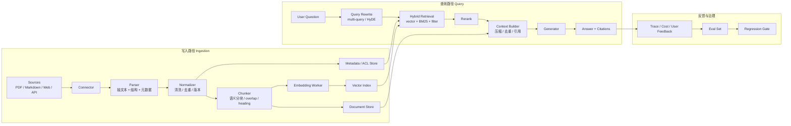
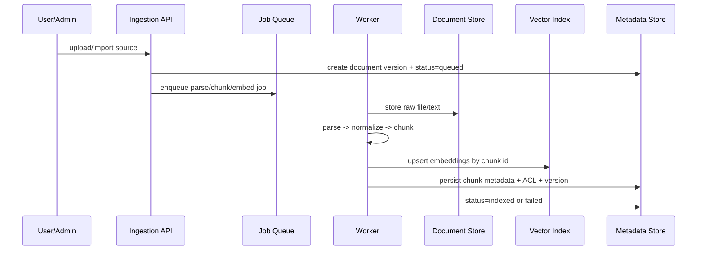
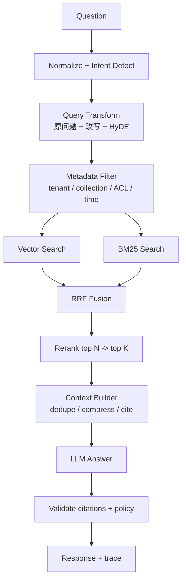
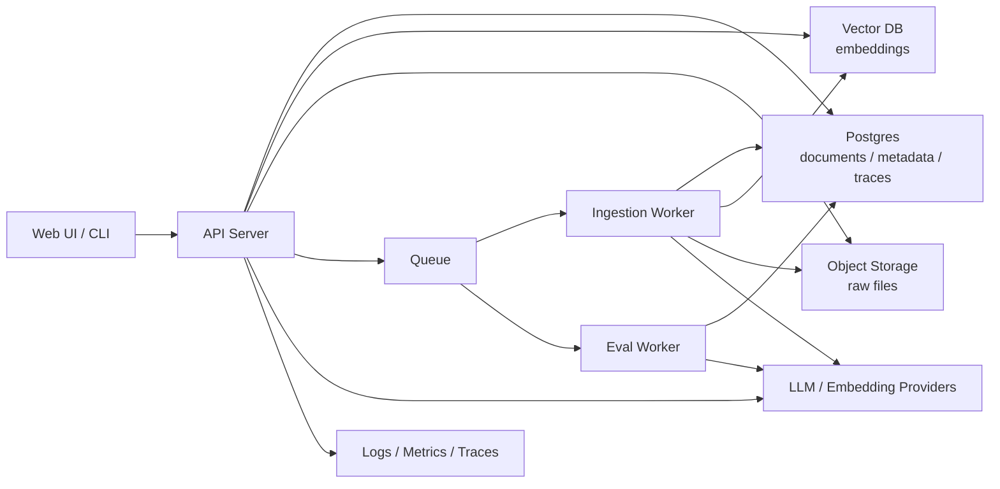

# RAG 完整架构蓝图

> 关联入口：[课程导航](./navigation.md) · [企业知识库 Agent 蓝图](./enterprise-knowledge-base-agent.md) · [RAG 系统实战项目](./rag-system-project.md) · [进阶 RAG 专题](../rag-advanced/01-chunking-strategies/README.md)

这份文档回答一个问题：学完第 08/09 章和 `rag-advanced` 后，怎样把 RAG 从“能跑的教学 demo”升级成“可长期维护的知识库产品”。

简版路径：

```text
08/09 最小 RAG
  -> rag-advanced 进阶能力
  -> 本文档的系统架构
  -> 企业知识库 Agent 蓝图
  -> songuu/rag-system 独立作品集项目
```

## 架构目标

- **证据可追溯**：答案必须能回到 chunk、文档、版本和来源链接。
- **更新可持续**：文档新增、修改、删除后，索引可增量更新，不靠全量重建。
- **质量可度量**：坏答案能定位到 ingestion、chunking、retrieval、rerank、context 或 generation。
- **权限可隔离**：检索阶段就过滤 tenant、workspace、role、document ACL，不能等答案后处理。
- **成本可控**：召回、精排、生成、评估分层用模型，不把所有步骤都交给最贵模型。
- **接口可替换**：向量库、embedding 模型、LLM、reranker 都通过接口隔离，课程代码不绑定单一厂商。

## 总览



## 分层职责

| 层 | 负责什么 | 不负责什么 | 课程对应 |
|----|----------|------------|----------|
| Interface | CLI、HTTP API、网页上传、聊天入口 | 检索算法细节 | 第 18 章、毕业项目 |
| Application | collection、document、query、session 用例编排 | 直接调用厂商 SDK | 毕业项目、`ragPipeline.ts` |
| Ingestion | 连接器、解析、清洗、去重、chunk、embedding job | 回答用户问题 | R1、R6 |
| Retrieval | metadata filter、BM25、向量检索、RRF、top-k | 生成最终答案 | R2、`HybridRetriever` |
| Rerank | 多召回候选精排、压缩到少量高信号 chunk | 取代权限过滤 | R3 |
| Generation | context 注入、引用约束、结构化答案 | 伪造未检索来源 | 第 09 章、R6 |
| Evaluation | context relevance、faithfulness、answer relevance、回归集 | 线上权限控制 | R5、第 15 章 |
| Governance | ACL、审计、PII、prompt injection 防护、保留策略 | 排序算法本身 | 第 17 章 |
| Infrastructure | DB、vector DB、object storage、queue、worker、observability | 业务语义判断 | 第 16/18 章 |

## 写入路径

写入路径的核心目标是：把“不稳定的外部资料”变成“可检索、可溯源、可回滚的证据单元”。



关键设计：

- **Document version 是索引边界**：每次导入生成版本号，chunk 绑定 `documentId + version`，方便回滚和重建。
- **Chunk id 稳定**：推荐由 `documentId + version + chunkIndex + contentHash` 生成，避免重复 upsert。
- **Metadata 先于 embedding**：tenant、collection、source type、createdAt、ACL、tags 都要在入库前确定，因为检索过滤依赖它。
- **失败可重试**：parse、chunk、embed、upsert 分阶段记录状态，失败 job 可从中间阶段恢复。
- **删除是双写**：删除文档必须同时 tombstone metadata、删除向量、保留审计记录。

## 查询路径

查询路径的核心目标是：在权限允许的材料里，拿到“足够覆盖但不过载”的证据，再让模型只基于证据作答。



关键设计：

- **过滤先发生**：ACL 和 metadata filter 必须进入 retriever 查询条件，避免越权 chunk 进入候选池。
- **召回追求覆盖，精排追求准确**：第一段可以多路召回 top 30-100；第二段精排压到 top 5-10。
- **Context Builder 是独立模块**：负责去重、按来源合并、压缩、排序、加引用标签，不把这些逻辑塞进 prompt 字符串拼接。
- **答案后验校验**：返回前检查引用 ID 是否存在、是否属于本次 context、是否命中权限范围。
- **Trace 必须贯穿**：记录 query、改写、候选、精排分、最终 context、模型用量、引用和用户反馈。

## 核心数据模型

```ts
type DocumentSource = {
  id: string;
  tenantId: string;
  collectionId: string;
  uri: string;
  type: "pdf" | "markdown" | "html" | "text" | "api";
  acl: string[];
};

type DocumentChunk = {
  id: string;
  documentId: string;
  version: string;
  text: string;
  headingPath: string[];
  tokenCount: number;
  metadata: Record<string, string | number | boolean>;
};

type RetrievalRequest = {
  question: string;
  tenantId: string;
  collectionId: string;
  filters: Record<string, string | number | boolean>;
  topK: number;
};

type RetrievedEvidence = {
  chunk: DocumentChunk;
  score: number;
  source: "vector" | "bm25" | "fusion" | "rerank";
  citationLabel: string;
};

type RagAnswer = {
  answer: string;
  citations: Array<{ label: string; chunkId: string; documentId: string; uri: string }>;
  traceId: string;
};
```

这些类型不是要求一次性实现，而是用来约束边界：chunk 不等于 document，retrieval 不等于 generation，answer 必须携带 citation。

## 与当前仓库的映射

| 当前资产 | 已覆盖 | 升级到独立系统时补什么 |
|----------|--------|------------------------|
| `lessons/08-embeddings-and-vector-search` | embedding、余弦相似度、top-k | 持久化索引、metadata filter、批量 upsert |
| `lessons/09-rag-from-scratch` | load、chunk、retrieve、augment、citation | 文档版本、权限、trace、引用校验 |
| `src/shared/rag/chunk.ts` | 滑窗、递归、Markdown chunk | parser 适配 PDF/HTML/Office，chunk 质量统计 |
| `src/shared/rag/hybridRetriever.ts` | vector + BM25 + RRF | 接真实 vector DB、全文索引服务 |
| `src/shared/rag/rerank.ts` | LLM rerank | cheaper cross-encoder / batch rerank / timeout fallback |
| `src/shared/rag/queryTransform.ts` | multi-query、HyDE | intent router、query cache、改写质量评估 |
| `src/shared/rag/evaluate.ts` | 三指标 LLM judge | 固定 eval set、CI gate、线上抽样复盘 |
| `src/shared/rag/ragPipeline.ts` | 组合式问答管线 | session、多租户、trace、policy、API |
| `capstone/deep-research-agent` | RAG 作为 agent 工具 | 把 RAG service 独立化，再让 agent 远程调用 |
| `songuu/rag-system` | 独立作品集方向 | 按本文档补齐产品级模块边界 |

## API 边界建议

最小产品不需要很多接口，但边界要清楚：

| API | 用途 | 返回重点 |
|-----|------|----------|
| `POST /collections` | 创建知识库 | collection id、默认配置 |
| `POST /collections/:id/documents` | 上传或导入文档 | document id、version、job id |
| `GET /documents/:id/status` | 查看解析/索引状态 | queued/indexing/indexed/failed |
| `POST /collections/:id/query` | 知识库问答 | answer、citations、trace id |
| `GET /traces/:id` | 调试一次回答 | rewritten queries、retrieved chunks、rerank scores、cost |
| `POST /eval-runs` | 跑固定评估集 | score、失败样本、回归 diff |

## 部署拓扑



部署原则：

- API server 保持无状态；长任务进入 queue。
- ingestion worker 与 query API 分离，避免大文件解析拖慢问答。
- vector DB 与 metadata DB 双写必须有 job 状态表兜底。
- eval worker 独立运行，避免评估流量影响线上问答。
- trace 存储默认保留短周期；含敏感数据的 context 需要脱敏或按租户策略保留。

## 基础设施选型矩阵

先用课程里的内存实现把边界跑通，再按瓶颈替换基础设施。不要把 Milvus、ElasticSearch、Neo4j、Redis 一次性塞进入门路径。

| 能力 | 课程版 | 作品集版 | 生产版 | 升级触发 |
|------|--------|----------|--------|----------|
| 文档元数据 | JSON / 内存对象 | PostgreSQL | PostgreSQL + migration + audit | 多 collection、多用户、需要审计 |
| 向量索引 | `MemoryVectorStore` | pgvector / Milvus | Milvus / Qdrant / OpenSearch vector | 数据量超过内存、需要持久化和过滤 |
| 全文检索 | 本地 BM25 | ElasticSearch / OpenSearch | ElasticSearch / OpenSearch | 精确术语、型号、中文分词影响召回 |
| 关系图谱 | heading / metadata | Neo4j 可选 | Neo4j / Graph DB 可选 | 需要实体关系、路径推理、Graph RAG |
| 会话记忆 | 进程内数组 | Redis | Redis cluster | 多实例部署、会话恢复、并发写入 |
| 长期记忆 | 摘要 / JSON | Postgres + vector memory | Mem0-style memory service | 跨会话偏好、稳定事实、个性化 |
| 原始文件 | 本地目录 | S3/R2/OSS | Object storage + lifecycle | 文件大、需回放、需保留策略 |
| 异步任务 | 手动脚本 | queue + worker | queue + retry + DLQ | 解析/embedding 不该阻塞 API |

选型顺序:

1. **接口先行**: 先抽 `VectorIndex`、`DocumentStore`、`MemoryStore`,再替换具体服务。
2. **检索先过滤**: tenant / collection / ACL 必须进入 retriever filter。
3. **重依赖后置**: Milvus / ElasticSearch / Neo4j / Redis 放进作品集或企业知识库项目,不前置到基础章节。

## 安全与治理

| 风险 | 设计约束 |
|------|----------|
| 越权检索 | tenant / collection / ACL 在 retrieval filter 中强制执行 |
| Prompt injection | 检索内容只作为 untrusted context，system prompt 明确禁止执行资料内指令 |
| 引用伪造 | 返回前校验 citation 必须来自本次 context |
| 敏感信息泄露 | 文档级 ACL、PII masking、trace 脱敏、导出审计 |
| 成本失控 | query timeout、top-k 上限、rerank 候选上限、模型分级、用量熔断 |
| 数据陈旧 | document version、index status、lastIndexedAt、过期索引提示 |

## 质量闭环

RAG 质量不要只看“答案像不像”。建议固定四类信号：

| 信号 | 说明 | 失败时优先查 |
|------|------|--------------|
| Context relevance | 检索出来的 context 是否相关 | chunk、query rewrite、retriever、filter |
| Faithfulness | 答案是否只说 context 支持的内容 | prompt、context builder、citation check |
| Answer relevance | 是否回答了用户问题 | intent、query rewrite、generation |
| Citation accuracy | 引用是否真实支撑句子 | context label、post-check、source mapping |

最低配回归集：

- 10 个“资料里明确有答案”的问题；
- 5 个“资料里没有答案”的问题，要求拒答或说明不足；
- 5 个“容易被权限/metadata 过滤影响”的问题；
- 5 个“同义改写/缩写/跨语言”的问题；
- 每次改 chunk、retriever、rerank、prompt 都跑一遍。

## 演进路线

### P0：本地 MVP

- 单 collection；
- Markdown/text 导入；
- `MemoryVectorStore` 或 JSON 持久化；
- RRF + rerank 可选；
- answer + citations；
- 手动 eval。

### P1：作品集级系统

- 多 collection；
- 文件上传 + 后台 indexing job；
- metadata filter；
- trace 页面；
- 固定 eval set；
- Docker compose：API + DB + vector DB + worker。

### P2：生产级产品

- 多租户 ACL；
- 增量同步 connector；
- 文档版本和回滚；
- 线上反馈进入 eval；
- 成本熔断和模型分级；
- 审计、脱敏、保留策略；
- RAG 能力暴露为 MCP server，供其他 agent 调用。

## 架构验收清单

- [ ] 任意答案都能定位到 chunk、document、version、source uri。
- [ ] 检索阶段强制 tenant/collection/ACL filter。
- [ ] 文档更新不会留下旧版本 chunk 污染新答案。
- [ ] 无资料时不会编造答案。
- [ ] Trace 能看到 query rewrite、召回候选、rerank 分数、最终 context、token 成本。
- [ ] Eval 集能区分 retrieval 错、generation 错、citation 错。
- [ ] ingestion 失败可重试，且不会生成半索引状态的可见文档。
- [ ] 向量库/LLM/embedding provider 可替换，不影响上层业务接口。
