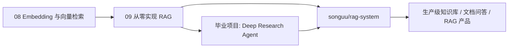

# RAG 系统实战项目 · songuu/rag-system

> 项目链接：[songuu/rag-system](https://github.com/songuu/rag-system)

本课程的第 08/09 章先用最小代码讲清 RAG 原理，毕业项目再把 RAG 放进一个 Deep Research Agent 里。`songuu/rag-system` 是更适合作为**独立作品集项目**和**生产化 RAG 系统样板**的下一站。

## 它在课程里的位置

## 为什么需要单独接入这个项目

课程里的 RAG 故意保持“小而透明”：

- 第 08 章用内存向量库解释 embedding、余弦相似度、top-k。
- 第 09 章用虚构资料演示加载、分块、检索、注入、引用。
- 毕业项目把 RAG 作为 `search` 工具接进 agent loop。

这些足够理解原理，但真实 RAG 系统还会遇到更多工程问题：

| 课程最小版 | 真实 RAG 系统会继续扩展 |
|------------|--------------------------|
| 内存向量库 | 持久化向量库、索引管理、增量更新 |
| 单份文本 | 多文件、多格式、批量导入、失败重试 |
| 固定 chunk 参数 | 按文档类型调 chunk、overlap、metadata |
| top-k 检索 | rerank、hybrid search、多路召回 |
| 一次性问答 | 多轮会话、权限、审计、来源回放 |
| 手动看效果 | eval 集、faithfulness、context relevance |

`songuu/rag-system` 应该承接这部分：从“理解 RAG”走向“建设 RAG 产品”。

## 建议学习路线

1. 先读 [第 08 章 · Embedding 与向量检索](../lessons/08-embeddings-and-vector-search/README.md)。
2. 再读 [第 09 章 · 从零实现 RAG](../lessons/09-rag-from-scratch/README.md)。
3. 跑通 [毕业项目 · Deep Research Agent](../capstone/deep-research-agent/README.md)，看 RAG 如何作为工具接入 agent。
4. 打开 [songuu/rag-system](https://github.com/songuu/rag-system)，重点对照这些模块:
   - 文档导入与解析；
   - chunk 策略；
   - embedding 与向量存储；
   - 检索、rerank、上下文组装；
   - 引用与答案溯源；
   - 评估、观测、成本和权限。

## 作品集包装建议

简历里可以把两个项目分工写清楚：

- **本课程仓库**：展示 agent 底层能力，覆盖 loop、tool、memory、RAG、multi-agent、eval、deployment。
- **songuu/rag-system**：展示 RAG 工程深度，覆盖知识库构建、检索质量、引用溯源、评估与生产化。

一个更有说服力的说法：

> 从零实现 TypeScript Agent 学习路径，并将课程中的最小 RAG 扩展为独立 RAG 系统项目 `songuu/rag-system`，覆盖文档 ingestion、chunking、embedding、retrieval、context assembly、source citation 与评估治理。

## 后续可增强方向

- 给 `songuu/rag-system` 增加一组固定 eval questions，统计 context relevance / answer faithfulness / answer relevance。
- 把第 19 章里的生态拆解接进去：RAG 数据层可以对照 LlamaIndex / LangChain / vector DB / MCP。
- 将 RAG 检索能力暴露成 MCP server，让其他 agent 或 IDE 客户端复用。
