## 这门课怎么学

```mermaid
flowchart LR
  A["00 环境搭建"] --> B["01–03 基础概念"]
  B --> B2["B1–B12 基础概念扩展"]
  B2 --> C["04–07 从零手写核心"]
  C --> D["08–09 知识与检索"]
  D --> E["10–11 进阶模式"]
  E --> F["12–14 工程化与框架"]
  F --> G["15–18 生产化"]
  G --> H["19 前沿与生态"]
  H --> H2["20 前沿文章库"]
  H2 --> I["🎓 毕业项目"]
  I --> J["🔬 进阶 RAG 专题"]
  J --> K["🏢 企业知识库 Agent 蓝图"]
  K --> K2["🎓 企业知识库 Agent Capstone"]
  K2 --> L["💼 求职 / 🚀 创业"]
```



- **先手写，后框架**：先理解每一行为什么存在，再看框架帮你省了什么。
- **每章可运行**：`npx tsx lessons/NN-xxx/index.ts` 直接跑，零编译。
- **厂商无关**：统一 `getLLM()` 抽象，换 Claude / OpenAI 只改一行 `.env`。
- **三层学习路线**：每章「极简 → 进阶 → 真实实践」，不止看懂，还能用在真实项目。

## 快速开始

```bash
git clone https://github.com/songuu/agent.git
cd agent
pnpm install

# 配置 key（至少一个厂商）
cp .env.example .env   # 填入 ANTHROPIC_API_KEY 或 OPENAI_API_KEY

# 验证环境（不需要 key）
pnpm typecheck

# 跑第一个例子（需要 key）
npx tsx lessons/02-first-llm-call/index.ts
```

详细步骤见 [第 00 章 · 环境搭建](/docs/setup)。
