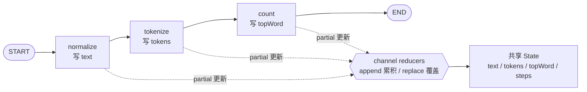

# 手写 StateGraph：揭开 createReactAgent 的盖子

> 所属：进阶 LangGraph 专题 · 从「用预制图」到「手写状态图」
> 预计用时：35 分钟 | 难度：⭐⭐⭐
> 全局导航：[课程导航](../../docs/navigation.md) · [完整大纲](../../docs/curriculum.md) · [知识图谱](../../docs/knowledge-graph.md)

## 学习目标

学完本章你能够：

- [ ] 说清 **StateGraph 三件套**：带 reducer 的 **channel**、返回 partial 更新的**函数节点**、连接它们的**边**。
- [ ] 解释 **channel reducer** 决定「多次写入如何合并」：`append` 累积 vs `replace` 覆盖（默认）。
- [ ] 理解节点返回的是 **partial 更新**（只写它碰的 channel），没碰的 channel 由上一状态**自动保留**。
- [ ] 用 `addEdge` + `compile` + `invoke` 手搓一张线性图，并说清 **`createReactAgent` 只是其上的预制封装**。
- [ ] 体会「纯函数节点 ⇒ 图输出完全确定」——本章 demo **无需任何 API key**、离线可回归。

## 前置知识

- 已读 [第 12 章 · 上框架](../../lessons/12-intro-to-frameworks/README.md)：用过预制 `createReactAgent`。本章把它的盖子揭开。
- 已读 [第 06 章 · 从零构建工具系统](../../lessons/06-building-a-tool-system/README.md)：手写过 `for` 循环驱动的 agent loop——本章用「图的节点+边」表达同样的控制流。
- 选读 [第 07 章 · 短期记忆](../../lessons/07-short-term-memory/README.md)：消息数组即记忆——你会看到 LangGraph 的 `messages` channel 用 append reducer 实现同一件事。
- 本章 demo 用**纯函数节点**（不调模型），**无需任何 API key** 即可运行。

## 三层学习路线

| 层级 | 学习目标 | 你要完成什么 |
|------|----------|--------------|
| 极简 | 跑通 demo，看懂一张图怎么把「partial 更新」沿边累积成终态。 | 能指着输出说出「每个节点只写它碰的 channel，reducer 负责合并」。 |
| 进阶 | 理解 channel/reducer/节点/边四个概念，以及 append vs replace 的区别。 | 解释为什么同样三个节点，换个 reducer 就得到不同的 `steps`。 |
| 真实实践 | 把直觉映射回 `createReactAgent`。 | 说清预制 agent 的 messages channel / 模型节点 / 工具节点 / 循环边各对应本章哪个机制。 |

---

## 图解学习地图

> 读图顺序：先看一条 State 如何沿 START→节点→END 流动、每个节点吐出 partial 更新由 reducer 合并，再回到「二、代码走读」。核心焦点：**图 = 带 reducer 的 State + 函数节点 + 边**。



---

## 一、原理：图 = State + 函数节点 + 边

第 12 章你用 `createReactAgent` 一行就拿到一个能跑工具循环的 agent。但那是一张**已经编译好的图**——你没看到里面的 State、节点和边。本章我们手写一张，把机制看清。

一张 StateGraph 由三件套组成：

### 1) State 与 channels（带 reducer）

图有一个**共享 State**，由若干 **channel** 组成（这里是 `text / tokens / topWord / steps`）。每个 channel 配一个 **reducer**，决定「当一个节点往这个 channel 写入时，新值怎么和旧值合并」：

```ts
const State = Annotation.Root({
  text:  Annotation<string>({   reducer: (_old, next) => next,        default: () => "" }),  // replace：只留最后一次
  steps: Annotation<string[]>({ reducer: (old, next) => old.concat(next), default: () => [] }), // append：累积
});
```

- `replace`（覆盖）：`(_old, next) => next`——后写覆盖先写，channel 只保留最后一次写入。**这是默认语义**。
- `append`（累积）：`(old, next) => old.concat(next)`——把每次写入都接到后面。**想累积历史（如对话 messages）必须显式用它**。

> 这就是本章最容易踩的坑：channel 用默认 replace reducer 时，**先后**往它写的值会**互相覆盖**（只留最后一次）；想累积就得显式配 append。（注意：若是**同一步并行**的多个节点同时写同一个 replace channel，LangGraph 会直接抛 `InvalidUpdateError` 而非静默覆盖——并行聚合到底怎么处理，留到第 05 章 fork/join 讲。）

### 2) 节点：返回 partial 更新

节点就是**普通函数**：读 State，返回一个对象——**只包含它要更新的 channel**（partial 更新），不用返回整个 State。没碰的 channel 由上一状态自动保留。

```ts
function countNode(state) {
  // …算词频…
  return { topWord, steps: ["count"] }; // 只写 topWord + steps；没碰 text/tokens，它们会被保留
}
```

### 3) 边 + compile + invoke

边把节点连成流程；`START`/`END` 是两个特殊端点。`compile()` 把图编译成可执行对象，`invoke(初始state)` 跑到终态：

```ts
const graph = new StateGraph(State)
  .addNode("normalize", normalizeNode).addNode("tokenize", tokenizeNode).addNode("count", countNode)
  .addEdge(START, "normalize").addEdge("normalize", "tokenize")
  .addEdge("tokenize", "count").addEdge("count", END)
  .compile();
const final = await graph.invoke({ text: "  The CAT sat …" });
```

### createReactAgent 到底替你做了什么？

把上面这套机制对照预制 agent，你会发现 **`createReactAgent` 只是预制了一组特定的 channel + 节点 + 边**：

| 本章手写 | `createReactAgent` 内部 |
|---|---|
| `steps` channel（append reducer） | `messages` channel（append reducer，累积对话/工具消息） |
| `normalize/tokenize/count` 函数节点 | 一个**模型节点**（调 LLM）+ 一个**工具节点**（执行 tool_call） |
| 线性边 `a→b→c→END` | 模型节点 ↔ 工具节点之间的**循环边**（下一章讲条件边） |

**所以「上框架」不是黑魔法**：你已经会写 State、节点和边了，`createReactAgent` 只是把「模型节点 + 工具节点 + 循环边」这套常用结构打包好。

---

## 二、代码走读

完整实现见 [`../../src/shared/langgraph/textPipeline.ts`](../../src/shared/langgraph/textPipeline.ts)，demo 见 [`index.ts`](./index.ts)。三个节点都是**纯函数**（`normalizeNode`/`tokenizeNode`/`countNode`），所以图的输出完全确定。

`buildTextPipeline({ accumulateSteps })` 用一个开关切换 `steps` channel 的 reducer（append / replace），这正是本章演示「reducer 决定合并语义」的对照主角：

```ts
// 同样三个节点，只换 steps 的 reducer：
buildTextPipeline({ accumulateSteps: true  }).invoke(input); // steps = ["normalize","tokenize","count"]
buildTextPipeline({ accumulateSteps: false }).invoke(input); // steps = ["count"]（只剩最后一次写入）
```

> demo 里每条结论都用 `invariant(...)` 在运行时核对、**不写死**：append/replace 的 steps、partial 更新的持久化、两次 invoke 的逐字节相等、topWord 现场重算——任一条被改坏，demo 立刻报错而非给你假结论。

---

## 三、运行

本章 demo 是**纯函数节点**（不调模型、不联网）——**无需任何 API key，离线即可跑通**：

```bash
npx tsx langgraph-advanced/01-stategraph-basics/index.ts
```

预期看到（**具体内容由运行时打印，下面是构造保证的趋势**）：

1. **逐节点 partial 更新**：`stream("updates")` 打印每个节点吐出的对象——`normalize` 只吐 `{text, steps}`、`tokenize` 只吐 `{tokens, steps}`、`count` 只吐 `{topWord, steps}`。
2. **终态**：图把这些 partial 更新沿边累积成完整 State（`text/tokens/topWord/steps` 都在）。
3. **结论核对**（`invariant` 现场判定）：
   - ① append reducer → `steps` 累积全部三步；replace reducer → `steps` 只剩 `["count"]`。
   - ② `count` 没写 `text/tokens`，但终态仍保留它们（partial 更新持久化）。
   - ③ 同输入两次 invoke 终态**逐字节相等**（纯函数节点、无随机）。
   - ④ `topWord` 经现场重算核对，确为最高频词。

也可跑纯函数冒烟（含本章全部断言）：`npx tsx langgraph-advanced/smoke.ts`（或 `npm run lg:smoke`）。

---

## 四、练习

> 本章 demo 无可调的「危险旋钮」；下面的练习都在你自己的副本里改图，改完跑一遍核对预期。

1. **加一个节点**：在 `tokenize` 和 `count` 之间插一个 `dropStopwords` 节点（过滤掉 `the`/`on` 等停用词后写回 `tokens`），并重连边 `tokenize → dropStopwords → count`。预期：`steps` 多一项，且 `topWord` **从 `the` 变成 `cat`**（去掉停用词后 cat 最高频）。
2. **换个 reducer**：给 `steps` 换一个「去重累积」reducer `(old, next) => [...new Set([...old, ...next])]`，想想若同名节点被跑两次，结果和普通 append 有何不同。
3. **手搓 messages channel**：加一个 `messages` channel 用 append reducer（`(old, next) => old.concat(next)`），再加两个节点各往里 push 一条消息，连跑，验证 `messages` 累积成 2 条——这正是 `createReactAgent` 内部 `messages` 的累积方式。
4. **预告条件边**：本章是**线性**图（每个节点的下一个固定）。想象 `count` 之后「若 `tokens` 为空就回 `normalize`、否则去 `END`」——这需要 `addConditionalEdges`，正是下一章 [`02-conditional-routing`](../02-conditional-routing/README.md) 的主题。
5. **进阶 · 对照 createReactAgent**：回到第 12 章的 [`langgraph.ts`](../../lessons/12-intro-to-frameworks/langgraph.ts)，指出 `createReactAgent` 的 `messages` channel / 模型节点 / 工具节点 / 循环边分别对应本章的哪个机制。

---

<!-- KG:START (由 npm run kg 自动生成，勿手改本标记区) -->

## 知识图谱与延伸阅读

> 本节由 `npm run kg` 自动生成（数据源 `knowledge-graph/data/graph.ts`）。要增删请改数据源后重跑。

### 本章概念图谱

> 节点：**橙框**=本章概念，蓝框=关联的其他章概念。连线按关系类型着色：前置(蓝) · 深化(紫) · 对比(玫红) · 应用(绿) · 组成(橙)。

```mermaid
graph TB
  classDef own fill:#fff7ed,stroke:#ea580c,stroke-width:3px,color:#7c2d12;
  classDef cross fill:#eef2ff,stroke:#6366f1,stroke-width:1.5px,color:#312e81;
  n_lgsg_state_channels["State 与 channels"]
  n_lgsg_reducer["channel reducer"]
  n_lgsg_node_partial["节点返回 partial 更新"]
  n_lgsg_edges_compile["边与 compile/invoke"]
  n_lgsg_vs_prebuilt["揭开 createReactAgent"]
  n_c12_react_agent["createReactAgent 预制图（第12章）"]
  n_c12_state_graph["状态机图模型（第12章）"]
  n_c12_langgraph["LangGraph.js（第12章）"]
  n_c06_run_agent_loop["runAgent 循环（第06章）"]
  n_c07_conversation_as_array["记忆即回灌 messages（第07章）"]
  n_c12_framework_choice["框架选型决策（第12章）"]
  n_lgrt_conditional_edge["条件边 (addConditionalEdges)（第lg-routing章）"]
  n_lgrt_loop["循环边（第lg-routing章）"]
  n_lgrt_send_fanout["Send 扇出 (map-reduce)（第lg-routing章）"]
  n_lgcp_checkpointer["Checkpointer 与 thread_id（第lg-checkpoint章）"]
  n_lgcp_persist_accumulate["跨 invoke 持久化累积（第lg-checkpoint章）"]
  n_lgma_order_independent_join["join 顺序无关聚合（第lg-multiagent章）"]
  n_lgsg_state_channels -->|组成| n_lgsg_reducer
  n_lgsg_state_channels -->|前置| n_lgsg_node_partial
  n_lgsg_node_partial -->|应用| n_lgsg_reducer
  n_lgsg_node_partial -->|组成| n_lgsg_edges_compile
  n_lgsg_reducer -->|应用| n_lgsg_vs_prebuilt
  n_lgsg_vs_prebuilt -->|深化| n_c12_react_agent
  n_lgsg_state_channels -->|深化| n_c12_state_graph
  n_lgsg_edges_compile -->|深化| n_c12_langgraph
  n_lgsg_node_partial -->|对比| n_c06_run_agent_loop
  n_lgsg_reducer -->|应用| n_c07_conversation_as_array
  n_lgsg_vs_prebuilt -->|前置| n_c12_framework_choice
  n_lgrt_conditional_edge -->|深化| n_lgsg_edges_compile
  n_lgrt_loop -->|深化| n_lgsg_vs_prebuilt
  n_lgrt_send_fanout -->|应用| n_lgsg_reducer
  n_lgcp_checkpointer -->|深化| n_lgsg_edges_compile
  n_lgcp_persist_accumulate -->|应用| n_lgsg_reducer
  n_lgma_order_independent_join -->|应用| n_lgsg_reducer
  class n_lgsg_state_channels,n_lgsg_reducer,n_lgsg_node_partial,n_lgsg_edges_compile,n_lgsg_vs_prebuilt own;
  class n_c12_react_agent,n_c12_state_graph,n_c12_langgraph,n_c06_run_agent_loop,n_c07_conversation_as_array,n_c12_framework_choice,n_lgrt_conditional_edge,n_lgrt_loop,n_lgrt_send_fanout,n_lgcp_checkpointer,n_lgcp_persist_accumulate,n_lgma_order_independent_join cross;
  linkStyle 0 stroke:#d97706,stroke-width:2px;
  linkStyle 1 stroke:#2563eb,stroke-width:2px;
  linkStyle 2 stroke:#059669,stroke-width:2px;
  linkStyle 3 stroke:#d97706,stroke-width:2px;
  linkStyle 4 stroke:#059669,stroke-width:2px;
  linkStyle 5 stroke:#7c3aed,stroke-width:2px;
  linkStyle 6 stroke:#7c3aed,stroke-width:2px;
  linkStyle 7 stroke:#7c3aed,stroke-width:2px;
  linkStyle 8 stroke:#db2777,stroke-width:2px;
  linkStyle 9 stroke:#059669,stroke-width:2px;
  linkStyle 10 stroke:#2563eb,stroke-width:2px;
  linkStyle 11 stroke:#7c3aed,stroke-width:2px;
  linkStyle 12 stroke:#7c3aed,stroke-width:2px;
  linkStyle 13 stroke:#059669,stroke-width:2px;
  linkStyle 14 stroke:#7c3aed,stroke-width:2px;
  linkStyle 15 stroke:#059669,stroke-width:2px;
  linkStyle 16 stroke:#059669,stroke-width:2px;
```



### 与其他章节的关系

- `揭开 createReactAgent` —**深化**→ `createReactAgent 预制图`（第 12 章）
- `State 与 channels` —**深化**→ `状态机图模型`（第 12 章）
- `边与 compile/invoke` —**深化**→ `LangGraph.js`（第 12 章）
- `节点返回 partial 更新` —**对比**→ `runAgent 循环`（第 06 章）
- `channel reducer` —**应用**→ `记忆即回灌 messages`（第 07 章）
- `揭开 createReactAgent` —**前置**→ `框架选型决策`（第 12 章）
- `条件边 (addConditionalEdges)` —**深化**→ `边与 compile/invoke`（第 lg-routing 章）
- `循环边` —**深化**→ `揭开 createReactAgent`（第 lg-routing 章）
- `Send 扇出 (map-reduce)` —**应用**→ `channel reducer`（第 lg-routing 章）
- `Checkpointer 与 thread_id` —**深化**→ `边与 compile/invoke`（第 lg-checkpoint 章）
- `跨 invoke 持久化累积` —**应用**→ `channel reducer`（第 lg-checkpoint 章）
- `join 顺序无关聚合` —**应用**→ `channel reducer`（第 lg-multiagent 章）

### 延伸阅读

- [LangGraph.js · Low-level 概念（State / Nodes / Edges / Reducers）](https://langchain-ai.github.io/langgraphjs/concepts/low_level/) — LangGraph.js 官方底层概念：StateGraph、channel reducer、节点/边——本章手写图的权威参考 `doc`
- [LangGraph.js · Workflows and Agents](https://langchain-ai.github.io/langgraphjs/tutorials/workflows/) — 从底层图到预制 agent 的官方教程，对照本章「createReactAgent 只是预制 StateGraph」 `doc`

> 🗺️ 在[全局知识图谱](../../docs/knowledge-graph.md) / [交互式图谱](../../knowledge-graph/output/index.html) 中查看本章位置。

<!-- KG:END -->

## 五、小结与延伸

- **StateGraph 三件套**：带 reducer 的 channel（决定写入怎么合并）+ 返回 partial 更新的函数节点 + 连接它们的边。
- **reducer 是关键**：`append` 累积、`replace`（默认）覆盖；想累积历史（messages）必须显式用 append——否则节点间互相覆盖。
- **节点返回 partial 更新**：只写它碰的 channel，其余自动保留；这让节点彼此解耦、可单独测试。
- **createReactAgent 不是黑魔法**：它只是预制了 `messages` channel + 模型节点 + 工具节点 + 循环边；你已经会写这套机制了。
- 下一步：本章是**线性**图；下一章 [`02-conditional-routing`](../02-conditional-routing/README.md) 用**条件边**做分支与循环，才真正发挥状态机图的威力。

> 💡 **面试会问**：LangGraph 的 channel reducer 是做什么的？append 和 replace 有什么区别？节点为什么返回 partial 更新而不是整个 state？`createReactAgent` 内部大致是怎样一张图？为什么说「先手写 StateGraph 再用预制 agent」更不容易被框架绕晕？
