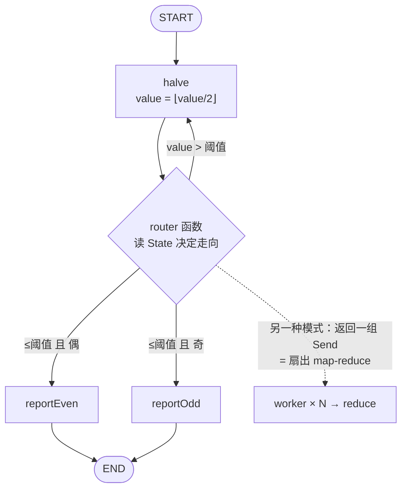
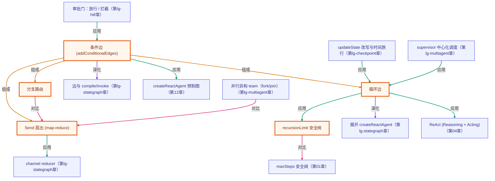

# 条件边与路由：分支 / 循环 / Send 扇出

> 所属：进阶 LangGraph 专题 · 让图在运行时自己决定走向
> 预计用时：35 分钟 | 难度：⭐⭐⭐
> 全局导航：[课程导航](../../docs/navigation.md) · [完整大纲](../../docs/curriculum.md) · [知识图谱](../../docs/knowledge-graph.md)

## 学习目标

学完本章你能够：

- [ ] 说清 **`addConditionalEdges`**：一个 **router 函数**读 State、返回下一个节点名——图在运行时自己决定走向。
- [ ] 用条件边实现 **分支**（按 State 路由到不同 handler）和 **循环**（指回更早的节点，直到满足终止条件）。
- [ ] 理解 **循环边就是 ReAct 的骨架**：「反复行动直到完成」= 条件边指回模型节点，直到不再需要工具。
- [ ] 知道 **`recursionLimit`** 是图版的 `maxSteps` 安全阀：循环不收敛时抛 `GraphRecursionError`，防无限循环。
- [ ] 用 **`Send`** 做扇出（map-reduce）：把一批项动态分发给同一节点的多个并行实例，再 reduce 合并。

## 前置知识

- 已读 [第 01 章 · 手写 StateGraph](../01-stategraph-basics/README.md)：知道 State/channel/reducer/节点/边/compile/invoke。本章在**线性图**上加「条件走向」。
- 已读 [第 04 章 · Agent 循环 (ReAct)](../../lessons/04-the-agent-loop/README.md)：理解「想→做→观察」反复循环——本章的循环边正是它的图表达。
- 选读 [第 12 章 · 上框架](../../lessons/12-intro-to-frameworks/README.md)：`createReactAgent` 内部的「模型↔工具」循环，就是一条条件边。
- 本章 demo 用**纯函数节点**（不调模型），**无需任何 API key** 即可运行。

## 三层学习路线

| 层级 | 学习目标 | 你要完成什么 |
|------|----------|--------------|
| 极简 | 跑通 demo，看懂条件边怎么让图分支、循环、扇出。 | 能指着输出说出「router 函数返回哪个节点名，图就走哪条边」。 |
| 进阶 | 理解循环边的终止条件、recursionLimit 安全阀、Send 的 map-reduce。 | 解释为什么循环必须有终止条件，以及 recursionLimit 在兜什么底。 |
| 真实实践 | 把循环边映射回 ReAct / `createReactAgent`。 | 说清「模型决定是否还要调工具」就是一条条件边，对应本章哪种模式。 |

---

## 图解学习地图

> 读图顺序：跟着 `halve` 节点后那条**条件边**——它要么指回自己（循环），要么按奇偶分流（分支），再回到「二、代码走读」。核心焦点：**条件边 = 图在运行时自己决定下一步**。



---

## 一、原理：让图自己决定走向

第 01 章的图是**线性**的：`addEdge("a", "b")` 把下一步写死。但真实的 agent 要**分情况**走——这就是 `addConditionalEdges` 的用武之地。

### 1) 条件边 = 一个 router 函数

`addConditionalEdges(source, router)`：`router` 是个**纯函数**，读当前 State，返回**下一个节点的名字**（或 `END`）。图照它的返回值走。

```ts
.addConditionalEdges("halve", (state) => {
  if (state.value > threshold) return "halve";                 // 指回自己 = 循环
  return state.value % 2 === 0 ? "reportEven" : "reportOdd";    // 按 State 选 handler = 分支
})
```

- **分支**：router 按 State 返回不同节点名 → 走向不同 handler。
- **循环**：router 返回**更早的节点名**（这里是 `halve` 自己）→ 图回到那里再跑一轮。

### 2) 循环必须有终止条件——这就是 ReAct 的骨架

循环边强大，但**必须有出口**。本章的出口是「`value` 减半到 ≤ 阈值」：因为每步 `value` 严格减半、**单调递减**，所以**必然**在有限步内跳出。

这正是 **ReAct / `createReactAgent` 的形状**：「模型 → 工具 → 模型 → ……」是一条指回模型节点的循环边，终止条件是「模型不再要求调工具」。把 LLM 换成这里的纯函数 `halve`，骨架一模一样。

### 3) recursionLimit：图版的 maxSteps 安全阀

万一终止条件写错、循环永不收敛怎么办？LangGraph 有 **`recursionLimit`**（默认 25）：跑到上限还没到 `END`，就抛 `GraphRecursionError`。

```ts
await graph.invoke(input, { recursionLimit: 8 }); // 恒循环图 → 抛 GraphRecursionError
```

这和第 01/12 章讲的 **`maxSteps` 安全阀**是同一个思想：**给「反复执行」一个硬上限，防止失控烧资源**。

### 4) Send：动态扇出（map-reduce）

有时你要把**一批项**分别处理再汇总（map-reduce）。`Send("worker", { item })` 让你从一条边**动态生成多个并行节点实例**，每个带自己的输入：

```ts
.addConditionalEdges(START, (state) => state.items.map((item) => new Send("worker", { item })))
.addEdge("worker", "reduce") // 多个 worker 汇入同一个 reduce（fan-in：等所有 worker 完成后跑一次）
```

各 worker 的结果经 **append reducer** 合并（回顾第 01 章），所以**汇总值与 worker 的完成顺序无关**——这正是用 reducer 管状态的好处。

---

## 二、代码走读

完整实现见 [`../../src/shared/langgraph/routingGraphs.ts`](../../src/shared/langgraph/routingGraphs.ts)，demo 见 [`index.ts`](./index.ts)。三张图都用**纯函数节点**，离线确定。

```ts
import { buildHalvingGraph, buildRunawayGraph, buildFanoutGraph } from "../../src/shared/langgraph";

// 图1：减半循环 + 奇偶分支
await buildHalvingGraph({ threshold: 5 }).invoke({ value: 100 });
//   → 100→50→25→12→6→3（循环 5 次），3≤5 跳出，3 是奇数 → route="odd"

// 图2：recursionLimit 安全阀
await buildRunawayGraph().invoke({}, { recursionLimit: 8 }); // 抛 GraphRecursionError

// 图3：Send 扇出 map-reduce
await buildFanoutGraph().invoke({ items: [1, 2, 3, 4] }); // results=[2,4,6,8]（顺序无关）, total=20
```

> demo 里每条结论都用 `invariant(...)` 在运行时核对、**且旋钮无关**：循环终止、单调递减、分支按**实际奇偶**、扇出 N 得 N、reduce 求和——改 `START_VALUE`/`THRESHOLD`/`items` 都不会让 demo 误报崩（因为断言的是构造性质，不是某个具体数）。

---

## 三、运行

本章 demo 是**纯函数节点**（不调模型、不联网）——**无需任何 API key，离线即可跑通**：

```bash
npx tsx langgraph-advanced/02-conditional-routing/index.ts
```

预期看到（**具体数字由运行时打印，下面是构造保证的趋势**）：

1. **减半循环 + 分支**：从起点不断减半的轨迹；终值 ≤ 阈值时跳出循环，按**奇偶**路由到 `reportEven`/`reportOdd`（默认 `100→…→3`，奇数 → `odd`）。
2. **结论核对**（`invariant` 旋钮无关判定）：① 循环终止（终值 ≤ 阈值）；② 减半轨迹严格单调递减、与纯函数模拟逐项一致；③ 分支按**实际**终值奇偶（非写死）。
3. **recursionLimit 安全阀**：恒循环图跑到 `recursionLimit` 抛 `GraphRecursionError`（④）。
4. **Send 扇出**：N 项 → N 个 worker 结果（⑤）；reduce 汇总 = Σ(item×2)，与完成顺序无关（⑥）。

也可跑纯函数冒烟（含本章全部断言）：`npx tsx langgraph-advanced/smoke.ts`（或 `npm run lg:smoke`）。

---

## 四、练习

> demo 的 invariant **旋钮无关**——下面几题放心改常量，改完跑一遍核对预期。

1. **看分支翻转**：把 `START_VALUE` 改成 `64`（`64→32→16→8→4`），终值 `4` 是偶数 → `route` 从 `odd` **变成 `even`**。体会 router 是按**运行时实际 State** 判定，不是写死的。
2. **改成 ReAct 骨架**：把「减半」换成「重试直到通过某校验」——比如节点给 `value` 加点噪声、router 判断「是否达标，否则回到该节点」。这就是 `createReactAgent` 的「模型→工具→模型直到收敛」。
3. **拨 recursionLimit**：把 `RECURSION_LIMIT` 调到 `3`，观察恒循环图更早抛错；再想想生产里这个上限该设多大（太小会误杀正常长流程，太大失控时烧得久）。
4. **扇出加过滤**：给 `worker` 改成「只对偶数项 push 结果」，观察 `results` 变短、`total` 变化——map 阶段也能筛。
5. **进阶 · 对照 createReactAgent**：回到第 12 章的 [`langgraph.ts`](../../lessons/12-intro-to-frameworks/langgraph.ts)，指出它内部「是否还要调工具」对应本章的**哪条边**（提示：`tools_condition` 就是一条条件边）。

---

<!-- KG:START (由 npm run kg 自动生成，勿手改本标记区) -->

## 知识图谱与延伸阅读

> 本节由 `npm run kg` 自动生成（数据源 `knowledge-graph/data/graph.ts`）。要增删请改数据源后重跑。

### 本章概念图谱

> 节点：**橙框**=本章概念，蓝框=关联的其他章概念。连线按关系类型着色：前置(蓝) · 深化(紫) · 对比(玫红) · 应用(绿) · 组成(橙)。



### 与其他章节的关系

- `条件边 (addConditionalEdges)` —**深化**→ `边与 compile/invoke`（第 lg-stategraph 章）
- `循环边` —**深化**→ `揭开 createReactAgent`（第 lg-stategraph 章）
- `循环边` —**应用**→ `ReAct (Reasoning + Acting)`（第 04 章）
- `recursionLimit 安全阀` —**对比**→ `maxSteps 安全阀`（第 01 章）
- `Send 扇出 (map-reduce)` —**应用**→ `channel reducer`（第 lg-stategraph 章）
- `条件边 (addConditionalEdges)` —**应用**→ `createReactAgent 预制图`（第 12 章）
- `updateState 改写与时间旅行` —**应用**→ `循环边`（第 lg-checkpoint 章）
- `审批门：放行 / 拦截` —**应用**→ `条件边 (addConditionalEdges)`（第 lg-hitl 章）
- `supervisor 中心化调度` —**应用**→ `循环边`（第 lg-multiagent 章）
- `并行异构 team（fork/join）` —**对比**→ `Send 扇出 (map-reduce)`（第 lg-multiagent 章）

### 延伸阅读

- [LangGraph.js · Map-reduce branches with Send](https://langchain-ai.github.io/langgraphjs/how-tos/map-reduce/) — 用 Send 从一条边动态扇出多个并行节点实例再 reduce 合并——本章图3 的官方对应 `doc`
- [LangGraph.js · How to control graph recursion limit](https://langchain-ai.github.io/langgraphjs/how-tos/recursion-limit/) — recursionLimit 控制循环上限、超限抛 GraphRecursionError——本章循环安全阀的官方说明 `doc`

> 🗺️ 在[全局知识图谱](../../docs/knowledge-graph.md) / [交互式图谱](../../knowledge-graph/output/index.html) 中查看本章位置。

<!-- KG:END -->

## 五、小结与延伸

- **条件边 = router 函数**：`addConditionalEdges(source, router)`，router 读 State 返回下一个节点名，图在运行时自己决定走向。
- **分支与循环**：返回不同节点名 = 分支；返回更早的节点名 = 循环——但循环**必须有终止条件**。
- **循环边就是 ReAct 骨架**：「反复行动直到完成」= 指回模型节点的条件边；`createReactAgent` 的工具循环正是如此。
- **recursionLimit = 图版 maxSteps**：循环不收敛时的断路器，抛 `GraphRecursionError`。
- **Send = 动态扇出**：map-reduce，结果经 reducer 合并、与完成顺序无关。
- 下一步：[`03-checkpointing`](../03-checkpointing/README.md) 给图加 **checkpointer**，让它能持久化、断点恢复、甚至「时间旅行」回到历史状态——这是手写循环做不到的。

> 💡 **面试会问**：`addConditionalEdges` 和 `addEdge` 有什么区别？怎么用图表达一个会循环的 ReAct agent？循环不收敛会怎样、`recursionLimit` 兜什么底？`Send` 解决什么问题，为什么扇出结果能和完成顺序无关？
