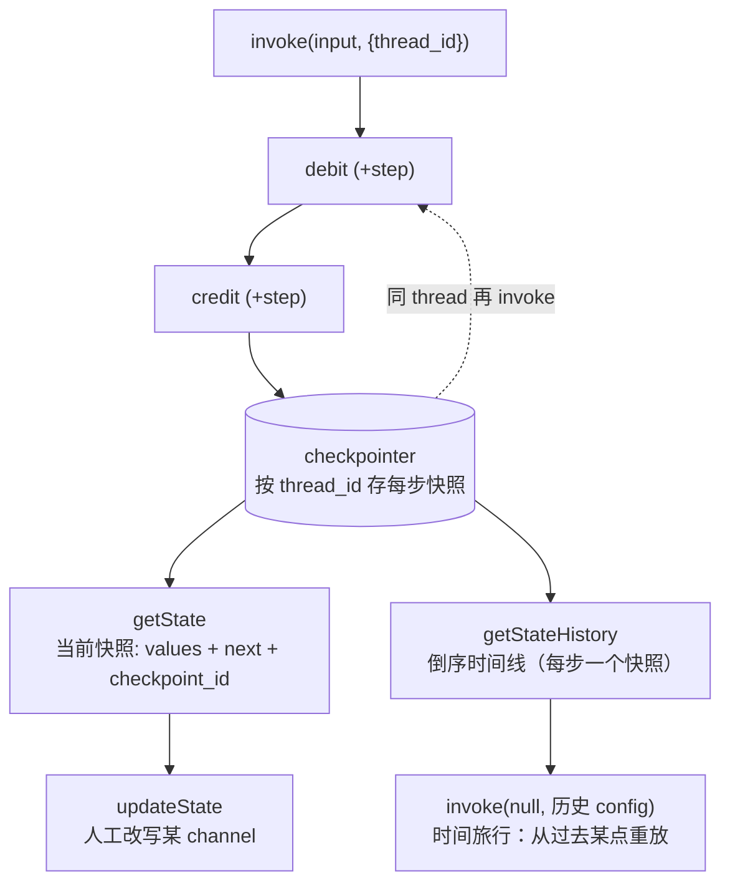
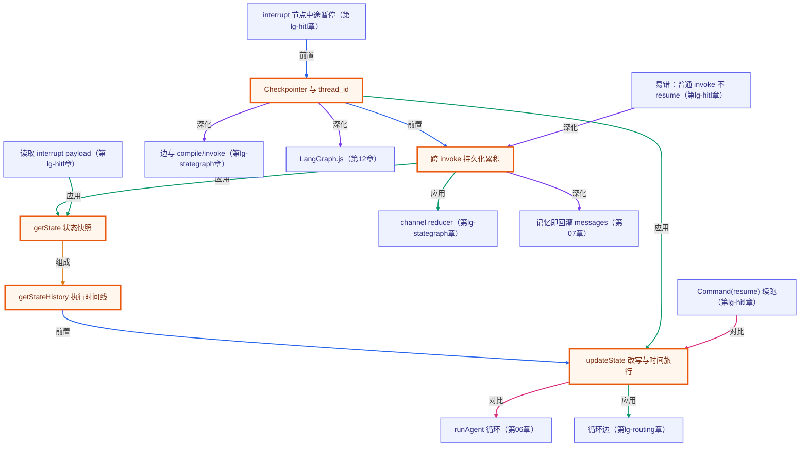

# Checkpointer 持久化与时间旅行

> 所属：进阶 LangGraph 专题 · 给图一条可回溯、可续跑、可重放的状态时间线
> 预计用时：35 分钟 | 难度：⭐⭐⭐
> 全局导航：[课程导航](../../docs/navigation.md) · [完整大纲](../../docs/curriculum.md) · [知识图谱](../../docs/knowledge-graph.md)

## 学习目标

学完本章你能够：

- [ ] 说清 **checkpointer**（本章用内存版 `MemorySaver`）：`compile({ checkpointer })` 后，每个 super-step 的状态都按 **`thread_id`** 被持久化。
- [ ] 用同一个 `thread_id` **跨 invoke 累积状态**——无需手动回传历史，checkpointer 自动把上一轮终态喂进下一轮；不同 `thread_id` 完全隔离。
- [ ] 用 **`getState`** 取当前快照（`values` + 待执行 `next` + `checkpoint_id`），用 **`getStateHistory`** 倒序遍历整条执行时间线。
- [ ] 用 **`updateState`** 人工改写某个 channel（human-in-the-loop 修正状态的底座）。
- [ ] 做一次 **时间旅行**：`invoke(null, 历史 checkpoint 的 config)` 从过去某点重放——纯函数节点下结果可复现。

## 前置知识

- 已读 [第 01 章 · 手写 StateGraph](../01-stategraph-basics/README.md)：知道 channel/**reducer**/节点/边/compile/invoke。本章的「累积」靠的正是 reducer，checkpointer 只负责把状态存下来。
- 已读 [第 02 章 · 条件边与路由](../02-conditional-routing/README.md)：理解循环图。给循环图挂 checkpointer，就能在循环中途暂停、查状态、改写再续跑。
- 选读 [第 07 章 · 对话即数组](../../lessons/07-short-term-memory/README.md)：那里手动把消息数组回传当记忆；checkpointer 把这件事**下沉成框架能力**。
- 本章 demo 用**纯函数节点**（不调模型），**无需任何 API key** 即可运行。

## 三层学习路线

| 层级 | 学习目标 | 你要完成什么 |
|------|----------|--------------|
| 极简 | 跑通 demo，看懂同一个 `thread_id` 多次 invoke 状态会累积、不同 thread 互不影响。 | 能指着输出说出「checkpointer 把上一轮状态存住了，这一轮接着加」。 |
| 进阶 | 理解 `getState`/`getStateHistory` 的快照与时间线、`updateState` 精确改写。 | 解释 `next` 为什么是空数组、时间线为什么倒序单调。 |
| 真实实践 | 做一次时间旅行，并把它映射到会话记忆 / 断点续跑 / human-in-the-loop。 | 说清「从历史 checkpoint 重放」在真实 agent 里解决什么问题。 |

---

## 图解学习地图

> 读图顺序：先看 `invoke` 进图、checkpointer 在每个 super-step **存一个快照**；再看三条「回看/改写/重放」的支路。核心焦点：**加一个 checkpointer，图就从「跑完即忘」变成「有记忆、可回溯」**。



---

## 一、原理：给图加一个「会记事的本子」

第 01/02 章的图每次 `invoke` 都从零开始——**跑完即忘**。真实 agent 要「记住上次聊到哪」「中断后能续上」「出错能回到上一步重来」。LangGraph 把这件事交给 **checkpointer**。

### 1) compile 时挂 checkpointer，invoke 时带 thread_id

```ts
const graph = new StateGraph(State)
  /* …addNode/addEdge… */
  .compile({ checkpointer: new MemorySaver() }); // ← 只多这一个选项

await graph.invoke({}, { configurable: { thread_id: "user-A" } });
```

`MemorySaver` 是**内存版** checkpointer（生产可换 `SqliteSaver`/`PostgresSaver`）。挂上后，**每个 super-step 的状态**都会按 `thread_id` 存成一个 **checkpoint**。

### 2) 跨 invoke 持久化累积——但「累积」是 reducer 的功劳

同一个 `thread_id` 再次 `invoke`，checkpointer 会把**上一轮的终态**取出来当起点，新输入经各 channel 的 reducer **合并**进去：

- `total` 用 **sum reducer**（`(old, next) => old + next`）：节点只声明「这一步加多少」，跨 invoke **自动累加**。
- `trail` 用 **append reducer**：每次每节点的轨迹**持续累积**。

> ⚠️ 关键澄清：**是否「累积」取决于 channel 的 reducer，不是 checkpointer 本身**。`replace` channel（如本章的 `label`）即使有 checkpointer，也仍会被新输入覆盖。checkpointer 只负责「把状态存下来、下次喂进来」，怎么合并是 reducer 的事（回看第 01 章）。

不同 `thread_id` 各存各的，**完全隔离**——这正是「每个用户一个会话」的实现方式。

### 3) getState / getStateHistory：看快照与时间线

```ts
const snap = await graph.getState(cfg);
// snap.values  → 各 channel 当前值
// snap.next    → 待执行的下一个节点（[] 表示已到 END）
// snap.config.configurable.checkpoint_id → 这个快照的 id

for await (const s of graph.getStateHistory(cfg)) { /* 倒序：newest-first */ }
```

`getStateHistory` 倒序遍历**每个 super-step** 的快照，构成一条**可回溯的执行时间线**。因为是 newest-first，状态值沿时间线**单调回退**到初始（本章 `total` 从最新值一路退到 0）。

### 4) updateState 改写 + 时间旅行重放

```ts
await graph.updateState(cfg, { label: "human-corrected" }); // 人工改写某 channel（也经 reducer 合并）

const mid = /* 从 getStateHistory 里挑一个过去的 checkpoint */;
await graph.invoke(null, mid.config); // 从那一点重放（input 传 null = 不给新输入，纯续跑）
```

`updateState` 是 **human-in-the-loop** 的底座：人可以在图暂停时改状态再放行。`invoke(null, 历史 config)` 则是**时间旅行**：回到过去某个 checkpoint，从那里重新往下跑。本章节点是**纯函数**，所以重放出的下游和原始跑一遍**逐字一致**——确定、可回归。

---

## 二、代码走读

完整实现见 [`../../src/shared/langgraph/checkpointGraphs.ts`](../../src/shared/langgraph/checkpointGraphs.ts)，demo 见 [`index.ts`](./index.ts)。图用**纯函数节点**，离线确定。

```ts
import { buildCheckpointedLedger, threadConfig } from "../../src/shared/langgraph";

const graph = buildCheckpointedLedger({ step: 1 }); // 一次 invoke 走 debit→credit，净增 2×step
const A = threadConfig("user-A");

await graph.invoke({}, A); // total=2
await graph.invoke({}, A); // total=4（同 thread，自动续上）
await graph.invoke({}, threadConfig("user-B")); // B 独立 → total=2，不影响 A

const snap = await graph.getState(A);          // values.total=4, next=[]
await graph.updateState(A, { label: "fixed" }); // 改 label，total 不动
// 时间旅行：从「debit 之后」的历史 checkpoint 重放，复现完整跑一遍的下游
```

> demo 里每条结论都用 `invariant(...)` 在运行时核对、**且旋钮无关**：累积到 `2×STEP×INVOKES`、线程隔离、`next` 为空、时间线单调不增、改写只动指定 channel、重放复现——改 `STEP`/`INVOKES` 都不会让 demo 误报崩（断言的是构造性质，不是某个具体数）。

---

## 三、运行

本章 demo 是**纯函数节点**（不调模型、不联网）——**无需任何 API key，离线即可跑通**：

```bash
npx tsx langgraph-advanced/03-checkpointing/index.ts
```

预期看到（**具体数字由运行时打印，下面是构造保证的趋势**）：

1. **持久化累积**：同一 thread 连续 invoke，`total` 一路累加（默认 `2→4→6`）（①）；另一 thread 独立 = `2`，原 thread 不受影响（②）。
2. **快照与时间线**：`getState` 即时间线最新一条，`next=[]` 说明已到 END（③）；倒序时间线 `total` 单调不增、最早一条是初始 `0`（④）。
3. **人工改写**：`updateState` 把 `label` 改掉、`total` 原封不动（⑤）。
4. **时间旅行**：从「debit 之后」的历史 checkpoint 重放，`total` 复现完整跑一遍的值（⑥）。

也可跑纯函数冒烟（含本章全部断言）：`npx tsx langgraph-advanced/smoke.ts`（或 `npm run lg:smoke`）。

---

## 四、练习

> demo 的 invariant **旋钮无关**——下面几题放心改常量，改完跑一遍核对预期。

1. **改累积步长/次数**：把 `STEP` 改成 `5`、`INVOKES` 改成 `4`，预期最终 `total = 2×5×4 = 40`；体会「节点只声明增量，reducer 跨 invoke 续上」。
2. **看 replace 不累积**：给图加一个 `replace` channel（reducer 用 `(_old, next) => next`），让节点每轮写它，观察它**不累积**、只保留最后一次——印证「累积是 reducer 的事，不是 checkpointer 的事」。
3. **数一数时间线**：打印 `getStateHistory` 的长度，想清楚为什么一次 invoke 产生约「节点数 + 起止」个 checkpoint（提示：每个 super-step 存一次）。
4. **改写再续跑**：在 `updateState` 里把 `total` 也改一下（注意它是 **sum reducer**，传 `{total: 100}` 是 **+100** 不是覆盖！），体会「updateState 也经 reducer 合并」这个易错点。
5. **进阶 · 接 human-in-the-loop**：回看第 02 章的循环图，设想给它挂 checkpointer——循环跑到一半 `getState` 看进度、`updateState` 纠偏、再 `invoke(null, cfg)` 续跑。这正是下一章 `interrupt` 的雏形。

---

<!-- KG:START (由 npm run kg 自动生成，勿手改本标记区) -->

## 知识图谱与延伸阅读

> 本节由 `npm run kg` 自动生成（数据源 `knowledge-graph/data/graph.ts`）。要增删请改数据源后重跑。

### 本章概念图谱

> 节点：**橙框**=本章概念，蓝框=关联的其他章概念。连线按关系类型着色：前置(蓝) · 深化(紫) · 对比(玫红) · 应用(绿) · 组成(橙)。



### 与其他章节的关系

- `Checkpointer 与 thread_id` —**深化**→ `边与 compile/invoke`（第 lg-stategraph 章）
- `跨 invoke 持久化累积` —**应用**→ `channel reducer`（第 lg-stategraph 章）
- `跨 invoke 持久化累积` —**深化**→ `记忆即回灌 messages`（第 07 章）
- `updateState 改写与时间旅行` —**对比**→ `runAgent 循环`（第 06 章）
- `updateState 改写与时间旅行` —**应用**→ `循环边`（第 lg-routing 章）
- `Checkpointer 与 thread_id` —**深化**→ `LangGraph.js`（第 12 章）
- `interrupt 节点中途暂停` —**前置**→ `Checkpointer 与 thread_id`（第 lg-hitl 章）
- `读取 interrupt payload` —**应用**→ `getState 状态快照`（第 lg-hitl 章）
- `Command(resume) 续跑` —**对比**→ `updateState 改写与时间旅行`（第 lg-hitl 章）
- `易错：普通 invoke 不 resume` —**深化**→ `跨 invoke 持久化累积`（第 lg-hitl 章）

### 延伸阅读

- [LangGraph.js · Persistence（Checkpointer / thread / state history）](https://langchain-ai.github.io/langgraphjs/concepts/persistence/) — 官方持久化概念：checkpointer 按 thread_id 存每个 super-step、getState/getStateHistory 取快照与时间线——本章的权威参考 `doc`
- [LangGraph.js · How to view and update past graph state（time travel）](https://langchain-ai.github.io/langgraphjs/how-tos/time-travel/) — 用 getStateHistory 回到过去某个 checkpoint、updateState 改写并从该点重放——本章时间旅行的官方对应 `doc`

> 🗺️ 在[全局知识图谱](../../docs/knowledge-graph.md) / [交互式图谱](../../knowledge-graph/output/index.html) 中查看本章位置。

<!-- KG:END -->

## 五、小结与延伸

- **checkpointer = 给图加记忆**：`compile({ checkpointer })` 后，每个 super-step 的状态按 `thread_id` 持久化；`MemorySaver` 是内存版，生产换 Sqlite/Postgres。
- **跨 invoke 累积是 reducer 的功劳**：checkpointer 负责存/取，怎么合并由 channel 的 reducer 决定（sum/append 累积、replace 覆盖）；不同 `thread_id` 完全隔离。
- **getState / getStateHistory**：取当前快照（`values`/`next`/`checkpoint_id`）与倒序执行时间线。
- **updateState + 时间旅行**：人工改写某 channel（human-in-the-loop 底座）；`invoke(null, 历史 config)` 从过去某点重放，纯函数节点下可复现。
- 下一步：[`04-human-in-the-loop`](../04-human-in-the-loop/README.md) 用 **`interrupt`** 在节点中途暂停、等人输入，再用 `Command({ resume })` 续跑——它正是建立在本章 checkpointer 之上。

> 💡 **面试会问**：checkpointer 解决什么问题？同一个 `thread_id` 多次 invoke 为什么状态会累积、靠的是什么？`getState` 的 `next` 为空意味着什么？什么是时间旅行，它依赖哪个机制？`MemorySaver` 能直接上生产吗？
