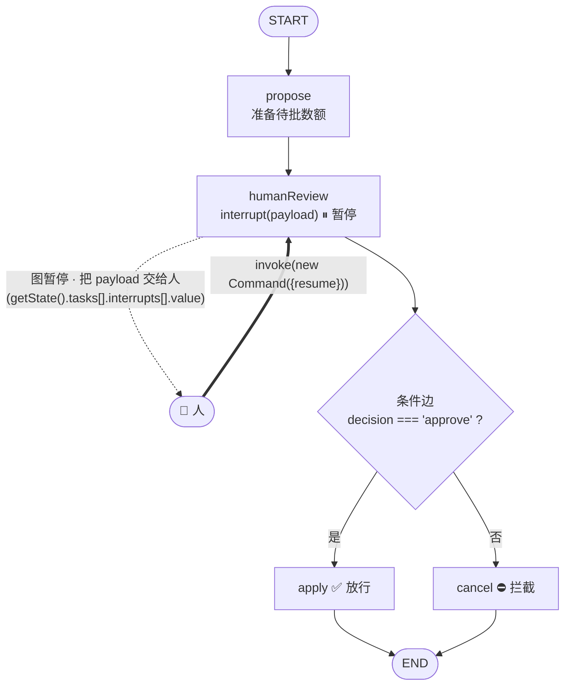
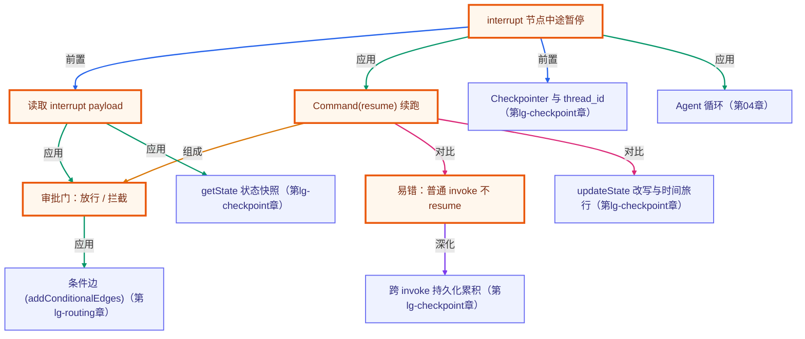

# Human-in-the-Loop：interrupt 审批门

> 所属：进阶 LangGraph 专题 · 让图能停下来等人拍板
> 预计用时：35 分钟 | 难度：⭐⭐⭐
> 全局导航：[课程导航](../../docs/navigation.md) · [完整大纲](../../docs/curriculum.md) · [知识图谱](../../docs/knowledge-graph.md)

## 学习目标

学完本章你能够：

- [ ] 说清 **`interrupt(payload)`**：在节点中途**暂停整张图**、把 `payload` 交给人——它必须配 **checkpointer**（暂停点要持久化）。
- [ ] 知道 **interrupt payload 不在 `invoke` 返回值顶层**（`result.__interrupt__` 为 `undefined`），要从 **`getState(cfg).tasks[].interrupts[].value`** 取。
- [ ] 用 **`invoke(new Command({ resume }), cfg)`** 续跑——被暂停的 `interrupt()` 就地返回 `resume` 值。
- [ ] 用条件边搭一个 **审批门**：人批准走 `apply`（放行）、否则走 `cancel`（拦截），终态完全由人决定。
- [ ] 避开关键坑：**暂停时用普通 `invoke(input)` 不会 resume**，而是带新输入从头重跑并再次暂停。

## 前置知识

- 已读 [第 03 章 · Checkpointer 持久化与时间旅行](../03-checkpointing/README.md)：`interrupt` 的暂停点就靠 checkpointer 持久化，payload 也从第 03 章的 `getState` 快照里取。**没读请先读它**。
- 已读 [第 02 章 · 条件边与路由](../02-conditional-routing/README.md)：审批后的「放行/拦截」就是一条按人给的决定路由的条件边。
- 选读 [第 04 章 · Agent 循环 (ReAct)](../../lessons/04-the-agent-loop/README.md)：给 agent 循环在「执行危险工具前」插一个 `interrupt`，就是工业级的人工确认闸门。
- 本章 demo 把「人」抽象成确定地传入的 `resume` 值，**无需任何 API key**、approve/reject 两条路径完全离线确定。

## 三层学习路线

| 层级 | 学习目标 | 你要完成什么 |
|------|----------|--------------|
| 极简 | 跑通 demo，看懂图怎么在 `humanReview` 暂停、又怎么被 `Command` 续跑。 | 能指着输出说出「interrupt 停在这里，resume 的值决定走 apply 还是 cancel」。 |
| 进阶 | 理解 payload 的读取位置、approve/reject 的条件边路由。 | 解释 payload 为什么不在返回值顶层、要去哪取。 |
| 真实实践 | 把审批门映射到「危险操作前人工确认」。 | 说清普通 `invoke` 为什么不 resume、生产里 resume 必须用 `Command`。 |

---

## 图解学习地图

> 读图顺序：跟着 `humanReview` 节点——它调用 `interrupt` **暂停**，把控制权交还给人；人通过 `Command({resume})` 回到这里，`interrupt()` 返回人给的值，再由条件边分流。核心焦点：**图能停下来等人，人拍板后再续跑**。



---

## 一、原理：让图停下来等人

第 03 章的 checkpointer 让图能记住状态、从中途重放。本章在它之上加一件事——**主动暂停等人**。

### 1) interrupt：在节点中途暂停

在节点里调用 `interrupt(payload)`：它把 `payload` 交给外部、**就地暂停整张图**，控制权返回给调用方。

```ts
const humanReview = (state) => {
  const decision = interrupt({ kind: "approval", amount: state.amount }); // ⏸ 停在这里
  return { decision: String(decision) }; // resume 后才执行：interrupt() 返回人给的值
};
```

⚠️ **`interrupt` 必须配 checkpointer**：暂停点要被持久化下来，之后才能恢复。本章的图编译时即挂了 `MemorySaver`。

### 2) payload 在哪取？——不在返回值顶层

暂停后 `invoke` 会返回（不是抛错），但返回的是**暂停前的状态**，且 **`result.__interrupt__` 是 `undefined`**（实测）。真正的 payload 要从快照里取：

```ts
const snap = await graph.getState(cfg);
// snap.next === ["humanReview"]                       ← 暂停在哪个节点
// snap.tasks[0].interrupts[0].value === { kind, amount } ← 交给人的 payload 在这
```

本章把这条深路径封装成了 `readPendingInterrupt(graph, cfg)`。

### 3) Command({ resume })：人拍板后续跑

人给出决定后，用 **`Command`** 续跑——`interrupt()` 就地返回 `resume` 的值：

```ts
await graph.invoke(new Command({ resume: "approve" }), cfg); // interrupt() 返回 "approve"
```

然后条件边按 `decision` 路由：等于 `approve` 走 `apply`（放行），否则走 `cancel`（拦截）。**终态完全由人给的 resume 值决定**——这就是审批门。

### 4) 关键坑：普通 invoke 不会 resume

暂停时如果你**忘了用 `Command`**、直接 `invoke({ ...新输入 })`，它**不会续跑**——而是把新输入经 reducer 并入已存状态、**从头重跑**，又停在 `interrupt`（轨迹里会看到 `propose` 出现两次）。

> 这其实是第 03 章持久化语义的体现：带输入的 `invoke` = 「合并输入再跑一遍」；要 **resume** 必须用 `Command`。

---

## 二、代码走读

完整实现见 [`../../src/shared/langgraph/hitlGraphs.ts`](../../src/shared/langgraph/hitlGraphs.ts)，demo 见 [`index.ts`](./index.ts)。图用**纯函数节点**，把「人」抽象成确定的 `resume` 值，离线确定。

```ts
import { buildApprovalGraph, readPendingInterrupt, threadConfig } from "../../src/shared/langgraph";
import { Command } from "@langchain/langgraph";

const graph = buildApprovalGraph({ approveWord: "approve" });
const cfg = threadConfig("req-1");

await graph.invoke({ amount: 500 }, cfg);          // ⏸ 暂停在 humanReview
await readPendingInterrupt(graph, cfg);            // → { kind: "approval", amount: 500 }
await graph.invoke(new Command({ resume: "approve" }), cfg); // ✅ status = "applied:500"
// 另一笔同样提交，resume "reject" → status = "rejected"（apply 从未执行）
```

> demo 里每条结论都用 `invariant(...)` 在运行时核对、**且旋钮无关**：暂停在审批节点、payload 携带提交数额、批准放行、拒绝拦截、两条 thread 终态相反、普通 invoke 不 resume——改 `AMOUNT`/审批词都不会让 demo 误报崩（断言的是构造性质，不是某个具体数）。

---

## 三、运行

本章 demo 是**纯函数节点**（不调模型、不联网，「人」用确定的 resume 值模拟）——**无需任何 API key，离线即可跑通**：

```bash
npx tsx langgraph-advanced/04-human-in-the-loop/index.ts
```

预期看到（**具体数字由运行时打印，下面是构造保证的趋势**）：

1. **暂停**：提交数额 → 图停在 `humanReview`，`status=pending`、`next=["humanReview"]`，下游 apply/cancel 都没跑（①）；payload 从 `getState().tasks[].interrupts[].value` 取得，携带提交数额（②）。
2. **批准放行**：`Command({resume:"approve"})` → 走 `apply` → `status=applied:<amount>`、到 END（③）。
3. **拒绝拦截**：另一笔同样的提交，`resume:"reject"` → 走 `cancel` → `status=rejected`，apply 从未执行（④）；两条 thread 提交一样、终态相反，差异 100% 来自人给的 resume 值（⑤）。
4. **关键坑**：暂停时用普通 `invoke({...})` 不 resume——从头重跑（`propose×2`）又停在 `humanReview`（⑥）。

也可跑纯函数冒烟（含本章全部断言）：`npx tsx langgraph-advanced/smoke.ts`（或 `npm run lg:smoke`）。

---

## 四、练习

> demo 的 invariant **旋钮无关**——下面几题放心改常量，改完跑一遍核对预期。

1. **换审批词**：把 `APPROVE_WORD` 改成 `"yes"`，再用 `resume:"approve"` 续跑——观察它现在被当成**拒绝**（走 cancel）。体会「放行条件是你定义的关键字，不是 LangGraph 内置的」。
2. **加一个『修改后再批准』**：让 `humanReview` 的 `interrupt` 接收一个**对象** `{ approve: true, newAmount: 300 }`，apply 节点用 `newAmount`——这就是「人不仅批准、还能改参数」(edit-and-continue)。
3. **复现『忘了 Command』的坑**：故意在暂停后写 `invoke({ amount: 1 })`，打印 `getState().next` 和 `log`，亲眼看到它没 resume、`propose` 跑了两次。
4. **读 payload 的另一条路**：不要用 `readPendingInterrupt`，自己写 `getState(cfg)` 然后逐层打印 `tasks[0].interrupts[0]`，看清 `value`/`when`/`resumable`/`ns` 这些字段。
5. **进阶 · 接危险工具确认**：设想第 04 章的 Agent 循环在「执行 `deleteFile` 工具前」插一个 `interrupt`，把工具名和参数交给人确认——这正是生产 agent 的人工闸门。说清它对应本章的哪个节点。

---

<!-- KG:START (由 npm run kg 自动生成，勿手改本标记区) -->

## 知识图谱与延伸阅读

> 本节由 `npm run kg` 自动生成（数据源 `knowledge-graph/data/graph.ts`）。要增删请改数据源后重跑。

### 本章概念图谱

> 节点：**橙框**=本章概念，蓝框=关联的其他章概念。连线按关系类型着色：前置(蓝) · 深化(紫) · 对比(玫红) · 应用(绿) · 组成(橙)。



### 与其他章节的关系

- `interrupt 节点中途暂停` —**前置**→ `Checkpointer 与 thread_id`（第 lg-checkpoint 章）
- `读取 interrupt payload` —**应用**→ `getState 状态快照`（第 lg-checkpoint 章）
- `审批门：放行 / 拦截` —**应用**→ `条件边 (addConditionalEdges)`（第 lg-routing 章）
- `Command(resume) 续跑` —**对比**→ `updateState 改写与时间旅行`（第 lg-checkpoint 章）
- `interrupt 节点中途暂停` —**应用**→ `Agent 循环`（第 04 章）
- `易错：普通 invoke 不 resume` —**深化**→ `跨 invoke 持久化累积`（第 lg-checkpoint 章）

### 延伸阅读

- [LangGraph.js · Human-in-the-loop（概念）](https://langchain-ai.github.io/langgraphjs/concepts/human_in_the_loop/) — 官方 HITL 概念：interrupt 暂停、Command(resume) 续跑、审批/编辑/工具确认等模式——本章的权威参考 `doc`
- [LangGraph.js · How to wait for user input using interrupt](https://langchain-ai.github.io/langgraphjs/how-tos/wait-user-input-functional/) — 用 interrupt 暂停等用户输入、再用 Command({resume}) 续跑的官方 how-to，对应本章审批门 demo `doc`

> 🗺️ 在[全局知识图谱](../../docs/knowledge-graph.md) / [交互式图谱](../../knowledge-graph/output/index.html) 中查看本章位置。

<!-- KG:END -->

## 五、小结与延伸

- **interrupt = 让图停下来等人**：`interrupt(payload)` 在节点中途暂停整张图、把 payload 交给人；必须配 checkpointer。
- **payload 不在返回值顶层**：从 `getState().tasks[].interrupts[].value` 取（`result.__interrupt__` 为 `undefined`）。
- **Command 续跑**：`invoke(new Command({ resume }), cfg)` 让 `interrupt()` 返回 resume 值；这是**唯一**能 resume 的方式。
- **审批门**：humanReview 后用条件边按人给的决定路由——批准 `apply`、否则 `cancel`，终态由人决定。
- **关键坑**：暂停时普通 `invoke(input)` 不 resume，会带输入从头重跑并再次暂停。
- 下一步：[`05-multi-agent-graph`](../05-multi-agent-graph/README.md) 把多个子图/agent 编排进一张图（supervisor / network），让它们协作——HITL 的审批门常嵌在 supervisor 的关键决策点上。

> 💡 **面试会问**：`interrupt` 和直接 `throw` 暂停有什么区别？为什么它必须配 checkpointer？怎么读到交给人的 payload？resume 为什么必须用 `Command`、普通 invoke 会怎样？审批门的「放行/拦截」是用什么实现的？
