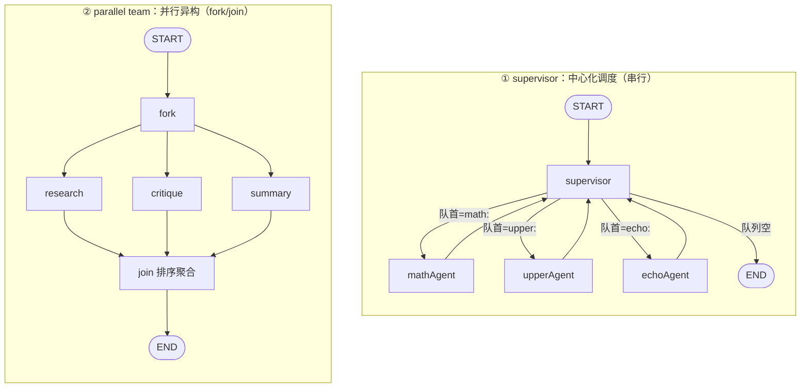
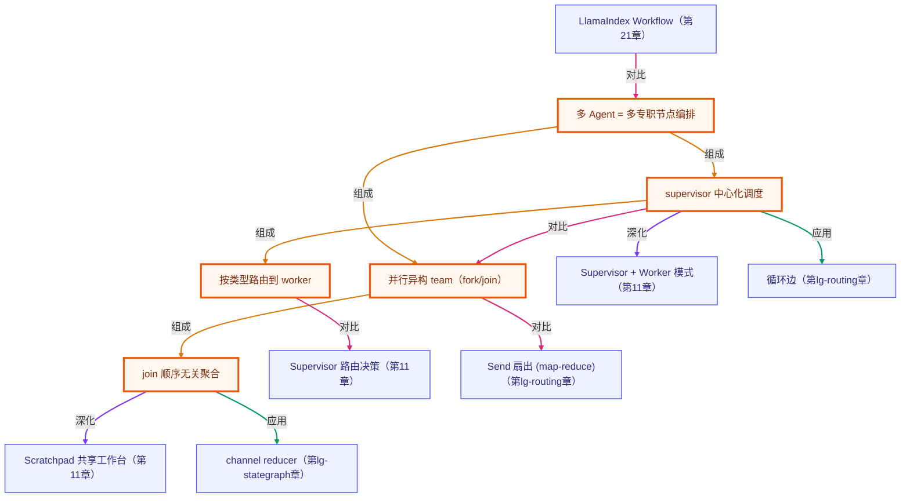

# 多 Agent 编排：supervisor / 并行 team

> 所属：进阶 LangGraph 专题 · 把多个专职 agent 编排进一张图（本轨道收官）
> 预计用时：40 分钟 | 难度：⭐⭐⭐⭐
> 全局导航：[课程导航](../../docs/navigation.md) · [完整大纲](../../docs/curriculum.md) · [知识图谱](../../docs/knowledge-graph.md)

## 学习目标

学完本章你能够：

- [ ] 说清 **多 Agent = 多个专职节点编排进一张图**：agent 就是节点，拓扑由边决定。
- [ ] 实现 **supervisor 中心化调度**：一个调度节点用条件边按任务类型派给对应 worker，干完回到 supervisor，循环到队列空。
- [ ] 实现 **并行异构 team**：从 fork 一次连出多条边让多个不同角色 agent 并行，结果汇入 join。
- [ ] 知道 **并行产出顺序「契约上」不保证**：append reducer 的收集顺序不承诺等于边书写顺序（纯同步本地虽确定，但换异步/分布式 worker 就会变），所以跨 agent 聚合必须靠 **排序** 消除顺序依赖（呼应第 02 章 Send 教训）。
- [ ] 选对拓扑：**串行/顺序可控/集中决策 → supervisor**；**可并行/无顺序依赖 → parallel team**。

## 前置知识

- 已读 [第 01 章 · 手写 StateGraph](../01-stategraph-basics/README.md)：channel/**reducer**——并行聚合靠 append reducer。
- 已读 [第 02 章 · 条件边与路由](../02-conditional-routing/README.md)：supervisor 调度就是**条件边 + 循环边**；并行 team 对照 **Send 扇出**。
- 选读 [第 11 章 · 多智能体编排](../../lessons/11-multi-agent-orchestration/README.md)：那里**手写** supervisor + worker（用 LLM 做路由决策）；本章是它的 **LangGraph 图版**（用确定性条件边离线讲透拓扑）。
- 本章 agent 全是**纯函数节点**（确定规则，不调模型），**无需任何 API key**、两种拓扑都离线确定。

## 三层学习路线

| 层级 | 学习目标 | 你要完成什么 |
|------|----------|--------------|
| 极简 | 跑通 demo，看懂 supervisor 怎么派活、并行 team 怎么合稿。 | 能指着输出说出「supervisor 按队首任务类型路由」「fork 出去的角色并行、join 收回来」。 |
| 进阶 | 理解两种拓扑的串行/并行差异、并行产出为什么要排序聚合。 | 解释为什么 `contributions` 不能比原始顺序、要按集合/排序比。 |
| 真实实践 | 把拓扑映射到真实团队：调度 vs 协作。 | 说清什么任务该用 supervisor、什么该用 parallel team。 |

---

## 图解学习地图

> 读图顺序：左边 supervisor——任务在 supervisor 和 worker 之间**循环**直到队空；右边 parallel team——一次 **fork** 出多个角色**并行**、再 **join** 合并。核心焦点：**两种「团队协作」的基本拓扑**。



---

## 一、原理：两种「团队协作」拓扑

agent 就是节点，**拓扑由边决定**。本章讲两种最常见的多 agent 拓扑。

### 1) supervisor：中心化调度（串行、顺序可控）

一个 `supervisor` 节点当「大脑」，用**条件边**按任务类型把每条任务派给对应的专职 worker；worker 干完**回到 supervisor**，再派下一条——直到队列空就路由到 `END`。

```ts
.addConditionalEdges("supervisor", (state) => {
  if (state.pending.length === 0) return END;          // 队空 → 收工
  const { type } = parseTask(state.pending[0]);
  if (type === "math") return "mathAgent";             // 按类型路由到专才
  if (type === "upper") return "upperAgent";
  return "echoAgent";
})
.addEdge("mathAgent", "supervisor")                    // worker 干完回 supervisor = 循环边
```

- 这正是第 02 章 **条件边 + 循环边** 的组合，终止条件是「队列空」（每个 worker 让队列 -1，单调递减必清空）。
- 它对应第 11 章手写的 **supervisor + worker** 模式——只是那里用一次 LLM JSON 调用做路由，这里用确定性规则。
- 特点：**串行、顺序可控**（supervisor 每轮取队首，产出顺序 === 输入顺序）。

### 2) parallel team：并行异构（fork/join）

从一个 `fork` 点**一次连出多条边**到多个**不同角色**的 agent，它们在同一 super-step **并行执行**；产出经 **append reducer** 汇集到一个 channel，再由 `join` 聚合。

```ts
.addEdge("fork", "research").addEdge("fork", "critique").addEdge("fork", "summary") // 并行
.addEdge("research", "join").addEdge("critique", "join").addEdge("summary", "join") // 汇入
```

⚠️ **关键：并行产出的顺序在「契约上」不保证**——append reducer 不承诺收集顺序等于边的书写顺序，它取决于各 agent 的完成顺序。本章纯同步纯函数节点本地跑虽然**每次都确定**（别指望「多跑几次自己乱」），但只要换成真实的异步/分布式 worker，完成顺序就会变。所以**不能依赖这个顺序**：`join` 必须**先排序再聚合**，最终报告才与完成顺序无关、确定可回归：

```ts
const join = (state) => ({ report: [...state.contributions].sort().join(" | ") });
```

这和第 02 章 **Send 扇出**的「顺序无关」是同一个教训——只不过 Send 是动态扇出**同构** worker，fork/join 是固定的**异构**角色。

### 3) 怎么选拓扑？

| | supervisor | parallel team |
|---|---|---|
| 执行 | 串行 | 并行 |
| 顺序 | 可控（取队首） | 不保证，需排序聚合 |
| 控制 | 集中（一个大脑） | 分散（各自干） |
| 适合 | 任务有依赖/需顺序/需集中决策 | 任务相互独立、可并行 |

---

## 二、代码走读

完整实现见 [`../../src/shared/langgraph/multiAgentGraphs.ts`](../../src/shared/langgraph/multiAgentGraphs.ts)，demo 见 [`index.ts`](./index.ts)。两张图的 agent 都是**纯函数节点**，离线确定。

```ts
import { buildSupervisorGraph, buildTeamGraph, computeTaskResult, TEAM_ROLES } from "../../src/shared/langgraph";

// 图1：supervisor 调度
await buildSupervisorGraph().invoke({ pending: ["math:2+3", "echo:hi", "upper:abc"] });
//   → results = ["math=5","echo=hi","upper=ABC"]（顺序保持），pending 清空

// 图2：并行 team
await buildTeamGraph().invoke({ topic: "agents" });
//   → contributions 三条（顺序不定），report = 排序聚合（确定）
```

> demo 里每条结论都用 `invariant(...)` 在运行时核对、**且旋钮无关**：每任务处理一次、按类型路由、顺序保持、队空终止、每角色一条贡献、join 排序聚合两次 invoke 全等——改 `TASKS`/`TOPIC` 都不会让 demo 误报崩（断言的是构造性质，期望由 `computeTaskResult`/`TEAM_ROLES` 重算）。

---

## 三、运行

本章 demo 是**纯函数节点**（不调模型、不联网）——**无需任何 API key，离线即可跑通**：

```bash
npx tsx langgraph-advanced/05-multi-agent-graph/index.ts
```

预期看到（**具体数字由运行时打印，下面是构造保证的趋势**）：

1. **supervisor 调度**：调度轨迹在 `supervise` 和各 worker 间交替；产出顺序与输入一致（①~③）；supervisor 比 worker 多跑一次（最后空队列收工，④）。
2. **parallel team**：3 个角色各贡献一条（收集顺序不被契约承诺，⑤）；`join` 排序聚合的报告两次 invoke 逐字相等（⑥）。

也可跑纯函数冒烟（含本章全部断言）：`npx tsx langgraph-advanced/smoke.ts`（或 `npm run lg:smoke`）。

---

## 四、练习

> demo 的 invariant **旋钮无关**——下面几题放心改常量，改完跑一遍核对预期。

1. **加任务、看顺序保持**：往 `TASKS` 里多塞几条（含重复类型），观察产出顺序始终与输入一致、`computeTaskResult` 期望自动重算。
2. **加一个 worker**：给 supervisor 加一个 `reverse:` 任务类型 + `reverseAgent`（把 payload 反转），在条件边里加一条路由分支——体会「加专才 = 加节点 + 加一条路由」。
3. **加一个角色**：给 parallel team 加第 4 个角色 `factcheck`，确认 `join` 的报告依然确定（因为先排序）——这就是 fork/join 的可扩展性。
4. **故意不排序**：把 `join` 的 `.sort()` 去掉——本地纯同步跑报告**每次仍一样**（别指望它自己乱），但它的顺序是 reducer 收集顺序、**不等于**你的边书写顺序，也**不被契约承诺**。再把某个角色节点改成 `async` 并 `await` 一个不同时长的延时，重跑——报告顺序就会变。亲眼验证「不能依赖收集顺序，并行聚合必须排序消除顺序依赖」。
5. **进阶 · 对照第 11 章**：回看 [第 11 章 · 多智能体编排](../../lessons/11-multi-agent-orchestration/README.md) 的 supervisor 路由（一次 LLM JSON 调用决定派给谁），说清它对应本章 supervisor 的**哪条边**，以及「LLM 决策」换成「确定性条件边」丢了什么、换来什么（提示：可控性/可测试性 vs 灵活性）。

---

<!-- KG:START (由 npm run kg 自动生成，勿手改本标记区) -->

## 知识图谱与延伸阅读

> 本节由 `npm run kg` 自动生成（数据源 `knowledge-graph/data/graph.ts`）。要增删请改数据源后重跑。

### 本章概念图谱

> 节点：**橙框**=本章概念，蓝框=关联的其他章概念。连线按关系类型着色：前置(蓝) · 深化(紫) · 对比(玫红) · 应用(绿) · 组成(橙)。



### 与其他章节的关系

- `LlamaIndex Workflow` —**对比**→ `多 Agent = 多专职节点编排`（第 21 章）
- `supervisor 中心化调度` —**深化**→ `Supervisor + Worker 模式`（第 11 章）
- `按类型路由到 worker` —**对比**→ `Supervisor 路由决策`（第 11 章）
- `join 顺序无关聚合` —**深化**→ `Scratchpad 共享工作台`（第 11 章）
- `supervisor 中心化调度` —**应用**→ `循环边`（第 lg-routing 章）
- `并行异构 team（fork/join）` —**对比**→ `Send 扇出 (map-reduce)`（第 lg-routing 章）
- `join 顺序无关聚合` —**应用**→ `channel reducer`（第 lg-stategraph 章）

### 延伸阅读

- [LangGraph.js · Multi-agent systems（概念）](https://langchain-ai.github.io/langgraphjs/concepts/multi_agent/) — 官方多 agent 拓扑总览：supervisor、network、hierarchical 等——本章 supervisor / parallel team 的权威参考 `doc`
- [LangGraph.js · Agent supervisor（教程）](https://langchain-ai.github.io/langgraphjs/tutorials/multi_agent/agent_supervisor/) — 一个 supervisor 用条件边把任务派给多个 worker agent 的官方教程，对应本章图1 的中心化调度循环 `doc`

> 🗺️ 在[全局知识图谱](../../docs/knowledge-graph.md) / [交互式图谱](../../knowledge-graph/output/index.html) 中查看本章位置。

<!-- KG:END -->

## 五、小结与延伸

- **多 Agent = 多专职节点编排进一张图**：agent 是节点，拓扑由边决定。
- **supervisor（中心化调度）**：条件边按类型派活 + 循环边回到 supervisor + 队空终止；串行、顺序可控；对应第 11 章手写的 supervisor+worker。
- **parallel team（并行异构）**：fork 一次连出多条边并行、join 聚合；并行产出顺序**契约上不保证**（纯同步本地虽确定，但不可依赖），必须 append reducer + 排序消除顺序依赖。
- **选拓扑**：有依赖/需顺序/需集中决策 → supervisor；相互独立可并行 → parallel team。
- **本轨道收官**：从 [01 手写 StateGraph](../01-stategraph-basics/README.md) → [02 条件边](../02-conditional-routing/README.md) → [03 checkpointer](../03-checkpointing/README.md) → [04 human-in-the-loop](../04-human-in-the-loop/README.md) → 05 多 Agent，你已经把 LangGraph 的 channel/reducer/节点/边/条件路由/持久化/中断恢复/多 agent 编排**从零拼齐**。再往后是 streaming 事件流、LCEL 链式组合等工程化主题——但底层都是这套图机制。

> 💡 **面试会问**：supervisor 和 parallel team 拓扑各适合什么任务？为什么并行 agent 的产出要排序聚合、不能直接用？supervisor 的循环怎么保证终止？它和第 11 章手写的多 agent 有什么异同？
