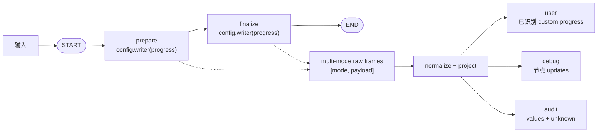
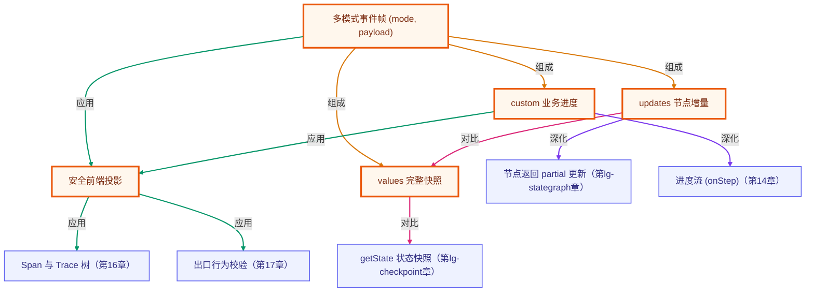

# Event streaming 与前端投影

> 所属：进阶 LangGraph 专题 · 把图执行流转换成稳定、安全的产品事件
> 预计用时：45 分钟 | 难度：⭐⭐⭐⭐
> 全局导航：[课程导航](../../docs/navigation.md) · [完整大纲](../../docs/curriculum.md) · [知识图谱](../../docs/knowledge-graph.md)

## 学习目标

学完本章你能够：

- [ ] 区分 LangGraph `values`、`updates`、`custom` 三种 stream mode 的职责。
- [ ] 说清 `@langchain/langgraph@0.2.74` 的关键协议：单模式直接产出 payload，多模式产出 `[mode, payload]` 元组。
- [ ] 在节点的第二个参数中用 `config.writer?.(...)` 发出显式产品事件。
- [ ] 把 raw frame 归一化成 `user / debug / audit` 三类稳定事件，而不是让前端直接绑定框架 chunk。
- [ ] 理解安全默认：完整 `values` 不直接暴露给用户；未知 mode 和畸形 custom 留在 audit。
- [ ] 知道本章对事件顺序的精确断言只适用于这张顺序图，不能泛化为并行图的顺序承诺。

## 前置知识

- 已读 [第 01 章 · 手写 StateGraph](../01-stategraph-basics/README.md)：节点返回 partial update，reducer 把它们合并成 state。
- 已读 [第 02 章 · 条件边与路由](../02-conditional-routing/README.md)：并行完成顺序不应被当作业务契约。
- 建议回看 [第 14 章 · 流式输出与用户体验](../../lessons/14-streaming-and-ux/README.md)：那里关注 token/UI 体验，本章关注图运行时事件如何进入产品边界。
- 本章使用纯函数节点和本地 LangGraph runtime，**无需 API key、不调用 LLM、不联网**。

## 三层学习路线

| 层级 | 学习目标 | 你要完成什么 |
|------|----------|--------------|
| 极简 | 跑通 demo，看见 raw stream 不等于最终答案。 | 能指出 `custom`、`updates`、`values` 各自出现在哪一步。 |
| 进阶 | 理解单/多模式 chunk 分叉和投影边界。 | 能解释为什么产品层统一使用 multi-mode tuple，并把三种事件分给不同受众。 |
| 真实实践 | 建立稳定、安全、可演进的前端事件协议。 | 新增未知事件时仍能安全降级，不泄露完整内部 state，也不让 UI 因框架升级崩溃。 |

---

## 图解学习地图

> 左侧是 LangGraph 0.2.74 的 raw runtime stream，右侧才是产品可以依赖的稳定投影。边界的重点不是“换个字段名”，而是决定**谁可以看见什么**。



---

## 一、为什么最终答案不够

`invoke()` 只返回终态。真实产品还需要回答：

- 当前跑到哪一步了，用户是否应该看到进度？
- 哪个节点写了哪些 partial state，开发者如何排障？
- 完整状态快照如何留作审计，但不泄露给普通用户？
- 框架以后新增 event mode，旧前端是否会直接崩？

因此，图执行不是一个“最后答案”，而是一串运行时事件。问题在于：**LangGraph 的 stream 是框架协议，不是 UI 协议**。如果组件直接判断 `{ prepare: ... }` 或直接渲染完整 state，框架升级、图拓扑变化和敏感字段增加都会穿透到产品层。

本章建立一个明确边界：

```text
LangGraph raw frame
        ↓
normalizeStreamFrame()
        ↓
ProjectedStreamEvent
        ↓
user / debug / audit
```

---

## 二、0.2.74 的真实 stream 契约

本仓库当前 lockfile 安装的是 `@langchain/langgraph@0.2.74`。本章代码以这个**真实安装版本**为准，不照搬其他版本的示例。

### 1) 三种 mode

| mode | 0.2.74 中的含义 | 本章投影 | 原因 |
|------|-----------------|----------|------|
| `custom` | 节点主动发出的自定义 payload | `user`，但仅限通过 schema 的 progress | 这是业务明确声明“可以上屏”的产品事件 |
| `updates` | 每个节点返回的 partial state patch | `debug` | 适合定位哪个节点写了什么，不是用户文案 |
| `values` | 初始状态及每个 super-step 后的完整 state | `audit` | 信息最完整，也最容易带出内部或敏感字段 |

### 2) 单模式与多模式的 chunk 形状不同

0.2.74 的实际行为是：

```ts
// 单模式：iterator 直接产出 payload
graph.stream(input, { streamMode: "updates" });
// => { prepare: { ... } }

// 多模式：iterator 产出 [mode, payload]
graph.stream(input, {
  streamMode: ["updates", "values", "custom"],
});
// => ["updates", { prepare: { ... } }]
```

这条分叉很容易制造调用方 bug：同一个 `for await`，有时拿对象，有时拿 tuple。

本章的工程选择是：**内部采集器始终开启 multi-mode**，因此边界内只处理一种稳定形状：

```ts
type RawStreamFrame = readonly [string, unknown];
```

如果 runtime 意外返回裸 payload，采集器会把它包装成 `["unknown", payload]`，交给安全 fallback，而不是让 UI 猜结构。

### 3) custom 事件用 `config.writer`

在当前 0.2.74 中，已验证可用的节点写法是读取节点第二参数：

```ts
import type { LangGraphRunnableConfig } from "@langchain/langgraph";

function prepareNode(state: State, config: LangGraphRunnableConfig) {
  config.writer?.({
    type: "progress",
    stage: "prepare",
    message: "输入已归一化",
  });

  return { normalizedInput: state.input.trim(), status: "prepared" };
}
```

为什么用可选调用？

- `stream(..., { streamMode: [..., "custom"] })` 时，runtime 会注入 writer。
- 普通 `invoke()` 没有 custom stream 消费者，writer 可以不存在；节点仍应正常返回 state update。

本章不使用无参 `getWriter()`，因为当前安装版本的运行时 spike 已确认 `config.writer` 才是这条 StateGraph 路径的可靠入口。

---

## 三、投影策略：谁可以看见什么

### 1) user：只收显式、已验证的产品事件

不是所有 custom 都自动可信。本章只允许下面的结构进入 user：

```ts
interface ProgressEvent {
  type: "progress";
  stage: string;
  message: string;
}
```

缺字段、纯空白字符串、其他 `type` 都不会上屏，而是降级进 audit。通过校验后也不会把原对象直接转发给 UI，而是按 `type / stage / message` 白名单重建公开事件；即使 custom payload 未来多出 `apiToken` 等内部字段，也会在边界被丢弃。

### 2) debug：保留节点 partial update

`updates` 的典型 frame：

```ts
["updates", {
  prepare: {
    normalizedInput: "agent streaming",
    steps: ["prepare"],
    status: "prepared",
  },
}]
```

normalizer 会提取唯一节点名 `prepare`，同时保留原 patch。它适合开发者调试、trace 面板或测试诊断，不适合直接成为用户文案。

### 3) audit：完整快照与未知事件

`values` 包含完整 state。本章保留它来：

- 还原状态演进；
- 核对 stream 最后一份快照与 `invoke()` 终态是否一致；
- 支持离线审计和故障分析。

但 **values 不能直接进入 user**。今天 state 里只有输入和结果，明天可能加入工具参数、内部推理标记、凭证引用或用户隐私。把完整 state 默认渲染到 UI 是错误的信任边界。

未知 mode、畸形 tuple、未识别 custom 同样进入：

```ts
{
  audience: "audit",
  kind: "unknown",
  payload: originalPayload,
}
```

这叫“安全默认”：

- 不丢证据；
- 不因新事件抛错；
- 不把未知内容意外升级为用户可见。

---

## 四、顺序：可以验证，但不要过度承诺

本章图是严格顺序拓扑：

```text
START → prepare → finalize → END
```

因此在当前 0.2.74 中，可离线回归下面的真实 mode 序列：

```text
values(initial)
custom(prepare)
updates(prepare)
values(after prepare)
custom(finalize)
updates(finalize)
values(final)
```

这条精确断言的价值是发现：

- writer 没有被注入；
- 某节点没有发 progress；
- runtime 升级改变了 chunk 协议；
- 状态快照或 partial update 丢失。

但它**不是并行图的普遍排序保证**。如果图从一个节点 fork 到多个异步 worker，各 worker 的事件到达顺序可能由完成时间决定。并行场景应该依赖：

- 稳定的 `stage / node / run id`；
- 每个分支内部的局部顺序；
- 显式聚合或排序规则；

而不是依赖“哪条边先写在代码里”。这与 [第 05 章](../05-multi-agent-graph/README.md) 对并行贡献先排序再聚合的原则一致。

---

## 五、代码走读

共享实现见 [`../../src/shared/langgraph/eventStreaming.ts`](../../src/shared/langgraph/eventStreaming.ts)，demo 见 [`index.ts`](./index.ts)。

核心调用只有三步：

```ts
import {
  collectEventStream,
  normalizeStreamFrame,
  projectStreamFrames,
} from "../../src/shared/langgraph";

const collected = await collectEventStream("  agent   streaming  ");

console.log(collected.frames);           // LangGraph raw [mode, payload]
console.log(collected.projection.user);  // 已识别 custom progress
console.log(collected.projection.debug); // updates
console.log(collected.projection.audit); // values
```

`projectStreamFrames()` 还保留一条全局 `sequence`。三类消费者可以各取自己的桶，排障时仍能按 sequence 拼回原始因果顺序。

demo 用 `invariant(...)` 运行时核对：

1. multi-mode raw 序列；
2. user 只能看到 `prepare → finalize` progress；
3. debug 只能看到两个节点的 updates；
4. audit 收到三份 values；
5. stream 最后一份 values 等于 `invoke()` 终态（仅把第二次执行作为本章纯函数、无副作用 demo 的测试 oracle；真实工具调用图不能照搬双执行）；
6. unknown / 畸形 custom 不抛错、不上屏、原样留在 audit。

---

## 六、运行

本章不调模型、不联网、无需任何 API key：

```bash
npx tsx langgraph-advanced/06-event-streaming/index.ts
```

也可运行包含 L1–L6 全部离线断言的轨道 smoke：

```bash
npm run lg:smoke
```

预期看到：

1. raw frame 的 mode 顺序为 `values → custom → updates → values → custom → updates → values`；
2. user 只有两条 progress；
3. debug 有 `prepare`、`finalize` 两条节点更新；
4. audit 有三份完整 state 快照；
5. future mode 与畸形 custom 均变成 `audit/unknown`；
6. 最终状态为 `status=completed`，结果是归一化输入的大写形式。

---

## 七、练习

1. **新增安全产品事件**：增加 `{ type: "warning", code, message }`，先写 schema 和投影测试，再决定它属于 user 还是 audit。
2. **验证空输入**：把 demo 输入改成空白，确认图仍完成，结果为 `(empty)`，事件序列不变。
3. **故意制造畸形 custom**：删掉 progress 的 `message`，或把 `stage` 改成纯空白，观察它不再进入 user，而是安全落到 audit。
4. **对照单模式**：临时分别运行 `streamMode: "updates"` 和多模式，打印 chunk，亲眼验证裸 payload 与 tuple 的差异；完成后恢复统一 multi-mode 边界。
5. **并行顺序实验**：从一个 fork 节点连出两个不同延迟的 async worker。不要断言全局固定顺序，改用 node/stage 标识归并事件。
6. **验证 user 白名单**：给合法 progress 额外加入 `apiToken` 字段，确认 user 投影只剩 `type / stage / message`；再为 values 写一个 audit serializer，只保存允许字段或字段哈希，避免日志成为第二个泄漏面。

---

## 延伸阅读

- [LangGraph.js · Streaming](https://docs.langchain.com/oss/javascript/langgraph/streaming)
- [LangGraph.js · Event streaming](https://docs.langchain.com/oss/javascript/langgraph/event-streaming)

下一章将从“单次 thread 的执行流”继续扩展到跨 thread 的长期状态：Store 与长期记忆。

<!-- KG:START (由 npm run kg 自动生成，勿手改本标记区) -->

## 知识图谱与延伸阅读

> 本节由 `npm run kg` 自动生成（数据源 `knowledge-graph/data/graph.ts`）。要增删请改数据源后重跑。

### 本章概念图谱

> 节点：**橙框**=本章概念，蓝框=关联的其他章概念。连线按关系类型着色：前置(蓝) · 深化(紫) · 对比(玫红) · 应用(绿) · 组成(橙)。



### 与其他章节的关系

- `updates 节点增量` —**深化**→ `节点返回 partial 更新`（第 lg-stategraph 章）
- `values 完整快照` —**对比**→ `getState 状态快照`（第 lg-checkpoint 章）
- `custom 业务进度` —**深化**→ `进度流 (onStep)`（第 14 章）
- `安全前端投影` —**应用**→ `Span 与 Trace 树`（第 16 章）
- `安全前端投影` —**应用**→ `出口行为校验`（第 17 章）

### 延伸阅读

- [LangGraph.js · Streaming](https://docs.langchain.com/oss/javascript/langgraph/streaming) — LangGraph 官方 streaming 文档：解释 values、updates、custom 等模式及多模式消费，是本章事件帧与投影契约的权威来源 `doc`
- [LangGraph.js · Event streaming](https://docs.langchain.com/oss/javascript/langgraph/event-streaming) — LangGraph 官方 event streaming 文档：说明图运行事件如何被客户端消费，对应本章从运行时事件到安全前端投影的边界 `doc`

> 🗺️ 在[全局知识图谱](../../docs/knowledge-graph.md) / [交互式图谱](../../knowledge-graph/output/index.html) 中查看本章位置。

<!-- KG:END -->
