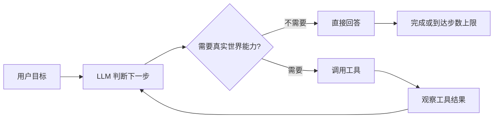
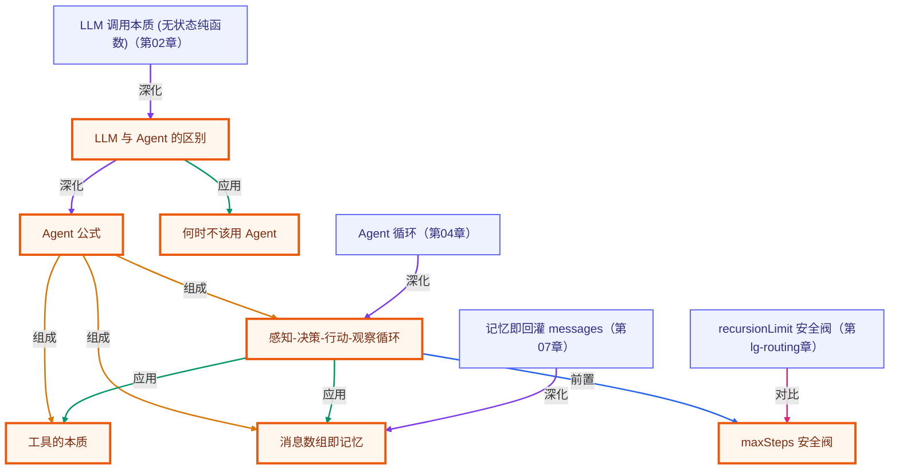

# 第 01 章 · 什么是 Agent

> 所属阶段：**第一部分 · 基础概念**
> 预计用时：25 分钟 | 难度：⭐☆☆☆☆
> 全局导航：[课程导航](../../docs/navigation.md) · [完整大纲](../../docs/curriculum.md) · [知识图谱](../../docs/knowledge-graph.md)

## 学习目标

学完本章你能够：

- [ ] 说清 **LLM** 和 **Agent** 的本质区别，不再混用这两个词。
- [ ] 记住一条公式：**Agent = LLM + 循环 + 工具 + 记忆**。
- [ ] 在脑中建立「**感知 → 决策 → 行动 → 观察**」的循环心智模型。
- [ ] 判断一个需求**该不该用 Agent**（很多时候一次 LLM 调用就够了）。

## 前置知识

- 已按 [环境搭建](../../docs/setup.md) 配好 `.env`（至少一个厂商的 key）。
- 会一点 TypeScript / 命令行即可，本章不要求任何 AI 背景。

## 三层学习路线

| 层级 | 学习目标 | 你要完成什么 |
|------|----------|--------------|
| 极简 | 先能用一句话区分 LLM 和 Agent。 | 画出 Agent = LLM + 循环 + 工具 + 记忆,并指出哪些需求只需要一次 LLM 调用。 |
| 进阶 | 把 Agent 理解成有停止条件的状态机。 | 解释感知、决策、行动、观察四步里分别会出现什么失败,以及 maxSteps 为什么必要。 |
| 真实实践 | 学会在产品需求前判断是否值得上 Agent。 | 拿一个真实需求做判断: 普通 LLM、RAG、工具型 Agent、多人协作 Agent 分别何时合适。 |

---

## 图解学习地图

> 读图顺序：先看本章主线,再回到代码走读。核心焦点：**从一次 LLM 调用升级到可行动的 Agent 循环**。



### 原理展开

- Agent 的关键不是模型更聪明,而是给模型外接了循环、工具和记忆。循环让任务可分步推进,工具让模型接触真实世界,记忆让下一步能看见上一步。
- 把 Agent 看成状态机更稳: 每轮只有三种结果,继续调用工具、直接回答、因为安全阀停止。这样你调试时能定位卡在感知、决策、行动还是观察。
- 不是所有需求都该上 Agent。一次问答能解决的问题用普通 LLM 更便宜、更稳定; 只有需要多步、外部信息或可执行动作时,Agent 才值得引入。

### 本章和整条路径的关系

本章是整条路径的总心智模型。后续工具、记忆、RAG、多智能体、部署,都只是在这条循环上加能力或加约束。

---

## 一、原理：LLM 是「嘴」，Agent 是「人」

### LLM 的天花板：无状态、无工具、活在过去

一次大模型（LLM）调用，本质是个**无状态的纯函数**：

```
输入：一段消息（你说了什么）
  ↓  （模型把训练时学到的知识，按概率续写出来）
输出：一段文本
```

它有三个与生俱来的「残疾」，记住这三点你就懂了为什么需要 Agent：

1. **无记忆**：这次调用不知道上次说过什么，除非你把历史再塞进输入。
2. **无工具**：它不能查数据库、不能调 API、不能读文件、不能下单付款 —— 只会「说话」。
3. **活在过去**：它的知识停在训练截止那一刻，**拿不到任何实时信息**。

所以当你问 LLM「现在几点了？」，它没有「现在」的概念，只能**一本正经地编**一个时间出来。这不是 bug，是 LLM 的物理边界。

### Agent：给 LLM 装上「循环 + 工具 + 记忆」

Agent 不是另一个模型，而是**围绕 LLM 搭的一套机制**，把那个只会说话的「嘴」变成能办事的「人」：

```
              ┌──────────────────────────────────────────┐
              │                Agent 循环                  │
              │                                            │
   目标 ───►  │   ① 感知        把当前对话/状态喂给 LLM    │
              │      │                                     │
              │      ▼                                     │
              │   ② 决策   LLM：我该直接答，还是先用工具？ │
              │      │                                     │
              │      ├──── 直接答 ──────────────► 完成 ✅  │
              │      │                                     │
              │      ▼ 需要工具                            │
              │   ③ 行动   调用工具（查时间/搜索/写文件）  │
              │      │                                     │
              │      ▼                                     │
              │   ④ 观察   把工具结果塞回对话，回到 ①      │
              │                                            │
              └──────────────────────────────────────────┘
                （循环往复，直到目标达成或到达步数上限）
```

把这张图拆成那条公式：

| 公式项 | 它解决 LLM 的哪个「残疾」 | 在循环里对应 |
| --- | --- | --- |
| **循环** | 一次问答 → 多步推进 | 整个回路反复执行 |
| **工具** | 不能碰真实世界 → 能查能做 | ③ 行动 |
| **记忆** | 无状态 → 记得上一步发生了什么 | 不断追加的消息数组 |

### 一个直观对比

| | 普通 Chatbot（裸 LLM） | Agent |
| --- | --- | --- |
| 「现在几点？」 | 瞎编一个时间 | 调用时间工具 → 给出真实时间 |
| 「北京今天天气？」 | 编一个天气 | 调天气 API → 真实天气 |
| 「把这三个文件合并并提交」 | 只能告诉你「步骤」 | 真的去读文件、合并、执行提交 |
| 「1+1 等于几？」 | **直接答对** ✅ | 没必要套 Agent，杀鸡用牛刀 |

最后一行很关键 —— **不是所有事都该用 Agent**：

- **该用 Agent**：需要实时信息、需要多步骤、需要调用外部系统、需要根据中间结果改变后续动作。
- **不该用 Agent**：一次问答就能搞定（翻译、改写、解释概念）。多套一层循环只会更慢、更贵、更不稳定。这是 `YAGNI` 原则在 AI 工程里的体现。

---

## 二、代码走读

完整代码见 [`index.ts`](./index.ts)。本章**刻意只用最朴素的写法**（不用 `ToolRegistry`、不用 `runAgent`，那是后面章节），目的是让你看清循环的「裸机制」。

### 第一幕：纯 LLM 会瞎编

```ts
import { getLLM } from "../../src/shared/llm";

const llm = getLLM();
const question = "现在几点了？请直接告诉我具体时间。";

const naive = await llm.chat({
  system: "你是一个助手。请直接回答用户的问题。",
  messages: [{ role: "user", content: question }],
});
console.log(naive.text); // ← 几乎一定是错的：模型没有「现在」的概念
```

### 第二幕：手写一个「伪 Agent 循环」

我们不引入正式的工具系统，只用一个普通函数当「假工具」：

```ts
// 工具的本质：一段「模型不会、但我们的代码会」的能力
function getCurrentTime(): string {
  return new Date().toLocaleString("zh-CN", { timeZone: "Asia/Shanghai" });
}
```

再用提示词约定一个极简「协议」：模型若需要时间，就**只回复口令 `NEED_TIME`**；拿到时间后再正常作答。然后把对话放进一个有上限的循环里：

```ts
const history: Message[] = [
  { role: "system", content: "……需要时间就只回复 NEED_TIME，拿到后再正常回答……" },
  { role: "user", content: question },
];

for (let step = 1; step <= 3; step++) {       // 3 是安全阀，防止无限循环
  const turn = await llm.chat({ messages: history });   // ① 感知 + ② 决策
  const reply = turn.text.trim();
  history.push({ role: "assistant", content: reply });  // 记忆：记下模型说了什么

  if (reply.includes("NEED_TIME")) {
    const now = getCurrentTime();                        // ③ 行动：调用工具
    // ④ 观察：用 role:"user" 把结果回灌记忆。本章是「文本协议」（口令 NEED_TIME），
    //   role:"tool" 必须与真实工具调用(tool_use)配对，否则厂商 API 会直接报错；
    //   真正的 tool 角色配对见第 04/05 章。
    history.push({ role: "user", content: `（工具返回）当前时间是：${now}` });
    continue;                                            // 回到循环顶部，再问一次模型
  }

  console.log(reply); // 模型不再要工具 → 这就是最终答案
  break;
}
```

读到这里，那张 ASCII 图就「活」起来了：`for` 循环是回路，`history` 是记忆，`getCurrentTime()` 是工具，`if (NEED_TIME)` 是模型的决策分支。**后面章节的 `runAgent` 做的就是这件事，只是把工具调用换成了规范的 function calling，并处理更多边界情况。**

> ⚠️ `maxSteps`（这里是 3）不是可选项。没有它，模型一旦反复要工具就会无限循环，烧钱烧到天荒地老。任何 Agent 循环都必须有步数上限。

---

## 三、运行

```bash
# 默认厂商（.env 里的 LLM_PROVIDER）
npx tsx lessons/01-what-is-an-agent/index.ts

# 临时切到 OpenAI（仅本次运行）
# PowerShell:
$env:LLM_PROVIDER="openai"; npx tsx lessons/01-what-is-an-agent/index.ts
# macOS / Linux:
LLM_PROVIDER=openai npx tsx lessons/01-what-is-an-agent/index.ts
```

预期：**第一幕**模型给出一个明显是编的/含糊的时间；**第二幕**先打印一行「模型请求工具 → getCurrentTime() → 真实时间」，再给出正确的当前时间。前后对比，就是 LLM 与 Agent 的差别。

---

## 四、练习

1. **换个实时问题**：把问题改成「今天星期几？」，并让 `getCurrentTime()` 返回里带上星期，观察循环是否依旧成立。
2. **加第二个工具**：再写一个 `getCpuCount()`（用 `os.cpus().length`），扩展提示词协议（比如 `NEED_CPU`），让模型按需选择不同工具 —— 体会「多工具」时决策为何变难。
3. **去掉记忆会怎样**：把第二幕里 `history.push(...)` 工具结果那一步注释掉，再跑一次。模型「观察」不到时间，循环会发生什么？理解记忆的不可或缺。
4. **触发步数上限**：故意把协议改成「无论如何都先回复 NEED_TIME」，看 `maxSteps` 如何兜底，体会安全阀的价值。
5. **进阶**：用 `git log` 的思路想一想 —— 如果工具是「执行删除文件」，这个循环里**哪一步**最该加人工确认？（这正是后面「人在回路」章节的伏笔。）

---

<!-- KG:START (由 npm run kg 自动生成，勿手改本标记区) -->

## 知识图谱与延伸阅读

> 本节由 `npm run kg` 自动生成（数据源 `knowledge-graph/data/graph.ts`）。要增删请改数据源后重跑。

### 本章概念图谱

> 节点：**橙框**=本章概念，蓝框=关联的其他章概念。连线按关系类型着色：前置(蓝) · 深化(紫) · 对比(玫红) · 应用(绿) · 组成(橙)。



### 与其他章节的关系

- `LLM 调用本质 (无状态纯函数)` —**深化**→ `LLM 与 Agent 的区别`（第 02 章）
- `Agent 循环` —**深化**→ `感知-决策-行动-观察循环`（第 04 章）
- `记忆即回灌 messages` —**深化**→ `消息数组即记忆`（第 07 章）
- `recursionLimit 安全阀` —**对比**→ `maxSteps 安全阀`（第 lg-routing 章）

### 延伸阅读

- [Building effective agents](https://www.anthropic.com/engineering/building-effective-agents) — Anthropic 官方工程博客，系统讲解 Agent 的循环、工具与何时该用 Agent，与本章心智模型高度对应 `doc`

> 🗺️ 在[全局知识图谱](../../docs/knowledge-graph.md) / [交互式图谱](../../knowledge-graph/output/index.html) 中查看本章位置。

<!-- KG:END -->

## 五、小结与延伸

- LLM 是无状态、无工具、活在过去的「嘴」；Agent 是给它装上**循环 + 工具 + 记忆**后的「人」。
- 心智模型只有四个词：**感知 → 决策 → 行动 → 观察**，循环往复。
- 牢记 `YAGNI`：一次问答能解决的，别套 Agent。
- 下一章 [第 02 章 · 你的第一次 LLM 调用](../02-first-llm-call/README.md) 会动手把「感知/决策」那一步 —— `llm.chat()` —— 彻底讲透。

> 💡 **面试会问**：LLM 和 Agent 有什么区别？请画出 Agent 的执行循环。为什么 Agent 循环一定要有步数上限？什么场景**不该**用 Agent？
