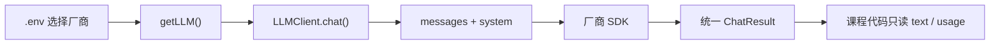
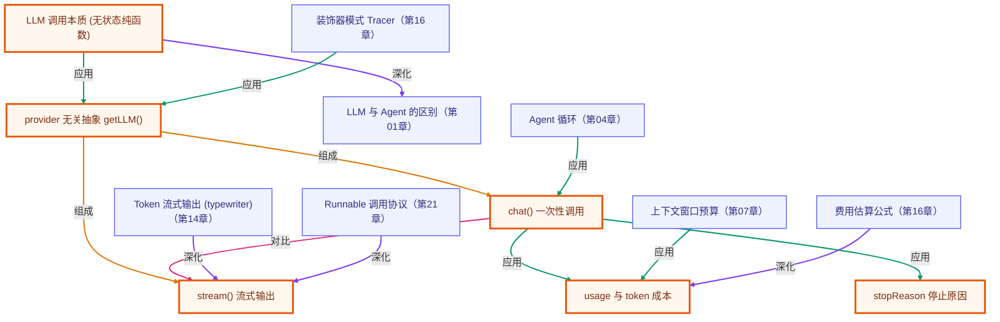

# 第 02 章 · 你的第一次 LLM 调用

> 所属阶段：**第一部分 · 基础概念**
> 预计用时：30 分钟 | 难度：⭐☆☆☆☆
> 全局导航：[课程导航](../../docs/navigation.md) · [完整大纲](../../docs/curriculum.md) · [知识图谱](../../docs/knowledge-graph.md)

## 学习目标

学完本章你能够：

- [ ] 理解一次 LLM 调用的本质：**输入一段消息 → 输出一段文本**。
- [ ] 用课程的 **provider 无关客户端** `getLLM()` 发起对话，并切换 Claude / OpenAI。
- [ ] 区分 `chat()`（一次性返回）与 `stream()`（流式逐字返回）。
- [ ] 读懂返回里的 `usage`（token 用量），建立成本意识。

## 前置知识

- 已读 [第 01 章 · 什么是 Agent](../01-what-is-an-agent/README.md)。
- 已按 [环境搭建](../../docs/setup.md) 配好 `.env`（至少一个厂商的 key）。

## 三层学习路线

| 层级 | 学习目标 | 你要完成什么 |
|------|----------|--------------|
| 极简 | 跑通第一次 provider 无关的 LLM 调用。 | 能用 `getLLM().chat()` 发消息并读懂 text、usage、stopReason。 |
| 进阶 | 理解一次模型调用的输入、输出、费用和停止原因。 | 对比 chat 与 stream,知道 temperature、maxTokens、model、provider 这些参数如何影响结果。 |
| 真实实践 | 把模型调用封装成项目里的稳定入口。 | 写出一个不会把 Claude/OpenAI 细节泄漏到业务代码里的 LLM client 使用方式。 |

---

## 图解学习地图

> 读图顺序：先看本章主线,再回到代码走读。核心焦点：**掌握 LLM 调用的最小闭环和 provider 抽象**。



### 原理展开

- 一次 LLM 调用可以理解为带随机性的函数: 输入 messages、system、temperature,输出 text、toolCalls、usage。先把这个边界看清,后面才不会把框架魔法误当原理。
- provider 抽象的价值是隔离变化: Anthropic 和 OpenAI 的 SDK 参数不同,但课程代码只依赖 LLMClient。厂商差异集中在 shared 层,学习者更容易追踪。
- usage 不是装饰信息,它是成本和可观测性的地基。每次调用都应该能回答用了多少输入 token、输出 token、模型是什么。

### 本章和整条路径的关系

后续所有章节都复用这个调用边界。工具调用、结构化输出、流式输出只是 chat/stream 的不同用法。

---

## 一、原理：LLM 调用就是一个「纯函数」

抛开所有花哨概念，一次大模型调用可以这样理解：

```
输入：消息列表（你说了什么、AI 之前说了什么）
  ↓  （模型推理）
输出：一段文本 + 用了多少 token
```

它**没有记忆**——模型不会"记住"你上一次说了什么，除非你把历史消息再次放进输入里（这一点在 [第 07 章 · 短期记忆](../07-short-term-memory/README.md) 展开）。理解这个"无状态"本质，是后面一切的基础。

### 为什么要包一层 `getLLM()`？

不同厂商的 SDK 形状不同：Claude 的 `messages.create`、OpenAI 的 `chat.completions.create`，返回结构也不一样。如果课程代码直接调某一家，换厂商就要全改。

所以我们在 `src/shared/llm` 做了一层**统一抽象**（见 [`types.ts`](../../src/shared/llm/types.ts)）：

```
你的代码  →  getLLM()  →  ┌─ Anthropic 实现
                          └─ OpenAI 实现
```

换厂商只改 `.env` 里的 `LLM_PROVIDER`，课程代码一行不动。这正是真实项目里防"厂商锁定"的标准做法。

---

## 二、代码走读

完整代码见 [`index.ts`](./index.ts)，核心三步：

```ts
import { getLLM } from "../../src/shared/llm";

// 1) 拿到一个客户端（厂商由 .env 的 LLM_PROVIDER 决定）
const llm = getLLM();

// 2) 发起一次对话
const result = await llm.chat({
  system: "你是一位简洁、友好的编程导师。",
  messages: [{ role: "user", content: "用一句话解释什么是 AI Agent。" }],
});

// 3) 读取结果
console.log(result.text);
console.log(`用量：输入 ${result.usage.inputTokens} / 输出 ${result.usage.outputTokens} token`);
```

### 流式输出

聊天类产品的"逐字蹦出"效果，靠的是 `stream()`：

```ts
const stream = llm.stream({
  messages: [{ role: "user", content: "写一首关于 TypeScript 的两行小诗。" }],
});
for await (const chunk of stream) {
  if (chunk.type === "text") process.stdout.write(chunk.text ?? "");
}
```

> 流式不会更快产出全部内容，但**首字延迟**低得多，用户体感好很多。

---

## 三、运行

```bash
# 默认厂商（.env 里的 LLM_PROVIDER）
npx tsx lessons/02-first-llm-call/index.ts

# 临时切到 OpenAI（仅本次运行）
# PowerShell:
$env:LLM_PROVIDER="openai"; npx tsx lessons/02-first-llm-call/index.ts
# macOS / Linux:
LLM_PROVIDER=openai npx tsx lessons/02-first-llm-call/index.ts
```

预期输出：一句对 Agent 的解释、一段流式小诗、以及一行 token 用量。

---

## 四、练习

1. **改 system 提示**：把导师换成"用东北话讲解技术"的风格，观察输出变化。
2. **多轮对话**：手动在 `messages` 里塞入一条 `assistant` 历史消息，再追加一条 `user`，验证"模型只看你给的上下文"。
3. **对比厂商**：同一个问题分别用 Claude 和 OpenAI 跑，比较回答风格与 token 用量。
4. **进阶**：打印 `result.stopReason`，理解它什么时候是 `stop`、什么时候可能是 `max_tokens`（试着把 `maxTokens` 设成 10）。

---

<!-- KG:START (由 npm run kg 自动生成，勿手改本标记区) -->

## 知识图谱与延伸阅读

> 本节由 `npm run kg` 自动生成（数据源 `knowledge-graph/data/graph.ts`）。要增删请改数据源后重跑。

### 本章概念图谱

> 节点：**橙框**=本章概念，蓝框=关联的其他章概念。连线按关系类型着色：前置(蓝) · 深化(紫) · 对比(玫红) · 应用(绿) · 组成(橙)。



### 与其他章节的关系

- `LLM 调用本质 (无状态纯函数)` —**深化**→ `LLM 与 Agent 的区别`（第 01 章）
- `Agent 循环` —**应用**→ `chat() 一次性调用`（第 04 章）
- `上下文窗口预算` —**应用**→ `usage 与 token 成本`（第 07 章）
- `Token 流式输出 (typewriter)` —**深化**→ `stream() 流式输出`（第 14 章）
- `费用估算公式` —**深化**→ `usage 与 token 成本`（第 16 章）
- `装饰器模式 Tracer` —**应用**→ `provider 无关抽象 getLLM()`（第 16 章）
- `Runnable 调用协议` —**深化**→ `stream() 流式输出`（第 21 章）

### 延伸阅读

- [Anthropic Messages API 文档](https://docs.anthropic.com/en/api/messages) — Claude 的 messages.create 接口，对应本章 chat() 的底层 `doc`
- [OpenAI Chat Completions API 文档](https://platform.openai.com/docs/api-reference/chat) — OpenAI 的 chat.completions.create 接口，本章 provider 抽象的另一实现 `doc`

> 🗺️ 在[全局知识图谱](../../docs/knowledge-graph.md) / [交互式图谱](../../knowledge-graph/output/index.html) 中查看本章位置。

<!-- KG:END -->

## 五、小结与延伸

- LLM 调用 = 无状态的"消息进、文本出"。
- 用统一抽象隔离厂商差异，是工程化第一课。
- 下一章 [第 03 章 · 提示工程](../03-prompt-engineering/README.md) 学习如何把"问得好"，显著提升输出质量。

> 💡 **面试会问**：什么是 token？为什么流式输出体验更好？为什么说 LLM 是"无状态"的？
