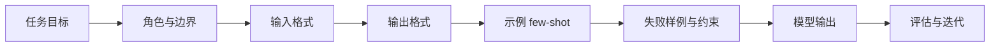
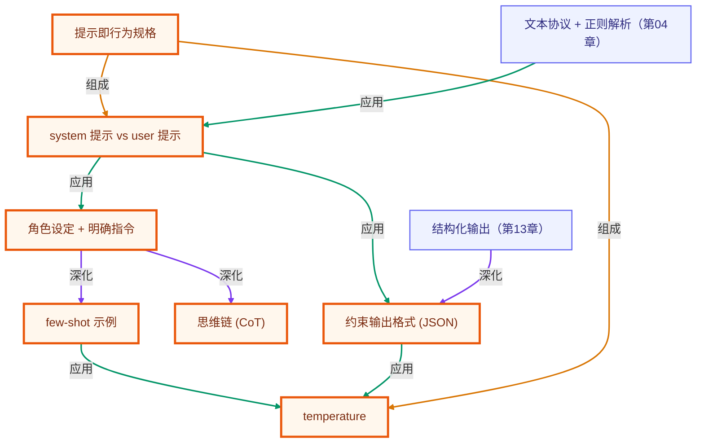

# 第 03 章 · 提示工程

> 所属阶段：**第一部分 · 基础概念**
> 预计用时：35 分钟 | 难度：⭐☆☆☆☆
> 全局导航：[课程导航](../../docs/navigation.md) · [完整大纲](../../docs/curriculum.md) · [知识图谱](../../docs/knowledge-graph.md)

## 学习目标

学完本章你能够：

- [ ] 区分 **system 提示** 与 **user 提示** 各自的职责，知道为什么 system 是 agent 行为的「总开关」。
- [ ] 用**角色设定 + 明确指令**把模糊问题变成可控输出。
- [ ] 用 **few-shot 示例**（给几个范例）让模型对齐你的自定义标签体系。
- [ ] 用**思维链（CoT）**让模型先推理再回答，提升多步任务的正确率。
- [ ] 用 system **强约束输出格式**（如固定 JSON），为下游程序消费做准备。
- [ ] 理解 **temperature** 高低对输出确定性的影响，并按任务选择合适的值。

## 前置知识

- 已读 [第 02 章 · 你的第一次 LLM 调用](../02-first-llm-call/README.md)，会用 `getLLM().chat()`、读得懂 `usage`。
- 已配好 `.env`（至少一个厂商的 key）。

## 三层学习路线

| 层级 | 学习目标 | 你要完成什么 |
|------|----------|--------------|
| 极简 | 能通过 system prompt 和少量示例改善输出。 | 改写同一个任务的 prompt,观察角色、约束、示例对结果的影响。 |
| 进阶 | 理解 prompt 是行为规格而不是文案装饰。 | 比较 zero-shot、few-shot、CoT、格式约束和 temperature 的边界,知道何时该换成结构化输出。 |
| 真实实践 | 把 prompt 当成可版本化的产品资产。 | 为一个真实功能写 prompt spec、坏例子、回归样例,为后续 eval 做准备。 |

---

## 图解学习地图

> 读图顺序：先看本章主线,再回到代码走读。核心焦点：**把提示词当成可测试的行为规格**。



### 原理展开

- 提示词不是咒语,而是行为规格。好的 prompt 会说明目标、边界、输入输出格式和失败时如何处理,让模型在可预期轨道内工作。
- few-shot 的本质是给模型局部模式,不是让它背答案。示例要覆盖边界条件,尤其是拒答、格式错误和歧义输入。
- 提示工程必须和评估一起出现。只看一次输出很容易误判,至少要用固定样例集反复比较不同 prompt 的稳定性。

### 本章和整条路径的关系

本章把自然语言变成工程接口。后续 agent 的 system prompt、工具描述、安全策略都依赖这套写法。

---

## 一、原理：提示就是 agent 的「程序」

传统程序里，行为由代码决定；在 LLM 这里，**行为由提示决定**。同一个模型，提示写得好不好，输出质量天差地别。所以「提示工程」不是玄学，而是一种可观测、可复现的工程实践。

一次调用里有两类提示，职责不同：

```
┌──────────────────────────────────────────────┐
│ system 提示  →  设定「它是谁、要遵守什么规则」     │  ← 全局、稳定、像"配置"
├──────────────────────────────────────────────┤
│ user 提示    →  给出「这一次具体要做什么」          │  ← 局部、多变、像"调用参数"
└──────────────────────────────────────────────┘
                      ↓
                  模型输出
```

**WHY 要重视 system 提示？** 它是 agent 行为的「总开关」：角色、语气、边界、输出格式都写在这里，对每一轮 user 输入都生效。后面章节里 agent 之所以「知道自己能用哪些工具、该怎么思考」，本质就是把这些规则写进了 system。

本章围绕五个最常用、性价比最高的提示技巧：

1. **角色设定 + 明确指令**：告诉模型「你是谁、给谁看、要什么格式、多长」。隐含期望写出来，输出立刻可用。
2. **few-shot 示例**：给几个「输入 → 期望输出」的范例，不训练模型就「现场教学」，让它模仿你的标准。
3. **思维链（CoT）**：让模型「先打草稿（写推理步骤）再给结论」，给多步任务留出推理空间，避免一步到位翻车。
4. **约束输出格式**：把输出锁定成固定结构（如 JSON），让下游代码能稳定解析。
5. **temperature**：控制随机性。`0` 高度确定、可复现（分类/抽取/计算）；接近 `1` 更发散有创意（起名/文案/头脑风暴）。

> 一句话心法：**把你脑子里的隐含期望，全部显式地写进提示。** 模型不会读心，它只对你写下的字面信息负责。

---

## 二、代码走读

完整代码见 [`index.ts`](./index.ts)，所有调用都走 `getLLM().chat()`。下面挑四个关键片段。

### 1) 模糊 vs. 精心设计

```ts
// 模糊：没角色、没受众、没格式 —— 模型只能自由发挥
await llm.chat({ messages: [{ role: "user", content: "讲讲闭包。" }] });

// 精心设计：system 设角色与受众，user 给明确的结构和长度约束
await llm.chat({
  system: "你是一位耐心的 JavaScript 讲师，面向零基础学员，用生活化类比解释概念。",
  messages: [{ role: "user", content: "解释闭包：1)生活化类比 2)≤8 行示例 3)一句话用途，总字数 150 以内。" }],
});
```

### 2) few-shot 文本分类

把「范例」直接编进 system，模型会模仿示例的格式与判断标准；分类任务用 `temperature: 0` 保证稳定：

```ts
const system = [
  "你是客服工单分类器。严格只输出一行，格式：情感|紧急度。",
  "示例：",
  '输入："东西很好用，谢谢！" → positive|low',
  '输入："账号被盗了，赶紧处理！" → negative|high',
].join("\n");

const result = await llm.chat({ system, temperature: 0, messages: [{ role: "user", content: `输入："..."` }] });
const label = result.text.trim().split("\n")[0]?.trim() ?? "(空)"; // 下标访问是 T|undefined，需判空
```

> 注意 `split("\n")[0]` 的结果类型是 `string | undefined`（项目开启了 `noUncheckedIndexedAccess`），所以这里用 `?? "(空)"` 兜底——这正是严格模式逼你养成的好习惯。

### 3) 思维链（CoT）

对易错的多步题，「直接报答案」常翻车，「先推理再回答」更稳：

```ts
// 直接回答：剥夺推理空间，容易错
await llm.chat({ system: "只回答最终数字，不要过程。", messages: [{ role: "user", content: question }] });

// 思维链：要求先分步、最后一行给『答案：』
await llm.chat({
  system: "你是数学助教。先分步写出计算过程，最后单独一行用『答案：』给出结果。",
  messages: [{ role: "user", content: question }],
});
```

例题「100 元先涨 20% 再降 20%」，直觉答 100，正确答案其实是 **96**——CoT 能帮模型避开这个坑。

### 4) 用 system 强约束输出为 JSON（为第 13 章铺垫）

```ts
const system = "你是信息抽取引擎。只输出一个 JSON 对象（不要代码块、不要解释），字段固定为 {name, company, email}。";
const result = await llm.chat({ system, temperature: 0, messages: [{ role: "user", content: text }] });

// 把模型输出解析成程序能用的对象；显式 try-catch，失败给出有意义的上下文
try {
  const parsed = JSON.parse(result.text.trim()) as Record<string, unknown>;
  // ...下游代码直接消费 parsed.name / parsed.email
} catch (err) {
  logger.warn(`解析失败（${(err as Error).message}）：约束还不够强，第 13 章用 schema 校验兜底。`);
}
```

> 第 13 章会把「约束输出」升级为 **schema 校验 + 失败重试**，让结构化输出真正可靠。本章先建立直觉。

---

## 三、运行

```bash
# 默认厂商（.env 里的 LLM_PROVIDER）
npx tsx lessons/03-prompt-engineering/index.ts
```

临时切换厂商（仅本次运行）：

```bash
# PowerShell:
$env:LLM_PROVIDER="openai"; npx tsx lessons/03-prompt-engineering/index.ts

# macOS / Linux:
LLM_PROVIDER=openai npx tsx lessons/03-prompt-engineering/index.ts
```

预期输出：五段对照实验——模糊/精心提示对比、few-shot 分类结果、CoT 推理过程（最终 96 元）、抽取出的 JSON 对象、以及 temperature 0/1 各跑两次的起名结果（0 趋于一致、1 各不相同）。

> 提示：`temperature=1` 的两次结果若偶尔相同也属正常，多跑几次差异会更明显。

---

## 四、练习

1. **基础 · 加约束**：给实验一的「精心设计提示」再加一条「用一个表格列出闭包的优点和风险」，观察输出形态的变化。
2. **few-shot · 改标签**：把实验二的分类标签从「情感|紧急度」改成你自己的体系（如「咨询/投诉/建议」），补 2 个示例，测试一条新样本。
3. **CoT · 找反例**：自己构造一道「直觉容易答错」的题（如年龄、日期、单位换算），对比「直接回答」与「思维链」的正确率。
4. **格式 · 加字段**：给实验四的 JSON 增加 `phone` 字段，并在文本里同时给出邮箱和电话，验证模型能否同时抽取。
5. **进阶 · 测稳定性**：把实验五的 `temperature` 改成 `0.3` 和 `0.7` 各跑几次，找到「既不呆板又不离谱」的甜区，并记录你的观察。

---

<!-- KG:START (由 npm run kg 自动生成，勿手改本标记区) -->

## 知识图谱与延伸阅读

> 本节由 `npm run kg` 自动生成（数据源 `knowledge-graph/data/graph.ts`）。要增删请改数据源后重跑。

### 本章概念图谱

> 节点：**橙框**=本章概念，蓝框=关联的其他章概念。连线按关系类型着色：前置(蓝) · 深化(紫) · 对比(玫红) · 应用(绿) · 组成(橙)。



### 与其他章节的关系

- `文本协议 + 正则解析` —**应用**→ `system 提示 vs user 提示`（第 04 章）
- `结构化输出` —**深化**→ `约束输出格式 (JSON)`（第 13 章）

### 延伸阅读

- [Chain-of-Thought Prompting Elicits Reasoning in Large Language Models](https://arxiv.org/abs/2201.11903) — 思维链 (CoT) 的奠基论文，对应本章实验三 `paper`
- [Language Models are Few-Shot Learners (GPT-3)](https://arxiv.org/abs/2005.14165) — few-shot 学习的代表性论文，对应本章实验二 `paper`
- [Anthropic 文档：Prompt engineering overview](https://docs.anthropic.com/en/docs/build-with-claude/prompt-engineering/overview) — 官方提示工程技巧汇总，覆盖角色/示例/格式约束 `doc`

> 🗺️ 在[全局知识图谱](../../docs/knowledge-graph.md) / [交互式图谱](../../knowledge-graph/output/index.html) 中查看本章位置。

<!-- KG:END -->

## 五、小结与延伸

- system 提示是 agent 行为的「总开关」，user 提示是「这一次的具体任务」。
- 角色设定、明确指令、few-shot、思维链、约束输出格式——把隐含期望显式写进提示，输出质量立刻提升。
- temperature 不是越高越好，而是「按任务对确定性的需求」来选。
- 上一章 [第 02 章 · 你的第一次 LLM 调用](../02-first-llm-call/README.md) 学会了怎么「调用」模型；本章学会了怎么「问得好」。
- 下一章 [第 04 章 · Agent 循环](../04-the-agent-loop/README.md) 把「问得好」放进一个能反复思考、调用工具的循环里，让模型真正「动起来」。

> 💡 **面试会问**：system 提示和 user 提示有什么区别？few-shot 和微调（fine-tuning）各适合什么场景？为什么思维链（CoT）能提升正确率？什么任务该把 temperature 设成 0？
