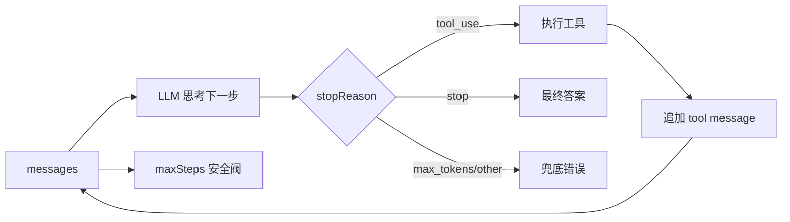
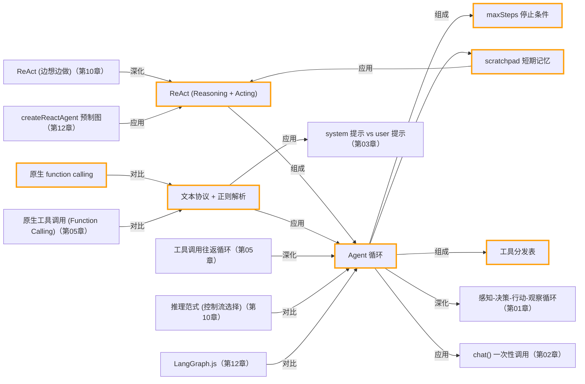

# 第 04 章 · 手写 Agent 循环 (ReAct)

> 所属阶段：**第二部分 · 从零手写核心**
> 预计用时：45 分钟 | 难度：⭐⭐☆☆☆

## 学习目标

学完本章你能够：

- [ ] 说清 **ReAct = Reasoning + Acting**：模型为什么要「思考」与「行动」交替进行。
- [ ] 从零手写一个 agent 循环：**Thought → Action → Observation → … → Final Answer**。
- [ ] 用「文本协议」让模型输出固定格式，再用**正则解析**出它想调用哪个工具。
- [ ] 理解为何必须有**停止条件 `maxSteps`**，以及它如何防止死循环 / 预算失控。
- [ ] 分辨「手摇版 ReAct」与「原生 function calling」的边界（下一章引入后者）。

## 前置知识

- 已读 [第 02 章 · 你的第一次 LLM 调用](../02-first-llm-call/README.md)，理解 `getLLM().chat()` 与「LLM 是无状态的」。
- 已读 [第 03 章 · 提示工程](../03-prompt-engineering/README.md)，理解 system 提示如何约束模型行为。

## 三层学习路线

| 层级 | 学习目标 | 你要完成什么 |
|------|----------|--------------|
| 极简 | 跑通一个最小 ReAct 循环。 | 看懂 Thought、Action、Observation 如何组成多步任务,并能指出循环何时停止。 |
| 进阶 | 理解 agent loop 的控制权和上下文管理。 | 解释 messages、tool result、stopReason、maxSteps 如何共同决定下一轮。 |
| 真实实践 | 把手写 loop 抽成可复用 runtime 的雏形。 | 为一个需要查资料或算步骤的任务设计 loop、日志、错误回灌和人工终止点。 |

---

## 图解学习地图

> 读图顺序：先看本章主线,再回到代码走读。核心焦点：**手写 ReAct 风格的多步循环**。



### 原理展开

- Agent loop 的核心是消息数组的可变历史。每一轮模型输出都被写回 history,工具结果也被写回 history,下一轮模型因此拥有新状态。
- maxSteps 是必要安全阀。模型可能反复要工具、工具可能返回无效信息,没有上限就会变成无限循环和无限账单。
- ReAct 的可调试性来自把 Reason/Act/Observe 分开。你能看见模型为什么调用某工具、工具返回什么、下一步如何变化。

### 本章和整条路径的关系

第 05/06 章把这里的手写工具执行抽象成工具系统; capstone 则把这条循环扩展成完整研究流程。

---

## 一、原理：为什么一次调用不够，需要「循环」

第 02 章我们见过：一次 LLM 调用就是「消息进、文本出」的纯函数。但很多问题**一步答不出来**：

> 「北京和上海的常住人口加起来大约是多少万人？」

模型脑子里可能没有精确数字，需要先**查**北京、再**查**上海、最后**算**加和。这就要求它能：

1. **思考（Reasoning）**：现在缺什么信息？下一步该做什么？
2. **行动（Acting）**：调用一个工具去获取信息 / 执行计算。
3. **观察（Observation）**：拿到工具结果，回到第 1 步继续思考。

这套「想一步、做一步、看一眼结果，再想下一步」的范式就叫 **ReAct（Reasoning + Acting）**。它的核心是一个**循环**：

```
        ┌──────────────────────────────────────────┐
        │                                            │
   ┌────▼─────┐   ┌──────────┐   ┌──────────────┐   │
   │ Thought  │──▶│  Action  │──▶│  执行工具     │   │
   │ 我缺人口  │   │ lookup   │   │  → 北京2189   │   │
   └──────────┘   └──────────┘   └──────┬───────┘   │
                                        │            │
                                 ┌──────▼───────┐    │
                                 │ Observation  │────┘  把结果拼回上下文，再来一轮
                                 │ 北京约2189万  │
                                 └──────────────┘
                                        │
                              （信息够了？）│ 是
                                        ▼
                                 ┌──────────────┐
                                 │ Final Answer │  跳出循环
                                 └──────────────┘
```

### 为什么本章故意用「文本协议」而不是原生工具调用？

今天的主流模型都带**原生 function calling**：你把工具描述传进去，模型直接返回结构化的「我要调用 X 工具，参数是 Y」。又干净又稳。**但那会把循环的本质藏起来。**

所以本章倒回到没有原生工具调用的时代，用最朴素的办法：

- 在 **system 提示**里「约法三章」，要求模型每一步只能输出两种文本格式之一：
  - 想调工具 → `Thought:` / `Action:` / `Action Input:`
  - 能回答了 → `Thought:` / `Final Answer:`
- 我们**用正则把这段文本解析开**，自己决定调哪个工具、传什么输入。
- 把工具结果作为 `Observation:` **手动拼回**对话，再发起下一次 `chat()`。

这样你会亲眼看到：所谓「agent」不过是 **一个 while 循环 + 一个文本解析器 + 一张工具表**。下一章用原生 function calling，你就明白那层抽象帮你省掉了「写格式提示」和「正则解析」这两件脏活。

> 本章**只用 `getLLM().chat()`**，刻意不碰 shared 里现成的 `runAgent` / `ToolRegistry`——那些是「成品」，本章是「拆开看内部」。

---

## 二、代码走读

完整代码见 [`index.ts`](./index.ts)。这里拆讲四块。

### 1) 工具：最朴素的「字符串进、字符串出」

文本协议下，模型给的 `Action Input` 本质就是一段文本，所以工具签名统一成 `(input: string) => string`，循环代码就不必关心每个工具的参数形状。

```ts
// 城市 → 人口查表；查不到时返回一句"可读的提示"，让模型自己换问法或收尾
function lookupPopulation(city: string): string {
  const value = POPULATION_TABLE[city.trim()];
  if (value === undefined) {
    return `未收录城市「${city.trim()}」。已收录：${Object.keys(POPULATION_TABLE).join("、")}。`;
  }
  return `${city.trim()} 的常住人口约 ${value} 万人。`;
}
```

> 计算器工具**不用 `eval`**：先用白名单正则 `^[\d+\-*/().\s]+$` 把输入卡死（只允许数字与运算符），再求值。`eval` 会执行任意代码，是经典安全漏洞——哪怕教学代码也不该养成坏习惯。

### 2) System 提示：把「输出格式」写成铁律

模型没有原生工具通道时，唯一能约束它的就是提示词。我们要求它一次只走一步：

```ts
const SYSTEM_PROMPT = `你是一个会使用工具的智能助手。你必须严格按 ReAct 格式逐步推理。
...
格式 A（需要调用工具时）：
Thought: <你的思考>
Action: <工具名>
Action Input: <传给工具的输入>

格式 B（已经能回答用户时）：
Thought: <你的思考>
Final Answer: <给用户的最终答案>`;
```

### 3) 解析器：从文本里抠出「它想干什么」

```ts
function parseStep(text: string): Parsed {
  // 先看停止信号：一旦出现 Final Answer 就结束，别再去找 Action
  const finalMatch = text.match(/Final Answer:\s*([\s\S]+)/i);
  if (finalMatch && finalMatch[1] !== undefined) {
    return { kind: "final", answer: finalMatch[1].trim() };
  }
  const actionMatch = text.match(/Action:\s*([^\n]+)/i);
  const inputMatch = text.match(/Action Input:\s*([^\n]+)/i);
  if (actionMatch && actionMatch[1] !== undefined && inputMatch && inputMatch[1] !== undefined) {
    return { kind: "action", tool: actionMatch[1].trim(), input: inputMatch[1].trim() };
  }
  return { kind: "unknown" }; // 没按格式输出，交给循环兜底
}
```

> TS 细节：本工程开了 `noUncheckedIndexedAccess`，所以 `finalMatch[1]` 的类型是 `string | undefined`，必须显式判 `!== undefined` 才能安全 `.trim()`——这不是啰嗦，是类型系统在帮你堵「正则没捕获到」的坑。

### 4) 循环本体：while + 解析 + 执行 + 回填

```ts
let scratchpad = `Question: ${question}\n`;          // 模型的"草稿纸"

for (let step = 1; step <= maxSteps; step++) {
  const result = await llm.chat({
    system: SYSTEM_PROMPT,
    messages: [{ role: "user", content: scratchpad }],
    temperature: 0,                                   // 低温让格式更稳定、可被正则解析
  });
  const parsed = parseStep(result.text.trim());

  if (parsed.kind === "final") return parsed.answer;  // 收敛，跳出

  if (parsed.kind === "action") {
    const tool = TOOLS[parsed.tool];
    const observation = tool ? tool(parsed.input) : `未知工具「${parsed.tool}」…`;
    // 关键：把"模型这一步 + 真实 Observation"拼回草稿纸，下一轮模型才能读到结果
    scratchpad += `${result.text.trim()}\nObservation: ${observation}\n`;
    continue;
  }
  // ...格式异常则提示其修正...
}
throw new Error(`达到最大步数 ${maxSteps} 仍未收敛，强制停止以防死循环。`);
```

两个最容易被忽略却最关键的点：

- **每轮都把完整 `scratchpad` 喂回去**：LLM 无状态（第 02 章），不重放历史它就「失忆」。`scratchpad` 就是我们手动维护的「短期记忆」（第 07 章会系统讲）。
- **`maxSteps` 是安全带**：没有它，一个「想不通」的模型会无限调工具，烧光预算甚至卡死。**停止条件比循环体本身更重要。**

---

## 三、运行

```bash
# 默认厂商（.env 里的 LLM_PROVIDER）
npx tsx lessons/04-the-agent-loop/index.ts
```

切换厂商（仅本次运行）：

```bash
# PowerShell:
$env:LLM_PROVIDER="openai"; npx tsx lessons/04-the-agent-loop/index.ts
# macOS / Linux:
LLM_PROVIDER=openai npx tsx lessons/04-the-agent-loop/index.ts
```

预期输出：你会**逐步**看到模型的每一步——先 `lookup_population 北京`、再 `lookup_population 上海`、然后 `calculate 2189 + 2487`，每步后面跟一行 `Observation:`，最后给出 `Final Answer`。这正是 ReAct 循环在你眼前一圈圈转。

> 想看得更细，可设 `DEBUG=1` 再跑（`logger.debug` 会输出）；或把 `temperature` 调高，观察模型格式开始「飘」、解析器如何兜底。

---

## 四、练习

1. **加一个工具**：在 `TOOLS` 表里加一个 `current_time`（返回当前时间字符串），并在 system 提示里登记它。问模型「现在几点」，看它学会调用新工具。
2. **触发停止条件**：把 `maxSteps` 改成 `1`，再问那个需要多步的人口问题，观察循环如何因「未收敛」被强制中止——体会安全带的作用。
3. **打印 token 用量**：把每一步 `result.usage` 累加起来，在结尾打印总用量。你会发现：**ReAct 的代价是多次往返 = 更多 token**，这是「能力 vs 成本」的真实权衡。
4. **制造格式错误**：把 system 提示里的格式要求删掉一部分，观察模型输出变乱、`parseStep` 返回 `unknown`、循环走「格式异常」分支去纠偏。
5. **进阶**：把 `scratchpad`（单条 user 消息）改造成真正的多轮 `messages` 数组（assistant 放模型输出、user 放 Observation），对比两种「记忆」组织方式的差异。

---

<!-- KG:START (由 npm run kg 自动生成，勿手改本标记区) -->

## 知识图谱与延伸阅读

> 本节由 `npm run kg` 自动生成（数据源 `knowledge-graph/data/graph.ts`）。要增删请改数据源后重跑。

### 本章概念图谱



### 与其他章节的关系

- `Agent 循环` —**深化**→ `感知-决策-行动-观察循环`（第 01 章）
- `Agent 循环` —**应用**→ `chat() 一次性调用`（第 02 章）
- `文本协议 + 正则解析` —**应用**→ `system 提示 vs user 提示`（第 03 章）
- `原生工具调用 (Function Calling)` —**对比**→ `文本协议 + 正则解析`（第 05 章）
- `工具调用往返循环` —**深化**→ `Agent 循环`（第 05 章）
- `ReAct (边想边做)` —**深化**→ `ReAct (Reasoning + Acting)`（第 10 章）
- `推理范式 (控制流选择)` —**对比**→ `Agent 循环`（第 10 章）
- `LangGraph.js` —**对比**→ `Agent 循环`（第 12 章）
- `createReactAgent 预制图` —**应用**→ `ReAct (Reasoning + Acting)`（第 12 章）

### 延伸阅读

- [ReAct: Synergizing Reasoning and Acting in Language Models](https://arxiv.org/abs/2210.03629) — ReAct 原始论文，本章「思考+行动交替」范式的来源 `paper`

> 🗺️ 在[全局知识图谱](../../docs/knowledge-graph.md) / [交互式图谱](../../knowledge-graph/output/index.html) 中查看本章位置。

<!-- KG:END -->

## 五、小结与延伸

- **ReAct = 思考 + 行动的循环**：Thought → Action → Observation → … → Final Answer。
- 「agent」的本质很朴素：**一个带停止条件的 while 循环 + 文本解析 + 工具表**。
- 本章用**文本协议 + 正则解析**是为了拆开看内部；它脆（模型一不守格式就要兜底），所以现代做法改用**原生 function calling**。
- 上一章 [第 03 章 · 提示工程](../03-prompt-engineering/README.md)；下一章 [第 05 章 · 工具调用基础](../05-tool-use-basics/README.md) 用原生 function calling 重写本章逻辑，并引入 shared 的 `runAgent` / `ToolRegistry`——你会看到本章那些「脏活」是如何被抽象掉的。

> 💡 **面试会问**：ReAct 是什么、它解决了什么问题？为什么 agent 循环必须有 `maxSteps`（停止条件）？文本协议解析相比原生 function calling 有哪些脆弱点？
