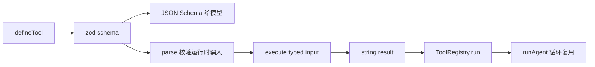
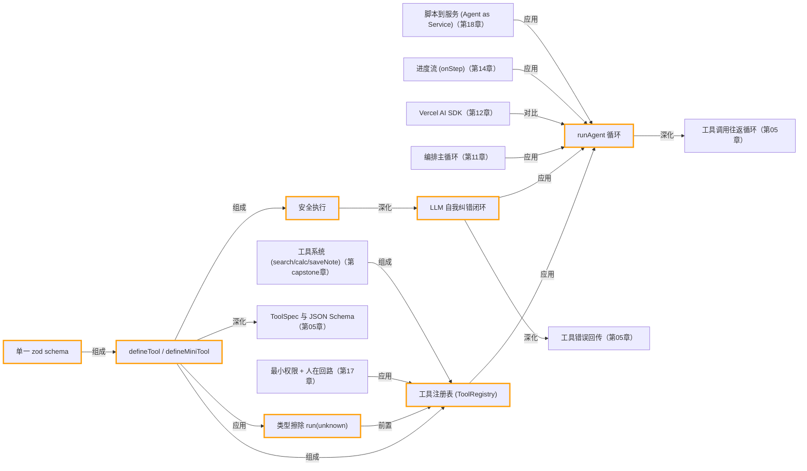

# 第 06 章 · 从零构建工具系统

> 所属阶段：**第二部分 · 从零手写核心**
> 预计用时：50 分钟 | 难度：⭐⭐⭐☆☆
> 全局导航：[课程导航](../../docs/navigation.md) · [完整大纲](../../docs/curriculum.md) · [知识图谱](../../docs/knowledge-graph.md)

## 学习目标

学完本章你能够：

- [ ] 用一个 **zod schema** 同时完成「运行期参数校验」和「给模型的 JSON Schema 描述」——单一事实来源。
- [ ] 亲手实现一个简化版 **工具注册表（ToolRegistry）**：登记、列举 specs、按名分发。
- [ ] 理解「**安全执行**」：未知工具 / 非法参数 / 执行抛错都转成字符串回给模型，让它**自我纠错**，而不是让程序崩溃。
- [ ] 从手写版无缝切换到 shared 的成品 `defineTool` / `ToolRegistry` / `runAgent`，跑通一个真·多工具 agent。

## 前置知识

- 已读 [第 05 章 · 工具调用基础](../05-tool-use-basics/README.md)：知道模型如何「请求」调用一个工具、我们如何把结果回传。
- 已读 [第 02 章 · 你的第一次 LLM 调用](../02-first-llm-call/README.md)：熟悉 `getLLM()` 与 `chat()`。
- 了解 [zod](https://zod.dev) 的基本写法（`z.object`、`z.number`、`z.enum`）。

## 三层学习路线

| 层级 | 学习目标 | 你要完成什么 |
|------|----------|--------------|
| 极简 | 用 `defineTool` 和 registry 管理多个工具。 | 新增一个工具,能被注册、校验、执行,并返回结构化结果。 |
| 进阶 | 理解工具系统的类型、运行期校验和安全执行。 | 说明 zod schema、ToolSpec、ToolRegistry、错误包装如何一起减少不可信输入风险。 |
| 真实实践 | 把工具层升级成企业 Agent 的能力边界。 | 设计一组内部工具的命名、权限、超时、审计和未来接入 MCP 的映射方式。 |

---

## 图解学习地图

> 读图顺序：先看本章主线,再回到代码走读。核心焦点：**从零实现可复用 ToolRegistry**。



### 原理展开

- 工具系统的目标是单一事实来源: 同一个 zod schema 同时服务模型描述和运行时校验,避免文档和代码漂移。
- 注册表应该存同构工具。作者写工具时保留具体类型,注册后擦除成统一 Tool,可以避免 TypeScript 函数参数逆变导致的集合类型问题。
- ToolRegistry 是权限边界。未来做生产系统时,审计日志、限流、危险工具确认都应该挂在这一层,而不是散落在每个 lesson。

### 本章和整条路径的关系

本章产物是后续所有 agent 的工具基础设施。RAG 搜索、计算器、保存笔记、部署 API 都会以工具形式接入循环。

---

## 一、原理：为什么需要一个「工具系统」

第 05 章我们让模型调了一次工具。但只要工具一多，**手写 schema + 手写 dispatch** 就会失控：

```
手写痛点（不可扩展）：
  ┌─ 给模型的参数描述         ← 手写一份 JSON
  ├─ 执行前的参数校验         ← 手写一份 if 判断   ← 两份「真相」会逐渐漂移
  └─ 按工具名分发执行         ← 一长串 if/else，每加一个工具就改这里
```

成熟的工具系统把它收敛成**三要素**（这正是 `src/shared/agent/tool.ts` 的设计）：

```
        ┌──────────────────────────────────────────────┐
        │  单一 zod schema                               │
        │     ├─ safeParse() ── 运行期参数校验            │
        │     └─ zodToJsonSchema() ── 生成模型可读描述     │  ← 一份真相，两个用途
        └──────────────────────────────────────────────┘
                              │
                              ▼
        ┌──────────────────────────────────────────────┐
        │  ToolRegistry 注册表                            │
        │     register() / specs() / run({name,args})    │  ← 新增工具不改分发逻辑
        └──────────────────────────────────────────────┘
                              │
                              ▼
        ┌──────────────────────────────────────────────┐
        │  安全执行 run()                                 │
        │     未知工具 / 参数非法 / 执行抛错               │
        │        → 全部转成「Error: ...」字符串回给模型     │  ← 程序不崩，模型自我纠错
        └──────────────────────────────────────────────┘
```

### 三要素各解决一个问题

1. **单一 schema（DRY）**：描述和校验永远一致。改一处，两处同步。还顺手用 `.describe()` 把字段说明喂给模型，调用更准。
2. **注册表（开闭原则）**：分发逻辑写一次，新增工具只是 `register` 一下，`run` 一行都不用动。
3. **安全执行（容错）**：在 agent 循环里，工具结果会作为一条 `tool` 消息**回传给模型**。如果工具一抛错整个 agent 就崩了；反之，把错误描述清楚回给模型，它往往能读懂并在下一轮纠正（换正确工具名、补齐缺参数）。这就是 **LLM 的「自我纠错」闭环**。

---

## 二、代码走读

本章代码分两个文件：

- [`mini-tool-system.ts`](./mini-tool-system.ts)：**亲手重建**的简化版工具系统（不依赖 shared）。
- [`index.ts`](./index.ts)：第一部分用手写版离线演示机制；第二部分切到 shared 成品跑真 agent。

### 第一部分：亲手重建（看清内部）

核心是 `defineMiniTool`：它把「zod schema → 模型可读描述」与「校验 → 执行 → 字符串化 → 错误兜底」一次性封装好。三类失败都**返回字符串**，绝不向上抛：

```ts
export function defineMiniTool<I>(def: MiniToolDefinition<I>): MiniTool {
  const parameters = buildParameters(def.schema); // 一份 schema → 模型可读描述（剥掉元字段噪音）
  return {
    name: def.name,
    description: def.description,
    parameters,
    run: async (input: unknown): Promise<string> => {
      const parsed = def.schema.safeParse(input);
      if (!parsed.success) {                                       // 失败一：参数过不了校验
        const detail = parsed.error.issues
          .map((i) => `${i.path.join(".") || "(root)"}: ${i.message}`)
          .join("; ");
        return `Error: 工具 "${def.name}" 参数校验失败 — ${detail}`;
      }
      try {                                                        // 失败二：execute 自身抛错
        const result = await def.execute(parsed.data);            // parsed.data 类型精确为 I
        return typeof result === "string" ? result : JSON.stringify(result);
      } catch (err) {
        return `Error: 工具 "${def.name}" 执行异常 — ${(err as Error).message}`;
      }
    },
  };
}
```

注册表因此变得很薄——只负责「按名查找 + 转发」，未知工具是它唯一要处理的失败：

```ts
async run(call: { name: string; arguments: Record<string, unknown> }): Promise<string> {
  const tool = this.tools.get(call.name);
  if (!tool) return `Error: 未知工具 "${call.name}"`;  // 失败三：工具不存在
  return tool.run(call.arguments);                      // 校验/执行/兜底都在 tool.run 里
}
```

> **为什么 `run(input: unknown)` 而不是带类型的 `execute(input: I)`？** 注册表要同时装下入参类型各不相同的工具（`add` 要 `{a,b}`、`current_time` 不要参数…）。若每个工具在数组里都保留各自的泛型入参类型，会因为 **TS 的函数参数逆变** 而互不兼容；用 `any` 又会丢掉类型安全。所以让 `defineMiniTool` 在**定义时**就把校验和执行包进 `run`，对外统一成 `run(unknown)`——**作者写 `execute` 时仍有精确类型 `I`，注册表里却是同构类型**，两全其美。shared 的 `defineTool` 用的是同一套设计。

> 注意用 `safeParse` 而不是 `parse`：前者返回 `{ success, data | error }` 让我们**自己决定怎么处理**，后者会抛异常——而我们恰恰不想抛。

### 第二部分：切换到 shared 成品

成品的形状和你手写的几乎一样，所以切换无痛。用 `defineTool` 定义工具时，`execute` 的入参类型会被 schema **自动推断**，不用手写：

```ts
import { z } from "zod";
import { defineTool, ToolRegistry, runAgent } from "../../src/shared";
import { getLLM } from "../../src/shared/llm";

const calculatorTool = defineTool({
  name: "calculator",
  description: "做一次四则运算。除以零会报错（用来演示安全执行）。",
  schema: z.object({
    a: z.number(),
    op: z.enum(["+", "-", "*", "/"]),
    b: z.number(),
  }),
  execute: ({ a, op, b }) => {
    if (op === "/" && b === 0) throw new Error("除数不能为 0"); // 抛错会被 registry 兜成字符串
    // ...
  },
});

const registry = new ToolRegistry([calculatorTool /* , ...更多工具 */]);

const run = await runAgent({
  client: getLLM(),
  registry,
  system: "涉及计算或换算必须调用工具，不要心算。",
  messages: [{ role: "user", content: "(12+8)*3 是多少？再把 5 千米换成英里。" }],
  onStep: (step) => step.toolResults.forEach((tr) => console.log(tr.name, tr.output)),
});
console.log(run.finalText);
```

> `runAgent` 内部就是「调模型 → 模型要调工具就 `registry.run` → 把结果作为 `tool` 消息回传 → 再调模型」的循环（见 [`src/shared/agent/loop.ts`](../../src/shared/agent/loop.ts)）。本章你只需关注**工具系统**这一层。

> ⚠️ 关于 `noUncheckedIndexedAccess`：本工程开启了它，所以**数组/对象下标访问的结果是 `T | undefined`**。`index.ts` 里 `toMeter[from]!` 用了 `!`，因为 `from` 已被 `z.enum` 约束必在表内——这是「我已确保安全」的显式断言。

---

## 三、运行

```bash
# 默认厂商（.env 里的 LLM_PROVIDER）
npx tsx lessons/06-building-a-tool-system/index.ts
```

临时切换厂商（仅本次运行）：

```bash
# PowerShell:
$env:LLM_PROVIDER="openai"; npx tsx lessons/06-building-a-tool-system/index.ts

# macOS / Linux:
LLM_PROVIDER=openai npx tsx lessons/06-building-a-tool-system/index.ts
```

预期输出：

1. **第一部分（离线，无需 key）**：打印自动生成的工具 specs；然后演示「合法参数 → 正常结果」「非法参数 → 校验错误字符串」「未知工具 → 错误字符串」。
2. **第二部分（调真模型，需 key）**：模型自动调用 `calculator` 与 `convert_length` 完成计算与换算，逐步打印每个工具的返回，最后给出汇总回复与 token 用量；末尾再手动触发几次降级路径（除零 / 非法运算符 / 未知工具）。

---

## 四、练习

1. **加一个工具**：在 `index.ts` 里新增一个 `random_int`（给定 `min`/`max` 返回随机整数）工具并注册，问模型「掷一个 1-6 的骰子」，观察它是否会调用。体会「只改一行 register，agent 循环零改动」。
2. **更严的校验**：给 `convert_length` 的 `value` 加上 `.positive()` 约束，然后故意让模型换算一个负数，看 `run()` 返回的校验错误，再看模型是否会改正。
3. **对象返回**：把 `current_time` 改成返回对象 `{ iso, unix }`，验证 `run()` 会自动 `JSON.stringify`，且模型仍能读懂。
4. **故意「钓鱼」**：把问题改成「用 `power` 工具算 2 的 10 次方」（你并没有注册 `power`），观察模型收到「未知工具」错误后如何降级（改用 `calculator` 连乘，或直接说明做不到）。
5. **进阶**：给 `MiniToolRegistry`（手写版）补一个 `has(name): boolean` 与 `unregister(name): boolean`，并写两行断言验证；体会注册表作为「容器」可以有哪些自然的扩展点。

---

<!-- KG:START (由 npm run kg 自动生成，勿手改本标记区) -->

## 知识图谱与延伸阅读

> 本节由 `npm run kg` 自动生成（数据源 `knowledge-graph/data/graph.ts`）。要增删请改数据源后重跑。

### 本章概念图谱



### 与其他章节的关系

- `defineTool / defineMiniTool` —**深化**→ `ToolSpec 与 JSON Schema`（第 05 章）
- `runAgent 循环` —**深化**→ `工具调用往返循环`（第 05 章）
- `LLM 自我纠错闭环` —**深化**→ `工具错误回传`（第 05 章）
- `编排主循环` —**应用**→ `runAgent 循环`（第 11 章）
- `Vercel AI SDK` —**对比**→ `runAgent 循环`（第 12 章）
- `进度流 (onStep)` —**应用**→ `runAgent 循环`（第 14 章）
- `最小权限 + 人在回路` —**应用**→ `工具注册表 (ToolRegistry)`（第 17 章）
- `脚本到服务 (Agent as Service)` —**应用**→ `runAgent 循环`（第 18 章）
- `工具系统 (search/calc/saveNote)` —**组成**→ `工具注册表 (ToolRegistry)`（第 capstone 章）

### 延伸阅读

- [Anthropic Docs · Tool use (function calling) with Claude](https://docs.anthropic.com/en/docs/build-with-claude/tool-use) — 官方工具调用文档，含 tool_use stopReason 与 tool_result 回传机制 `doc`
- [Zod 官方文档](https://zod.dev) — 本章 schema 校验与类型推断的基础库，README 前置知识引用 `doc`

> 🗺️ 在[全局知识图谱](../../docs/knowledge-graph.md) / [交互式图谱](../../knowledge-graph/output/index.html) 中查看本章位置。

<!-- KG:END -->

## 五、小结与延伸

- 工具系统 = **单一 zod schema** + **注册表** + **安全执行**，三者各解决「DRY / 可扩展 / 容错」一个问题。
- 「错误转字符串回给模型」不是偷懒，而是刻意设计——它把 LLM 的自我纠错能力纳入了系统闭环。
- 你手写的 `MiniToolRegistry` 和 shared 的成品 `ToolRegistry` 本质相同，理解了前者就理解了后者。
- 上一章 [第 05 章 · 工具调用基础](../05-tool-use-basics/README.md) 讲「一次工具调用怎么发生」；下一章 [第 07 章 · 短期记忆](../07-short-term-memory/README.md) 解决「多轮之间如何记住上下文」——有了工具又有了记忆，agent 才真正活起来。

> 💡 **面试会问**：为什么用 zod 同时做校验和 schema 生成？工具执行报错时为什么不直接抛异常，而要回传字符串给模型？注册表相比手写 `if/else` 分发好在哪？
