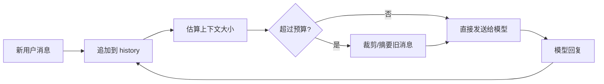
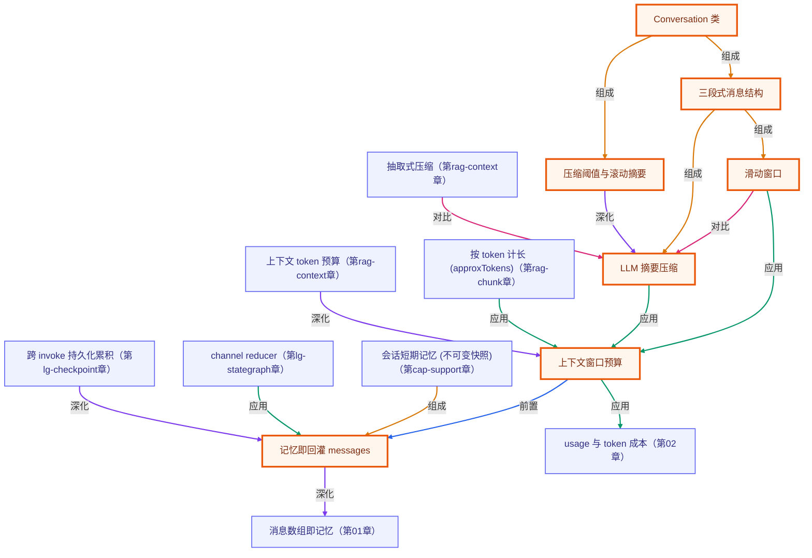

# 第 07 章 · 短期记忆与上下文管理

> 所属阶段：**第二部分 · 从零手写核心**
> 预计用时：40 分钟 | 难度：⭐⭐☆☆☆
> 全局导航：[课程导航](../../docs/navigation.md) · [完整大纲](../../docs/curriculum.md) · [知识图谱](../../docs/knowledge-graph.md)

## 学习目标

学完本章你能够：

- [ ] 说清「对话记忆」的本质：**不是模型记住了，而是你把历史塞回了 `messages`**。
- [ ] 理解上下文窗口的**容量上限**与**成本**——为什么不能无脑堆历史。
- [ ] 实现**滑动窗口**：只保留最近 N 轮原文，控制每次请求的规模。
- [ ] 实现 **LLM 摘要压缩**：历史过长时把旧对话压成一条摘要，省 token 且不失忆。

## 前置知识

- 已读 [第 02 章 · 你的第一次 LLM 调用](../02-first-llm-call/README.md)——尤其是「LLM 无状态」那段。
- 已读 [第 06 章 · 构建工具系统](../06-building-a-tool-system/README.md)，熟悉 `messages` 数组的来回传递。
- 已按 [环境搭建](../../docs/setup.md) 配好 `.env`（至少一个厂商的 key）。

## 三层学习路线

| 层级 | 学习目标 | 你要完成什么 |
|------|----------|--------------|
| 极简 | 用 history array 保留多轮对话。 | 能解释为什么每次调用都要把必要历史重新放进 messages。 |
| 进阶 | 掌握上下文窗口、摘要压缩和 token 预算。 | 比较最近 N 轮、滑动窗口、摘要记忆三种策略的成本和丢信息风险。 |
| 真实实践 | 为真实会话设计记忆生命周期。 | 定义哪些内容进短期记忆、哪些进长期记忆、哪些必须因隐私或合规被丢弃。 |

---

## 图解学习地图

> 读图顺序：先看本章主线,再回到代码走读。核心焦点：**把对话历史当作可裁剪的工作记忆**。



### 原理展开

- 短期记忆不是模型内部自动记住,而是你把历史消息重新放进下一次请求。少放会失忆,多放会超上下文和烧成本。
- 记忆管理本质是信息压缩: 保留目标、约束、最近交互和工具结果,丢弃寒暄、重复内容和已经沉淀的中间推理。
- 上下文窗口是资源预算。真实产品会同时考虑 token 成本、延迟、隐私和相关性,不是简单把全部聊天记录塞进去。

### 本章和整条路径的关系

本章解决短会话状态。第 08/09 章会引入向量检索,处理放不进上下文的长期知识。

---

## 一、原理：「记忆」是你手动维护的一个数组

第 02 章讲过：LLM 是**无状态**的。它不会记得你上一句说了什么——除非你把历史再次放进输入里。

所以「对话记忆」根本没有魔法，它就是一个数组：

```
第 1 轮：messages = [u1]                         → 模型答 a1
第 2 轮：messages = [u1, a1, u2]                  → 模型答 a2   ← 把历史一起送回去
第 3 轮：messages = [u1, a1, u2, a2, u3]          → 模型答 a3
                    └──────── 你手动维护的历史 ────────┘
```

模型之所以「记得」你叫什么、讨厌什么，是因为**每次调用你都把前文一并发了过去**。

### 为什么不能无脑堆历史？两个硬约束

1. **窗口有限**：每个模型有最大上下文长度（token 上限）。历史无限增长，迟早撑爆请求直接报错。
2. **成本随长度上升**：你为**每次请求里的全部 token**付费。下面是「无脑堆历史」的成本曲线——

```
每次请求的输入 token
  ▲
  │                                   ╱  ← 第 N 轮要重发前 N-1 轮的全部内容
  │                              ╱        轮次越多，单轮越贵（近似 O(n²) 累计）
  │                         ╱
  │                    ╱
  │               ╱
  │          ╱
  │     ╱
  └──────────────────────────────────▶ 对话轮次
```

第 5 轮你不只发第 5 句，而是把前 4 轮**全部重发一遍**。轮次越多，每一轮都更贵。

### 解法：滑动窗口 + 摘要压缩

| 策略 | 做什么 | 代价 |
|------|--------|------|
| **滑动窗口** | 只保留最近 N 轮原文，更早的直接丢弃 | 简单，但会丢掉早期细节 |
| **LLM 摘要压缩** | 把窗口外的旧历史交给模型，压成一条短摘要 | 多一次 LLM 调用，但保住了关键信息 |

本章把两者**组合**起来，发送给模型的结构是：

```
[system]  +  [一条「前情摘要」]  +  [最近 N 轮原文]
   固定          压缩的旧历史           近距离细节不失真
```

最近的对话保留原文（细节准），更早的对话压成摘要（省空间），系统提示始终单独保留。

---

## 二、代码走读

核心是自写的 `Conversation` 类（完整代码见 [`conversation.ts`](./conversation.ts)），它内部把消息分成三段：**摘要 + 最近窗口**，系统提示单独存。

### 1）每轮把历史回灌——记忆就此生效

```ts
async ask(userInput: string, onSummarize?: OnSummarize): Promise<string> {
  this.append({ role: "user", content: userInput });

  // 发送前先压缩，确保规模受控
  await this.compactIfNeeded(onSummarize);

  const result = await this.client.chat({
    system: this.system,
    messages: this.buildMessages(), // ← 摘要 + 最近窗口，一并送回
  });

  this.append({ role: "assistant", content: result.text });
  return result.text;
}
```

`buildMessages()` 负责拼装：摘要（若有）放最前，再接最近窗口的原文。

```ts
buildMessages(): Message[] {
  const result: Message[] = [];
  if (this.summary) {
    // 用 assistant 角色承载摘要：像模型「自己记下的笔记」，比塞进 system 更自然
    result.push({ role: "assistant", content: `【前情摘要】${this.summary}` });
  }
  return [...result, ...this.recent];
}
```

### 2）滑动窗口 + 摘要压缩——规模超阈值才动手

```ts
private async compactIfNeeded(onSummarize?: OnSummarize): Promise<void> {
  // 窗口要保留的「最近原文」之外，还剩多少条旧历史
  const overflow = this.recent.length - this.keepRecentMessages;
  if (overflow < this.summarizeThreshold) return; // 没攒够，先不压

  const toSummarize = this.recent.slice(0, overflow); // 窗口外，待压缩
  const kept = this.recent.slice(overflow);           // 最近 N 轮，保留原文

  const newSummary = await this.summarize(toSummarize);

  this.summary = newSummary; // 一条短摘要换掉一大段旧历史
  this.recent = kept;        // 窗口收缩
  onSummarize?.({ removedMessages: toSummarize.length, summary: newSummary });
}
```

> WHY 攒够一批再压：摘要本身也是一次 LLM 调用（要花钱）。每来一条就压反而更贵，所以用 `summarizeThreshold` 控制频率。

### 3）压缩提示词决定「失忆」与否

摘要是一次普通的 `getLLM().chat()` 调用，关键在 system 提示明确「该保住什么」：

```ts
system:
  "你是对话记忆压缩器。把给定对话压成一段中文摘要，" +
  "务必保留：人名、数字、用户偏好、已做的决定、尚未解决的事项。" +
  "不要编造、不要寒暄，直接输出摘要本身。",
```

若已有旧摘要，会把它一并喂回去做**滚动摘要**，防止「越早的信息越容易丢」。

完整可运行示例见 [`index.ts`](./index.ts)：演示一证明它记得名字/偏好；演示二用一串闲聊把早期「暗号」顶出窗口、触发压缩，再验证暗号仍能从摘要里取回。

---

## 三、运行

```bash
# 默认厂商（.env 里的 LLM_PROVIDER），跑两段自动演示
npx tsx lessons/07-short-term-memory/index.ts

# 交互模式：自己多聊几句，感受「它记得」与「自动压缩」
npx tsx lessons/07-short-term-memory/index.ts --chat
```

临时切换厂商（仅本次运行）：

```bash
# PowerShell:
$env:LLM_PROVIDER="openai"; npx tsx lessons/07-short-term-memory/index.ts
# macOS / Linux:
LLM_PROVIDER=openai npx tsx lessons/07-short-term-memory/index.ts
```

想看到摘要的具体内容，可开启调试日志：

```bash
# PowerShell:
$env:DEBUG="1"; npx tsx lessons/07-short-term-memory/index.ts
# macOS / Linux:
DEBUG=1 npx tsx lessons/07-short-term-memory/index.ts
```

预期输出：演示一里它准确引用「林小满 / 讨厌香菜 / TypeScript」；演示二里会打印一行「触发摘要压缩」，且最后仍答得出会员编号 `A7-2025`。

---

## 四、练习

1. **改窗口大小**：逐步调大演示二的 `keepRecentTurns`，观察压缩触发得越来越晚、单次请求越来越贵；当窗口大到能装下整段演示时，压缩就不再触发——这正说明窗口大小是「记忆保真度 vs 成本」的权衡。
2. **故意「失忆」**：把 `summarize()` 的 system 提示改成「随便概括两个字」，再跑演示二，观察会员编号被丢掉——体会摘要质量决定记忆质量。
3. **统计 token 成本**：在 `ask()` 里打印 `result.usage.inputTokens`，对比「开压缩」与「关压缩」两种情况下，靠后轮次的输入 token 差距。
4. **按 token 而非条数压缩**：把 `summarizeThreshold` 的判断从「消息条数」换成「估算字符数 / 4」（粗略 token 数），更贴近真实窗口约束。
5. **进阶**：让 `Conversation` 支持 `tool` 角色消息（配合第 06 章的工具系统），保证压缩时不破坏 `toolCallId` 的对应关系。

---

## 五、真实项目：记忆分层地图

本章只讲“短期对话记忆”，但企业级 Agent 不能把所有东西都塞进同一个 `messages` 数组。更稳的做法是把记忆按生命周期分层：

| 层 | 存什么 | 生命周期 | 常见存储 | 什么时候读 |
|----|--------|----------|----------|------------|
| 当前轮 context | 本轮问题、工具结果、检索证据 | 单次请求 | 内存 | 生成本轮答案前 |
| 会话短期记忆 | 最近多轮消息、任务目标、未完成事项 | 一个 session | 内存 / Redis | 多轮追问时 |
| 摘要记忆 | 窗口外旧对话的关键事实和决策 | session / thread | Redis / Postgres | 历史被裁剪后 |
| 用户长期记忆 | 偏好、角色、常用项目、稳定事实 | 跨会话 | Postgres + vector | 个性化回复前 |
| 组织知识库 | 文档、SOP、政策、代码说明 | 长期、版本化 | Document store + vector DB | 需要事实依据时 |

判断口诀：

```text
会话状态进 Redis
稳定偏好进长期记忆
企业资料进 RAG
过程证据进 trace
敏感信息默认不长期保存
```

### Redis、Mem0、RAG 分别解决什么

| 方案 | 解决的问题 | 不该承担 |
|------|------------|----------|
| Redis session memory | 多实例部署下恢复同一会话；保存短期 slot、最近消息、摘要 | 企业知识库事实、长期合规资料 |
| Mem0-style long-term memory | 跨会话抽取稳定偏好、身份、项目事实，并按相关性召回 | 原始文档检索、权限过滤 |
| RAG knowledge base | 从组织资料中找可引用证据 | 用户偏好、临时任务状态 |

真实产品里三者通常同时存在：Redis 让对话不断线，长期记忆让 Agent 记住用户偏好，RAG 让答案有企业资料依据。

---

<!-- KG:START (由 npm run kg 自动生成，勿手改本标记区) -->

## 知识图谱与延伸阅读

> 本节由 `npm run kg` 自动生成（数据源 `knowledge-graph/data/graph.ts`）。要增删请改数据源后重跑。

### 本章概念图谱

> 节点：**橙框**=本章概念，蓝框=关联的其他章概念。连线按关系类型着色：前置(蓝) · 深化(紫) · 对比(玫红) · 应用(绿) · 组成(橙)。



### 与其他章节的关系

- `记忆即回灌 messages` —**深化**→ `消息数组即记忆`（第 01 章）
- `上下文窗口预算` —**应用**→ `usage 与 token 成本`（第 02 章）
- `会话短期记忆 (不可变快照)` —**组成**→ `记忆即回灌 messages`（第 cap-support 章）
- `按 token 计长 (approxTokens)` —**应用**→ `上下文窗口预算`（第 rag-chunk 章）
- `上下文 token 预算` —**深化**→ `上下文窗口预算`（第 rag-context 章）
- `抽取式压缩` —**对比**→ `LLM 摘要压缩`（第 rag-context 章）
- `channel reducer` —**应用**→ `记忆即回灌 messages`（第 lg-stategraph 章）
- `跨 invoke 持久化累积` —**深化**→ `记忆即回灌 messages`（第 lg-checkpoint 章）

### 延伸阅读

- [Effective context engineering for AI agents](https://www.anthropic.com/engineering/effective-context-engineering-for-ai-agents) — Anthropic 官方：上下文是有限资源，需主动裁剪与压缩，与本章窗口预算/摘要思路一致 `blog`

> 🗺️ 在[全局知识图谱](../../docs/knowledge-graph.md) / [交互式图谱](../../knowledge-graph/output/index.html) 中查看本章位置。

<!-- KG:END -->

## 六、小结与延伸

- 对话记忆 = 手动维护并回灌 `messages`，模型本身仍是无状态的。
- 窗口有限、成本随轮次上升 → 必须管理历史：**滑动窗口**控规模，**LLM 摘要**保信息。
- 上一章 [第 06 章 · 构建工具系统](../06-building-a-tool-system/README.md) 让 Agent 会「动手」；本章让它会「记事」。
- 下一章 [第 08 章 · 嵌入与向量检索](../08-embeddings-and-vector-search/README.md) 解决「长期知识」——把组织资料存进向量库，用到时再检索回来。

> 💡 **面试会问**：LLM 既然无状态，多轮对话的「记忆」是怎么实现的？上下文窗口满了怎么办？滑动窗口和摘要压缩各自的取舍是什么？
