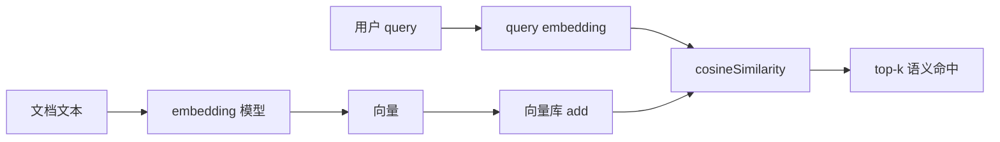
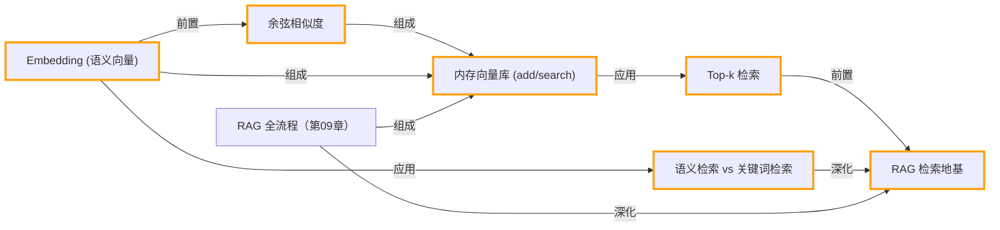

# 第 08 章 · Embedding 与向量检索

> 所属阶段：**第三部分 · 知识与检索**
> 预计用时：40 分钟 | 难度：⭐⭐☆☆☆

## 学习目标

学完本章你能够：

- [ ] 说清 **embedding（语义向量）** 是什么：把文本变成一串数字，语义相近则数字相近。
- [ ] 用 **余弦相似度** 衡量两段文本有多"像"，并读懂分数高低代表什么。
- [ ] 亲手写一个 **极简内存向量库**（add 存原文+向量，search 排序取 top-k）。
- [ ] 讲清 **语义检索 vs 关键词检索** 的本质差别（搜「汽车」为什么能命中「轿车」）。

## 前置知识

- 已读 [第 02 章 · 你的第一次 LLM 调用](../02-first-llm-call/README.md)，理解"消息进、文本出"。
- 已读 [第 07 章 · 短期记忆](../07-short-term-memory/README.md)，知道上下文有长度上限——这正是后面要"检索"的动机。
- 已在 `.env` 配好 **`OPENAI_API_KEY`**（embedding 默认走 OpenAI，见下文）。

## 三层学习路线

| 层级 | 学习目标 | 你要完成什么 |
|------|----------|--------------|
| 极简 | 把文本变成向量并完成一次语义搜索。 | 能运行 embedding 示例,理解 top-k 返回的是语义相近而不只是关键词相同。 |
| 进阶 | 理解距离度量、metadata 和索引质量。 | 解释余弦相似度、chunk 粒度、过滤条件、召回率和噪声之间的关系。 |
| 真实实践 | 为 RAG 系统选择向量存储和索引策略。 | 把小型内存向量库映射到真实 vector DB,考虑重建索引、增量更新和权限过滤。 |

---

## 图解学习地图

> 读图顺序：先看本章主线,再回到代码走读。核心焦点：**把文本变成可计算的语义空间**。



### 原理展开

- embedding 的意义是把不可直接比较的文本变成可以计算距离的向量。语义相近的句子在向量空间里方向更接近。
- 余弦相似度看方向不看长度,适合比较不同长度文本的语义相关性。分数不是绝对真理,而是排序信号。
- 向量检索不是答案生成。它只负责从知识库捞候选材料,真正的组织、引用和回答要等 RAG 阶段完成。

### 本章和整条路径的关系

本章是 RAG 的检索地基。下一章会把 top-k 结果和问题一起喂给 LLM,形成检索增强生成。

---

## 一、原理：把"语义"变成可以做减法的数字

人类一眼就知道「汽车」和「轿车」是一回事，但计算机看到的只是两串完全不同的字符。**embedding** 就是架在两者之间的桥：让一个专门的模型把文本压成一个高维向量（一长串小数），并保证一条规律——

```
语义越接近的文本  →  向量在空间里越靠近
语义越无关的文本  →  向量在空间里越分散
```

举个直觉图（真实向量有上千维，这里压成 2 维示意）：

```
              ▲
              │      ● 轿车
              │     ● 电动车      （这一簇都是"车"，挤在一起）
              │   ● 汽车
              │
   ───────────┼─────────────────►
              │
              │              ● 红烧排骨   （和"车"无关，离得很远）
              │       ● 跑步锻炼
              ▼
```

### 怎么量"靠得有多近"？余弦相似度

衡量两个向量方向是否一致，最常用的是 **余弦相似度**：算两个向量夹角的余弦值。

```
方向几乎相同  → cos ≈ 1     （非常相似）
方向无关/垂直 → cos ≈ 0     （没什么关系）
方向相反      → cos ≈ -1    （语义相反）
```

它只看"方向"不看"长度"，所以长短不一的两段话也能公平比较。本章直接用 shared 里写好的 `cosineSimilarity(a, b)`，不必自己推公式。

### 为什么 embedding 默认走 OpenAI？

Anthropic（Claude）官方**不提供 embedding 模型**。为降低初学者门槛，课程把 embedding 统一封装在 `src/shared/llm/embeddings.ts`，默认调用 OpenAI 的 `text-embedding-3-small`（便宜、够用）。所以本章和 LLM 对话不同——**它只认 `OPENAI_API_KEY`**，没配会直接报错。

### 语义检索 vs 关键词检索

传统关键词搜索（`text.includes("汽车")`）只会做**字面匹配**：

```
关键词搜「汽车」：
  "这款轿车很省油"      → ✗ 不含"汽车"二字，漏掉
  "新能源电动车..."     → ✗ 同样漏掉

语义搜「汽车」：
  "这款轿车很省油"      → ✓ 向量很近，命中
  "新能源电动车..."     → ✓ 向量很近，命中
```

**这就是 RAG（检索增强生成）的地基**：先用向量把"语义相关"的资料捞出来，再连同问题一起喂给 LLM 作答。下一章会把它拼成完整的 RAG。

---

## 二、代码走读

完整代码见 [`index.ts`](./index.ts)，分三段递进。

### 1) 手写极简向量库——理解原理

只要两个动作：`add` 把文本向量化后连同原文存起来，`search` 把 query 也向量化，逐条算相似度、排序、取前 k：

```ts
import { embed, cosineSimilarity } from "../../src/shared/llm/embeddings";

class TinyVectorStore {
  private records: { text: string; vec: number[] }[] = [];

  async add(texts: string[]): Promise<void> {
    const vectors = await embed(texts); // 一次性批量向量化，省往返
    texts.forEach((text, idx) => {
      this.records.push({ text, vec: vectors[idx]! }); // ! 处理下标的 T | undefined
    });
  }

  async search(query: string, k = 3): Promise<{ text: string; score: number }[]> {
    const [queryVec] = await embed([query]);
    if (!queryVec) return [];
    return this.records
      .map((rec) => ({ text: rec.text, score: cosineSimilarity(queryVec, rec.vec) }))
      .sort((a, b) => b.score - a.score) // 分数降序
      .slice(0, k); // 取 top-k
  }
}
```

> 注意 `vectors[idx]!`：项目开了 `noUncheckedIndexedAccess`，数组下标访问的类型是 `number[] | undefined`，必须用 `!` 或判空守卫，否则过不了 `tsc`。

### 2) 用 shared 的成熟版 `MemoryVectorStore`

同样的原理，shared 已经封装好（还支持 `id` / `metadata`）。课程里真正写 RAG 时直接用它即可：

```ts
import { MemoryVectorStore } from "../../src/shared/rag/vectorStore";

const store = new MemoryVectorStore();
await store.add(CORPUS.map((text) => ({ text }))); // 入参是对象数组
const hits = await store.search("汽车", 3); // 返回 { doc, score }[]
hits.forEach((h) => console.log(h.score.toFixed(3), h.doc.text));
```

手写版和成熟版跑出来的 top-k 完全一致——**封装只是把同一套原理藏进了类里**。

### 3) 语义检索 vs 关键词检索

用一个字面对照组凸显差别：关键词检索对「汽车」会 **0 命中**（语料里没有这两个字），而语义检索能把「轿车」「电动车」都捞回来。

```ts
function keywordSearch(query: string, texts: string[]) {
  return texts.filter((t) => t.includes(query)); // 字面包含才算命中
}
```

---

## 三、运行

```bash
# embedding 走 OpenAI，确保 .env 里有 OPENAI_API_KEY
npx tsx lessons/08-embeddings-and-vector-search/index.ts
```

如果只想临时指定 key（仅本次运行）：

```bash
# PowerShell:
$env:OPENAI_API_KEY="sk-..."; npx tsx lessons/08-embeddings-and-vector-search/index.ts
# macOS / Linux:
OPENAI_API_KEY=sk-... npx tsx lessons/08-embeddings-and-vector-search/index.ts
```

预期输出：手写库与 shared 库对「汽车」各自给出 top-3（分数相同），其中"车"相关的几条分数明显更高；最后关键词检索「汽车」得到 0 命中，与语义检索形成对比。

---

## 四、练习

1. **换 query**：把 `query` 改成「驾驶」或「美食」，观察 top-k 怎么跟着语义漂移。
2. **看分数断层**：把 `k` 调大到 6（全量），观察"相关"与"无关"之间是否有明显的分数落差，思考如何据此设一个"相似度阈值"过滤噪声。
3. **加 metadata**：给 `MemoryVectorStore.add` 的每条加上 `metadata: { topic: "车" | "其他" }`，检索后把命中条目的 topic 一并打印。
4. **造一对"反例"**：往语料里加两句语义相反的话（如"我超爱这辆车" / "我讨厌开车"），看余弦相似度能否区分。
5. **进阶**：把手写 `cosineSimilarity` 换成"点积"或"欧氏距离"作为排序依据，对比 top-k 是否变化，理解为什么文本检索偏爱余弦。

---

<!-- KG:START (由 npm run kg 自动生成，勿手改本标记区) -->

## 知识图谱与延伸阅读

> 本节由 `npm run kg` 自动生成（数据源 `knowledge-graph/data/graph.ts`）。要增删请改数据源后重跑。

### 本章概念图谱



### 与其他章节的关系

- `RAG 全流程` —**深化**→ `RAG 检索地基`（第 09 章）
- `RAG 全流程` —**组成**→ `内存向量库 (add/search)`（第 09 章）

### 延伸阅读

- [Vector embeddings - OpenAI API documentation](https://platform.openai.com/docs/guides/embeddings) — 本章 embedding 默认调用 OpenAI text-embedding-3-small，官方指南 `doc`

> 🗺️ 在[全局知识图谱](../../docs/knowledge-graph.md) / [交互式图谱](../../knowledge-graph/output/index.html) 中查看本章位置。

<!-- KG:END -->

## 五、小结与延伸

- embedding = 把文本变成"语义坐标"，相近的语义坐标也相近。
- 余弦相似度衡量两个向量方向有多一致，是向量检索的排序依据。
- 内存向量库只需 `add` + `search` 两步；shared 的 `MemoryVectorStore` 就是它的加固版。
- 语义检索能跨越字面差异（汽车≈轿车），这是关键词搜索做不到的，也是 RAG 的前提。
- 上一章 [第 07 章 · 短期记忆](../07-short-term-memory/README.md) 解决"记住对话"；下一章 [第 09 章 · 从零手写 RAG](../09-rag-from-scratch/README.md) 会把向量检索 + LLM 拼成完整的问答系统。

> 💡 **面试会问**：什么是 embedding？为什么用余弦相似度而不是欧氏距离？语义检索和关键词检索各自的适用场景是什么？
