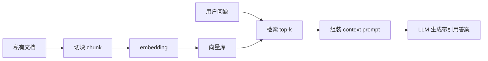
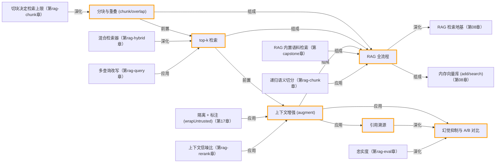

# 第 09 章 · 从零实现 RAG

> 所属阶段：**第三部分 · 知识与检索**
> 预计用时：55 分钟 | 难度：⭐⭐⭐
> 全局导航：[课程导航](../../docs/navigation.md) · [完整大纲](../../docs/curriculum.md) · [知识图谱](../../docs/knowledge-graph.md)

## 学习目标

学完本章你能够：

- [ ] 说清 **RAG（Retrieval-Augmented Generation，检索增强生成）** 解决的核心问题：**注入私有知识、降低幻觉、可溯源**。
- [ ] 跑通 RAG 全流程：**加载 → 分块 → 向量化入库 → 检索 top-k → 拼进 prompt → 生成**。
- [ ] 自己写一个带 **重叠（overlap）** 的分块函数，并解释「为什么要分块、为什么要重叠」。
- [ ] 用「只许根据资料作答 + 标注引用编号」的提示，让答案**准确且可溯源**。
- [ ] 通过 **A/B 对比**（不带 RAG vs 带 RAG）亲眼看到幻觉是怎么被压下去的。

## 前置知识

- 已读 [第 08 章 · Embedding 与向量检索](../08-embeddings-and-vector-search/README.md)（理解 embedding、余弦相似度、向量库）。
- 已读 [第 02 章 · 你的第一次 LLM 调用](../02-first-llm-call/README.md)（会用 `getLLM()` 和 `system` 提示）。
- 已按 [环境搭建](../../docs/setup.md) 配好 `.env`。注意：**embedding 默认走 OpenAI**，所以本章需要 `OPENAI_API_KEY`（生成可继续用 Claude 或 OpenAI）。

## 三层学习路线

| 层级 | 学习目标 | 你要完成什么 |
|------|----------|--------------|
| 极简 | 跑通 chunk 到 retrieve 到 augment 到 generate 的 RAG 闭环。 | 能指出回答中的哪些信息来自检索上下文,哪些来自模型语言组织。 |
| 进阶 | 理解 RAG 质量来自检索链路而不只是大模型。 | 比较 chunk overlap、top-k、rerank、引用溯源和无答案处理如何影响可靠性。 |
| 真实实践 | 连接到生产级知识库项目。 | 把本章最小 RAG 对照到 `songuu/rag-system`: 文档入库、检索服务、答案引用、权限和可观测性。 |

---

## 图解学习地图

> 读图顺序：先看本章主线,再回到代码走读。核心焦点：**把检索结果接入生成,降低私有知识幻觉**。



### 原理展开

- RAG 的关键不是让模型记住你的知识,而是在回答前把相关片段临时放进上下文。模型仍然是生成器,知识来源来自检索。
- chunk 粒度决定召回质量。太大容易带入噪声,太小容易丢上下文; 好的切块通常按语义边界而不是固定字符数盲切。
- 引用是 RAG 的可审计性。没有来源标注的答案很难排查是检索错、提示错,还是模型自己编的。

### 本章和整条路径的关系

本章把第 08 章检索能力变成可回答私有知识的 agent 能力。capstone 的研究资料搜索会复用同一模式。

---

## 一、原理：模型不懂你的「私有数据」，所以会编

大模型的知识冻结在训练那一刻，它**没见过你公司的内部文档**。这时直接问它私有问题，会发生两件糟糕的事：

1. **幻觉**：模型为了「显得有用」，会一本正经地编一个看似合理、实则错误的答案。
2. **不可溯源**：就算它蒙对了，你也无从核对「这话有没有依据」。

RAG 的思路非常朴素——**与其指望模型「记住」你的资料，不如在它回答前，临时把相关资料「喂」给它**：

```
                    ┌─────────── 离线：建索引（只做一次）──────────┐
  私有文档 ──load──▶ 分块(chunk) ──embed──▶ 向量库(每块一个向量)
                    └────────────────────────────────────────────┘

                    ┌─────────── 在线：每次提问 ──────────────────┐
  用户问题 ──embed──▶ 在向量库里检索最相近的 top-k 片段
                           │
                           ▼
            把【命中片段 + 问题 + "只许根据资料作答"】拼成 prompt
                           │
                           ▼
                        LLM 生成 ──▶ 带引用编号的答案（可溯源）
                    └────────────────────────────────────────────┘
```

`Augmented`（增强）这个词的关键就在这里：生成（Generation）之前，先用检索（Retrieval）把上下文「增强」了一把。

### 为什么要分块（chunk）？

不能把整篇文档当成一个向量，也不能整篇塞进 prompt：

- **检索粒度**：整篇文档的向量是所有主题的「平均」，太钝；切成小块后每块聚焦一个局部主题，向量更「锐利」，top-k 召回更准。
- **上下文预算**：整篇塞进 prompt 又贵又可能超长；只注入命中的少数小块，省 token 还减少无关噪声。

### 为什么要重叠（overlap）？

纯按长度硬切，会把一句完整的话从中间截断。万一答案恰好落在两块的边界上，**任何一块都检索不全**。

让相邻块共享一段重叠文字，相当于给边界上「保险」——关键信息至少会完整出现在某一块里：

```
原文：……专业版每用户每月 39 元……          size=240, overlap=50
块0：[──────── 240 字符 ────────]
块1：               [50 重叠][──── 新增 190 ────]
                    ▲ 边界处的句子在两块里都能找到完整版本
```

### 为什么要标注引用编号？

把命中片段编号成 `[片段 0]/[片段 1]…` 再塞进提示，并要求模型「每条结论标注依据编号」。这样答案就能**指回具体来源**，人工一眼可核对。这是 RAG 在企业落地的硬要求。

---

## 二、代码走读

完整代码见 [`index.ts`](./index.ts)，并拆出两个小文件：知识文本 [`knowledge.ts`](./knowledge.ts)、分块函数 [`chunk.ts`](./chunk.ts)。

### 1) 自写分块函数（带 overlap 的滑动窗口）

核心是一个滑动窗口：每次取 `size` 个字符为一块，下一块起点回退 `overlap` 个字符产生重叠（见 [`chunk.ts`](./chunk.ts)）：

```ts
const step = size - overlap; // 每块净增 (size - overlap) 个新字符
let start = 0;
while (start < text.length) {
  const piece = text.slice(start, start + size).trim();
  if (piece.length > 0) chunks.push({ index: chunks.length, text: piece });
  start += step; // 窗口前进，但与上一块重叠 overlap
}
```

> 注意守卫 `overlap < size`：否则窗口无法前进会死循环。课程用「字符级」切分讲清原理；真实项目通常按句子/段落/标题等**语义边界**切，并按 **token** 计长——思想一致。

### 2) 入库与检索：复用 `MemoryVectorStore`

第 08 章已沉淀好向量库，这里直接拿来用：`add()` 内部自动向量化，`search()` 按余弦相似度取 top-k。

```ts
import { MemoryVectorStore } from "../../src/shared/rag/vectorStore";

const store = new MemoryVectorStore();
await store.add(chunks.map((c) => ({ id: `chunk-${c.index}`, text: c.text })));
const hits = await store.search(question, 3); // [{ doc, score }, ...]
```

### 3) Augment：把命中片段拼进 system 提示

这是 RAG 的「灵魂」——**资料 + 约束**一起给模型，逼它「只用资料、没有就说不知道、并标注来源」：

```ts
const ragSystem = [
  "你是星轨笔记的客服助手。",
  "你必须【仅根据下面提供的资料】回答用户问题，不得使用资料之外的知识，更不得编造。",
  "若资料中没有答案，就直接说「资料中未提及」。",
  "每条结论后面用方括号标注它依据的片段编号，例如：……（[片段 1]）。",
  "===== 资料开始 =====",
  contextBlock, // [片段 0] …\n\n[片段 1] …
  "===== 资料结束 =====",
].join("\n");

const answer = await llm.chat({
  system: ragSystem,
  messages: [{ role: "user", content: question }],
  temperature: 0, // 事实问答要稳定贴资料，不需要创造力
});
```

### 4) A/B 对比：看见幻觉被压下去

代码对**同一个问题**跑两遍：对照组 A 不给资料（`system` 只说「你是客服」），实验组 B 给资料。因为「星轨笔记」是虚构产品，A 只能编，B 能对上事实并标注 `[片段 N]`。

---

## 三、运行

```bash
# 默认厂商（.env 里的 LLM_PROVIDER）；embedding 始终走 OpenAI，需要 OPENAI_API_KEY
npx tsx lessons/09-rag-from-scratch/index.ts
```

切换「生成」用的厂商（embedding 不受影响，仍走 OpenAI）：

```bash
# PowerShell:
$env:LLM_PROVIDER="openai"; npx tsx lessons/09-rag-from-scratch/index.ts
# macOS / Linux:
LLM_PROVIDER=openai npx tsx lessons/09-rag-from-scratch/index.ts
```

预期输出（依次）：分块预览 → 入库条数 → top-k 命中及相似度 → **A 组（多半编造）** → **B 组（贴资料 + `[片段 N]` 引用）** → 两组 token 用量对比。

---

## 四、练习

1. **调分块参数**：把 `chunkText` 的 `size` 改成 `120` 再改成 `600`、`overlap` 改成 `0`，观察 top-k 命中片段和最终答案如何变化。体会「块太大太钝、太小割裂、overlap=0 易漏边界」。
2. **问一个资料里没有的问题**：比如「星轨笔记支持手写识别吗？」验证带 RAG 时模型是否老实回答「资料中未提及」，而不是编。
3. **改 k**：把 `TOP_K` 从 `3` 调到 `1` 和 `6`，看 k 太小漏答案、k 太大引噪声且更费 token 的取舍。
4. **加入「无关干扰段」**：往 [`knowledge.ts`](./knowledge.ts) 里塞几段和问题完全无关的文字，确认检索是否仍能把真正相关的片段排到前面（这考验 embedding 的语义召回）。
5. **进阶 · 重排（rerank）**：先 `search(question, 8)` 取回 8 块，再用 LLM 让它从中挑出「最该用的 3 块」，对比直接 top-3 的效果——这就是生产里常见的「召回 + 精排」两段式。

---

<!-- KG:START (由 npm run kg 自动生成，勿手改本标记区) -->

## 知识图谱与延伸阅读

> 本节由 `npm run kg` 自动生成（数据源 `knowledge-graph/data/graph.ts`）。要增删请改数据源后重跑。

### 本章概念图谱



### 与其他章节的关系

- `RAG 全流程` —**深化**→ `RAG 检索地基`（第 08 章）
- `RAG 全流程` —**组成**→ `内存向量库 (add/search)`（第 08 章）
- `隔离 + 标注 (wrapUntrusted)` —**应用**→ `上下文增强 (augment)`（第 17 章）
- `RAG 内置语料检索` —**组成**→ `RAG 全流程`（第 capstone 章）
- `切块决定检索上限` —**深化**→ `分块与重叠 (chunk/overlap)`（第 rag-chunk 章）
- `递归语义切分` —**应用**→ `RAG 全流程`（第 rag-chunk 章）
- `混合检索器` —**深化**→ `top-k 检索`（第 rag-hybrid 章）
- `上下文信噪比` —**应用**→ `上下文增强 (augment)`（第 rag-rerank 章）
- `多查询改写` —**应用**→ `top-k 检索`（第 rag-query 章）
- `忠实度` —**深化**→ `幻觉抑制与 A/B 对比`（第 rag-eval 章）

### 延伸阅读

- [Retrieval-Augmented Generation for Knowledge-Intensive NLP Tasks](https://arxiv.org/abs/2005.11401) — RAG 原始论文 (Lewis et al., 2020)，提出检索增强生成范式 `paper`

> 🗺️ 在[全局知识图谱](../../docs/knowledge-graph.md) / [交互式图谱](../../knowledge-graph/output/index.html) 中查看本章位置。

<!-- KG:END -->

## 五、小结与延伸

- RAG = **检索**把私有资料找出来，**增强**生成时的上下文，让模型「有据可依」。
- **分块 + 重叠** 决定召回质量；**「只许根据资料 + 标注编号」** 决定答案的可信与可溯源。
- 上一章 [第 08 章 · Embedding 与向量检索](../08-embeddings-and-vector-search/README.md) 打好了向量基础；下一章 [第 10 章 · 推理模式](../10-reasoning-patterns/README.md) 学习如何让模型更好地「思考与决策」。

### 下一步：进阶 RAG 专题（就在本仓库）

本章是“最小可解释 RAG”。想把它补成**生产级**、且每一步都能动手跑？直接进 [**进阶 RAG 专题（rag-advanced）**](../../rag-advanced/01-chunking-strategies/README.md)，六章承接本章：

1. [进阶分块策略](../../rag-advanced/01-chunking-strategies/README.md)：递归语义切分 / Markdown 感知（纯函数，免 key 可跑）
2. [混合检索](../../rag-advanced/02-hybrid-search/README.md)：向量 + BM25 + RRF
3. [召回-精排](../../rag-advanced/03-reranking/README.md)：两段式 + LLM 重排
4. [查询改写](../../rag-advanced/04-query-transformation/README.md)：multi-query / HyDE
5. [RAG 评估](../../rag-advanced/05-rag-evaluation/README.md)：三指标定位坏在哪一环
6. [生产化 RAG](../../rag-advanced/06-production-rag/README.md)：过滤 / 持久化 / 增量 / 全链路

再往后，[RAG 系统实战项目](../../docs/rag-system-project.md) 会把这些能力连接到独立作品集项目 [songuu/rag-system](https://github.com/songuu/rag-system)。

对照时重点看这些差异：

| 本章最小版 | RAG 系统项目应继续深化 |
|------------|------------------------|
| 单份虚构知识文本 | 多文件 / 多格式 / 批量导入 |
| 内存向量库 | 持久化向量库与索引管理 |
| top-k 直接注入 | rerank / hybrid search / context assembly |
| 手工观察输出 | eval 指标、来源回放、质量监控 |

> 💡 **面试会问**：RAG 为什么能降低幻觉？分块为什么要做 overlap？top-k 的 k 怎么取？如何让 RAG 的答案可溯源？
