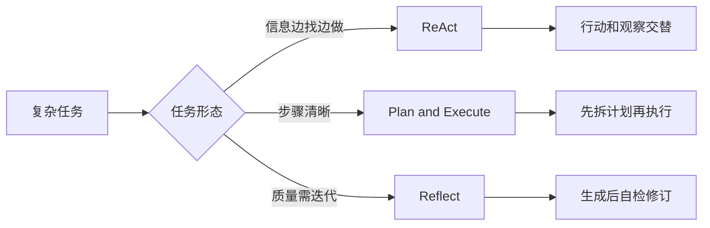
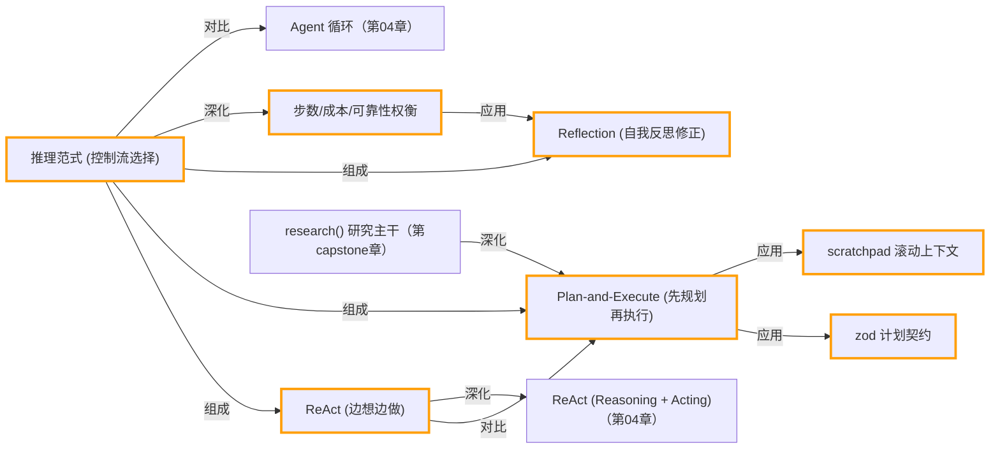

# 第 10 章 · 推理范式：ReAct / Plan-and-Execute / Reflection

> 所属阶段：**第四部分 · 进阶模式**
> 预计用时：50 分钟 | 难度：⭐⭐⭐☆☆

## 学习目标

学完本章你能够：

- [ ] 说清三种推理范式的核心思想：**ReAct（边想边做）**、**Plan-and-Execute（先规划再执行）**、**Reflection（自我反思修正）**。
- [ ] 用 `runAgent` + 工具跑一个 **ReAct** 小任务，理解「思考→行动→观察」的循环。
- [ ] 实现 **Plan-and-Execute**：先用 zod 约束模型产出 **JSON 计划**，再逐步执行。
- [ ] 实现 **Reflection**：初稿 → 批评 → 改写的三步打磨。
- [ ] 从 **步数 / 成本 / 可靠性** 三个维度给具体任务选对范式（并知道它们能组合）。

## 前置知识

- 已读 [第 04 章 · Agent 循环](../04-the-agent-loop/README.md)（本章 ReAct 是它的「调库」版）。
- 已读 [第 06 章 · 从零构建工具系统](../06-building-a-tool-system/README.md)（理解 `defineTool` / `ToolRegistry`）。
- 已读 [第 09 章 · 从零实现 RAG](../09-rag-from-scratch/README.md)。
- 已按 [环境搭建](../../docs/setup.md) 配好 `.env`（至少一个厂商的 key）。

## 三层学习路线

| 层级 | 学习目标 | 你要完成什么 |
|------|----------|--------------|
| 极简 | 能区分 ReAct、Plan-Execute、Reflection。 | 用同一个任务分别说明三种范式的执行顺序。 |
| 进阶 | 理解推理范式的可靠性、成本和延迟权衡。 | 判断什么时候需要先规划、什么时候边做边想、什么时候让模型自检。 |
| 真实实践 | 为真实任务选择合适控制流。 | 给研究、客服、代码修复、数据分析四类任务各选一种范式并说明原因。 |

---

## 图解学习地图

> 读图顺序：先看本章主线,再回到代码走读。核心焦点：**比较 ReAct、Plan-and-Execute、Reflection 三种推理组织方式**。



### 原理展开

- 推理模式是控制流选择,不是模型能力本身。相同模型套不同控制流,会得到不同的可控性、成本和稳定性。
- ReAct 适合探索型任务,因为它每一步都能根据观察改方向; Plan-and-Execute 适合目标清晰的任务,因为先拆解能减少迷路。
- Reflection 提高质量但会增加成本和延迟。它更适合作为关键输出的复核环节,不适合每个小请求都默认开启。

### 本章和整条路径的关系

本章为后续多智能体和 capstone 提供任务编排策略。复杂研究 agent 通常会混合 plan、act、reflect。

---

## 一、原理：同一个任务，三种「怎么想」

LLM 本身只会「输入消息→输出文本」（第 02 章）。要解决一个**多步骤**问题，关键不在模型多聪明，而在**你用什么结构去组织它的思考**。这就是「推理范式」。

我们用一个统一任务贯穿全章：

```
4 人吃饭，点了 2 份「水煮鱼」、3 杯「柠檬茶」。
规则：菜品总价满 100 打 9 折。求折后总价与人均。
```

它同时需要「查外部数据（菜价）」+「多步计算」+「别漏掉折扣条件」——刚好能照出三种范式的差异。

### 1. ReAct：边想边做（Reasoning + Acting）

模型每一轮要么「思考下一步」，要么「调用一个工具」，看到工具结果后**再决定下一步**。

```
想：我得先知道水煮鱼多少钱  →  做：lookup_price(水煮鱼)
观察：58 元                  →  想：再查柠檬茶 …
                            …直到信息齐了 → 想：算总价 → 做：calculate(...) → 收尾
```

- **优点**：动态、自适应，特别适合**探索型、依赖外部信息**的任务（不知道要几步）。
- **缺点**：走一步看一步，可能**绕远路或跑偏**；调用次数不可预测 → 成本不可控。

### 2. Plan-and-Execute：先规划再执行

把「想全局」和「干活」**拆成两个阶段**：第一次调用只产出一份**完整步骤计划**，之后照计划逐步执行。

```
┌── 规划阶段（1 次调用）──┐      ┌──────── 执行阶段 ────────┐
│ 输出 JSON：            │      │ 第1步 → 第2步 → 第3步 …  │
│ [{1,查菜价},{2,算小计},│  →   │ 每步结论喂给下一步        │
│  {3,判折扣},{4,算人均}]│      └──────────────────────────┘
└────────────────────────┘
```

- **优点**：先把全局想清楚，**减少中途跑偏**；计划可被**人工检查 / 缓存 / 复用** → 可控性强。
- **缺点**：计划在「信息不全」时可能一开始就错；不如 ReAct 灵活应对意外。
- 步数 ≈ **计划步数 + 2**（规划 1 次 + 汇总 1 次），相对可预测。

### 3. Reflection：自我反思修正

先出**初稿**，再让模型**换上「审稿人」的帽子**给初稿挑刺，最后**据批评改写**。

```
草稿(作者视角) → 批评(审稿人视角：算错没?漏条件没?) → 改写(修正问题) → 成稿
```

- **WHY 有效**：对同一个模型，「写」和「评」是两个不同任务。切换到审稿视角，更容易发现自己初稿里的疏漏（算错、漏掉折扣、表述含糊）。
- **代价**：固定多花约 **2 次调用**换质量 → 适合**「质量 > 速度」**的产出（文案、代码、方案）。

### 三者的取舍（一张表记住）

| 范式 | 调用次数 | 适用场景 | 主要风险 |
|------|----------|----------|----------|
| ReAct | 动态、不可预测 | 探索型、需外部工具/数据 | 绕路、跑偏、成本失控 |
| Plan-and-Execute | ≈ 计划步数 + 2 | 可预先拆解的复杂多步任务 | 初始计划基于不全信息 |
| Reflection | 固定 +2 左右 | 对产出质量要求高 | 反思无新信息时收益递减 |

> 它们**不是互斥**的：真实工程常组合使用——先 Plan，每步内用 ReAct，最后对成稿做一次 Reflection。

---

## 二、代码走读

完整代码见 [`index.ts`](./index.ts)。三种范式都返回同一个 `PatternResult`（含答案、`llmCalls`、`usage`），方便最后横向对比。

### ReAct：直接复用 `runAgent`

我们**不手写循环**——`shared` 的 `runAgent` 已经把「思考→调工具→观察→再思考」实现好了（第 04 章手写过原理）。这里只负责给工具、给任务、在 `onStep` 里统计调用次数：

```ts
const registry = new ToolRegistry([lookupPrice, calculator]);
let llmCalls = 0;

const result = await runAgent({
  client,
  registry,
  system: "遇到查价/计算必须调用工具，不要心算……",
  messages: [{ role: "user", content: TASK }],
  maxSteps: 8,
  // runAgent 每「步」对应一次 LLM 调用，这正是 ReAct 的成本来源
  onStep: (step) => { llmCalls += 1; /* 打印用了哪些工具 */ },
});
```

工具用 `defineTool` 定义，一个 zod schema **同时**承担「给模型的参数说明」和「运行期校验」。注意计算器做了**白名单**，绝不把任意字符串丢给 `eval`：

```ts
const calculator = defineTool({
  name: "calculate",
  description: "计算算术表达式，仅支持 + - * / ( ) 和数字……",
  schema: z.object({ expression: z.string() }),
  execute: ({ expression }) => {
    if (!/^[\d+\-*/().\s]+$/.test(expression)) return `表达式含非法字符……`;
    const value = Function(`"use strict"; return (${expression});`)() as number;
    return `${expression} = ${value}`;
  },
});
```

### Plan-and-Execute：用 zod 把「计划」变成可靠的数据结构

规划阶段最容易翻车的是「模型把 JSON 包在代码块里」。我们用 `extractJson` 截取 `{…}` 兜底，再用 `planSchema.parse` **强校验**结构——畸形输出会得到可读报错而非崩在后面：

```ts
const planSchema = z.object({
  steps: z.array(z.object({
    id: z.number().int(),
    action: z.string(),     // 这一步要做的事，动词开头
  })).min(1),
});

const planResp = await client.chat({
  system: '只输出 JSON：{"steps":[{"id":1,"action":"..."}]}，无额外文字',
  messages: [{ role: "user", content: `任务：${TASK}\n请给出步骤计划。` }],
  temperature: 0,
});
const plan = planSchema.parse(extractJson(planResp.text)); // zod 兜底
```

执行阶段维护一个 **scratchpad**（草稿纸）：每步的结论喂给下一步，让后续步骤站在前面的肩膀上：

```ts
let scratchpad = `菜单数据：${JSON.stringify(MENU)}`;
for (const step of plan.steps) {
  const stepResp = await client.chat({
    system: "按计划执行单个步骤，只给本步结论。",
    messages: [{ role: "user", content:
      `已知信息：\n${scratchpad}\n\n当前步骤：${step.action}` }],
    temperature: 0,
  });
  scratchpad += `\n第 ${step.id} 步结论：${stepResp.text.trim()}`;
}
```

### Reflection：写 → 评 → 改

三次调用，关键在**第二次切换 system 视角**——把模型从「作者」变成「严格审稿人」，专挑「是否算错 / 是否漏了满 100 打 9 折 / 人均对不对 / 表述清不清楚」：

```ts
// 1) 初稿
const draft = (await client.chat({ system: "直接给出答复…", messages: […] })).text;

// 2) 自我批评（审稿人视角，只列问题不改写）
const critique = (await client.chat({
  system: "你是严格审稿人，逐条列出问题：是否算错、是否漏折扣条件、人均是否正确…",
  messages: [{ role: "user", content: `待审阅：\n${draft}` }],
})).text;

// 3) 据批评改写
const final = (await client.chat({
  system: "根据审稿意见改写，修正所有被指出的问题。",
  messages: [{ role: "user", content: `初稿：\n${draft}\n审稿意见：\n${critique}` }],
})).text;
```

> 给 Reflection 提供菜单价格作为 `context`：把「能力」和「数据」分开，反思才聚焦在**推理**而非「缺数据」。

### 最后：横向对比

主流程顺序跑完三种范式，打印每种的 **LLM 调用次数 + token 合计**——这正是选型时最该看的成本指标。

---

## 三、运行

```bash
# 默认厂商（.env 里的 LLM_PROVIDER）
npx tsx lessons/10-reasoning-patterns/index.ts

# 临时切到 OpenAI（仅本次运行）
# PowerShell:
$env:LLM_PROVIDER="openai"; npx tsx lessons/10-reasoning-patterns/index.ts
# macOS / Linux:
LLM_PROVIDER=openai npx tsx lessons/10-reasoning-patterns/index.ts

# 想看每个工具调用的调试细节，开 DEBUG：
# PowerShell:  $env:DEBUG="1"; npx tsx lessons/10-reasoning-patterns/index.ts
```

预期输出：三段分别标注「范式一/二/三」的执行日志（ReAct 的逐步工具调用、Plan 的步骤清单、Reflection 的初稿/批评/成稿），最后一张「LLM 调用次数与 token 成本」对比表。三种方式给出的人均金额应当一致（小计 2×58 + 3×12 = 152 元，满 100 打 9 折后 136.8 元 ÷ 4 = 34.2 元）。

---

## 四、练习

1. **看成本差异**：跑三遍，记录每种范式的 `llmCalls`。哪种最省？哪种最贵？为什么 Reflection 的次数几乎固定？
2. **给 ReAct 加难度**：把任务里的「柠檬茶」改成菜单里没有的「冰美式」。观察 ReAct 如何**靠工具的错误返回自我纠错**，而 Plan-and-Execute 是否一开始就把错菜名写进了计划。
3. **多轮 Reflection**：把 Reflection 改成循环——批评→改写→再批评→再改写，最多 3 轮，直到批评返回「无问题」就提前停。观察质量是否还在提升、还是收益递减。
4. **真正的 Plan-and-Execute**：现在执行阶段是「让 LLM 算」。改成：让规划器在每个 `action` 里附带 `tool` 字段（`lookup_price` / `calculate`），执行阶段直接调 `ToolRegistry.run`，把算术彻底交给确定性代码。
5. **组合范式**：先 Plan 出步骤，每步内部用一个 `runAgent`（ReAct）去执行，最后对汇总稿做一次 Reflection。对比组合版与单一范式的质量/成本。

---

<!-- KG:START (由 npm run kg 自动生成，勿手改本标记区) -->

## 知识图谱与延伸阅读

> 本节由 `npm run kg` 自动生成（数据源 `knowledge-graph/data/graph.ts`）。要增删请改数据源后重跑。

### 本章概念图谱



### 与其他章节的关系

- `ReAct (边想边做)` —**深化**→ `ReAct (Reasoning + Acting)`（第 04 章）
- `推理范式 (控制流选择)` —**对比**→ `Agent 循环`（第 04 章）
- `research() 研究主干` —**深化**→ `Plan-and-Execute (先规划再执行)`（第 capstone 章）

### 延伸阅读

- [ReAct: Synergizing Reasoning and Acting in Language Models](https://arxiv.org/abs/2210.03629) — ReAct 原始论文，本章「思考+行动交替」范式的来源 `paper`
- [Reflexion: Language Agents with Verbal Reinforcement Learning](https://arxiv.org/abs/2303.11366) — Reflection/自我反思修正的代表性论文 `paper`

> 🗺️ 在[全局知识图谱](../../docs/knowledge-graph.md) / [交互式图谱](../../knowledge-graph/output/index.html) 中查看本章位置。

<!-- KG:END -->

## 五、小结与延伸

- 推理范式 = **「怎么组织模型的思考」**，比模型本身更决定多步任务的成败。
- **ReAct** 动态探索、**Plan-and-Execute** 可控可复用、**Reflection** 用调用换质量——按「步数 / 成本 / 可靠性」三轴选型，且三者可组合。
- 用 zod 把「计划」固化成可校验的数据结构，是让 LLM 输出**可被程序消费**的关键工程手法。
- 上一章 [第 09 章 · 从零实现 RAG](../09-rag-from-scratch/README.md)；下一章 [第 11 章 · 多 Agent 编排](../11-multi-agent-orchestration/README.md) 把「不同视角的思考」从一个模型扩展到**多个协作的 agent**。

> 💡 **面试会问**：ReAct 和 Plan-and-Execute 的本质区别是什么？什么任务该用哪个？Reflection 为什么能在不引入新信息的情况下提升质量、它的收益边界在哪？
