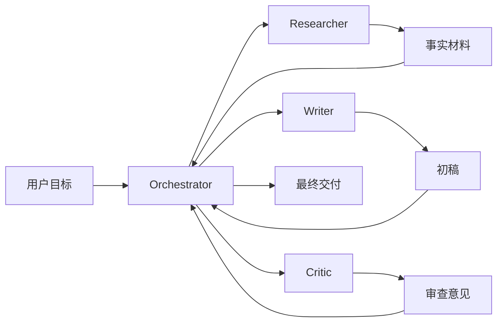
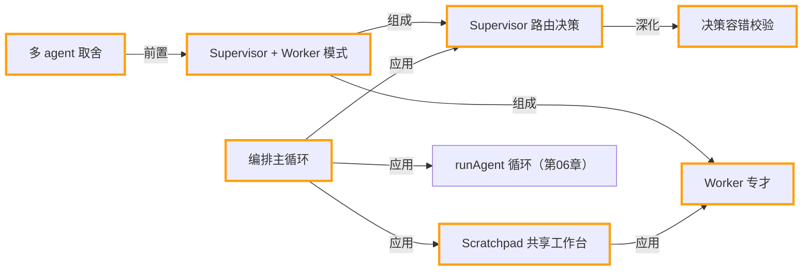

# 第 11 章 · 多智能体编排

> 所属阶段：**第四部分 · 进阶模式**
> 预计用时：55 分钟 | 难度：⭐⭐⭐⭐☆
> 全局导航：[课程导航](../../docs/navigation.md) · [完整大纲](../../docs/curriculum.md) · [知识图谱](../../docs/knowledge-graph.md)

## 学习目标

学完本章你能够：

- [ ] 说清**何时多 agent 优于单 agent**，以及它带来的额外成本与复杂度。
- [ ] 理解 **supervisor（协调者）+ worker（专才）** 的经典分工结构。
- [ ] 让 supervisor 用一次**结构化 JSON 决策**来"路由"任务：派给谁 / 还是结束。
- [ ] 从零写出一个编排循环：调度 `researcher → writer` 并**汇总**结果（不依赖任何多 agent 框架）。

## 前置知识

- 已读 [第 04 章 · Agent 循环](../04-the-agent-loop/README.md) 与 [第 05 章 · 工具调用基础](../05-tool-use-basics/README.md)：理解 agent 循环（思考 → 调工具 → 观察）。本章直接复用 `runAgent`。
- 已读 [第 06 章 · 工具系统](../06-building-a-tool-system/README.md)：理解 `defineTool` / `ToolRegistry`。
- 已读 [第 10 章 · 推理模式](../10-reasoning-patterns/README.md)。
- 已配好 `.env`（**一个厂商的 key 即可**，本章不需要 embedding key）。

## 三层学习路线

| 层级 | 学习目标 | 你要完成什么 |
|------|----------|--------------|
| 极简 | 跑通 supervisor + worker 的协作模型。 | 能说明主管 agent 如何拆任务,worker 如何返回结果。 |
| 进阶 | 理解多智能体的通信协议和上下文合并问题。 | 分析任务分配、结果冲突、重复劳动、上下文污染和停止条件。 |
| 真实实践 | 把多智能体映射到真实团队流程。 | 设计一个研究员、执行者、审查者协作的流程,明确每个 agent 的权限和交付物。 |

---

## 图解学习地图

> 读图顺序：先看本章主线,再回到代码走读。核心焦点：**把复杂任务拆给多个角色协作**。



### 原理展开

- 多智能体的价值来自分工,不是数量。每个 agent 应该有清晰输入、输出和责任边界,否则只是把单 agent 的混乱放大。
- Orchestrator 是系统稳定性的核心。它决定谁先做、谁复核、何时停止,也负责把中间结果压缩成最终上下文。
- 多 agent 会增加通信成本和一致性风险。任务足够复杂、角色视角确实不同、输出可合并时才值得拆。

### 本章和整条路径的关系

本章把单条 agent loop 扩展成协作网络。后续框架章节会展示如何用图结构更稳地表达这种编排。

---

## 一、原理：什么时候该"拆成一支团队"

一个单 agent，本质是「一个 system prompt + 一堆工具 + 一个循环」。它很好用，直到——

```
你想让它：又会查资料、又会写代码、又会审校、又会发邮件……
结果：system prompt 越堆越长，工具越塞越杂，
      上下文被无关信息挤爆 → 跑偏、遗忘、前后矛盾。
```

这时把它**拆成一支团队**往往更好：

```
                    ┌─────────────┐
        总目标 ───▶ │  supervisor │  （协调者：只决策派给谁/是否结束）
                    └──────┬──────┘
            派活 ┌─────────┼──────────┐ 汇总
                 ▼         ▼          ▼
          ┌───────────┐ ┌────────┐ ┌────────┐
          │researcher │ │ writer │ │  …更多 │
          │（带检索） │ │（成文）│ │  专才  │
          └───────────┘ └────────┘ └────────┘
```

每个 worker 是一个**专才**：上下文更窄、提示更专、工具按职责裁剪。supervisor 不亲自干活，只负责"把哪个子任务派给哪个 worker、串行还是并行、最后怎么汇总"。

### 收益 vs. 代价（这才是面试与实战的重点）

| 维度 | 单 agent | 多 agent |
|------|----------|----------|
| 上下文 | 一锅烩，易超载 | 每个专才聚焦，更干净 |
| 提示词 | 越堆越臃肿 | 各自简短专一 |
| 可维护性 | 改一处牵全身 | 可单独替换某个 worker |
| **Token 成本** | 低 | **高**（每多一个 worker 多一份输入/输出） |
| **复杂度** | 低 | **高**（要写编排、传结果、防死循环） |
| 调试 | 一条链路 | 多条链路，更难定位 |

> 一句话决策法则：**当单 agent 的职责或上下文明显过载、且子任务边界清晰时，才拆多 agent。** 否则多花的 token 与复杂度并不划算——这正是 YAGNI 原则在 agent 架构上的体现。

### supervisor 其实很"便宜"

关键认知：supervisor 本身通常**只是一次结构化的 LLM 调用**——读取当前进度，输出"下一步派给谁"。真正烧 token 的检索、写作都外包给了 worker。所以让 LLM 当"路由器"是很经济的做法。

---

## 二、代码走读

完整代码见 [`index.ts`](./index.ts)（编排循环）与 [`workers.ts`](./workers.ts)（专才定义）。

### 1) worker：各有独立 system prompt 与工具

`researcher` 有检索工具，内部直接复用 `runAgent`，让模型自己决定查几次：

```ts
// workers.ts
const knowledgeSearchTool = defineTool({
  name: "knowledge_search",
  description: "在本地知识库中按关键词检索资料……",
  schema: z.object({ keyword: z.string() }),
  execute: ({ keyword }) => { /* 在本地语料里找，命中/未命中都返回字符串 */ },
});

export function makeResearcher(client: LLMClient): Worker {
  const registry = new ToolRegistry([knowledgeSearchTool]);
  const system = "你是研究员，只负责用 knowledge_search 收集事实，输出要点式笔记……";
  return async (task, context) => {
    const run = await runAgent({ client, registry, system, messages: [...], maxSteps: 6 });
    return run.finalText;
  };
}
```

`writer` **没有工具**——写作不需要检索，强行给它工具只会增加跑偏风险。这体现"按职责裁剪能力"：

```ts
export function makeWriter(client: LLMClient): Worker {
  const system = "你是写手，只负责把研究员的笔记整理成带要点的摘要，不负责查资料……";
  return async (task, context) =>
    (await client.chat({ system, messages: [{ role: "user", content: `素材：${context}` }] })).text;
}
```

> WHY 用「本地知识库」而不是真实联网检索：本章重点是**编排**，不是检索质量。用内置语料，课程只要一个 LLM key 就能跑通。真实项目里把这个工具换成 Web 搜索或向量库（[第 09 章](../09-rag-from-scratch/README.md)）即可，supervisor 与 writer **一行都不用改**。

### 2) supervisor：用结构化 JSON 做"路由决策"

让 supervisor 输出一个小 JSON，编排循环才能据此精确分支。配合 zod 校验，把"模型文本"当成边界数据来兜底：

```ts
// index.ts
const decisionSchema = z.object({
  next: z.enum(["researcher", "writer", "done"]), // 派给谁 / 结束
  task: z.string().default(""),                   // 给该 worker 的子任务
  reason: z.string().default(""),                 // 决策理由，纯为可解释
});

async function decide(client, pad): Promise<Decision> {
  const result = await client.chat({
    system: "你是协调者，只决策下一步派给谁或宣布完成，严格只输出一个 JSON……",
    messages: [{ role: "user", content: `总目标：${pad.goal}\n当前进度：${renderProgress(pad)}` }],
    temperature: 0, // 决策要稳定可复现
  });
  return parseDecision(result.text); // 宽容提取 JSON + zod 校验 + 失败兜底
}
```

### 3) 编排主循环：决策 → 派活 → 回写工作台 → 再决策

`Scratchpad`（共享工作台）记录每个 worker 的产出；下游 worker 能看到上游结果，这就是"结果在 agent 之间流动"：

```ts
for (let round = 1; round <= maxRounds; round++) {
  const decision = await decide(client, pad);
  if (decision.next === "done") { /* 取最后一份 writer 产出作为交付 */ break; }

  const worker = workers[decision.next];                 // researcher 或 writer
  const output = await worker(decision.task, renderProgress(pad));
  pad.entries.push({ worker: decision.next, output });   // 回写，供下一轮参考
}
```

> `maxRounds` 是防死循环的护栏，和单 agent 的 `maxSteps` 同理：万一 supervisor 迟迟不说 `done`，也不会无限烧钱。

---

## 三、运行

```bash
# 默认厂商（.env 里的 LLM_PROVIDER）
npx tsx lessons/11-multi-agent-orchestration/index.ts

# 想看 supervisor 每一步决策 / 各 worker 的 token 用量，开 DEBUG：
# PowerShell:
$env:DEBUG="1"; npx tsx lessons/11-multi-agent-orchestration/index.ts
# macOS / Linux:
DEBUG=1 npx tsx lessons/11-multi-agent-orchestration/index.ts
```

预期输出：supervisor 先决策派给 `researcher`（打印研究笔记），再派给 `writer`（打印成稿摘要），最后宣布 `done` 并汇总出最终摘要。

---

## 四、练习

1. **加一个审校 worker**：定义 `makeReviewer`（无工具），让 supervisor 在 writer 之后插入一道"审校/润色"工序。注意把 `WorkerName` 联合类型和 `decisionSchema` 的 `enum` 同步更新。
2. **换真检索**：把 `knowledge_search` 工具的 `execute` 换成 [第 09 章](../09-rag-from-scratch/README.md) 的 `MemoryVectorStore.search`（需要 embedding key），体会"换工具、不动编排"。
3. **并行派活**：把循环改成"supervisor 一次可返回多个 worker"，用 `Promise.all` 并行跑互不依赖的 worker，观察墙钟时间与 token 的变化。
4. **成本对比**：累加所有 worker + supervisor 的 token，和"让单个 agent 一把梭"做对比，量化多 agent 多花了多少。
5. **健壮性**：故意把 supervisor 的 system prompt 改坏（让它输出非 JSON），验证 `parseDecision` 的兜底是否生效。

---

<!-- KG:START (由 npm run kg 自动生成，勿手改本标记区) -->

## 知识图谱与延伸阅读

> 本节由 `npm run kg` 自动生成（数据源 `knowledge-graph/data/graph.ts`）。要增删请改数据源后重跑。

### 本章概念图谱



### 与其他章节的关系

- `编排主循环` —**应用**→ `runAgent 循环`（第 06 章）

### 延伸阅读

- [Building effective agents](https://www.anthropic.com/engineering/building-effective-agents) — Anthropic 官方工程博客，系统讲解 Agent 的循环、工具与何时该用 Agent，与本章心智模型高度对应 `doc`

> 🗺️ 在[全局知识图谱](../../docs/knowledge-graph.md) / [交互式图谱](../../knowledge-graph/output/index.html) 中查看本章位置。

<!-- KG:END -->

## 五、小结与延伸

- 多 agent = supervisor（路由决策）+ 若干 worker（按职责裁剪上下文与工具）+ 一个传结果的编排循环。
- 拆团队有收益（聚焦、可维护）也有代价（token、复杂度、调试）——**职责/上下文过载且子任务边界清晰**时才值得拆。
- 你已亲手写穿了"多智能体"的骨架；上一章是 [第 10 章 · 推理模式](../10-reasoning-patterns/README.md)，下一章 [第 12 章 · 框架入门](../12-intro-to-frameworks/README.md) 会看到 LangGraph / CrewAI 等框架，其实就是把本章这套循环封装了一层。

> 💡 **面试会问**：什么场景下多 agent 比单 agent 更好？supervisor-worker 模式各自的职责边界是什么？多 agent 的主要代价是什么、如何权衡？
