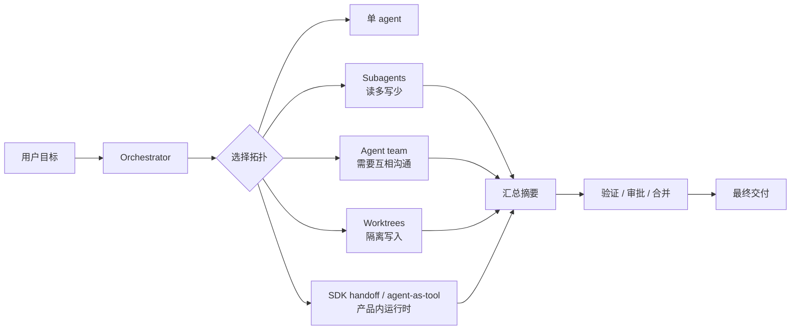
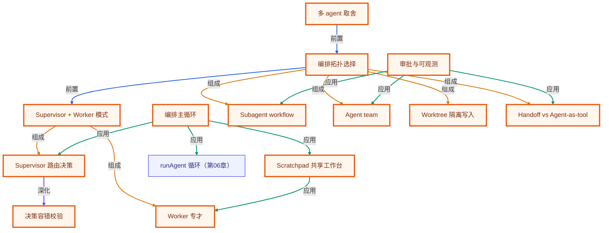

# 第 11 章 · 多智能体编排

> 所属阶段：**第四部分 · 进阶模式**
> 预计用时：120 分钟 | 难度：⭐⭐⭐⭐☆
> 全局导航：[课程导航](../../docs/navigation.md) · [完整大纲](../../docs/curriculum.md) · [知识图谱](../../docs/knowledge-graph.md)

## 学习目标

学完本章你能够：

- [ ] 说清**何时多 agent 优于单 agent**，以及它带来的额外成本与复杂度。
- [ ] 理解 **supervisor（协调者）+ worker（专才）** 的经典分工结构。
- [ ] 让 supervisor 用一次**结构化 JSON 决策**来"路由"任务：派给谁 / 还是结束。
- [ ] 从零写出一个编排循环：调度 `researcher → writer` 并**汇总**结果（不依赖任何多 agent 框架）。
- [ ] 把手写骨架映射到 2026 年真实工具：Claude Code 的 subagents / agent teams / worktrees，Codex 的 subagent workflows / custom agents / AGENTS.md，以及 OpenAI Agents SDK 的 handoff / agent-as-tool。
- [ ] 给一组真实任务选择正确拓扑：单 agent、读多写少的 subagents、需要互相沟通的 agent team、隔离写入的 worktree、或产品内 SDK 编排。

## 前置知识

- 已读 [第 04 章 · Agent 循环](../04-the-agent-loop/README.md) 与 [第 05 章 · 工具调用基础](../05-tool-use-basics/README.md)：理解 agent 循环（思考 → 调工具 → 观察）。本章直接复用 `runAgent`。
- 已读 [第 06 章 · 工具系统](../06-building-a-tool-system/README.md)：理解 `defineTool` / `ToolRegistry`。
- 已读 [第 10 章 · 推理模式](../10-reasoning-patterns/README.md)。
- 已配好 `.env`（**一个厂商的 key 即可**，本章不需要 embedding key）。

## 三层学习路线

| 层级 | 学习目标 | 你要完成什么 |
|------|----------|--------------|
| 极简 | 跑通 supervisor + worker 的协作模型。 | 能说明主管 agent 如何拆任务,worker 如何返回结果。 |
| 进阶 | 理解多智能体的通信协议、上下文合并、权限继承和停止条件。 | 分析任务分配、结果冲突、重复劳动、上下文污染、审批点和成本边界。 |
| 真实实践 | 把多智能体映射到 Claude Code / Codex / Agents SDK 的真实团队流程。 | 设计研究员、执行者、审查者协作流程，明确每个 agent 的权限、文件边界、交付物和验证方式。 |

---

## 图解学习地图

> 读图顺序：先看本章主线,再回到代码走读。核心焦点：**把复杂任务拆给多个角色协作**。



### 原理展开

- 多智能体的价值来自**边界清晰的分工**，不是数量。每个 agent 都要有明确输入、输出、工具权限、文件范围和完成标准，否则只是把单 agent 的混乱放大。
- Orchestrator 是系统稳定性的核心。它决定谁先做、谁并行、谁复核、何时停止，也负责把中间结果压缩成最终上下文。
- 最新工具正在把“多 agent”做成产品能力：Claude Code 有 subagents、agent teams、worktrees；Codex 有 subagent workflows、custom agents、AGENTS.md 和 sandbox/approval 继承；OpenAI Agents SDK 有 handoff、agent-as-tool、guardrails、traces 和 evals。
- 多 agent 会增加通信成本、token 成本、审批面和一致性风险。任务足够复杂、子任务能独立推进、输出能被验证和合并时才值得拆。

### 本章和整条路径的关系

本章把单条 agent loop 扩展成协作网络。后续框架章节会展示如何用图结构更稳地表达这种编排；第 15-17 章会继续补齐 eval、观测、审批和安全边界。

---

## 一、原理：什么时候该"拆成一支团队"

一个单 agent，本质是「一个 system prompt + 一堆工具 + 一个循环」。它很好用，直到——

```
你想让它：又会查资料、又会写代码、又会审校、又会发邮件……
结果：system prompt 越堆越长，工具越塞越杂，
      上下文被无关信息挤爆 → 跑偏、遗忘、前后矛盾。
```

这时把它**拆成一支团队**往往更好：

```
                    ┌─────────────┐
        总目标 ───▶ │  supervisor │  （协调者：只决策派给谁/是否结束）
                    └──────┬──────┘
            派活 ┌─────────┼──────────┐ 汇总
                 ▼         ▼          ▼
          ┌───────────┐ ┌────────┐ ┌────────┐
          │researcher │ │ writer │ │  …更多 │
          │（带检索） │ │（成文）│ │  专才  │
          └───────────┘ └────────┘ └────────┘
```

每个 worker 是一个**专才**：上下文更窄、提示更专、工具按职责裁剪。supervisor 不亲自干活，只负责"把哪个子任务派给哪个 worker、串行还是并行、最后怎么汇总"。

### 收益 vs. 代价（这才是面试与实战的重点）

| 维度 | 单 agent | 多 agent |
|------|----------|----------|
| 上下文 | 一锅烩，易超载 | 每个专才聚焦，更干净 |
| 提示词 | 越堆越臃肿 | 各自简短专一 |
| 可维护性 | 改一处牵全身 | 可单独替换某个 worker |
| **Token 成本** | 低 | **高**（每多一个 worker 多一份输入/输出） |
| **复杂度** | 低 | **高**（要写编排、传结果、防死循环） |
| 调试 | 一条链路 | 多条链路，更难定位 |

> 一句话决策法则：**当单 agent 的职责或上下文明显过载、且子任务边界清晰时，才拆多 agent。** 否则多花的 token 与复杂度并不划算——这正是 YAGNI 原则在 agent 架构上的体现。

### supervisor 其实很"便宜"

关键认知：supervisor 本身通常**只是一次结构化的 LLM 调用**——读取当前进度，输出"下一步派给谁"。真正烧 token 的检索、写作都外包给了 worker。所以让 LLM 当"路由器"是很经济的做法。

---

## 二、2026 实战版：Claude Code 与 Codex 的编排思路

> 截至 2026-06-11，多智能体编排已经不只是 AutoGen / CrewAI 这类框架名词。真实工程里更常见的是：**一个主会话负责目标、约束和合并；多个隔离 worker 负责探索、测试、审查或独立模块；敏感动作交给审批和 guardrail；结果用 trace / eval 回归。**

### 1) 先选拓扑，而不是先喊"多 agent"

| 拓扑 | 适合场景 | 不适合场景 | 你要定义的边界 |
|------|----------|------------|----------------|
| 单 agent | 任务线性、文件少、风险低 | 上下文噪声很大、需要多视角审查 | `maxSteps`、工具清单、done 标准 |
| Manager + specialists | 主 agent 需要最终负责答案，专才只做分类、摘要、检索、审查 | 专才需要直接接管用户对话 | 每个 specialist 的输入/输出 schema |
| Subagents | 读多写少、探索/测试/日志/审查可并行，结果只需汇总 | 多个 worker 同时改同一批文件 | 每个子任务、等待策略、汇总格式 |
| Agent team | 多个 agent 需要互相讨论、挑战假设、共享任务列表 | 简单顺序任务；token 预算紧 | team lead、teammate、共享任务、消息规则 |
| Worktrees / isolated sessions | 多个 worker 要写代码，且能按文件/模块隔离 | 大量跨文件同改、需要紧密协同 | 分支/目录边界、合并顺序、冲突处理 |
| SDK handoff | 产品里某个 specialist 应该接管下一轮对话 | 主 agent 必须保持最终控制权 | handoff 条件、历史过滤、返回责任 |
| Agent-as-tool | 主 agent 应保持控制，只把 specialist 当有界能力调用 | specialist 需要长期独立状态 | tool 名称、参数、输出、审批策略 |

判断顺序：

1. **能单 agent 完成吗？** 能就别拆。OpenAI Agents SDK 官方也建议“先从一个 agent 开始”，只有当能力隔离、策略隔离、prompt 清晰度或 trace 可读性真的变好时再加 specialist。
2. **是读任务还是写任务？** 读多写少优先 subagents；写任务优先 worktree / 文件边界隔离。
3. **worker 是否需要互相沟通？** 只回传结果用 subagents；需要彼此质询、共享任务列表，用 agent team。
4. **谁拥有最终输出？** specialist 接管用户回复是 handoff；主 agent 汇总输出是 agent-as-tool / manager。
5. **是否有副作用？** 改文件、发请求、执行 shell、改数据库前必须有 sandbox、approval 或 human-in-the-loop。

### 2) Claude Code：subagents、agent teams、worktrees

Claude Code 的现代实践分三层：

| 能力 | 当前定位 | 实战用法 |
|------|----------|----------|
| Custom subagents | 单会话内的专才，拥有自己的上下文窗口、system prompt、工具权限和权限模式 | 适合研究、审查、日志分析、测试定位；能减少主会话 context pollution |
| Agent teams | 多个 Claude Code session 组成团队，有 team lead、teammates、共享任务列表和 mailbox | 适合并行 code review、竞争假设调试、前后端测试分层推进；官方标注 experimental，需显式启用 |
| Worktrees | 多个 session 在隔离工作树里并行写代码 | 适合“每个 worker 负责一个模块/分支”的写入型任务，避免同文件冲突 |
| Hooks | 对工具调用、任务创建/完成、teammate idle 等事件加自动规则 | 适合强制测试、格式化、禁止高风险任务完成 |
| MCP / skills / instructions | 给团队提供外部工具、复用流程和项目规则 | 适合把 Jira、Slack、Drive、内部脚本纳入工具层 |

Claude Code 的要点：

- subagent 用来**隔离噪声**：搜索结果、日志、候选假设不要淹没主会话。
- agent team 用来**协作讨论**：teammates 能互发消息和共享 task list，适合互相挑战而不是只汇报。
- team lead 仍要负责**合并和收敛**：让所有 teammate 明确输出格式、完成标准、测试要求。
- 写入型并行必须优先考虑 worktree 或文件边界；否则节省的时间会被 merge conflict 吃掉。
- hooks 是质量门，不是装饰：可以在 teammate 完成任务前强制跑测试，失败就退回继续修。

一个 Claude Code 团队提示可以这样写：

```text
Create an agent team for this refactor.
Spawn three teammates:
- explorer: read-only, map call sites and risks
- implementer: edit only src/orchestrator/** and add tests
- reviewer: read-only, review security, regressions, and missing tests

Require plan approval before implementer writes files.
Only mark a task complete after the relevant tests pass.
The lead should wait for all teammates, synthesize conflicts, and produce one final merge plan.
```

### 3) Codex：显式 subagent workflows、custom agents、AGENTS.md

Codex 的当前思路更强调**显式触发、沙箱继承、项目指令链和可审计结果**：

| 能力 | 当前定位 | 实战用法 |
|------|----------|----------|
| Subagent workflows | Codex 可以显式 spawn 多个 specialized agents 并合并结果 | 适合“每个审查维度一个 agent”“每个文档分片一个 agent”“每个假设一个 agent” |
| `/agent` 线程切换 | CLI 中查看/切换 active agent threads | 长任务中检查子线程、追问或停止 worker |
| Custom agents | `~/.codex/agents/` 或 `.codex/agents/` 下 TOML 定义 agent | 为 `explorer`、`worker`、`security-reviewer` 等设定模型、sandbox、instructions |
| AGENTS.md | Codex 启动时读取全局 + 项目 + 子目录指令链 | 把构建命令、测试策略、架构规则、PR 规范固定下来 |
| Sandbox / approvals | subagent 继承父会话 sandbox 和审批策略，子 agent 可单独设 read-only 等 | 控制 worker 是否能写文件、跑命令、请求升级权限 |
| App / CLI / cloud workflows | IDE/CLI/云端都强调明确上下文、done 定义和验证命令 | 让 Codex 报告命令输出、测试结果、diff，而不是只给自然语言 |

Codex 的要点：

- Codex 官方明确：**不会自动 spawn subagents**；需要用户显式说“spawn two agents”“delegate this in parallel”“use one agent per point”。
- 好的 subagent prompt 要写清：怎么拆、是否等所有 agent、返回什么格式。
- 并行 worker 会继承 sandbox/approval；非交互流程里无法新获批的动作会失败并回传给父流程，所以提示里要提前说明权限边界。
- `AGENTS.md` 是多 agent 项目的地基：所有 worker 先读取同一套项目规则，再按子目录更深层指令覆盖。
- 控制递归深度很重要。Codex custom agent 配置中 `agents.max_depth` 默认只允许直接 child；盲目加深会带来不可预测 fan-out、token 和资源成本。

一个 Codex review prompt 可以这样写：

```text
Review this branch against main with parallel subagents.
Spawn one agent per point, wait for all agents, then summarize with file references:
1. Security and permissions
2. Bugs and edge cases
3. Test coverage
4. Maintainability

All agents must stay read-only. The parent thread should merge findings,
deduplicate duplicates, and mark P0/P1/P2 separately.
```

一个项目级 Codex custom agent 可以这样放在 `.codex/agents/security-reviewer.toml`：

```toml
name = "security-reviewer"
description = "Read-only security reviewer for auth, permissions, secrets, injection, and unsafe shell usage."
developer_instructions = """
Review only. Do not edit files.
Return findings first, ordered by severity.
Each finding must include file path, line number, risk, exploit scenario, and minimal fix.
"""
sandbox_mode = "read-only"
model_reasoning_effort = "high"
```

### 4) OpenAI Agents SDK：产品内编排的两种主模式

如果你不是在 IDE/CLI 里协作写代码，而是在自己的产品里实现多 agent runtime，OpenAI Agents SDK 的核心分歧是：

| 模式 | 谁控制最终回复 | 适合场景 |
|------|----------------|----------|
| `handoff` | specialist 接管该分支对话 | 用户从“分诊”进入“退款/账单/技术支持”等专业流程 |
| `agent.asTool()` | manager 保持控制，specialist 只是一个工具 | 摘要、分类、检索评估、代码审查、合规判断等有界能力 |

SDK 级实践不要漏掉四件事：

- **Guardrails**：输入、输出、工具行为分别校验；不要只靠 agent-level guardrail 保护所有深层工具。
- **Human review**：敏感工具 `needsApproval`，run 暂停后用 resumable `state` 继续同一次运行。
- **Tracing**：每个 model call、tool call、handoff、guardrail、custom span 都要进 trace，先 debug，再 eval。
- **Eval**：从单条 trace 复盘，升级到 dataset + grader，回归检查“是否选对工具、是否该 handoff、是否违反策略”。

最小 manager-as-tool 形态：

```ts
import { Agent } from "@openai/agents";

const reviewer = new Agent({
  name: "Reviewer",
  instructions: "Review the provided diff and return only actionable findings.",
});

const manager = new Agent({
  name: "Engineering manager",
  instructions: "Own the final answer. Call specialists only for bounded review tasks.",
  tools: [
    reviewer.asTool({
      toolName: "review_diff",
      toolDescription: "Review a diff for bugs, regressions, and missing tests.",
    }),
  ],
});
```

### 5) 现代多 agent 实战清单

每次准备拆 agent 前，按这张清单过一遍：

| 检查项 | 合格标准 |
|--------|----------|
| 拆分收益 | 并行能省时间，或专才能显著提升质量；不是为了显得高级 |
| 任务独立性 | worker 输入足够完整，互相等待少，输出可单独验收 |
| 写入边界 | 每个写入 worker 有文件/模块/分支边界；同文件写入先串行 |
| 上下文策略 | 主线程保留目标、约束、决策；worker 返回摘要，不回灌原始噪声 |
| 工具权限 | read-only / write / shell / network / MCP 分级授予，默认最小权限 |
| 审批边界 | shell、删除、迁移、发 PR、发邮件、改配置等副作用要 human gate |
| 观测证据 | 保存 trace、命令、测试结果、diff、失败原因 |
| 合并策略 | parent 负责去重、冲突解决、最终判断，不把 worker 结论原样拼贴 |
| 回归验证 | 并行越多，越要有自动测试或 eval 防止“看似都对，合起来错” |

一句话更新版决策法则：

> **多 agent 不是“多叫几个人”，而是把任务、上下文、权限、产物和验证边界都切开；切不开就先别拆。**

---

## 三、代码走读

完整代码见 [`index.ts`](./index.ts)（编排循环）与 [`workers.ts`](./workers.ts)（专才定义）。

### 1) worker：各有独立 system prompt 与工具

`researcher` 有检索工具，内部直接复用 `runAgent`，让模型自己决定查几次：

```ts
// workers.ts
const knowledgeSearchTool = defineTool({
  name: "knowledge_search",
  description: "在本地知识库中按关键词检索资料……",
  schema: z.object({ keyword: z.string() }),
  execute: ({ keyword }) => { /* 在本地语料里找，命中/未命中都返回字符串 */ },
});

export function makeResearcher(client: LLMClient): Worker {
  const registry = new ToolRegistry([knowledgeSearchTool]);
  const system = "你是研究员，只负责用 knowledge_search 收集事实，输出要点式笔记……";
  return async (task, context) => {
    const run = await runAgent({ client, registry, system, messages: [...], maxSteps: 6 });
    return run.finalText;
  };
}
```

`writer` **没有工具**——写作不需要检索，强行给它工具只会增加跑偏风险。这体现"按职责裁剪能力"：

```ts
export function makeWriter(client: LLMClient): Worker {
  const system = "你是写手，只负责把研究员的笔记整理成带要点的摘要，不负责查资料……";
  return async (task, context) =>
    (await client.chat({ system, messages: [{ role: "user", content: `素材：${context}` }] })).text;
}
```

> WHY 用「本地知识库」而不是真实联网检索：本章重点是**编排**，不是检索质量。用内置语料，课程只要一个 LLM key 就能跑通。真实项目里把这个工具换成 Web 搜索或向量库（[第 09 章](../09-rag-from-scratch/README.md)）即可，supervisor 与 writer **一行都不用改**。

### 2) supervisor：用结构化 JSON 做"路由决策"

让 supervisor 输出一个小 JSON，编排循环才能据此精确分支。配合 zod 校验，把"模型文本"当成边界数据来兜底：

```ts
// index.ts
const decisionSchema = z.object({
  next: z.enum(["researcher", "writer", "done"]), // 派给谁 / 结束
  task: z.string().default(""),                   // 给该 worker 的子任务
  reason: z.string().default(""),                 // 决策理由，纯为可解释
});

async function decide(client, pad): Promise<Decision> {
  const result = await client.chat({
    system: "你是协调者，只决策下一步派给谁或宣布完成，严格只输出一个 JSON……",
    messages: [{ role: "user", content: `总目标：${pad.goal}\n当前进度：${renderProgress(pad)}` }],
    temperature: 0, // 决策要稳定可复现
  });
  return parseDecision(result.text); // 宽容提取 JSON + zod 校验 + 失败兜底
}
```

### 3) 编排主循环：决策 → 派活 → 回写工作台 → 再决策

`Scratchpad`（共享工作台）记录每个 worker 的产出；下游 worker 能看到上游结果，这就是"结果在 agent 之间流动"：

```ts
for (let round = 1; round <= maxRounds; round++) {
  const decision = await decide(client, pad);
  if (decision.next === "done") { /* 取最后一份 writer 产出作为交付 */ break; }

  const worker = workers[decision.next];                 // researcher 或 writer
  const output = await worker(decision.task, renderProgress(pad));
  pad.entries.push({ worker: decision.next, output });   // 回写，供下一轮参考
}
```

> `maxRounds` 是防死循环的护栏，和单 agent 的 `maxSteps` 同理：万一 supervisor 迟迟不说 `done`，也不会无限烧钱。

---

## 四、运行

```bash
# 默认厂商（.env 里的 LLM_PROVIDER）
npx tsx lessons/11-multi-agent-orchestration/index.ts

# 想看 supervisor 每一步决策 / 各 worker 的 token 用量，开 DEBUG：
# PowerShell:
$env:DEBUG="1"; npx tsx lessons/11-multi-agent-orchestration/index.ts
# macOS / Linux:
DEBUG=1 npx tsx lessons/11-multi-agent-orchestration/index.ts
```

预期输出：supervisor 先决策派给 `researcher`（打印研究笔记），再派给 `writer`（打印成稿摘要），最后宣布 `done` 并汇总出最终摘要。

---

## 五、练习

1. **加一个审校 worker**：定义 `makeReviewer`（无工具），让 supervisor 在 writer 之后插入一道"审校/润色"工序。注意把 `WorkerName` 联合类型和 `decisionSchema` 的 `enum` 同步更新。
2. **换真检索**：把 `knowledge_search` 工具的 `execute` 换成 [第 09 章](../09-rag-from-scratch/README.md) 的 `MemoryVectorStore.search`（需要 embedding key），体会"换工具、不动编排"。
3. **并行派活**：把循环改成"supervisor 一次可返回多个 worker"，用 `Promise.all` 并行跑互不依赖的 worker，观察墙钟时间与 token 的变化。
4. **成本对比**：累加所有 worker + supervisor 的 token，和"让单个 agent 一把梭"做对比，量化多 agent 多花了多少。
5. **健壮性**：故意把 supervisor 的 system prompt 改坏（让它输出非 JSON），验证 `parseDecision` 的兜底是否生效。
6. **Codex 子代理审查**：不用改代码，只写一段 Codex prompt：要求 spawn 4 个 read-only subagents 分别审查安全、bug、测试、可维护性，并要求父线程等待全部结果后按 P0/P1/P2 汇总。
7. **Claude Code 团队设计**：为一个“重构 auth 模块”的任务设计 agent team：列出 lead、explorer、implementer、reviewer 的工具权限、是否需要 plan approval、哪些文件不能碰。
8. **SDK 拓扑选择**：同一个客服场景，分别写出 handoff 和 agent-as-tool 版本的适用条件：什么时候退款 specialist 应接管，什么时候只作为 manager 的工具。

---

<!-- KG:START (由 npm run kg 自动生成，勿手改本标记区) -->

## 知识图谱与延伸阅读

> 本节由 `npm run kg` 自动生成（数据源 `knowledge-graph/data/graph.ts`）。要增删请改数据源后重跑。

### 本章概念图谱

> 节点：**橙框**=本章概念，蓝框=关联的其他章概念。连线按关系类型着色：前置(蓝) · 深化(紫) · 对比(玫红) · 应用(绿) · 组成(橙)。



### 与其他章节的关系

- `编排主循环` —**应用**→ `runAgent 循环`（第 06 章）

### 延伸阅读

- [Claude Code Docs · Orchestrate teams of Claude Code sessions](https://code.claude.com/docs/en/agent-teams) — Claude Code 官方 agent teams 文档：team lead、teammates、共享任务列表、mailbox、hooks 与限制 `doc`
- [Codex Docs · Subagents](https://developers.openai.com/codex/subagents) — OpenAI Codex 官方 subagent workflows 文档：显式 spawn、线程管理、sandbox/approval 继承与 custom agents `doc`
- [OpenAI Agents SDK · Orchestration and handoffs](https://developers.openai.com/api/docs/guides/agents/orchestration) — OpenAI 官方 Agents SDK 编排文档：handoff 与 agent-as-tool 的选择边界 `doc`
- [Claude Code Docs · Create custom subagents](https://code.claude.com/docs/en/sub-agents) — Claude Code 官方 subagents 文档：独立上下文、工具权限、自动/显式委派与上下文隔离 `doc`
- [Codex Docs · Custom instructions with AGENTS.md](https://developers.openai.com/codex/guides/agents-md) — OpenAI Codex 官方 AGENTS.md 文档：全局、项目、子目录指令链与覆盖规则 `doc`
- [OpenAI Agents SDK · Guardrails and human review](https://developers.openai.com/api/docs/guides/agents/guardrails-approvals) — OpenAI 官方：guardrails 与 human-in-the-loop approvals 控制敏感工具和副作用 `doc`
- [OpenAI Agents SDK · Integrations and observability](https://developers.openai.com/api/docs/guides/agents/integrations-observability) — OpenAI 官方：tracing 记录 model calls、tool calls、handoffs、guardrails 与 custom spans `doc`

> 🗺️ 在[全局知识图谱](../../docs/knowledge-graph.md) / [交互式图谱](../../knowledge-graph/output/index.html) 中查看本章位置。

<!-- KG:END -->

## 六、小结与延伸

- 多 agent = supervisor（路由决策）+ 若干 worker（按职责裁剪上下文与工具）+ 一个传结果的编排循环。
- 现代实践把这个骨架产品化为 subagents、agent teams、worktrees、custom agents、handoffs、agent-as-tool、guardrails、traces 和 evals。
- 拆团队有收益（聚焦、并行、可维护、多视角）也有代价（token、审批面、合并成本、调试难度）——**职责/上下文过载且子任务边界清晰**时才值得拆。
- 你已亲手写穿了"多智能体"的骨架；上一章是 [第 10 章 · 推理模式](../10-reasoning-patterns/README.md)，下一章 [第 12 章 · 框架入门](../12-intro-to-frameworks/README.md) 会看到 LangGraph / Vercel AI SDK 等框架，其实就是把本章这套循环封装成更稳定的运行时。

> 💡 **面试会问**：什么场景下多 agent 比单 agent 更好？subagent、agent team、handoff、agent-as-tool 各自怎么选？多 agent 的主要代价是什么，如何用权限、trace、eval 和 human gate 控住？
