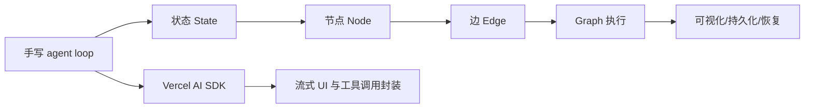

# 第 12 章 · 上框架：LangGraph.js 与 Vercel AI SDK

> 所属阶段：**第五部分 · 工程化与框架**
> 预计用时：50 分钟 | 难度：⭐⭐⭐
> 全局导航：[课程导航](../../docs/navigation.md) · [完整大纲](../../docs/curriculum.md) · [知识图谱](../../docs/knowledge-graph.md)

## 学习目标

学完本章你能够：

- [ ] 说清**为什么生产环境要用框架**：状态管理 / 检查点持久化 / 中断恢复 / 流式 / 工具生态 / 可观测性。
- [ ] 用 **Vercel AI SDK** 的 `generateText` + `tool`，一个 `maxSteps` 参数跑完整条工具循环。
- [ ] 用 **LangGraph.js** 的 `createReactAgent`，把 agent 当作一张**状态机图**来编排。
- [ ] 对照第 06 章手写版，**指出框架到底替你做了什么**，并知道**何时选哪个框架**。

## 前置知识

- 已读 [第 04 章 · Agent 循环](../04-the-agent-loop/README.md)：理解 think→act→observe。
- 已读 [第 06 章 · 从零构建工具系统](../06-building-a-tool-system/README.md)：本章会把那段手写代码用框架重建。
- 已读 [第 11 章 · 多 Agent 编排](../11-multi-agent-orchestration/README.md)。
- 已配好 `.env` 里的 `ANTHROPIC_API_KEY`（本章框架 SDK 会自动读取它）。

## 三层学习路线

| 层级 | 学习目标 | 你要完成什么 |
|------|----------|--------------|
| 极简 | 把手写版 agent 能力映射到框架概念。 | 说清 LangGraph.js、Vercel AI SDK 分别帮你托管了哪些样板代码。 |
| 进阶 | 理解框架的状态、节点、边、stream 和持久化抽象。 | 对比手写 loop 与 LangGraph state graph,知道框架何时降低复杂度、何时增加约束。 |
| 真实实践 | 制定从 demo 迁移到框架的路线。 | 为一个已有手写 agent 选择保留、替换、重写的模块,避免被框架重构吞没。 |

---

## 图解学习地图

> 读图顺序：先看本章主线,再回到代码走读。核心焦点：**理解框架把手写循环封装成图和节点**。



### 原理展开

- 框架不是替代原理,而是把已经学过的循环、工具和状态封装成更可维护的结构。先手写再上框架,你才能判断抽象是否合适。
- LangGraph 的核心是显式状态图: 节点做计算,边决定下一步,状态在节点间流动。它适合长流程和可恢复编排。
- Vercel AI SDK 更偏产品体验: 流式、工具调用、前端集成更顺手。选框架时要看任务控制流和 UI 形态。

### 本章和整条路径的关系

本章是从底层原理到生产抽象的桥。后续结构化输出、流式 UX、部署都会受益于框架提供的封装。

---

## 一、原理：手写够学原理，生产需要框架

前 11 章我们一直坚持两件事：**手写循环**、**走 `getLLM()` 统一抽象**。这是为了把原理学透——你现在完全知道一个 agent 内部在干什么。

但把手写代码搬上生产，你会立刻撞到一堆「重活」：

```
你手写的 agent loop          生产真正需要的
─────────────────────       ─────────────────────────────
for 循环跑工具调用      →    状态机：节点/边/条件转移，可读可改可测
内存里的 messages 数组  →    检查点（checkpoint）：崩溃后能从断点恢复
一口气跑到底            →    中断恢复：跑到一半等人工审批，再继续
console.log 看进度      →    可观测性：每一步的输入/输出/耗时/成本可追踪
自己拼 stream 事件      →    开箱即用的流式 API
自己写每个工具          →    成熟的工具生态（检索/浏览器/代码执行…）
```

这些不该每个项目重新发明。**框架就是把上面这一整列「重活」标准化的成熟方案。**

### 两种主流框架，两种世界观

| | **Vercel AI SDK** | **LangGraph.js** |
|---|---|---|
| 世界观 | agent = **一次带工具的文本生成** | agent = **一张状态机图**（节点+边） |
| 核心 API | `generateText` / `streamText` / `tool` | `createReactAgent` / `StateGraph` |
| 工具循环 | `maxSteps` 参数自动跑 | 图里内置「模型节点 ↔ 工具节点」循环边 |
| 最强项 | 轻量、流式、贴近 Web/前端 | 持久化、中断恢复、复杂多 agent 编排 |
| 何时选 | 聊天应用、Next.js 全栈、要好流式体验 | 长流程、需 checkpoint/human-in-the-loop、多 agent |

一句话决策：**做聊天/Web 产品、要丝滑流式 → AI SDK；做长流程、要持久化与可恢复编排 → LangGraph。** 两者也能混用（AI SDK 负责前端流式，LangGraph 负责后端编排）。

### 框架替你做了什么（对照第 06 章）

第 06 章里你手写过这样一段循环（示意）：

```
模型说「要调 add 工具」
  → 你解析 toolCall，执行 add，拿到结果
  → 你把结果作为 tool 消息塞回 messages
  → 你再调一次模型……如此往复，直到模型不再调工具
```

本章两个示例里，**这整段你一行都不用写**——AI SDK 用 `maxSteps` 包掉，LangGraph 用图里的循环边包掉。你只负责「定义工具 + 提问」。

> 框架 API 演进很快。本章代码以本仓库锁定的版本为准（`ai@4` / `@ai-sdk/anthropic@1` / `@langchain/langgraph@0.2` / `@langchain/anthropic@0.3`）。**升级时请以官方文档为准。**

---

## 二、代码走读

完整代码见 [`index.ts`](./index.ts)（串起两个示例）、[`ai-sdk.ts`](./ai-sdk.ts)、[`langgraph.ts`](./langgraph.ts)。任务都是同一个「两步算术」：先 `add(23,19)`，再把结果 `multiply` 乘 2。

> ⚠️ 本章是**破例**章节——直接使用框架 SDK，**不走 `getLLM()`**。其余章节请继续用统一抽象。

### 示例 A：Vercel AI SDK（[`ai-sdk.ts`](./ai-sdk.ts)）

```ts
import { generateText, tool } from "ai";
import { anthropic } from "@ai-sdk/anthropic";
import { z } from "zod";

const result = await generateText({
  model: anthropic("claude-opus-4-8"), // 自动读 ANTHROPIC_API_KEY
  prompt: "先用 add 算 23+19，再用 multiply 乘以 2，最后报告答案。",
  tools: {
    add: tool({
      description: "把两个数字相加",
      parameters: z.object({ a: z.number(), b: z.number() }), // 注意字段叫 parameters
      execute: async ({ a, b }) => String(a + b),             // 入参类型由 zod 自动推断
    }),
    multiply: tool({
      description: "把两个数字相乘",
      parameters: z.object({ a: z.number(), b: z.number() }),
      execute: async ({ a, b }) => String(a * b),
    }),
  },
  maxSteps: 5, // ← 一个参数 = 第 06 章整段手写工具循环
});

console.log(result.text);
// result.steps 是天然的可观测性：每一步的模型调用 + 触发的工具调用都在里面
```

要点：
- `maxSteps` 是关键——它让 `generateText` 自动跑「模型→工具→模型」多轮，直到收敛或触顶。
- 用量字段是 `result.usage.promptTokens / completionTokens`（AI SDK v4 的命名，和本课统一抽象的 `inputTokens/outputTokens` 不同）。

### 示例 B：LangGraph.js（[`langgraph.ts`](./langgraph.ts)）

```ts
import { createReactAgent } from "@langchain/langgraph/prebuilt";
import { ChatAnthropic } from "@langchain/anthropic";
import { tool } from "@langchain/core/tools";
import { z } from "zod";

const model = new ChatAnthropic({ model: "claude-opus-4-8" }); // 同样自动读 ANTHROPIC_API_KEY

// 注意：execute 是第一参数，参数 schema 字段叫 schema（不是 parameters）
const addTool = tool(async ({ a, b }) => String(a + b), {
  name: "add",
  description: "把两个数字相加",
  schema: z.object({ a: z.number(), b: z.number() }),
});

// createReactAgent 返回一张「已编译的状态图」，内部已连好模型节点↔工具节点的循环边
const agent = createReactAgent({ llm: model, tools: [addTool /* , multiplyTool */] });

const out = await agent.invoke({
  messages: [{ role: "user", content: "先用 add 算 23+19，再乘以 2…" }],
});

// out.messages 是图终态的完整轨迹；最后一条就是终答，用 .text 取纯文本
const last = out.messages[out.messages.length - 1];
console.log(last?.text ?? "");
```

要点：
- `createReactAgent` 是官方**预制图**：它已经把「模型判断要不要调工具 → 工具节点执行 → 结果回流」这条循环搭好了。
- `invoke` 的入参是图的**初始状态**（一条消息列表），返回的是图的**终态**（含完整 messages 轨迹）——这就是 LangGraph 的「状态机」心智模型。

### 两个框架命名差异速查（容易踩的坑）

| 概念 | Vercel AI SDK | LangGraph (`@langchain/core`) | 第 06 章手写版 |
|---|---|---|---|
| 工具参数 schema | `parameters` | `schema` | `schema` |
| 工具执行函数 | `execute`（在对象里） | 第一个位置参数 | `execute` |
| 跑工具循环 | `maxSteps` | 图内置循环边 | 手写 `for` |
| token 用量字段 | `promptTokens/completionTokens` | 消息 metadata | `inputTokens/outputTokens` |

---

## 三、运行

```bash
# 一次跑完两个框架示例
npx tsx lessons/12-intro-to-frameworks/index.ts

# 也可单独运行某一个示例
npx tsx lessons/12-intro-to-frameworks/ai-sdk.ts
npx tsx lessons/12-intro-to-frameworks/langgraph.ts
```

> 本章框架 SDK 走的是 Anthropic，凭 `.env` 里的 `ANTHROPIC_API_KEY` 即可（`anthropic()` 与 `ChatAnthropic` 都会自动读取该环境变量）。若你想临时指定 key，可在运行前设置环境变量：

```bash
# PowerShell（仅本次运行）
$env:ANTHROPIC_API_KEY="sk-ant-..."; npx tsx lessons/12-intro-to-frameworks/index.ts

# macOS / Linux（仅本次运行）
ANTHROPIC_API_KEY=sk-ant-... npx tsx lessons/12-intro-to-frameworks/index.ts
```

预期输出：两个示例各自打印「框架跑了几步 / 工具调用明细 / 最终回答」，结果都应是 `(23+19)*2 = 84`。

---

## 四、练习

1. **加一个工具**：给 AI SDK 示例加一个 `subtract` 工具，把题目改成三步运算，观察 `result.steps.length` 变化。
2. **改 LangGraph 的提示**：给 `createReactAgent` 传 `prompt: "你是严谨的数学助手，每步都说明你在算什么"`，对比终答风格。
3. **可观测性**：在 AI SDK 示例里加 `onStepFinish` 回调，打印每一步的 `finishReason` 和 token 用量，建立「每步成本」意识。
4. **流式**：把 `generateText` 换成 `streamText`，体验框架开箱即用的流式（回顾第 02 章的 `stream()`，对比手写 vs 框架）。
5. **进阶 · 持久化**：给 LangGraph 的 `createReactAgent` 传 `checkpointer`（如 `MemorySaver`）+ `invoke` 时带 `thread_id`，连续两次提问，验证它「记得」上一轮——这正是手写版做不到的「状态持久化」。

---

<!-- KG:START (由 npm run kg 自动生成，勿手改本标记区) -->

## 知识图谱与延伸阅读

> 本节由 `npm run kg` 自动生成（数据源 `knowledge-graph/data/graph.ts`）。要增删请改数据源后重跑。

### 本章概念图谱

> 节点：**橙框**=本章概念，蓝框=关联的其他章概念。连线按关系类型着色：前置(蓝) · 深化(紫) · 对比(玫红) · 应用(绿) · 组成(橙)。

```mermaid
graph TB
  classDef own fill:#fff7ed,stroke:#ea580c,stroke-width:3px,color:#7c2d12;
  classDef cross fill:#eef2ff,stroke:#6366f1,stroke-width:1.5px,color:#312e81;
  n_c12_why_frameworks["为什么生产要上框架"]
  n_c12_vercel_ai_sdk["Vercel AI SDK"]
  n_c12_max_steps["maxSteps 自动工具循环"]
  n_c12_langgraph["LangGraph.js"]
  n_c12_react_agent["createReactAgent 预制图"]
  n_c12_state_graph["状态机图模型"]
  n_c12_framework_choice["框架选型决策"]
  n_c06_run_agent_loop["runAgent 循环（第06章）"]
  n_c04_agent_loop["Agent 循环（第04章）"]
  n_c04_react["ReAct (Reasoning + Acting)（第04章）"]
  n_c19_ecosystem_layers["Agent 生态分层（第19章）"]
  n_srca_reading_map["源码阅读路线（第21章）"]
  n_lgsg_vs_prebuilt["揭开 createReactAgent（第lg-stategraph章）"]
  n_lgsg_state_channels["State 与 channels（第lg-stategraph章）"]
  n_lgsg_edges_compile["边与 compile/invoke（第lg-stategraph章）"]
  n_lgrt_conditional_edge["条件边 (addConditionalEdges)（第lg-routing章）"]
  n_lgcp_checkpointer["Checkpointer 与 thread_id（第lg-checkpoint章）"]
  n_c12_why_frameworks -->|应用| n_c12_vercel_ai_sdk
  n_c12_why_frameworks -->|应用| n_c12_langgraph
  n_c12_vercel_ai_sdk -->|组成| n_c12_max_steps
  n_c12_langgraph -->|组成| n_c12_react_agent
  n_c12_langgraph -->|深化| n_c12_state_graph
  n_c12_react_agent -->|应用| n_c12_state_graph
  n_c12_max_steps -->|对比| n_c12_state_graph
  n_c12_vercel_ai_sdk -->|前置| n_c12_framework_choice
  n_c12_langgraph -->|前置| n_c12_framework_choice
  n_c12_vercel_ai_sdk -->|对比| n_c06_run_agent_loop
  n_c12_langgraph -->|对比| n_c04_agent_loop
  n_c12_react_agent -->|应用| n_c04_react
  n_c19_ecosystem_layers -->|深化| n_c12_framework_choice
  n_srca_reading_map -->|深化| n_c12_framework_choice
  n_lgsg_vs_prebuilt -->|深化| n_c12_react_agent
  n_lgsg_state_channels -->|深化| n_c12_state_graph
  n_lgsg_edges_compile -->|深化| n_c12_langgraph
  n_lgsg_vs_prebuilt -->|前置| n_c12_framework_choice
  n_lgrt_conditional_edge -->|应用| n_c12_react_agent
  n_lgcp_checkpointer -->|深化| n_c12_langgraph
  class n_c12_why_frameworks,n_c12_vercel_ai_sdk,n_c12_max_steps,n_c12_langgraph,n_c12_react_agent,n_c12_state_graph,n_c12_framework_choice own;
  class n_c06_run_agent_loop,n_c04_agent_loop,n_c04_react,n_c19_ecosystem_layers,n_srca_reading_map,n_lgsg_vs_prebuilt,n_lgsg_state_channels,n_lgsg_edges_compile,n_lgrt_conditional_edge,n_lgcp_checkpointer cross;
  linkStyle 0 stroke:#059669,stroke-width:2px;
  linkStyle 1 stroke:#059669,stroke-width:2px;
  linkStyle 2 stroke:#d97706,stroke-width:2px;
  linkStyle 3 stroke:#d97706,stroke-width:2px;
  linkStyle 4 stroke:#7c3aed,stroke-width:2px;
  linkStyle 5 stroke:#059669,stroke-width:2px;
  linkStyle 6 stroke:#db2777,stroke-width:2px;
  linkStyle 7 stroke:#2563eb,stroke-width:2px;
  linkStyle 8 stroke:#2563eb,stroke-width:2px;
  linkStyle 9 stroke:#db2777,stroke-width:2px;
  linkStyle 10 stroke:#db2777,stroke-width:2px;
  linkStyle 11 stroke:#059669,stroke-width:2px;
  linkStyle 12 stroke:#7c3aed,stroke-width:2px;
  linkStyle 13 stroke:#7c3aed,stroke-width:2px;
  linkStyle 14 stroke:#7c3aed,stroke-width:2px;
  linkStyle 15 stroke:#7c3aed,stroke-width:2px;
  linkStyle 16 stroke:#7c3aed,stroke-width:2px;
  linkStyle 17 stroke:#2563eb,stroke-width:2px;
  linkStyle 18 stroke:#059669,stroke-width:2px;
  linkStyle 19 stroke:#7c3aed,stroke-width:2px;
```



### 与其他章节的关系

- `Vercel AI SDK` —**对比**→ `runAgent 循环`（第 06 章）
- `LangGraph.js` —**对比**→ `Agent 循环`（第 04 章）
- `createReactAgent 预制图` —**应用**→ `ReAct (Reasoning + Acting)`（第 04 章）
- `Agent 生态分层` —**深化**→ `框架选型决策`（第 19 章）
- `源码阅读路线` —**深化**→ `框架选型决策`（第 21 章）
- `揭开 createReactAgent` —**深化**→ `createReactAgent 预制图`（第 lg-stategraph 章）
- `State 与 channels` —**深化**→ `状态机图模型`（第 lg-stategraph 章）
- `边与 compile/invoke` —**深化**→ `LangGraph.js`（第 lg-stategraph 章）
- `揭开 createReactAgent` —**前置**→ `框架选型决策`（第 lg-stategraph 章）
- `条件边 (addConditionalEdges)` —**应用**→ `createReactAgent 预制图`（第 lg-routing 章）
- `Checkpointer 与 thread_id` —**深化**→ `LangGraph.js`（第 lg-checkpoint 章）

### 延伸阅读

- [Vercel AI SDK 官方文档](https://sdk.vercel.ai/docs) — generateText / streamText / tool / maxSteps 的权威参考 `doc`
- [LangGraph.js 官方文档](https://langchain-ai.github.io/langgraphjs/) — StateGraph / createReactAgent / checkpointer 的权威参考 `doc`

> 🗺️ 在[全局知识图谱](../../docs/knowledge-graph.md) / [交互式图谱](../../knowledge-graph/output/index.html) 中查看本章位置。

<!-- KG:END -->

## 五、小结与延伸

- 手写是为了学原理；**框架是为了不重复造生产级的轮子**（状态/持久化/恢复/流式/可观测）。
- **Vercel AI SDK**：把 agent 当「带工具的文本生成」，`maxSteps` 自动跑循环，轻量、流式强。
- **LangGraph.js**：把 agent 当「状态机图」，`createReactAgent` 内置工具循环，持久化与编排强。
- 上一章 [第 11 章 · 多 Agent 编排](../11-multi-agent-orchestration/README.md) 是手写编排的天花板；本章用框架把这些能力标准化。
- 下一章 [第 13 章 · 结构化输出](../13-structured-output/README.md) 学习如何让模型稳定吐出 JSON / schema 约束的结果。

> 💡 **面试会问**：手写 agent loop 和用框架（AI SDK / LangGraph）各有什么取舍？什么场景必须用 LangGraph 的 checkpoint？`maxSteps` 解决了手写版里的什么问题？
