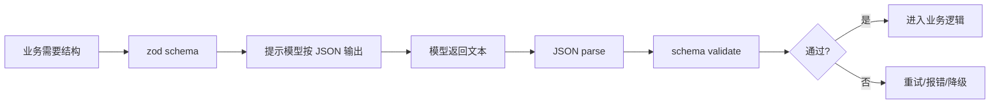
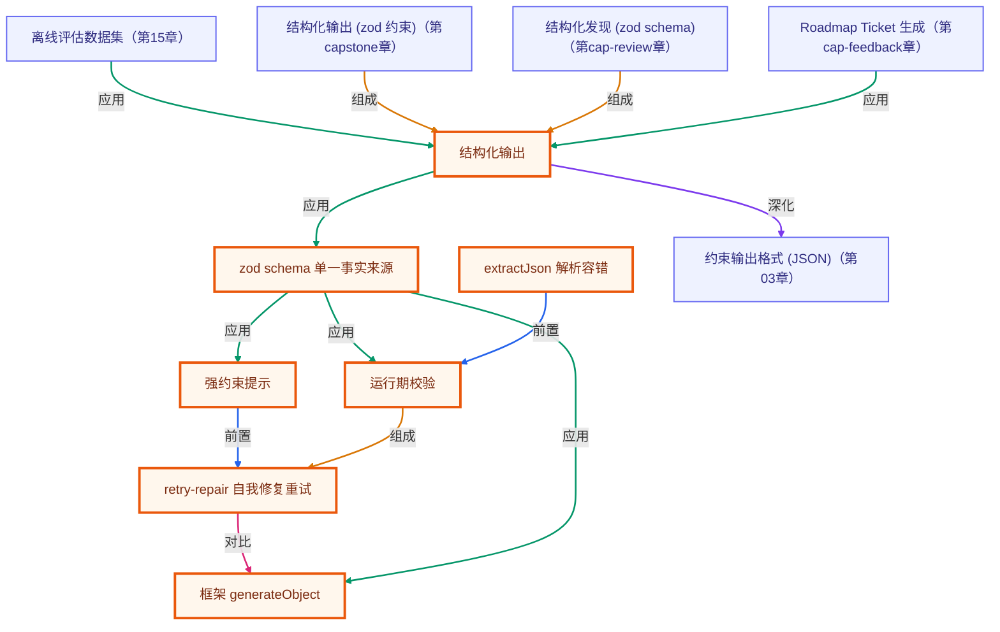

# 第 13 章 · 结构化输出与校验

> 所属阶段：**第五部分 · 工程化与框架**
> 预计用时：45 分钟 | 难度：⭐⭐⭐☆☆
> 全局导航：[课程导航](../../docs/navigation.md) · [完整大纲](../../docs/curriculum.md) · [知识图谱](../../docs/knowledge-graph.md)

## 学习目标

学完本章你能够：

- [ ] 说清「为什么自由文本不可靠、为什么生产里要结构化输出」。
- [ ] 用 **强约束提示 + 要求 JSON** 让模型产出结构化数据，并用 **zod** 做运行期校验。
- [ ] 实现 **retry-repair（自我修复重试）**：校验失败时把 zod 错误回传给模型，让它自己改。
- [ ] 用同一个 zod schema，对照 **Vercel AI SDK 的 `generateObject()`**，理解框架替你省掉了什么。
- [ ] 把这套能力套到典型场景：**信息抽取 / 分类 / 填表**。

## 前置知识

- 已读 [第 02 章 · 你的第一次 LLM 调用](../02-first-llm-call/README.md)（`getLLM()` / `chat()`）。
- 已读 [第 12 章 · 框架入门](../12-intro-to-frameworks/README.md)（知道 AI SDK 大致长什么样）。
- 对 zod 有基本印象（`z.object` / `z.infer` / `safeParse`），不熟也没关系，本章会带着用。

## 三层学习路线

| 层级 | 学习目标 | 你要完成什么 |
|------|----------|--------------|
| 极简 | 让模型稳定输出可解析 JSON。 | 用 zod 校验一次模型输出,并在失败时看到明确错误。 |
| 进阶 | 理解 schema、retry-repair 和版本兼容。 | 解释为什么自然语言输出不能直接进数据库,以及 schema 变更如何影响调用方。 |
| 真实实践 | 把模型输出变成可靠系统契约。 | 为 API、数据库、UI 三方共用的输出结构设计 schema、错误处理和回归样例。 |

---

## 图解学习地图

> 读图顺序：先看本章主线,再回到代码走读。核心焦点：**让模型输出从散文变成可校验数据**。



### 原理展开

- 结构化输出的目标是让模型结果能被程序消费。只给人看的回答可以自由,进业务流程的数据必须有 schema。
- schema 是运行时契约。TypeScript 类型只在编译期存在,模型返回的是字符串,必须 parse 和 validate 才可信。
- 失败路径要设计清楚。JSON 坏了、字段缺失、枚举不合法时,系统应该重试、修复或降级,不能假装一定成功。

### 本章和整条路径的关系

本章让 agent 输出能接数据库、API 和 UI。capstone 的研究计划与报告结构化生成会复用这套模式。

---

## 一、原理：为什么需要「结构化输出」

Agent 不是聊天机器人。真正干活时，下游往往是**代码**：把抽取的字段写进数据库、按分类结果路由、用填好的表单调下一个 API。这时模型吐一段「文采斐然的自由文本」是灾难——你没法可靠地解析它。

```
自由文本（人能读，程序读不了）
  "张伟是个有 8 年经验的前端，擅长 TS 和 React……"
        ↓  正则？字符串切割？—— 脆、易碎、换句话就挂
结构化数据（程序能直接用）
  { "name": "张伟", "skills": ["TypeScript","React"], "years": 8 }
```

让模型稳定产出结构化数据，业界有三种手段，可叠加使用：

1. **强约束提示**：明确告诉模型「只输出 JSON、不要解释、不要 Markdown 围栏」，并把目标 **JSON Schema** 贴给它当契约。
2. **强制 schema**（工具调用 / JSON mode / 框架的 `generateObject`）：从协议层逼模型按 schema 产出，命中率最高。
3. **校验 + 修复重试（retry-repair）**：拿到输出先用 zod 校验；**失败就把错误回传给模型让它修正**，重试 N 次。这是兜底，也是工程上最实用的一招。

### retry-repair 的核心闭环

模型不是每次都听话——它可能把 `years` 写成字符串、漏掉 `skills`、或包上 ` ```json ` 围栏。与其祈祷它一次对，不如建一个「自我修复」的闭环：

```
         ┌────────────────────────────────────────┐
         ↓                                          │ (把 zod 错误拼进下一轮提示)
 ┌──────────────┐   抠出 JSON   ┌──────────┐  失败   │
 │  chat(提示)   │ ───────────→ │ zod 校验  │ ───────┘
 └──────────────┘              └────┬─────┘
                                    │ 成功
                                    ↓
                          类型安全的对象 ✅
```

WHY 把错误「原样回传」效果好：模型擅长**基于反馈修正**。你告诉它「字段 `years` 期望 number，收到 string」，它下一轮大概率就改对了——这比让它「重答一遍」可靠得多。本质上是把 zod 当成了模型的「编译器报错」。

---

## 二、代码走读

完整代码见 [`index.ts`](./index.ts) 与通用工具 [`generateStructured.ts`](./generateStructured.ts)。

### 1) 单一事实来源：一个 zod schema

```ts
const resumeSchema = z.object({
  name: z.string().describe("候选人姓名"),
  skills: z.array(z.string()).describe("技能关键词列表，如 TypeScript、React"),
  years: z.number().int().min(0).max(60).describe("总工作年限（整数年）"),
});
type Resume = z.infer<typeof resumeSchema>; // 类型由 schema 反推，改一处就同步
```

这个 schema **一物三用**：转成 JSON Schema 喂给模型当契约、运行期 `safeParse` 校验输出、`z.infer` 推导 TS 类型。

### 2) retry-repair 主循环（节选自 `generateStructured.ts`）

```ts
for (let attempt = 1; attempt <= maxRetries + 1; attempt++) {
  const result = await client.chat({ system: baseSystem, messages: conversation, temperature: 0 });
  const jsonText = extractJson(result.text); // 容错：抠掉围栏/客套话

  let parsed: unknown;
  try { parsed = JSON.parse(jsonText); }
  catch (err) {                              // 连 JSON 都不是 → 回传错误重试
    pushRepairTurn(conversation, result.text, `输出不是合法 JSON：${(err as Error).message}`);
    continue;
  }

  const validation = schema.safeParse(parsed);
  if (validation.success) return { data: validation.data, attempts: attempt, rawText: result.text };

  // 校验失败：把逐条 zod 错误回传，让模型「看着错误改」
  pushRepairTurn(conversation, result.text, `JSON 结构校验失败：\n${formatZodIssues(validation.error)}`);
}
throw new Error("用尽重试仍未得到合法结构…");
```

两个工程细节值得留意：

- **`extractJson()` 容错**：即使要求「只输出 JSON」，模型仍可能加围栏或客套话。与其指望它 100% 听话，不如在解析侧抠出 `{...}`。这是结构化输出稳定落地的关键。
- **`temperature: 0`**：抽取/分类追求**稳定可复现**，温度压到 0，别让模型「发挥」。

### 3) 对照：框架内建的 `generateObject()`

理解了手写版，再看框架版你就知道它替你做了什么——「要 JSON + 按 schema 校验 + 推导类型」全内建：

```ts
import { generateObject } from "ai";
import { anthropic } from "@ai-sdk/anthropic";

const { object } = await generateObject({
  model: anthropic("claude-3-5-sonnet-latest"),
  schema: resumeSchema,        // 同一个 zod schema
  prompt: `从这段简历抽取姓名/技能/年限：\n\n${RESUME_TEXT}`,
});
const resume: Resume = object; // 类型安全，无需手动 parse
```

> 注意：本章属第五部分「工程化与框架」，**允许**直接用 `ai` / `@ai-sdk/anthropic` SDK（其余章节一律走 `getLLM()`）。`generateObject` 固定走 Anthropic，需要 `.env` 里有 `ANTHROPIC_API_KEY`；本章在缺 key 时会优雅跳过这段。

---

## 三、运行

```bash
# 默认厂商（.env 里的 LLM_PROVIDER）跑「手写 generateStructured」+「框架 generateObject」对照
npx tsx lessons/13-structured-output/index.ts
```

切换手写版走的厂商（不影响框架版，框架版固定 Anthropic）：

```bash
# PowerShell:
$env:LLM_PROVIDER="openai"; npx tsx lessons/13-structured-output/index.ts
# macOS / Linux:
LLM_PROVIDER=openai npx tsx lessons/13-structured-output/index.ts
```

预期输出：一段抽取出的 `{ name, skills, years }`、每次尝试是否通过校验的日志、以及（若配了 Anthropic key）框架版抽取结果与 token 用量。

---

## 四、练习

1. **触发一次修复**：把 `resumeSchema` 的 `years` 改成 `z.number().int().min(20)`（强行让 8 年简历不合法），观察 `onAttempt` 打出的「失败→回传错误→重试」日志。
2. **从抽取到分类**：新写一个 `z.object({ category: z.enum(["前端","后端","算法","其他"]) })` 的 schema，用 `generateStructured` 给这段简历打标签。
3. **填表场景**：把 schema 扩成 `{ name, email: z.string().email(), phone }`，喂一段含邮箱/电话的文本，验证 `.email()` 校验失败时模型能否修复。
4. **调 maxRetries**：把 `maxRetries` 设成 `0`，再把 schema 改得很苛刻，观察它如何抛出携带「最后一次原始输出」的错误——理解为什么要保留这个调试信息。
5. **进阶**：给 `generateStructured` 加一个 `array` 模式：要求模型从一段文本抽取**多条**记录（`z.array(resumeSchema)`），看提示与校验要怎么改。

---

<!-- KG:START (由 npm run kg 自动生成，勿手改本标记区) -->

## 知识图谱与延伸阅读

> 本节由 `npm run kg` 自动生成（数据源 `knowledge-graph/data/graph.ts`）。要增删请改数据源后重跑。

### 本章概念图谱

> 节点：**橙框**=本章概念，蓝框=关联的其他章概念。连线按关系类型着色：前置(蓝) · 深化(紫) · 对比(玫红) · 应用(绿) · 组成(橙)。



### 与其他章节的关系

- `结构化输出` —**深化**→ `约束输出格式 (JSON)`（第 03 章）
- `离线评估数据集` —**应用**→ `结构化输出`（第 15 章）
- `结构化输出 (zod 约束)` —**组成**→ `结构化输出`（第 capstone 章）
- `结构化发现 (zod schema)` —**组成**→ `结构化输出`（第 cap-review 章）
- `Roadmap Ticket 生成` —**应用**→ `结构化输出`（第 cap-feedback 章）

### 延伸阅读

- [Zod - TypeScript-first schema validation](https://zod.dev/) — z.object / z.infer / safeParse 官方文档 `doc`
- [Vercel AI SDK - generateObject](https://ai-sdk.dev/docs/reference/ai-sdk-core/generate-object) — 框架内建结构化输出 API 参考 `doc`

> 🗺️ 在[全局知识图谱](../../docs/knowledge-graph.md) / [交互式图谱](../../knowledge-graph/output/index.html) 中查看本章位置。

<!-- KG:END -->

## 五、小结与延伸

- 生产里 Agent 的输出常被代码消费，**结构化 + 校验**是可靠性的底线。
- 手段三件套：**强约束提示**、**强制 schema（工具/JSON mode/框架）**、**校验+修复重试**。
- 一个 zod schema 一物三用：约束模型、运行期校验、推导类型。
- 手写 `generateStructured` 让你看清原理；框架 `generateObject` 让你少写样板——两者共用同一个 schema。
- 上一章 [第 12 章 · 框架入门](../12-intro-to-frameworks/README.md)；下一章 [第 14 章 · 流式与 UX](../14-streaming-and-ux/README.md) 学习如何把输出「逐字蹦出来」、做出好体感的交互。

> 💡 **面试会问**：怎么让 LLM 稳定输出 JSON？校验失败了怎么办（retry-repair 怎么实现）？工具调用 / JSON mode / 提示约束三者有什么区别？
