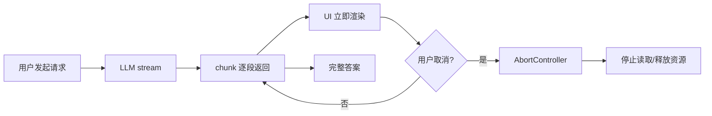
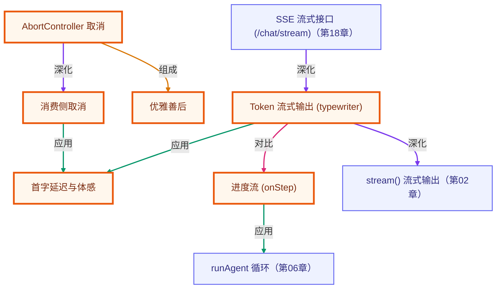

# 第 14 章 · 流式输出与交互体验

> 所属阶段：**第五部分 · 工程化与框架**
> 预计用时：40 分钟 | 难度：⭐⭐☆☆☆
> 全局导航：[课程导航](../../docs/navigation.md) · [完整大纲](../../docs/curriculum.md) · [知识图谱](../../docs/knowledge-graph.md)

## 学习目标

学完本章你能够：

- [ ] 用 `llm.stream()` 实现**打字机式**逐字输出，理解"流式优化的是体感，不是总耗时"。
- [ ] 在 agent 多步流程里用 `runAgent` 的 **`onStep` 回调**实时播报"第几步 / 调了哪个工具 / 结果是什么"。
- [ ] 用 **`AbortController`** 取消一个过长的流，并**优雅善后**（区分"完成"与"已取消"，清理定时器）。
- [ ] 理解"消费侧取消"（停止向生成器要数据）为什么是最通用、跨厂商的取消方式。

## 前置知识

- 已读 [第 02 章 · 你的第一次 LLM 调用](../02-first-llm-call/README.md)，见过 `stream()` 的 `text` 流。
- 已读 [第 13 章 · 结构化输出](../13-structured-output/README.md)。
- 了解 `runAgent` 的基本用法（见 [第 04 章](../04-the-agent-loop/README.md)、[第 05 章](../05-tool-use-basics/README.md) 与 [`src/shared/agent/loop.ts`](../../src/shared/agent/loop.ts)）。

## 三层学习路线

| 层级 | 学习目标 | 你要完成什么 |
|------|----------|--------------|
| 极简 | 跑通 token streaming 并看到增量输出。 | 能区分最终结果、过程事件、工具步骤和用户取消。 |
| 进阶 | 理解流式 UX 的事件协议和资源控制。 | 设计 chunk、progress、tool-call、done、error、abort 这些事件如何流向前端。 |
| 真实实践 | 把 agent 做成可感知进度的产品体验。 | 为长任务设计 SSE 或 WebSocket 流、取消按钮、重试提示和部分结果展示。 |

---

## 图解学习地图

> 读图顺序：先看本章主线,再回到代码走读。核心焦点：**用流式输出降低等待焦虑,用取消控制成本**。



### 原理展开

- 流式不一定缩短总耗时,但会显著降低首字延迟。用户越早看到系统在动,越能接受长任务。
- 流式是协议问题也是 UX 问题。后端要逐块产出,前端要增量渲染,状态栏要说明当前阶段,错误要能在半路显示。
- 取消是成本控制能力。没有取消,用户关页面后模型可能继续烧 token; 生产系统必须把 abort 信号传到尽可能深的调用层。

### 本章和整条路径的关系

本章把 agent 从命令行输出推向产品体验。部署章节会把流式能力包装成 SSE 服务接口。

---

## 一、原理：流式让"等待"变得可见

一次 agent 调用可能要好几秒甚至几十秒。如果界面在这段时间里**一片沉默**，用户会以为程序卡死了。流式的价值不在"更快"，而在"把沉默变成进展":

```
非流式：  [..........等待 8 秒..........] → 一次性吐出全部
流式：    [字][字][字][字]...持续蹦字...    → 首字 0.4 秒就出现
          ↑ 总耗时几乎一样，但"首字延迟"和"体感"天差地别
```

### 1）文本流 vs. 进度流

聊天产品里我们流的是**文本**（逐字蹦）。但在 agent 场景，用户最焦虑的往往不是"字来得慢"，而是"它在多步工具调用里卡住、不说话"。所以 agent 要额外流一种东西——**进度**:

```
[步骤1] 调用 get_user_city() → 杭州
[步骤2] 调用 get_weather(杭州) → 晴 26°C
[最终]  今天晴暖，外套可以不带~
```

这就是 `runAgent` 的 `onStep` 回调的用武之地：每一步落地（工具结果拿到）就立刻播报。

### 2）取消：协作式，而非强杀

JavaScript 里你**无法强行杀死**一个正在跑的异步任务，只能"礼貌地请它停下"。标准做法是 [`AbortController`](https://developer.mozilla.org/docs/Web/API/AbortController):

```
controller.abort()  →  signal.aborted 变 true  →  消费方在下一个检查点主动退出
```

本课程的统一 `stream()` 接口**没有**暴露 `AbortSignal` 参数（见 [`types.ts`](../../src/shared/llm/types.ts)）。那怎么取消？答案是**消费侧取消**——`stream()` 是一个 async generator，只要我们 `break` 出 `for await` 循环、不再向它要数据，生成器就会被关闭，底层消费随之结束。这套思路不依赖任何厂商特性，最通用。

---

## 二、代码走读

完整代码见 [`index.ts`](./index.ts)，复用工具见 [`stream-utils.ts`](./stream-utils.ts)。

### 1）打字机：把"已到达的字"匀速吐出

`shared` 自带的 `printStream` 是"来多少打多少"，受网络分块影响节奏忽快忽慢。我们想要稳定的逐字观感，于是把每块文本拆成字符、用固定间隔吐出：

```ts
// stream-utils.ts
export async function typewriter(stream, charDelayMs = 12) {
  let full = "";
  for await (const chunk of stream) {
    if (chunk.type === "text" && chunk.text) {
      for (const ch of chunk.text) {
        process.stdout.write(ch);
        full += ch;
        if (charDelayMs > 0) await sleep(charDelayMs); // 制造节奏感
      }
    }
  }
  return full;
}
```

> 记住：节奏是**体验**不是**性能**。`charDelayMs` 只影响"已到达的字"如何呈现，不会让模型生成更快。

### 2）agent 进度：onStep 回调

`runAgent` 在每一步把工具结果都拿到后，调用一次 `onStep(step)`。`step.result.toolCalls` 和 `step.toolResults` **顺序一一对应**:

```ts
await runAgent({
  client: llm,
  registry,
  messages: [{ role: "user", content: "我今天出门要不要带外套？" }],
  onStep: (step) => {
    const calls = step.result.toolCalls;
    for (let i = 0; i < calls.length; i++) {
      const call = calls[i]!;                 // 开了 noUncheckedIndexedAccess，下标是 T|undefined，用 ! 收窄
      const observed = step.toolResults[i]?.output ?? "(无结果)";
      logger.info(`步骤 ${step.index + 1}：调用 ${call.name}(${JSON.stringify(call.arguments)}) → ${observed}`);
    }
  },
});
```

### 3）取消：AbortController + 消费侧退出

设一个超时"截止线"，到点 `abort()`；消费时每收到一块就检查 `signal.aborted`，命中就退出并返回"已取消"标记:

```ts
// index.ts
const controller = new AbortController();
const timer = setTimeout(() => controller.abort(), 1500); // 截止线

try {
  const { text, aborted } = await consumeWithAbort(stream, controller.signal, (delta) =>
    process.stdout.write(delta),
  );
  if (aborted) logger.warn(`生成已取消（已输出 ${text.length} 字符）。`); // 不是错误，是主动叫停
  else logger.success(`生成完成（${text.length} 字符）。`);
} finally {
  clearTimeout(timer); // 无论如何都清理定时器，避免悬挂
}
```

```ts
// stream-utils.ts —— 消费侧取消的核心
export async function consumeWithAbort(stream, signal, onText) {
  let full = "";
  if (signal.aborted) return { text: full, aborted: true };
  for await (const chunk of stream) {
    if (signal.aborted) return { text: full, aborted: true }; // 协作式检查点：安全处主动退出
    if (chunk.type === "text" && chunk.text) {
      full += chunk.text;
      onText(chunk.text);
    }
  }
  return { text: full, aborted: false };
}
```

---

## 三、运行

```bash
# 默认厂商（.env 里的 LLM_PROVIDER）
npx tsx lessons/14-streaming-and-ux/index.ts
```

临时切换厂商（仅本次运行）:

```powershell
# PowerShell
$env:LLM_PROVIDER="openai"; npx tsx lessons/14-streaming-and-ux/index.ts
```

```bash
# macOS / Linux
LLM_PROVIDER=openai npx tsx lessons/14-streaming-and-ux/index.ts
```

预期看到：① 一段逐字蹦出的科普文字；② 出行助手分两步调用工具的进度播报与最终建议；③ 一段散文写到一半被超时 `abort()`，并打印"生成已取消（已输出 N 字符）"。

> 演示 3 是否被取消取决于网速与模型速度——若它先写完了，你会看到"生成完成"。把 `TIMEOUT_MS` 调小（如 `300`）即可稳定触发取消。

---

## 四、练习

1. **可调速打字机**：给 `typewriter` 传不同 `charDelayMs`（如 `0`、`30`、`80`），体会"原始流速"与"匀速节奏"的差异；思考 `0` 时它和 `shared` 的 `printStream` 有何区别。
2. **进度里加 spinner/计时**：在 `onStep` 里记录每步耗时（`Date.now()` 差值），播报"步骤 N 耗时 xxx ms"，给用户更强的进度感。
3. **手动取消**：把演示 3 的 `setTimeout` 改成监听键盘——读到回车就 `controller.abort()`，模拟"用户点停止生成"（提示：`process.stdin`）。
4. **取消后续追问**：取消一个流之后，把"已输出片段"作为上下文，追加一条 user 消息"接着上面继续"，验证"取消不丢已生成内容"。
5. **进阶 · 超时即重试**：把演示 3 包一层——若 `aborted` 为真，则换更短的 prompt 重发一次，实现"超时降级"。

---

<!-- KG:START (由 npm run kg 自动生成，勿手改本标记区) -->

## 知识图谱与延伸阅读

> 本节由 `npm run kg` 自动生成（数据源 `knowledge-graph/data/graph.ts`）。要增删请改数据源后重跑。

### 本章概念图谱

> 节点：**橙框**=本章概念，蓝框=关联的其他章概念。连线按关系类型着色：前置(蓝) · 深化(紫) · 对比(玫红) · 应用(绿) · 组成(橙)。



### 与其他章节的关系

- `Token 流式输出 (typewriter)` —**深化**→ `stream() 流式输出`（第 02 章）
- `进度流 (onStep)` —**应用**→ `runAgent 循环`（第 06 章）
- `SSE 流式接口 (/chat/stream)` —**深化**→ `Token 流式输出 (typewriter)`（第 18 章）

### 延伸阅读

- [AbortController - Web APIs | MDN](https://developer.mozilla.org/en-US/docs/Web/API/AbortController) — 本章取消机制的权威参考，README 中直接引用 `doc`
- [Streaming Messages - Anthropic API](https://docs.anthropic.com/en/api/messages-streaming) — 官方流式消息 SSE 协议，对应底层 stream() 的实现 `doc`

> 🗺️ 在[全局知识图谱](../../docs/knowledge-graph.md) / [交互式图谱](../../knowledge-graph/output/index.html) 中查看本章位置。

<!-- KG:END -->

## 五、小结与延伸

- 流式优化的是**首字延迟与体感**，不是总耗时。
- agent 场景除了流**文本**，更要用 `onStep` 流**进度**——让多步工具调用不再"沉默卡死"。
- 取消用 `AbortController` + **消费侧退出**（停止向生成器要数据），跨厂商通用；善后要区分"完成/取消"并清理定时器。
- 上一章 [第 13 章 · 结构化输出](../13-structured-output/README.md)；下一章 [第 15 章 · 评估与测试](../15-evaluation-and-testing/README.md) 学习如何系统化地验证 agent 的质量。

> 💡 **面试会问**：流式输出能让接口更快吗？为什么不能？`AbortController` 是怎么"取消"一个异步任务的（强杀还是协作）？在多步 agent 里你会怎么给用户进度反馈？
